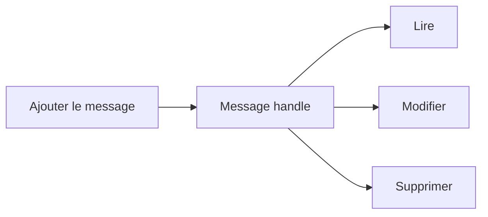

# CUMULER, MODIFIER ET SUPPRIMER DES MESSAGES

## OBJECTIFS

- Éviter les milliers de messages identiques
- Manipuler un message à partir de son handle
- Connaître les fonctions avancées du BAL

## CUMULER

`BAL_LOG_MSG_CUMULATE` ajoute un message ou incrémente son compteur lorsqu’un message équivalent existe. Cette technique réduit le volume pour les erreurs répétitives.

Exemple de résultat :

> Article sans unité de mesure — 1 542 occurrences

Le journal doit néanmoins conserver assez de contexte pour identifier les enregistrements concernés. Une cumulation totale sans fichier de rejet ni identifiants rend le diagnostic impossible.

## HANDLES DE MESSAGE

Les fonctions d’ajout renvoient un `BALMSGHNDL`. Ce handle permet notamment :

- `BAL_LOG_MSG_READ` ;
- `BAL_LOG_MSG_CHANGE` ;
- `BAL_LOG_MSG_REPLACE` ;
- `BAL_LOG_MSG_DELETE`.



## USAGE

La modification d’un message est utile lorsqu’un traitement ajoute d’abord un état provisoire, puis complète le résultat. Dans la majorité des traitements, il reste plus simple et plus traçable d’ajouter un nouveau message.

Ne pas supprimer une erreur uniquement pour produire un journal « vert ». Le journal doit refléter le résultat réel du traitement.

## PROCÉDURE PAS À PAS

1. Lire la définition et identifier les prérequis du chapitre.
2. Choisir un objet Z ou un scénario de démonstration sans impact métier.
3. Reproduire l’exemple dans un système de développement et relever les données d’entrée.
4. Contrôler la syntaxe ou la configuration avant activation/exécution.
5. Comparer le résultat observé avec la section **Vérification**.
6. Documenter toute différence liée à la release, aux autorisations ou au paramétrage du système.

## VÉRIFICATION

- Le journal est retrouvable dans `SLG1` avec objet, sous-objet et période.
- Chaque erreur contient un contexte permettant d’identifier l’enregistrement concerné.
- Le log est sauvegardé même lorsque le traitement se termine avec des erreurs gérées.
- Aucune donnée sensible inutile n’est enregistrée.

## ERREURS FRÉQUENTES

- Enregistrer uniquement un texte générique sans clé métier.
- Journaliser des mots de passe, tokens ou données personnelles inutiles.

## FICHE DE CONTRÔLE À COPIER

```text
Système / SID       :
Mandant             :
Utilisateur         :
Transaction / outil :
Objet technique     :
Jeu de données      :
Résultat attendu    :
Résultat observé    :
Horodatage          :
Ordre de transport  :
```

## TERMES DU LEXIQUE

- [Application Log](<../00 ├── LEXIQUE SAP ET ABAP/08 ├── EXECUTION EXPLOITATION ET ADMINISTRATION.md#application-log>)
- [BAL](<../00 ├── LEXIQUE SAP ET ABAP/10 └── ACRONYMES SAP.md#acro-bal>)
- [Job](<../00 ├── LEXIQUE SAP ET ABAP/06 ├── PROGRAMMES CLASSES ET OBJETS TECHNIQUES.md#job>)

## RÉFÉRENCES OFFICIELLES SAP

- [Function Module Overview — SAP Help Portal](https://help.sap.com/docs/ABAP_PLATFORM_NEW/addb96cd90c945dfb3182865363bbc47/4e23b1720771417fe10000000a15822b.html)
- [Basics — SAP Help Portal](https://help.sap.com/docs/ABAP_PLATFORM_NEW/addb96cd90c945dfb3182865363bbc47/4e21029235d44180e10000000a15822b.html)


---

[Chapitre suivant — AFFICHER UN JOURNAL EN MÉMOIRE](<./13 ├── AFFICHER UN JOURNAL EN MEMOIRE.md>)
