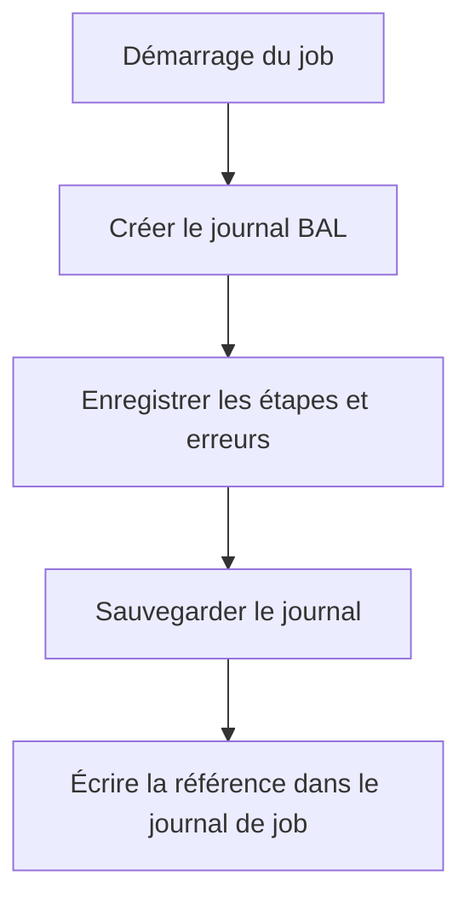

# INTÉGRER LE JOURNAL AUX JOBS ET PROGRAMMES BATCH

## OBJECTIFS

- Rendre un traitement batch exploitable
- Relier le journal applicatif au journal de job
- Éviter les dépendances à l’affichage SAP GUI

## STRATÉGIE



Le programme batch doit écrire dans le journal de job une référence exploitable :

- objet ;
- sous-objet ;
- identifiant externe ;
- résultat global ;
- nombre de succès, avertissements et erreurs.

```abap
WRITE: / |Journal SLG1 : ZDEV_LOG / IMPORT / { lv_extnumber }|.
```

## RÈGLES

- ne pas appeler `BAL_DSP_LOG_DISPLAY` en arrière-plan ;
- sauvegarder le journal même lorsqu’aucune erreur n’est rencontrée si la traçabilité l’exige ;
- intercepter les exceptions au niveau supérieur pour enregistrer le résultat final ;
- distinguer erreur technique du job et rejet fonctionnel d’une ligne ;
- rendre la reprise idempotente.

## RÉSULTAT DU JOB

Un job peut techniquement se terminer correctement alors que des éléments métier ont été rejetés. Le programme doit définir explicitement les seuils qui provoquent une terminaison anormale, un simple avertissement ou un succès partiel.

## PROCÉDURE PAS À PAS

1. Saisir `/nATC` ou utiliser l’entrée ATC disponible dans le système.
2. Choisir une variante de contrôle autorisée.
3. Lancer le contrôle sur l’objet, le package ou l’ordre de transport.
4. Classer les findings par priorité et corriger d’abord les erreurs bloquantes.
5. Demander une exemption uniquement avec justification, propriétaire et échéance.
6. Relancer le contrôle avant libération.

## VÉRIFICATION

- Le journal est retrouvable dans `SLG1` avec objet, sous-objet et période.
- Chaque erreur contient un contexte permettant d’identifier l’enregistrement concerné.
- Le log est sauvegardé même lorsque le traitement se termine avec des erreurs gérées.
- Aucune donnée sensible inutile n’est enregistrée.

## ERREURS FRÉQUENTES

- Copier un exemple sans adapter les types, noms d’objets et données disponibles dans le système.
- Tester uniquement le cas nominal et ignorer les valeurs initiales, absentes ou invalides.
- Enregistrer uniquement un texte générique sans clé métier.
- Journaliser des mots de passe, tokens ou données personnelles inutiles.

## SNIPPET À RÉUTILISER

> [!NOTE]
> Adapter les noms `Z*`, les types DDIC, les données et les autorisations au système cible. Effectuer un contrôle syntaxique avant activation.

```abap
WRITE: / |Journal SLG1 : ZDEV_LOG / IMPORT / { lv_extnumber }|.
```

## TERMES DU LEXIQUE

- [Application Log](<../00 ├── LEXIQUE SAP ET ABAP/08 ├── EXECUTION EXPLOITATION ET ADMINISTRATION.md#application-log>)
- [BAL](<../00 ├── LEXIQUE SAP ET ABAP/10 └── ACRONYMES SAP.md#acro-bal>)
- [Job](<../00 ├── LEXIQUE SAP ET ABAP/06 ├── PROGRAMMES CLASSES ET OBJETS TECHNIQUES.md#job>)

## RÉFÉRENCES OFFICIELLES SAP

- [Logging Application Jobs — SAP Help Portal](https://help.sap.com/docs/SAP_NETWEAVER_AS_ABAP_752/b4367b1cec3243c4989f0ff3d727c4ab/3882707a014c4b5e85d31c459bfb8652.html)
- [Application Log – Guidelines for Developers — SAP Help Portal](https://help.sap.com/docs/SAP_NETWEAVER_AS_ABAP_FOR_SOH_740/addb96cd90c945dfb3182865363bbc47/4e21000f35d44180e10000000a15822b.html)


---

[Chapitre suivant — JOURNALISER IMPORTS, EXPORTS ET TRAITEMENTS DE MASSE](<./19 ├── JOURNALISER IMPORTS EXPORTS ET TRAITEMENTS DE MASSE.md>)
