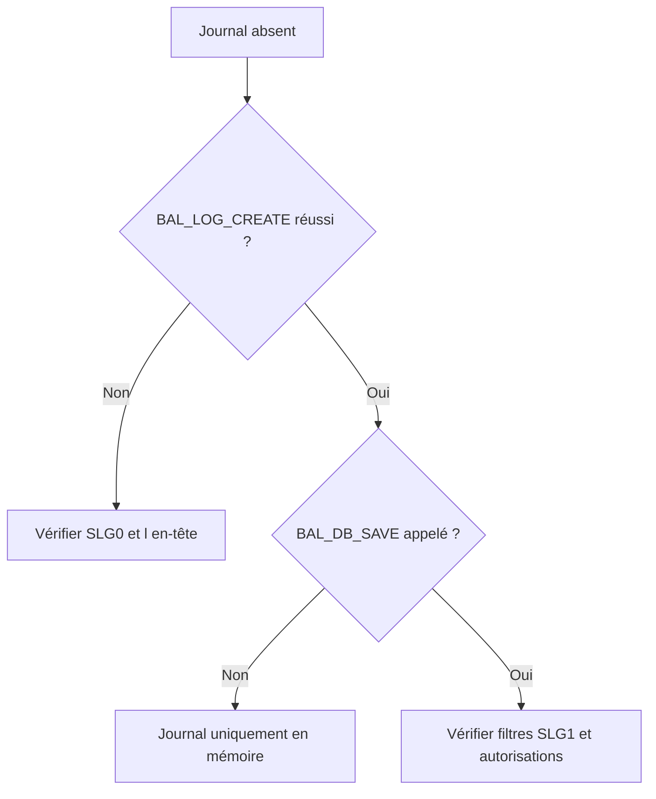

# PROGRAMMES DE DÉMONSTRATION, TESTS ET DIAGNOSTIC

## OBJECTIFS

- Utiliser les démonstrations standard SAP
- Tester chaque étape du cycle BAL
- Diagnostiquer un journal absent ou incomplet

## PROGRAMMES STANDARD

SAP documente plusieurs programmes de démonstration :

| Programme      | Sujet principal                 |
| -------------- | ------------------------------- |
| `SBAL_DEMO_01` | Création et ajout simple        |
| `SBAL_DEMO_02` | Méthodes avancées de collecte   |
| `SBAL_DEMO_03` | Recherche et lecture en mémoire |
| `SBAL_DEMO_04` | Profils et affichage            |
| `SBAL_DEMO_05` | Interface base de données       |

Analyser ces programmes dans `SE38` ou `SE80` avant d’inventer une implémentation spécifique.

## PLAN DE TEST

1. vérifier l’objet et le sous-objet dans `SLG0` ;
2. créer un journal ;
3. ajouter un message `S`, `W` et `E` ;
4. ajouter une exception ;
5. afficher le journal en mémoire ;
6. sauvegarder ;
7. rechercher dans `SLG1` ;
8. rechercher par programme avec `BAL_DB_SEARCH` ;
9. charger et réafficher ;
10. tester les autorisations avec un utilisateur représentatif.

## JOURNAL ABSENT DANS SLG1



## MESSAGES MANQUANTS

Contrôler :

- handle transmis ;
- `sy-subrc` des fonctions d’ajout ;
- niveau de détail ou filtre d’affichage ;
- cumul involontaire ;
- journal retiré de la mémoire ;
- rollback ou échec de l’update task ;
- sélection trop restrictive dans `SLG1`.

## VÉRIFICATION

- Le journal est retrouvable dans `SLG1` avec objet, sous-objet et période.
- Chaque erreur contient un contexte permettant d’identifier l’enregistrement concerné.
- Le log est sauvegardé même lorsque le traitement se termine avec des erreurs gérées.
- Aucune donnée sensible inutile n’est enregistrée.

## ERREURS FRÉQUENTES

- Enregistrer uniquement un texte générique sans clé métier.
- Journaliser des mots de passe, tokens ou données personnelles inutiles.

## FICHE DE CONTRÔLE À COPIER

```text
Système / SID       :
Mandant             :
Utilisateur         :
Transaction / outil :
Objet technique     :
Jeu de données      :
Résultat attendu    :
Résultat observé    :
Horodatage          :
Ordre de transport  :
```

## TERMES DU LEXIQUE

- [Application Log](<../00 ├── LEXIQUE SAP ET ABAP/08 ├── EXECUTION EXPLOITATION ET ADMINISTRATION.md#application-log>)
- [BAL](<../00 ├── LEXIQUE SAP ET ABAP/10 └── ACRONYMES SAP.md#acro-bal>)
- [Job](<../00 ├── LEXIQUE SAP ET ABAP/06 ├── PROGRAMMES CLASSES ET OBJETS TECHNIQUES.md#job>)

## RÉFÉRENCES OFFICIELLES SAP

- [Function Module Overview — SAP Help Portal](https://help.sap.com/docs/ABAP_PLATFORM_NEW/addb96cd90c945dfb3182865363bbc47/4e23b1720771417fe10000000a15822b.html)
- [Log Display — SAP Help Portal](https://help.sap.com/docs/SAP_NETWEAVER_731_BW_ABAP/addb96cd90c945dfb3182865363bbc47/4e2102fa35d44180e10000000a15822b.html)
- [Database Interface — SAP Help Portal](https://help.sap.com/docs/ABAP_PLATFORM_NEW/addb96cd90c945dfb3182865363bbc47/4e21021635d44180e10000000a15822b.html)


---

[Chapitre suivant — BONNES PRATIQUES ET CHECKLIST](<./24 └── BONNES PRATIQUES ET CHECKLIST.md>)
