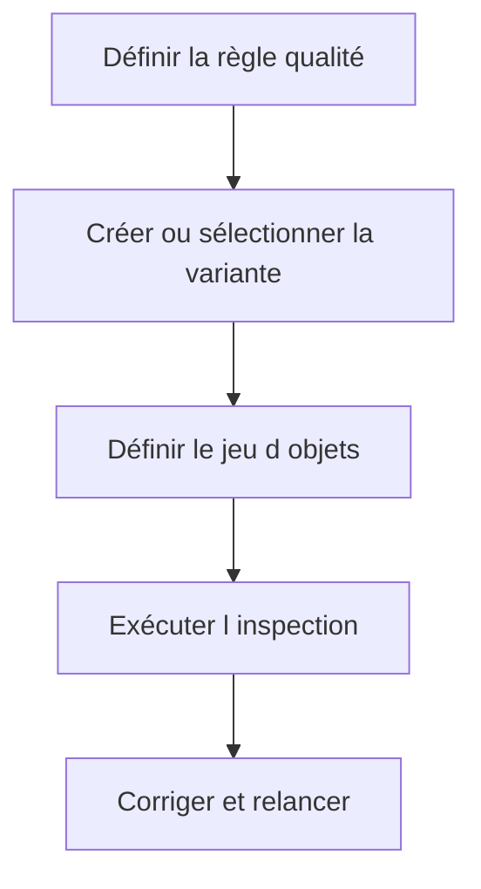

# VARIANTES ET INSPECTIONS SCI

## Objectif

Construire des variantes de contrôle stables et des inspections reproductibles.

## Concevoir une variante

Une variante doit refléter un objectif explicite : contrôle quotidien développeur, sécurité, performance SQL, migration ou validation avant transport.

### Principes

- partir d’une variante SAP ou projet reconnue ;
- ne pas désactiver une règle uniquement pour réduire le nombre de findings ;
- paramétrer les seuils selon la volumétrie et la release ;
- versionner la décision de gouvernance hors de l’outil si nécessaire ;
- tester la variante sur un package pilote.

## Construire un jeu d’objets

Le jeu peut viser un programme, une classe, un package, un transport ou un ensemble sélectionné. Il doit être assez précis pour fournir un résultat exploitable.

## Inspection reproductible

Une inspection nommée permet de relancer la même combinaison et de comparer l’évolution des findings.



## Résultats historiques

Ne pas comparer deux inspections si la variante, le jeu d’objets ou la version active a changé sans le documenter.

## Références SAP officielles

- [SAP Help Portal — Code Inspector](https://help.sap.com/docs/ABAP_PLATFORM_NEW/ba879a6e2ea04d9bb94c7ccd7cdac446/49205531d0fc14cfe10000000a42189b.html)
- [SAP Help Portal — Creating Code Inspections](https://help.sap.com/docs/ABAP_PLATFORM_NEW/ba879a6e2ea04d9bb94c7ccd7cdac446/4926dff4c93016b8e10000000a42189d.html)

## PROCÉDURE PAS À PAS

1. Saisir `/nSCI`.
2. Créer ou sélectionner une variante de contrôles approuvée par le projet.
3. Créer une inspection sur le package, l’objet ou l’ensemble de transport visé.
4. Exécuter l’inspection.
5. Analyser chaque finding, corriger la cause ou documenter l’exception selon la gouvernance.
6. Relancer jusqu’à obtenir le niveau de qualité attendu.

## VÉRIFICATION

- Le résultat fonctionnel est identique avant et après optimisation.
- La mesure est répétée avec le même jeu de données et le même contexte.
- Les contrôles statiques ne retournent plus de finding bloquant.
- Les tests automatiques couvrent les cas nominal, limites et erreurs attendues.

## ERREURS FRÉQUENTES

- Optimiser sans mesure de référence.
- Accepter un finding critique sans correction ni justification formelle.

## FICHE DE CONTRÔLE À COPIER

```text
Système / SID       :
Mandant             :
Utilisateur         :
Transaction / outil :
Objet technique     :
Jeu de données      :
Résultat attendu    :
Résultat observé    :
Horodatage          :
Ordre de transport  :
```

## TERMES DU LEXIQUE

- [Variante](<../00 ├── LEXIQUE SAP ET ABAP/06 ├── PROGRAMMES CLASSES ET OBJETS TECHNIQUES.md#variante>)
- [ATC](<../00 ├── LEXIQUE SAP ET ABAP/10 └── ACRONYMES SAP.md#acro-atc>)
- [ABAP](<../00 ├── LEXIQUE SAP ET ABAP/10 └── ACRONYMES SAP.md#acro-abap>)
- [Trace](<../00 ├── LEXIQUE SAP ET ABAP/08 ├── EXECUTION EXPLOITATION ET ADMINISTRATION.md#trace>)
