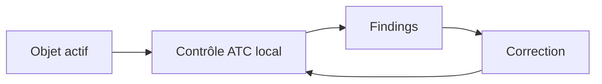

# ABAP TEST COCKPIT AVEC ATC

## Objectif

Utiliser l’ATC comme point de contrôle principal de la qualité du code ABAP.

## Scénarios

- **Contrôle local** : lancé par le développeur sur ses objets.
- **Contrôle central/officiel** : exécuté selon une variante et une planification administrées.
- **Contrôle de transport** : findings évalués lors de la libération selon la configuration du système.

## Contrôle local dans SAP GUI

Selon la release et l’outil Workbench : ouvrir l’objet, choisir le contrôle ATC, sélectionner la variante autorisée si proposé, exécuter puis ouvrir le résultat.



## Contenu d’un finding

- priorité ;
- contrôle et message ;
- objet et sous-objet ;
- position source ;
- documentation et proposition de correction lorsque disponibles.

## Traitement attendu

1. Reproduire le finding sur la version active.
2. Lire la documentation du contrôle.
3. Corriger la cause.
4. Relancer le contrôle local.
5. Vérifier le résultat officiel si un run central existe.

## Version et configuration

Les variantes, contrôles disponibles, blocages de transport et transactions d’administration dépendent de la release et de la configuration locale. La gouvernance du système fait foi.

## Références SAP officielles

- [SAP Help Portal — ATC Quality Checking](https://help.sap.com/docs/ABAP_PLATFORM_NEW/c238d694b825421f940829321ffa326a/4ec1a1126e391014adc9fffe4e204223.html)
- [SAP Help Portal — Running Local Quality Checks with ATC](https://help.sap.com/docs/ABAP_PLATFORM_NEW/ba879a6e2ea04d9bb94c7ccd7cdac446/ca5e041535c0491db596d3ca6658cd7d.html)

## PROCÉDURE PAS À PAS

1. Saisir `/nATC` ou utiliser l’entrée ATC disponible dans le système.
2. Choisir une variante de contrôle autorisée.
3. Lancer le contrôle sur l’objet, le package ou l’ordre de transport.
4. Classer les findings par priorité et corriger d’abord les erreurs bloquantes.
5. Demander une exemption uniquement avec justification, propriétaire et échéance.
6. Relancer le contrôle avant libération.

## VÉRIFICATION

- Le résultat fonctionnel est identique avant et après optimisation.
- La mesure est répétée avec le même jeu de données et le même contexte.
- Les contrôles statiques ne retournent plus de finding bloquant.
- Les tests automatiques couvrent les cas nominal, limites et erreurs attendues.

## ERREURS FRÉQUENTES

- Optimiser sans mesure de référence.
- Accepter un finding critique sans correction ni justification formelle.

## FICHE DE CONTRÔLE À COPIER

```text
Système / SID       :
Mandant             :
Utilisateur         :
Transaction / outil :
Objet technique     :
Jeu de données      :
Résultat attendu    :
Résultat observé    :
Horodatage          :
Ordre de transport  :
```

## TERMES DU LEXIQUE

- [ABAP](<../00 ├── LEXIQUE SAP ET ABAP/10 └── ACRONYMES SAP.md#acro-abap>)
- [ATC](<../00 ├── LEXIQUE SAP ET ABAP/10 └── ACRONYMES SAP.md#acro-atc>)
- [Trace](<../00 ├── LEXIQUE SAP ET ABAP/08 ├── EXECUTION EXPLOITATION ET ADMINISTRATION.md#trace>)
