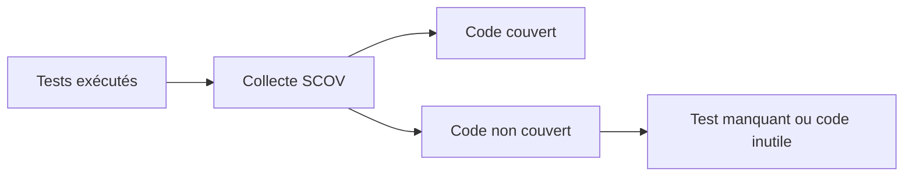

# MESURER LA COUVERTURE AVEC SCOV

## Objectif

Mesurer quelles parties du code ont réellement été exécutées pendant une campagne de tests.

## Transaction SCOV

`SCOV` permet d’activer la collecte, de définir des groupes et d’afficher la couverture selon les fonctions disponibles sur la release.

## Interprétation

La couverture répond à la question : **ce code a-t-il été exécuté ?** Elle ne répond pas à : **le résultat a-t-il été correctement vérifié ?**



## Utilisations

- identifier des branches non testées ;
- vérifier qu’un scénario de recette traverse le code attendu ;
- repérer du code potentiellement mort ;
- suivre l’évolution d’un périmètre critique.

## Précautions

- activer la collecte selon les règles d’administration ;
- inclure tous les serveurs applicatifs concernés lorsque nécessaire ;
- limiter le périmètre et la durée ;
- ne pas viser mécaniquement 100 % ;
- analyser la qualité des assertions en parallèle.

## Lecture utile

Une branche métier critique non couverte est prioritaire. Une ligne technique sans enjeu peut rester moins importante qu’un test de limite manquant.

## Références SAP officielles

- [SAP Help Portal — Coverage Analyzer](https://help.sap.com/docs/ABAP_PLATFORM_NEW/ba879a6e2ea04d9bb94c7ccd7cdac446/49216c634ab514cde10000000a42189b.html)
- [SAP Help Portal — ABAP Unit](https://help.sap.com/docs/ABAP_PLATFORM_NEW/ba879a6e2ea04d9bb94c7ccd7cdac446/491cfd8926bc14cde10000000a42189b.html)

## PROCÉDURE PAS À PAS

1. Lire la définition et identifier les prérequis du chapitre.
2. Choisir un objet Z ou un scénario de démonstration sans impact métier.
3. Reproduire l’exemple dans un système de développement et relever les données d’entrée.
4. Contrôler la syntaxe ou la configuration avant activation/exécution.
5. Comparer le résultat observé avec la section **Vérification**.
6. Documenter toute différence liée à la release, aux autorisations ou au paramétrage du système.

## VÉRIFICATION

- Le résultat fonctionnel est identique avant et après optimisation.
- La mesure est répétée avec le même jeu de données et le même contexte.
- Les contrôles statiques ne retournent plus de finding bloquant.
- Les tests automatiques couvrent les cas nominal, limites et erreurs attendues.

## ERREURS FRÉQUENTES

- Optimiser sans mesure de référence.
- Accepter un finding critique sans correction ni justification formelle.

## FICHE DE CONTRÔLE À COPIER

```text
Système / SID       :
Mandant             :
Utilisateur         :
Transaction / outil :
Objet technique     :
Jeu de données      :
Résultat attendu    :
Résultat observé    :
Horodatage          :
Ordre de transport  :
```

## TERMES DU LEXIQUE

- [ATC](<../00 ├── LEXIQUE SAP ET ABAP/10 └── ACRONYMES SAP.md#acro-atc>)
- [ABAP](<../00 ├── LEXIQUE SAP ET ABAP/10 └── ACRONYMES SAP.md#acro-abap>)
- [Trace](<../00 ├── LEXIQUE SAP ET ABAP/08 ├── EXECUTION EXPLOITATION ET ADMINISTRATION.md#trace>)
