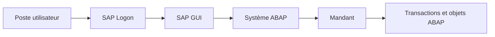
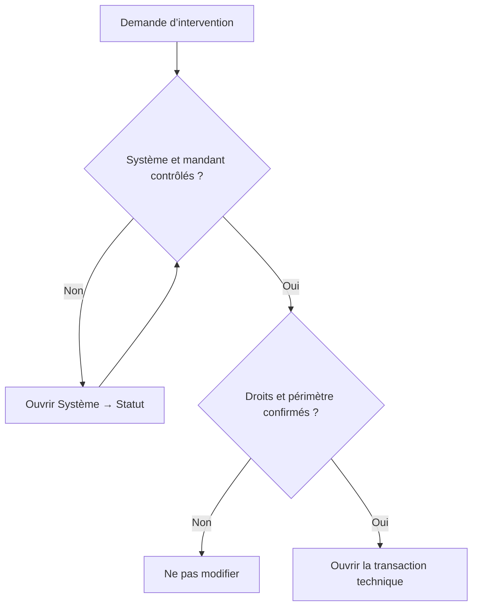

# 1. ENVIRONNEMENT SAP GUI

## 1.A RÉSULTAT ATTENDU

- Distinguer le client SAP GUI[^terme-sap-gui] du système ABAP[^terme-abap] auquel il se connecte
- Identifier le système, le mandant[^terme-mandant], l’utilisateur et la transaction en cours
- Naviguer avec SAP Easy Access[^terme-sap-easy-access] et le champ de commande[^terme-champ-commande]
- Utiliser les aides standard `F1`[^terme-aide-f1] et `F4`[^terme-aide-f4]
- Éviter les erreurs d’intervention sur un mauvais environnement[^terme-environnement]

## 1.B VUE D’ENSEMBLE



## 1.C SAP GUI ET SYSTÈME ABAP

`SAP GUI` est le client graphique utilisé pour accéder à un système SAP[^terme-systeme-sap] reposant sur un serveur d’applications ABAP[^terme-serveur-applications-abap].

Il faut distinguer :

| Élément         | Rôle                                                               |
| --------------- | ------------------------------------------------------------------ |
| SAP Logon[^terme-sap-logon]       | Répertorie les connexions disponibles                              |
| SAP GUI         | Affiche les écrans et transmet les actions utilisateur             |
| Système ABAP    | Exécute les transactions, programmes et contrôles d’autorisation   |
| Mandant         | Sépare une partie des données et du paramétrage au sein du système |
| Utilisateur SAP | Porte les autorisations, paramètres et préférences de session      |

> [!IMPORTANT]
> Un même poste peut contenir plusieurs connexions vers des environnements différents : développement, qualité, recette ou production. Le nom visuel de la connexion ne suffit pas toujours pour confirmer l’environnement réellement ouvert.

## 1.D QU’EST-CE QU’UN MANDANT ?

Un **mandant** est une subdivision logique d’un système SAP. Il est identifié par un numéro à trois chiffres, par exemple `100`, `200` ou `300`.

Un même système peut contenir plusieurs mandants. Ils partagent le même Repository ABAP[^terme-repository-abap] actif, mais une partie de leurs données, de leur paramétrage et de leurs utilisateurs peut être séparée.

| Élément                          | Exemple                | Portée habituelle                           |
| -------------------------------- | ---------------------- | ------------------------------------------- |
| Système                          | `D01`                  | Ensemble technique complet                  |
| Mandant                          | `200`                  | Contexte logique dans le système            |
| Utilisateur                      | `DEV_USER`             | Identité et autorisations dans le mandant   |
| Programme ABAP                   | `ZDEV_REPORT`          | Généralement commun aux mandants du système |
| Données d’une table avec `MANDT`[^terme-mandt] | Ligne du mandant `200` | Séparées par mandant                        |

Dans une table dépendante du mandant, le premier champ de clé est généralement `MANDT`. ABAP SQL[^terme-acro-sql] applique normalement automatiquement le mandant courant. Les accès inter-mandants[^terme-inter-mandants] sont des cas particuliers qui exigent une justification et des autorisations adaptées.

### 1.D.1 COMMENT IDENTIFIER LE MANDANT COURANT

1. ouvrir le menu **Système** ;
2. choisir **Statut** ;
3. relever le **mandant**, le **système** et l’**utilisateur** ;
4. vérifier ces informations avant toute création, modification ou exécution destructive.

> [!IMPORTANT]
> Un programme activé dans un système ABAP est généralement visible dans tous les mandants du système. Modifier le code dans le « bon mandant » ne protège donc pas les autres mandants du même système.

## 1.E CONNEXION

Une connexion SAP demande généralement :

- un **mandant** ;
- un **utilisateur** ;
- un **mot de passe** ;
- une **langue de connexion**.

La combinaison système, mandant et utilisateur détermine le contexte de travail.

### 1.E.1 CONTRÔLE DU CONTEXTE

Avant toute modification :

1. ouvrir **Système → Statut** ;
2. contrôler le système et le mandant ;
3. contrôler l’utilisateur connecté ;
4. identifier la transaction et le programme actifs si nécessaire ;
5. confirmer que l’environnement autorise la modification prévue.

> [!CAUTION]
> Ne jamais déduire qu’un système est un environnement de développement uniquement à partir de sa couleur SAP GUI ou du texte affiché dans SAP Logon. Ces éléments sont configurables.

## 1.F SAP EASY ACCESS

SAP Easy Access constitue le point d’entrée classique de SAP GUI. Il permet notamment d’utiliser :

- le menu utilisateur ;
- le menu SAP ;
- les favoris ;
- le champ de commande ;
- plusieurs sessions SAP GUI.

L’affichage des noms techniques peut être activé afin de faire apparaître les codes de transaction dans l’arborescence.

## 1.G CHAMP DE COMMANDE

Le champ de commande permet d’appeler directement une transaction.

| Saisie   | Effet                                                                |
| -------- | -------------------------------------------------------------------- |
| `SE38`[^outil-se38]   | Appelle la transaction depuis SAP Easy Access                        |
| `/nSE38` | Termine la transaction courante et ouvre `SE38` dans la même session |
| `/oSE38` | Ouvre `SE38` dans une nouvelle session                               |
| `/n`     | Revient à SAP Easy Access en quittant la transaction courante        |
| `/h`     | Active le débogage pour la prochaine action compatible               |

> [!NOTE]
> L’ouverture de nouvelles sessions peut être limitée par la configuration du système.

## 1.H AIDES STANDARD

### 1.H.1 AIDE F1

`F1` affiche l’aide associée à un champ ou à un élément de l’interface.

Dans de nombreux écrans, l’aide permet aussi d’accéder aux **informations techniques** :

- programme ;
- dynpro[^terme-dynpro] ;
- nom technique du champ ;
- élément de données[^terme-element-donnees] ;
- table ou structure de référence.

Ces informations sont essentielles pour analyser un écran standard ou préparer une recherche dans le Repository.

### 1.H.2 AIDE F4

`F4` ouvre l’aide à la saisie lorsqu’elle existe. Elle peut présenter :

- une liste fixe ;
- une aide à la recherche ;
- une recherche multicritère ;
- des valeurs provenant du Dictionnaire ABAP.

> [!TIP]
> Utiliser `F1` pour comprendre un champ et `F4` pour rechercher une valeur autorisée.

## 1.I RÉFLEXES AVANT INTERVENTION



- vérifier l’environnement avant toute création ou modification ;
- éviter de travailler avec plusieurs systèmes visuellement similaires sans contrôle explicite ;
- ne pas partager d’identifiants ni de captures contenant des données sensibles ;
- fermer les sessions devenues inutiles ;
- utiliser les transactions techniques uniquement avec les autorisations adaptées.

## 1.J PROCESS

### 1.J.1 Étape 1 — Sélectionner la connexion SAP

1. Ouvrir SAP Logon.
2. Repérer la connexion indiquée dans le ticket ou la documentation du paysage.
3. Comparer son libellé, son SID[^terme-sid] et son environnement annoncé : développement, qualité ou production.
4. Ouvrir cette connexion puis saisir le mandant, l’utilisateur, le mot de passe et la langue autorisés.

Le libellé SAP Logon ne constitue pas une preuve suffisante : il peut être personnalisé localement. La vérification doit continuer dans le système connecté.

### 1.J.2 Étape 2 — Identifier le système réellement ouvert

1. Dans SAP GUI, ouvrir **Système → Statut**.
2. Relever au minimum le SID, le mandant, l’utilisateur, le serveur d’application[^terme-fichier-serveur-application] et la version du composant ABAP lorsque celle-ci est nécessaire au diagnostic.
3. Conserver ces valeurs dans le ticket ou les notes de diagnostic.

Le SID identifie le système, le mandant sépare les données dépendantes du client et l’utilisateur détermine le contexte d’autorisation. Un résultat dans un autre mandant ne prouve rien pour le mandant demandé.

### 1.J.3 Étape 3 — Comparer le contexte avec la demande

1. Comparer le SID et le mandant avec les valeurs explicitement indiquées dans la demande.
2. Vérifier que l’utilisateur utilisé est celui autorisé pour l’action.
3. Contrôler que l’environnement permet l’opération prévue : affichage, développement, test ou correction.

Si une seule valeur diffère, arrêter l’action. Revenir à SAP Logon et sélectionner la bonne connexion ; ne pas tenter de compenser une erreur de contexte en poursuivant dans le mauvais système.

### 1.J.4 Étape 4 — Ouvrir la transaction sans perdre le contexte

1. Utiliser `/n<code>` pour remplacer la transaction de la session courante, par exemple `/nSE80`.
2. Utiliser `/o<code>` pour ouvrir une nouvelle session, par exemple `/oST22`, lorsque la comparaison avec l’écran courant doit être conservée.
3. Vérifier le titre et le code de transaction[^terme-code-transaction] affichés après la navigation.

Si SAP refuse la transaction, relever le message exact. Distinguer un code inexistant, une transaction verrouillée et un refus d’autorisation avant de choisir le chapitre de diagnostic approprié.

### 1.J.5 Étape 5 — Revalider avant une action sensible

Avant une modification, une activation, une suppression, un retraitement ou une exécution volumique, rouvrir **Système → Statut** et confirmer SID, mandant et utilisateur.

Le contrôle est terminé lorsque le contexte affiché correspond intégralement à la demande et que la transaction cible est ouverte dans ce même contexte.

## 1.K VÉRIFICATION

- Le SID, le mandant et l’utilisateur relevés correspondent au contexte demandé.
- Le lecteur sait expliquer pourquoi deux mandants d’un même système partagent généralement le même programme actif mais pas nécessairement les mêmes données.
- La transaction ouverte est bien celle attendue et l’action est autorisée dans l’environnement.
- La fiche de contrôle contient un horodatage et peut être jointe au diagnostic.

## 1.L ERREURS FRÉQUENTES

- Intervenir dans le mauvais système ou mandant.
- Confondre sauvegarde et activation.

## 1.M FICHE DE CONTRÔLE À COPIER

```text
Système / SID       :
Mandant             :
Utilisateur         :
Transaction / outil :
Objet technique     :
Jeu de données      :
Résultat attendu    :
Résultat observé    :
Horodatage          :
Ordre de transport  :
```

## 1.N TERMES DU LEXIQUE

- [Environnement](<../🧩 00 ├── LEXIQUE SAP ET ABAP/01 ├── SYSTEMES ENVIRONNEMENTS ET MANDANTS.md#environnement>)
- [SAP GUI](<../🧩 00 ├── LEXIQUE SAP ET ABAP/02 ├── SAP GUI NAVIGATION ET TRANSACTIONS.md#sap-gui>)
- [Système SAP](<../🧩 00 ├── LEXIQUE SAP ET ABAP/01 ├── SYSTEMES ENVIRONNEMENTS ET MANDANTS.md#systeme-sap>)
- [Mandant](<../🧩 00 ├── LEXIQUE SAP ET ABAP/01 ├── SYSTEMES ENVIRONNEMENTS ET MANDANTS.md#mandant>)
- [Transaction](<../🧩 00 ├── LEXIQUE SAP ET ABAP/02 ├── SAP GUI NAVIGATION ET TRANSACTIONS.md#transaction>)
- [Repository ABAP](<../🧩 00 ├── LEXIQUE SAP ET ABAP/03 ├── REPOSITORY PACKAGES ET TRANSPORTS.md#repository-abap>)

## 1.O RÉFÉRENCES OFFICIELLES SAP

- [SAP GUI for Windows — Command Field](https://help.sap.com/docs/sap_gui_for_windows/63bd20104af84112973ad59590645513/d1a516153a4d438691ecee7f83a5d77b.html)
- [SAP GUI — SAP Easy Access](https://help.sap.com/docs/ABAP_PLATFORM_1909/b1c834a22d05483b8a75710743b5ff26/cb11a43814a54af19c4bcf0221c24eb7.html)
- [SAP GUI — Using Transaction Codes](https://help.sap.com/docs/SAP_NETWEAVER_AS_ABAP_FOR_SOH_740/b1c834a22d05483b8a75710743b5ff26/f735dd776e724195b5562592a5e88b45.html)
- [SAP GUI for Windows — Fields and Input Help](https://help.sap.com/docs/sap_gui_for_windows/63bd20104af84112973ad59590645513/a7ca442f0a4d43ddb266e5a73dbb989d.html)

---

[Chapitre suivant — OBJETS DU REPOSITORY ABAP](<./02 ├── OBJETS DU REPOSITORY ABAP.md>)

[^terme-sap-gui]: **SAP GUI.** Client graphique permettant d’utiliser les transactions et écrans d’un système SAP. Voir [l’entrée du lexique](<../🧩 00 ├── LEXIQUE SAP ET ABAP/02 ├── SAP GUI NAVIGATION ET TRANSACTIONS.md#sap-gui>).
[^terme-abap]: **ABAP.** Langage de programmation de la plateforme ABAP, conçu pour développer des applications métier et techniques SAP. Voir [l’entrée du lexique](<../🧩 00 ├── LEXIQUE SAP ET ABAP/04 ├── LANGAGE ET DEVELOPPEMENT ABAP.md#abap>).
[^terme-mandant]: **MANDANT.** Subdivision logique d’un système SAP. Il est identifié par un numéro à trois chiffres et isole une partie des données, du paramétrage et des utilisateurs. Voir [l’entrée du lexique](<../🧩 00 ├── LEXIQUE SAP ET ABAP/01 ├── SYSTEMES ENVIRONNEMENTS ET MANDANTS.md#mandant>).
[^terme-sap-easy-access]: **SAP EASY ACCESS.** Écran d’accueil classique de SAP GUI contenant menus, favoris et champ de commande. Voir [l’entrée du lexique](<../🧩 00 ├── LEXIQUE SAP ET ABAP/02 ├── SAP GUI NAVIGATION ET TRANSACTIONS.md#sap-easy-access>).
[^terme-champ-commande]: **CHAMP DE COMMANDE.** Zone de SAP GUI utilisée pour saisir des codes de transaction et des commandes système. Voir [l’entrée du lexique](<../🧩 00 ├── LEXIQUE SAP ET ABAP/02 ├── SAP GUI NAVIGATION ET TRANSACTIONS.md#champ-commande>).
[^terme-aide-f1]: **AIDE F1.** Aide contextuelle expliquant un champ, une fonction ou un mot-clé. Voir [l’entrée du lexique](<../🧩 00 ├── LEXIQUE SAP ET ABAP/02 ├── SAP GUI NAVIGATION ET TRANSACTIONS.md#aide-f1>).
[^terme-aide-f4]: **AIDE F4.** Aide à la saisie proposant des valeurs autorisées ou recherchables. Voir [l’entrée du lexique](<../🧩 00 ├── LEXIQUE SAP ET ABAP/02 ├── SAP GUI NAVIGATION ET TRANSACTIONS.md#aide-f4>).
[^terme-environnement]: **ENVIRONNEMENT.** Rôle fonctionnel attribué à un système dans le cycle de vie : développement, test, recette, préproduction ou production. Voir [l’entrée du lexique](<../🧩 00 ├── LEXIQUE SAP ET ABAP/01 ├── SYSTEMES ENVIRONNEMENTS ET MANDANTS.md#environnement>).
[^terme-systeme-sap]: **SYSTÈME SAP.** Ensemble technique cohérent comprenant au minimum une base de données et un ou plusieurs serveurs d’applications. Il est généralement identifié par un SID de trois caractères. Voir [l’entrée du lexique](<../🧩 00 ├── LEXIQUE SAP ET ABAP/01 ├── SYSTEMES ENVIRONNEMENTS ET MANDANTS.md#systeme-sap>).
[^terme-serveur-applications-abap]: **SERVEUR D’APPLICATIONS ABAP.** Composant qui exécute les programmes ABAP au moyen de processus de travail. Voir [l’entrée du lexique](<../🧩 00 ├── LEXIQUE SAP ET ABAP/01 ├── SYSTEMES ENVIRONNEMENTS ET MANDANTS.md#serveur-applications-abap>).
[^terme-sap-logon]: **SAP LOGON.** Application qui répertorie les connexions SAP disponibles sur le poste utilisateur. Voir [l’entrée du lexique](<../🧩 00 ├── LEXIQUE SAP ET ABAP/02 ├── SAP GUI NAVIGATION ET TRANSACTIONS.md#sap-logon>).
[^terme-repository-abap]: **REPOSITORY ABAP.** Ensemble central des objets de développement d’un système ABAP. Voir [l’entrée du lexique](<../🧩 00 ├── LEXIQUE SAP ET ABAP/03 ├── REPOSITORY PACKAGES ET TRANSPORTS.md#repository-abap>).
[^terme-mandt]: **MANDT.** Champ technique de type mandant, généralement placé en première position de clé dans les tables dépendantes du mandant. Voir [l’entrée du lexique](<../🧩 00 ├── LEXIQUE SAP ET ABAP/05 ├── DONNEES DICTIONNAIRE ET BASE DE DONNEES.md#mandt>).
[^terme-acro-sql]: **SQL.** Structured Query Language. Voir [l’entrée du lexique](<../🧩 00 ├── LEXIQUE SAP ET ABAP/10 └── ACRONYMES SAP.md#acro-sql>).
[^terme-inter-mandants]: **INTER-MANDANTS.** Qualifie une donnée ou une action commune à tous les mandants d’un même système. Voir [l’entrée du lexique](<../🧩 00 ├── LEXIQUE SAP ET ABAP/01 ├── SYSTEMES ENVIRONNEMENTS ET MANDANTS.md#inter-mandants>).
[^terme-dynpro]: **DYNPRO.** Écran classique SAP composé d’une définition d’écran et d’une logique PBO/PAI. Voir [l’entrée du lexique](<../🧩 00 ├── LEXIQUE SAP ET ABAP/02 ├── SAP GUI NAVIGATION ET TRANSACTIONS.md#dynpro>).
[^terme-element-donnees]: **ÉLÉMENT DE DONNÉES.** Objet DDIC qui attribue une signification métier, des libellés et une documentation à un type élémentaire ou à un domaine. Voir [l’entrée du lexique](<../🧩 00 ├── LEXIQUE SAP ET ABAP/05 ├── DONNEES DICTIONNAIRE ET BASE DE DONNEES.md#element-donnees>).
[^terme-sid]: **SID.** Identifiant technique d’un système SAP, composé de trois caractères alphanumériques. Voir [l’entrée du lexique](<../🧩 00 ├── LEXIQUE SAP ET ABAP/01 ├── SYSTEMES ENVIRONNEMENTS ET MANDANTS.md#sid>).
[^terme-fichier-serveur-application]: **SERVEUR D’APPLICATION.** Emplacement du backend où un programme ABAP peut lire ou écrire avec `OPEN DATASET`. Voir [l’entrée du lexique](<../🧩 00 ├── LEXIQUE SAP ET ABAP/07 ├── INTERFACES ET INTEGRATION.md#fichier-serveur-application>).
[^terme-code-transaction]: **CODE DE TRANSACTION.** Identifiant court utilisé pour démarrer une transaction SAP. Voir [l’entrée du lexique](<../🧩 00 ├── LEXIQUE SAP ET ABAP/02 ├── SAP GUI NAVIGATION ET TRANSACTIONS.md#code-transaction>).

[^outil-se38]: **SE38.** Éditeur ABAP classique utilisé pour créer, modifier, vérifier et exécuter des programmes. Voir [le chapitre associé](<04 ├── EDITEURS ABAP SE38 ET SE80.md>).
