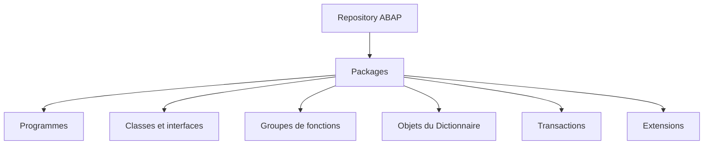
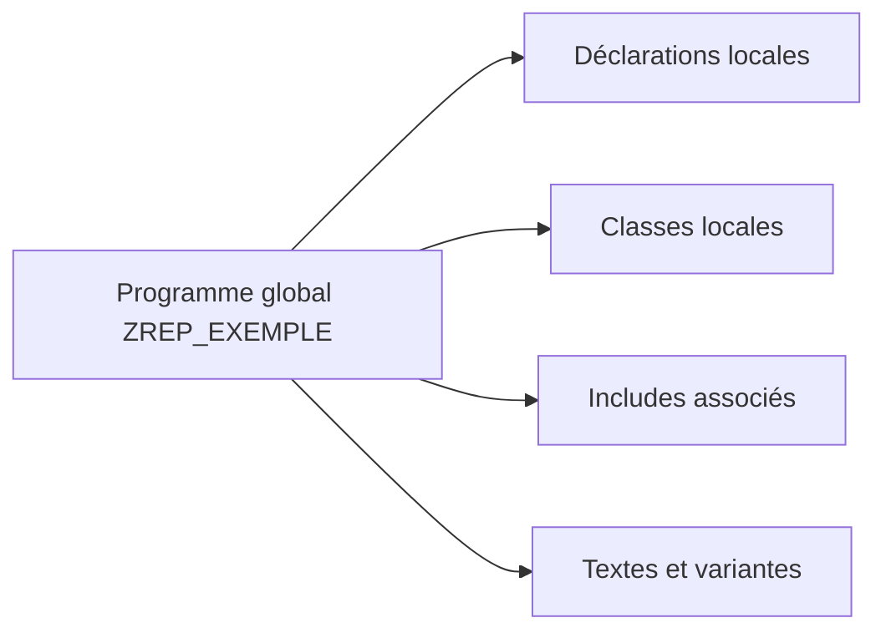
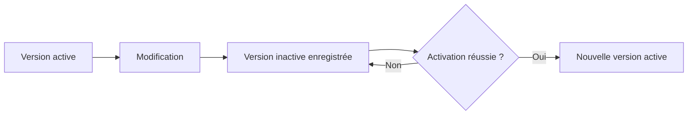

# 2. OBJETS DU REPOSITORY ABAP

## 2.A RÉSULTAT ATTENDU

- Comprendre le rôle du Repository ABAP[^terme-repository-abap]
- Identifier les principales familles d’objets de développement
- Distinguer objet global, sous-objet et objet local à un programme
- Comprendre les versions active et inactive
- Retrouver les dépendances d’un objet dans SAP GUI[^terme-sap-gui]

## 2.B VUE D’ENSEMBLE



## 2.C DÉFINITION

Le **Repository ABAP** contient les objets de développement d’un système ABAP. Ces objets sont enregistrés dans la base de données du système et sont utilisés par l’environnement[^terme-environnement] d’exécution ABAP.

Le Repository ne correspond pas à un répertoire local du poste de travail. Le code et les métadonnées restent dans le système SAP[^terme-systeme-sap].

> [!IMPORTANT]
> En environnement classique SAP GUI, plusieurs développeurs travaillent sur le même Repository central. Les verrous, les versions inactives et les ordres de transport servent à maîtriser les modifications concurrentes.

## 2.D PRINCIPALES FAMILLES D’OBJETS

| Famille               | Exemples                                                                | Transactions courantes         |
| --------------------- | ----------------------------------------------------------------------- | ------------------------------ |
| Programmes            | programmes exécutables, includes, pools de modules                      | `SE38`[^outil-se38], `SE80`[^outil-se80]                 |
| ABAP Objects[^terme-abap-objects]          | classes globales, interfaces                                            | `SE24`[^terme-class-builder-se24], `SE80`                 |
| Fonctions             | groupes de fonctions, modules fonction                                  | `SE37`[^outil-se37], `SE80`                 |
| Dictionnaire ABAP     | domaines, éléments de données, structures, tables, aides à la recherche | `SE11`[^outil-se11]                         |
| Interfaces classiques | écrans, menus GUI, statuts GUI                                          | `SE80`, `SE41`[^outil-se41], Screen Painter |
| Messages              | classes de messages                                                     | `SE91`[^outil-se91]                         |
| Transactions          | codes de transaction                                                    | `SE93`[^terme-transaction-se93]                         |
| Extensions            | enhancements, BAdI[^terme-acro-badi], exits selon la technologie                          | transactions dédiées, `SE80`   |

Cette liste n’est pas exhaustive. Un objet peut également posséder des sous-objets qui ne sont pas gérés comme des objets indépendants.

## 2.E OBJET GLOBAL ET ÉLÉMENT LOCAL

Un objet global du Repository possède un nom unique dans son espace de noms et peut être référencé depuis d’autres objets lorsque les règles techniques l’autorisent.

Exemples :

- programme `Z...` ;
- classe globale[^terme-classe-globale] `ZCL_...` ;
- table `Z...` ;
- module fonction[^terme-module-fonction] `Z_...` ;
- classe de messages `Z...`.

À l’inverse, une classe locale[^terme-classe-locale], une méthode[^terme-methode] locale ou une déclaration interne à un programme n’est pas nécessairement un objet de Repository autonome.



## 2.F ANNUAIRE DES OBJETS

L’annuaire des objets du Repository gère notamment :

- le type technique de l’objet ;
- son nom ;
- son package[^terme-package] ;
- son système d’origine ;
- les informations nécessaires au transport.

La table technique `TADIR` est fréquemment utilisée pour analyser les entrées de l’annuaire des objets. Tous les éléments visibles dans un outil ne correspondent toutefois pas obligatoirement à une entrée indépendante dans `TADIR`.

> [!CAUTION]
> Ne jamais modifier directement les tables techniques du Repository. Utiliser les outils SAP prévus à cet effet.

## 2.G ESPACES DE NOMS

Les développements client utilisent généralement :

- les préfixes `Z` ou `Y` ;
- un espace de noms enregistré de la forme `/NAMESPACE/` lorsque l’organisation en possède un.

Les objets SAP standard ne doivent pas être modifiés directement sans mécanisme d’extension ou procédure explicitement validée.

## 2.H VERSION ACTIVE ET VERSION INACTIVE

Lorsqu’un objet est modifié puis enregistré, une version inactive peut coexister avec la version active.

| Version  | Utilisation                                                                 |
| -------- | --------------------------------------------------------------------------- |
| Active   | Version disponible pour l’exécution normale et les consommateurs de l’objet |
| Inactive | État de travail enregistré mais pas encore activé                           |

L’activation vérifie l’objet et publie une nouvelle version active si les contrôles requis réussissent.



## 2.I VERROUS DE MODIFICATION

Lorsqu’un utilisateur modifie un objet, SAP peut poser un verrou afin d’empêcher une modification concurrente incompatible.

Un objet verrouillé doit être traité avec prudence :

- identifier le propriétaire du verrou ;
- vérifier si une modification est réellement en cours ;
- ne pas supprimer un verrou sans validation ;
- coordonner les changements portant sur le même objet.

## 2.J RECHERCHE ET NAVIGATION

### 2.J.1 SE80

L’Object Navigator permet de naviguer par :

- package ;
- programme ;
- classe ;
- groupe de fonctions ;
- objet local ;
- type d’objet disponible dans le Repository Browser.

### 2.J.2 SYSTÈME D’INFORMATION DU REPOSITORY

Le Repository Information System permet de rechercher des objets selon plusieurs critères techniques.

### 2.J.3 LISTE D’UTILISATIONS

La liste d’utilisations permet d’identifier les consommateurs d’un objet. Elle doit être consultée avant :

- un changement de signature ;
- une suppression ;
- un renommage ;
- une modification de type ou de structure ;
- une correction susceptible d’avoir un impact transversal.

> [!IMPORTANT]
> Une liste d’utilisations ne garantit pas toujours l’identification des appels dynamiques construits à l’exécution.

## 2.K PROCESS

### 2.K.1 Étape 1 — Ouvrir le navigateur d’objets

1. Saisir `/nSE80` dans le champ de commande[^terme-champ-commande].
2. Dans la liste située au-dessus de l’arborescence, choisir le type d’objet correspondant à l’information disponible : programme, classe/interface, groupe de fonctions, package ou objet local.
3. Saisir le nom technique complet puis valider avec Entrée.

Ne choisir le type « Package » que pour explorer un ensemble d’objets. Si le nom commence par `ZCL_` mais qu’une recherche de programme échoue, recommencer avec le type classe/interface.

### 2.K.2 Étape 2 — Confirmer l’identité de l’objet

1. Rester d’abord en mode **Afficher**.
2. Vérifier le titre, le type technique et le nom affichés.
3. Développer l’arborescence pour identifier le programme principal, les includes, les écrans, les GUI status ou les sections de classe réellement présents.
4. Relever le package affecté à l’objet.

Si SE80 propose de créer l’objet, annuler : le nom ou le type saisi ne correspond pas à un objet existant dans ce système.

### 2.K.3 Étape 3 — Identifier la structure et les dépendances

1. Sélectionner le nœud principal de l’objet.
2. Ouvrir chaque sous-objet utile sans modifier son contenu.
3. Utiliser la liste d’utilisation sur la méthode, le programme, la table ou le module concerné.
4. Distinguer les appelants de l’objet et les objets que celui-ci appelle.

Une liste vide peut signifier qu’aucune référence statique n’existe ; elle ne détecte pas nécessairement les appels dont le nom est construit dynamiquement.

### 2.K.4 Étape 4 — Relever les informations de transport

1. Ouvrir l’entrée de répertoire de l’objet depuis les fonctions de navigation de SE80.
2. Relever le package, le responsable, le système d’origine et la couche de transport disponible via le package.
3. Comparer ces valeurs avec les conventions du projet.

Un objet affecté à `$TMP`[^terme-objet-local-tmp] est local et ne sera pas transporté par un ordre Workbench[^terme-ordre-workbench] normal. Ne pas le réaffecter sans connaître la destination attendue.

### 2.K.5 Étape 5 — Autoriser ou refuser la modification

Passer en mode modification uniquement après avoir confirmé le système, le mandant[^terme-mandant], le nom, le type, le package et le périmètre de dépendances.

Le contrôle est terminé lorsque l’objet analysé est identifié sans ambiguïté et que ses principaux sous-objets, appelants et informations de transport sont connus.

## 2.L VÉRIFICATION

- Le lecteur peut expliquer la différence entre cette notion et les concepts proches.
- Le choix technique est justifié par un besoin concret, pas uniquement par habitude.
- Les limites liées à la release, aux autorisations et au contexte d’exécution sont identifiées.

## 2.M ERREURS FRÉQUENTES

- Intervenir dans le mauvais système ou mandant.
- Confondre sauvegarde et activation.

## 2.N FICHE DE CONTRÔLE À COPIER

```text
Système / SID       :
Mandant             :
Utilisateur         :
Transaction / outil :
Objet technique     :
Jeu de données      :
Résultat attendu    :
Résultat observé    :
Horodatage          :
Ordre de transport  :
```

## 2.O TERMES DU LEXIQUE

- [Repository ABAP](<../🧩 00 ├── LEXIQUE SAP ET ABAP/03 ├── REPOSITORY PACKAGES ET TRANSPORTS.md#repository-abap>)
- [ABAP](<../🧩 00 ├── LEXIQUE SAP ET ABAP/10 └── ACRONYMES SAP.md#acro-abap>)
- [Système SAP](<../🧩 00 ├── LEXIQUE SAP ET ABAP/01 ├── SYSTEMES ENVIRONNEMENTS ET MANDANTS.md#systeme-sap>)
- [Mandant](<../🧩 00 ├── LEXIQUE SAP ET ABAP/01 ├── SYSTEMES ENVIRONNEMENTS ET MANDANTS.md#mandant>)
- [SAP GUI](<../🧩 00 ├── LEXIQUE SAP ET ABAP/02 ├── SAP GUI NAVIGATION ET TRANSACTIONS.md#sap-gui>)
- [Transaction](<../🧩 00 ├── LEXIQUE SAP ET ABAP/02 ├── SAP GUI NAVIGATION ET TRANSACTIONS.md#transaction>)

## 2.P RÉFÉRENCES OFFICIELLES SAP

- [Overview of the ABAP Workbench](https://help.sap.com/docs/ABAP_PLATFORM_BW4HANA/bd833c8355f34e96a6e83096b38bf192/d18018d1454211d189710000e8322d00.html)
- [Object Directory](https://help.sap.com/docs/ABAP_PLATFORM_NEW/4a368c163b08418890a406d413933ba7/5738e06c4eb711d182bf0000e829fbfe.html)
- [Object Navigator](https://help.sap.com/docs/ABAP_PLATFORM_NEW/bd833c8355f34e96a6e83096b38bf192/efd94b7bebf811d295b100a0c94260a5.html)
- [Repository Browser](https://help.sap.com/docs/ABAP_PLATFORM_NEW/bd833c8355f34e96a6e83096b38bf192/d180194b454211d189710000e8322d00.html)

---

[Chapitre suivant — PACKAGES ET ORDRES DE TRANSPORT](<./03 ├── PACKAGES ET ORDRES DE TRANSPORT.md>)

[^terme-repository-abap]: **REPOSITORY ABAP.** Ensemble central des objets de développement d’un système ABAP. Voir [l’entrée du lexique](<../🧩 00 ├── LEXIQUE SAP ET ABAP/03 ├── REPOSITORY PACKAGES ET TRANSPORTS.md#repository-abap>).
[^terme-sap-gui]: **SAP GUI.** Client graphique permettant d’utiliser les transactions et écrans d’un système SAP. Voir [l’entrée du lexique](<../🧩 00 ├── LEXIQUE SAP ET ABAP/02 ├── SAP GUI NAVIGATION ET TRANSACTIONS.md#sap-gui>).
[^terme-environnement]: **ENVIRONNEMENT.** Rôle fonctionnel attribué à un système dans le cycle de vie : développement, test, recette, préproduction ou production. Voir [l’entrée du lexique](<../🧩 00 ├── LEXIQUE SAP ET ABAP/01 ├── SYSTEMES ENVIRONNEMENTS ET MANDANTS.md#environnement>).
[^terme-systeme-sap]: **SYSTÈME SAP.** Ensemble technique cohérent comprenant au minimum une base de données et un ou plusieurs serveurs d’applications. Il est généralement identifié par un SID de trois caractères. Voir [l’entrée du lexique](<../🧩 00 ├── LEXIQUE SAP ET ABAP/01 ├── SYSTEMES ENVIRONNEMENTS ET MANDANTS.md#systeme-sap>).
[^terme-abap-objects]: **ABAP OBJECTS.** Extension orientée objet du langage ABAP fournissant classes, interfaces, héritage, événements et exceptions de classe. Voir [l’entrée du lexique](<../🧩 00 ├── LEXIQUE SAP ET ABAP/04 ├── LANGAGE ET DEVELOPPEMENT ABAP.md#abap-objects>).
[^terme-class-builder-se24]: **CLASS BUILDER (SE24).** Outil SAP GUI utilisé pour créer, afficher, modifier, tester et documenter les classes et interfaces globales ABAP. Voir [l’entrée du lexique](<../🧩 00 ├── LEXIQUE SAP ET ABAP/06 ├── PROGRAMMES CLASSES ET OBJETS TECHNIQUES.md#class-builder-se24>).
[^terme-transaction-se93]: **TRANSACTION SE93.** Objet Repository associant un code de transaction à une cible de démarrage. Voir [l’entrée du lexique](<../🧩 00 ├── LEXIQUE SAP ET ABAP/06 ├── PROGRAMMES CLASSES ET OBJETS TECHNIQUES.md#transaction-se93>).
[^terme-acro-badi]: **BADI.** Business Add-In, mécanisme d’extension orienté objet du standard SAP. Voir [l’entrée du lexique](<../🧩 00 ├── LEXIQUE SAP ET ABAP/10 └── ACRONYMES SAP.md#acro-badi>).
[^terme-classe-globale]: **CLASSE GLOBALE.** Classe Repository réutilisable dans le système ABAP. Voir [l’entrée du lexique](<../🧩 00 ├── LEXIQUE SAP ET ABAP/06 ├── PROGRAMMES CLASSES ET OBJETS TECHNIQUES.md#classe-globale>).
[^terme-module-fonction]: **MODULE FONCTION.** Procédure globale appelée avec `CALL FUNCTION` et définie dans un groupe de fonctions. Voir [l’entrée du lexique](<../🧩 00 ├── LEXIQUE SAP ET ABAP/06 ├── PROGRAMMES CLASSES ET OBJETS TECHNIQUES.md#module-fonction>).
[^terme-classe-locale]: **CLASSE LOCALE.** Classe définie dans le code source d’un programme, d’un include ou d’un Class Pool et visible uniquement dans ce contexte de compilation. Voir [l’entrée du lexique](<../🧩 00 ├── LEXIQUE SAP ET ABAP/06 ├── PROGRAMMES CLASSES ET OBJETS TECHNIQUES.md#classe-locale>).
[^terme-methode]: **MÉTHODE.** Comportement déclaré dans une classe ou une interface et appelé avec une liste de paramètres définie. Voir [l’entrée du lexique](<../🧩 00 ├── LEXIQUE SAP ET ABAP/04 ├── LANGAGE ET DEVELOPPEMENT ABAP.md#methode>).
[^terme-package]: **PACKAGE.** Conteneur logique qui regroupe les objets de développement et détermine notamment leur transportabilité. Voir [l’entrée du lexique](<../🧩 00 ├── LEXIQUE SAP ET ABAP/03 ├── REPOSITORY PACKAGES ET TRANSPORTS.md#package>).
[^terme-champ-commande]: **CHAMP DE COMMANDE.** Zone de SAP GUI utilisée pour saisir des codes de transaction et des commandes système. Voir [l’entrée du lexique](<../🧩 00 ├── LEXIQUE SAP ET ABAP/02 ├── SAP GUI NAVIGATION ET TRANSACTIONS.md#champ-commande>).
[^terme-objet-local-tmp]: **OBJET LOCAL $TMP.** Objet affecté au package local `$TMP`, non destiné au transport vers un autre système. Voir [l’entrée du lexique](<../🧩 00 ├── LEXIQUE SAP ET ABAP/03 ├── REPOSITORY PACKAGES ET TRANSPORTS.md#objet-local-tmp>).
[^terme-ordre-workbench]: **ORDRE WORKBENCH.** Type d’ordre utilisé principalement pour les objets Repository et les modifications inter-mandants. Voir [l’entrée du lexique](<../🧩 00 ├── LEXIQUE SAP ET ABAP/03 ├── REPOSITORY PACKAGES ET TRANSPORTS.md#ordre-workbench>).
[^terme-mandant]: **MANDANT.** Subdivision logique d’un système SAP. Il est identifié par un numéro à trois chiffres et isole une partie des données, du paramétrage et des utilisateurs. Voir [l’entrée du lexique](<../🧩 00 ├── LEXIQUE SAP ET ABAP/01 ├── SYSTEMES ENVIRONNEMENTS ET MANDANTS.md#mandant>).

[^outil-se38]: **SE38.** Éditeur ABAP classique utilisé pour créer, modifier, vérifier et exécuter des programmes. Voir [le chapitre associé](<04 ├── EDITEURS ABAP SE38 ET SE80.md>).
[^outil-se80]: **SE80.** Object Navigator utilisé pour parcourir et maintenir les objets du Repository ABAP. Voir [le chapitre associé](<04 ├── EDITEURS ABAP SE38 ET SE80.md>).
[^outil-se37]: **SE37.** Function Builder utilisé pour rechercher, afficher, tester et maintenir les modules fonction. Voir [le chapitre associé](<../🧩 12 ├── MODULES FONCTION RFC ET BAPI/03 ├── RECHERCHER ET ANALYSER AVEC SE37.md>).
[^outil-se11]: **SE11.** Transaction de l’ABAP Dictionary utilisée pour analyser et maintenir les objets DDIC. Voir [le chapitre associé](<../🧩 07 ├── DICTIONNAIRE ABAP/02 ├── NAVIGATION ET ANALYSE AVEC SE11.md>).
[^outil-se41]: **SE41.** Menu Painter utilisé pour maintenir les statuts GUI, menus et codes fonction des écrans classiques. Voir [le chapitre associé](<../🧩 22 ├── PROGRAMMATION DIALOGUE ET DYNPRO/01 ├── CREER UN MODULE POOL ET UN PREMIER ECRAN.md>).
[^outil-se91]: **SE91.** Transaction de création et de maintenance des classes de messages SAP. Voir [le chapitre associé](<../🧩 10 ├── MESSAGES ET GESTION DES ERREURS/02 ├── CLASSES DE MESSAGES ET TRANSACTION SE91.md>).
