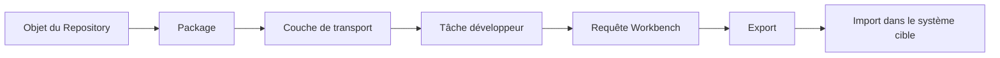
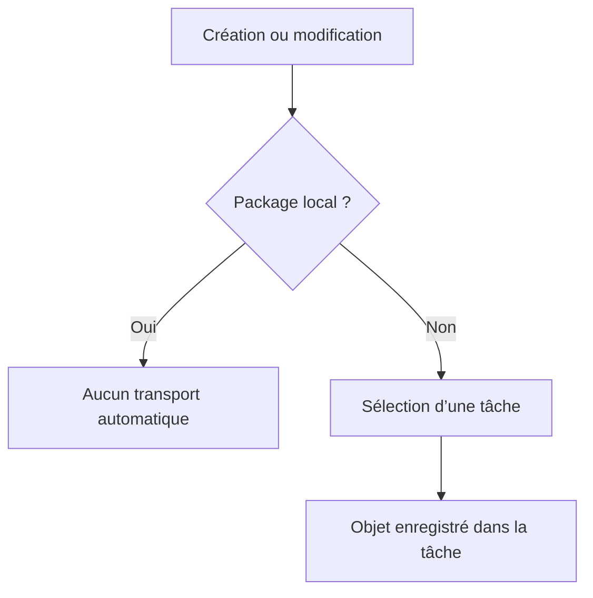
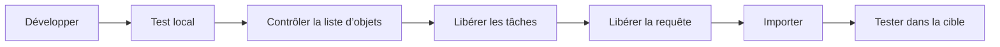

# 3. PACKAGES ET ORDRES DE TRANSPORT

## 3.A RÉSULTAT ATTENDU

- Comprendre le rôle d’un package[^terme-package] ABAP[^terme-abap]
- Distinguer objet local et objet transportable
- Comprendre la structure requête/tâche d’un ordre de transport[^terme-ordre-transport]
- Différencier requête Workbench et requête de Customizing[^terme-customizing]
- Appliquer une séquence de transport sûre

## 3.B VUE D’ENSEMBLE



## 3.C PACKAGE ABAP

Un package organise les objets du Repository qui appartiennent à un même périmètre technique ou applicatif.

Il porte notamment des informations utiles pour :

- la structuration du Repository ;
- l’affectation à un composant applicatif ;
- le transport des objets ;
- les dépendances entre packages lorsque le concept de package est utilisé complètement.

> [!IMPORTANT]
> Le package n’est pas un simple dossier visuel. Il participe au cycle de vie et au transport des objets.

## 3.D PACKAGE LOCAL `$TMP`

Le package `$TMP`[^terme-objet-local-tmp] est destiné aux objets locaux non transportés.

Utilisations adaptées :

- prototype jetable ;
- test personnel ;
- programme temporaire ;
- démonstration qui ne doit pas quitter le système.

Utilisations inadaptées :

- correction devant être livrée ;
- objet consommé par une application transportée ;
- développement devant passer en qualité ou en production.

Un objet local peut être réaffecté ultérieurement à un package transportable avec les outils du Workbench.

## 3.E PACKAGE TRANSPORTABLE

Lors de la création d’un objet dans un package transportable, SAP[^terme-acro-sap] demande généralement un ordre de transport.

Le package détermine la couche de transport et donc la route logique utilisée dans le paysage SAP.



## 3.F STRUCTURE D’UN ORDRE DE TRANSPORT

Une requête Workbench contient généralement une ou plusieurs tâches.

```text
Requête Workbench
├── Tâche du développeur A
│   ├── Objet 1
│   └── Objet 2
└── Tâche du développeur B
    └── Objet 3
```

| Niveau         | Rôle                                           |
| -------------- | ---------------------------------------------- |
| Requête        | Regroupe la livraison transportable            |
| Tâche          | Enregistre les modifications d’un propriétaire |
| Liste d’objets | Contient les entrées techniques à exporter     |

La tâche doit être libérée avant la requête parente.

## 3.G WORKBENCH ET CUSTOMIZING

### 3.G.1 REQUÊTE WORKBENCH

Elle transporte principalement les objets du Repository et certaines données dépendantes de la configuration technique.

Exemples :

- programmes ;
- classes ;
- objets du Dictionnaire ;
- modules fonction ;
- objets de service ou d’extension selon leur technologie.

### 3.G.2 REQUÊTE DE CUSTOMIZING

Elle transporte principalement du paramétrage dépendant du mandant[^terme-dependant-mandant] lorsque ce paramétrage est enregistré dans le système de transport.

> [!NOTE]
> Un développeur ABAP travaille surtout avec des requêtes Workbench, mais doit reconnaître les deux catégories pour éviter de mélanger code et paramétrage sans justification.

## 3.H TRANSACTIONS PRINCIPALES

| Transaction | Usage principal                                                             |
| ----------- | --------------------------------------------------------------------------- |
| `SE09`[^outil-se09]      | Transport Organizer orienté Workbench                                       |
| `SE10`[^outil-se10]      | Vue étendue du Transport Organizer                                          |
| `SE03`      | Outils d’administration et d’analyse du système de transport                |
| `STMS`[^outil-stms]      | Administration des routes et imports, généralement gérée par l’équipe Basis |

Les fonctions exactes accessibles dépendent des autorisations.

## 3.I SÉQUENCE DE TRAVAIL

1. identifier le package cible ;
2. sélectionner ou créer la requête adaptée au périmètre de livraison ;
3. affecter la modification à sa propre tâche ;
4. contrôler la liste d’objets ;
5. terminer les développements et les tests ;
6. libérer les tâches ;
7. libérer la requête ;
8. faire importer la requête selon le processus projet ;
9. vérifier les journaux d’export et d’import.



## 3.J CONTRÔLES AVANT LIBÉRATION

- la requête correspond au bon projet ou ticket ;
- aucun objet sans rapport n’est présent ;
- les objets dépendants sont inclus ;
- les objets sont activés ;
- les contrôles techniques ont été exécutés ;
- les dépendances avec d’autres transports sont connues ;
- l’ordre d’import est défini si plusieurs requêtes sont liées.

> [!CAUTION]
> Après libération d’une requête, sa liste d’objets ne doit plus être considérée comme un espace de travail modifiable. Une correction supplémentaire doit être enregistrée dans une autre requête selon le processus du projet.

## 3.K ERREURS FRÉQUENTES

| Erreur                                              | Conséquence                                      |
| --------------------------------------------------- | ------------------------------------------------ |
| Développer dans `$TMP` par défaut                   | Objet absent du transport                        |
| Réutiliser une requête sans contrôler son périmètre | Livraison de changements non liés                |
| Oublier un objet dépendant                          | Erreur d’activation ou d’exécution dans la cible |
| Libérer dans le mauvais ordre                       | Dépendance non satisfaite                        |
| Transporter sans test après import                  | Défaut découvert tardivement                     |

## 3.L PROCESS

### 3.L.1 Étape 1 — Affecter le bon package

1. Lors de la première sauvegarde, saisir le package fourni par le projet.
2. Vérifier son libellé et son composant avant de valider.
3. Utiliser `$TMP` uniquement pour un exercice ou un objet explicitement local.

Si le package attendu est inconnu, annuler l’affectation. Choisir un package arbitraire peut envoyer l’objet vers une mauvaise couche de transport.

### 3.L.2 Étape 2 — Affecter une tâche de transport

1. Dans la demande de transport, rechercher l’ordre Workbench[^terme-ordre-workbench] prévu pour la livraison.
2. Sélectionner la tâche appartenant à votre utilisateur.
3. Vérifier la description, le propriétaire et la cible de l’ordre parent.
4. Créer un nouvel ordre uniquement selon la convention de nommage et de découpage de l’équipe.

L’objet doit apparaître sous une tâche, elle-même rattachée à l’ordre parent. Un ordre d’un autre sujet ne doit pas être réutilisé pour éviter une livraison non maîtrisée.

### 3.L.3 Étape 3 — Contrôler le contenu dans SE09 ou SE10

1. Ouvrir `/nSE09` ou `/nSE10`.
2. Rechercher par numéro d’ordre ou propriétaire.
3. Développer l’ordre puis la tâche affectée.
4. Vérifier les clés d’objet enregistrées : type, nom et sous-objet.
5. Comparer la liste avec les objets réellement créés ou modifiés.

Un objet absent peut ne pas avoir été sauvegardé, être enregistré dans une autre tâche ou relever d’un transport Customizing distinct.

### 3.L.4 Étape 4 — Vérifier les dépendances de livraison

1. Identifier les dépendances nécessaires : élément de données[^terme-element-donnees], structure, table, classe[^terme-classe], message, enhancement ou Customizing.
2. Rechercher leur ordre respectif.
3. Vérifier que leur séquence d’import est compatible avec celle de l’objet appelant.

Le but n’est pas de placer tous les objets dans le même ordre, mais d’empêcher qu’un objet soit importé avant une dépendance indispensable.

### 3.L.5 Étape 5 — Préparer puis libérer

1. Exécuter les contrôles syntaxiques et statiques prévus.
2. Activer tous les objets dépendants.
3. Exécuter les tests positifs et négatifs.
4. Contrôler une dernière fois le contenu de la tâche.
5. Libérer la tâche utilisateur.
6. Libérer l’ordre parent uniquement après l’autorisation de livraison.

Après libération, vérifier le journal. Le processus est terminé lorsque l’ordre est libéré sans erreur, contient exactement le périmètre validé et est disponible pour la chaîne de transport attendue.

## 3.M VÉRIFICATION

- Le lecteur peut expliquer la différence entre cette notion et les concepts proches.
- Le choix technique est justifié par un besoin concret, pas uniquement par habitude.
- Les limites liées à la release, aux autorisations et au contexte d’exécution sont identifiées.

## 3.N FICHE DE CONTRÔLE À COPIER

```text
Système / SID       :
Mandant             :
Utilisateur         :
Transaction / outil :
Objet technique     :
Jeu de données      :
Résultat attendu    :
Résultat observé    :
Horodatage          :
Ordre de transport  :
```

## 3.O TERMES DU LEXIQUE

- [Package](<../🧩 00 ├── LEXIQUE SAP ET ABAP/03 ├── REPOSITORY PACKAGES ET TRANSPORTS.md#package>)
- [Système SAP](<../🧩 00 ├── LEXIQUE SAP ET ABAP/01 ├── SYSTEMES ENVIRONNEMENTS ET MANDANTS.md#systeme-sap>)
- [Mandant](<../🧩 00 ├── LEXIQUE SAP ET ABAP/01 ├── SYSTEMES ENVIRONNEMENTS ET MANDANTS.md#mandant>)
- [SAP GUI](<../🧩 00 ├── LEXIQUE SAP ET ABAP/02 ├── SAP GUI NAVIGATION ET TRANSACTIONS.md#sap-gui>)
- [Transaction](<../🧩 00 ├── LEXIQUE SAP ET ABAP/02 ├── SAP GUI NAVIGATION ET TRANSACTIONS.md#transaction>)
- [Repository ABAP](<../🧩 00 ├── LEXIQUE SAP ET ABAP/03 ├── REPOSITORY PACKAGES ET TRANSPORTS.md#repository-abap>)

## 3.P RÉFÉRENCES OFFICIELLES SAP

- [Transport Organizer — Concept](https://help.sap.com/docs/ABAP_PLATFORM_BW4HANA/4a368c163b08418890a406d413933ba7/5738dd924eb711d182bf0000e829fbfe.html)
- [Object Directory](https://help.sap.com/docs/ABAP_PLATFORM_NEW/4a368c163b08418890a406d413933ba7/5738e06c4eb711d182bf0000e829fbfe.html)
- [Creating Main Packages](https://help.sap.com/docs/ABAP_PLATFORM_NEW/bd833c8355f34e96a6e83096b38bf192/eac05d8cf01011d3964000a0c94260a5.html)
- [Assigning an Object to a Different Package](https://help.sap.com/docs/SAP_NETWEAVER_AS_ABAP_752/bd833c8355f34e96a6e83096b38bf192/d1801972454211d189710000e8322d00.html)

---

[Chapitre suivant — ÉDITEURS ABAP `SE38`[^outil-se38] ET `SE80`[^outil-se80]](<./04 ├── EDITEURS ABAP SE38 ET SE80.md>)

[^terme-package]: **PACKAGE.** Conteneur logique qui regroupe les objets de développement et détermine notamment leur transportabilité. Voir [l’entrée du lexique](<../🧩 00 ├── LEXIQUE SAP ET ABAP/03 ├── REPOSITORY PACKAGES ET TRANSPORTS.md#package>).
[^terme-abap]: **ABAP.** Langage de programmation de la plateforme ABAP, conçu pour développer des applications métier et techniques SAP. Voir [l’entrée du lexique](<../🧩 00 ├── LEXIQUE SAP ET ABAP/04 ├── LANGAGE ET DEVELOPPEMENT ABAP.md#abap>).
[^terme-ordre-transport]: **ORDRE DE TRANSPORT.** Conteneur qui regroupe des modifications à exporter puis importer dans d’autres systèmes. Voir [l’entrée du lexique](<../🧩 00 ├── LEXIQUE SAP ET ABAP/03 ├── REPOSITORY PACKAGES ET TRANSPORTS.md#ordre-transport>).
[^terme-customizing]: **CUSTOMIZING.** Paramétrage permettant d’adapter le comportement standard SAP à l’organisation. Voir [l’entrée du lexique](<../🧩 00 ├── LEXIQUE SAP ET ABAP/09 ├── NOTIONS FONCTIONNELLES ET ORGANISATIONNELLES.md#customizing>).
[^terme-objet-local-tmp]: **OBJET LOCAL $TMP.** Objet affecté au package local `$TMP`, non destiné au transport vers un autre système. Voir [l’entrée du lexique](<../🧩 00 ├── LEXIQUE SAP ET ABAP/03 ├── REPOSITORY PACKAGES ET TRANSPORTS.md#objet-local-tmp>).
[^terme-acro-sap]: **SAP.** Nom de l’éditeur et de son écosystème logiciel ; l’acronyme historique provient de l’allemand. Voir [l’entrée du lexique](<../🧩 00 ├── LEXIQUE SAP ET ABAP/10 └── ACRONYMES SAP.md#acro-sap>).
[^terme-dependant-mandant]: **DÉPENDANT DU MANDANT.** Qualifie une donnée ou un objet dont le contenu est séparé par mandant. Voir [l’entrée du lexique](<../🧩 00 ├── LEXIQUE SAP ET ABAP/01 ├── SYSTEMES ENVIRONNEMENTS ET MANDANTS.md#dependant-mandant>).
[^terme-ordre-workbench]: **ORDRE WORKBENCH.** Type d’ordre utilisé principalement pour les objets Repository et les modifications inter-mandants. Voir [l’entrée du lexique](<../🧩 00 ├── LEXIQUE SAP ET ABAP/03 ├── REPOSITORY PACKAGES ET TRANSPORTS.md#ordre-workbench>).
[^terme-element-donnees]: **ÉLÉMENT DE DONNÉES.** Objet DDIC qui attribue une signification métier, des libellés et une documentation à un type élémentaire ou à un domaine. Voir [l’entrée du lexique](<../🧩 00 ├── LEXIQUE SAP ET ABAP/05 ├── DONNEES DICTIONNAIRE ET BASE DE DONNEES.md#element-donnees>).
[^terme-classe]: **CLASSE.** Modèle orienté objet définissant état et comportements. Voir [l’entrée du lexique](<../🧩 00 ├── LEXIQUE SAP ET ABAP/04 ├── LANGAGE ET DEVELOPPEMENT ABAP.md#classe>).

[^outil-se09]: **SE09.** Transaction de l’Organisateur de transports utilisée pour consulter et gérer les ordres et tâches de transport. Voir [le chapitre associé](<03 ├── PACKAGES ET ORDRES DE TRANSPORT.md>).
[^outil-se10]: **SE10.** Transaction de l’Organisateur de transports utilisée pour consulter et gérer les ordres et tâches de transport. Voir [le chapitre associé](<03 ├── PACKAGES ET ORDRES DE TRANSPORT.md>).
[^outil-stms]: **STMS.** Transport Management System utilisé pour administrer les routes, files et imports de transports. Voir [le chapitre associé](<03 ├── PACKAGES ET ORDRES DE TRANSPORT.md>).
[^outil-se38]: **SE38.** Éditeur ABAP classique utilisé pour créer, modifier, vérifier et exécuter des programmes. Voir [le chapitre associé](<04 ├── EDITEURS ABAP SE38 ET SE80.md>).
[^outil-se80]: **SE80.** Object Navigator utilisé pour parcourir et maintenir les objets du Repository ABAP. Voir [le chapitre associé](<04 ├── EDITEURS ABAP SE38 ET SE80.md>).
