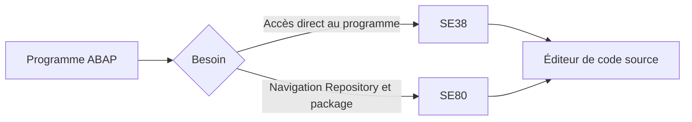
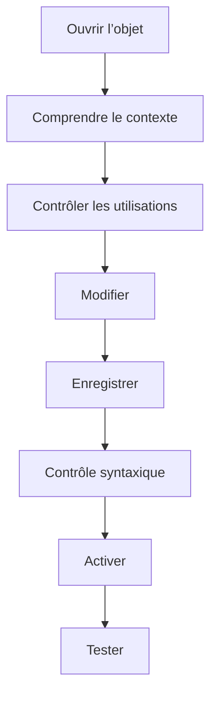

# 4. ÉDITEURS ABAP `SE38` ET `SE80`

## 4.A RÉSULTAT ATTENDU

- Distinguer les rôles de `SE38`[^outil-se38] et `SE80`[^outil-se80]
- Ouvrir, modifier, contrôler et activer un programme
- Naviguer dans les sous-objets d’un programme
- Utiliser les principales fonctions de l’éditeur ABAP[^terme-abap] dans SAP GUI[^terme-sap-gui]
- Choisir l’outil adapté au contexte

## 4.B VUE D’ENSEMBLE



## 4.C TRANSACTION `SE38`

`SE38` ouvre l’ABAP Editor avec une approche centrée sur un programme.

Utilisations courantes :

- créer un programme ;
- afficher ou modifier son code source ;
- exécuter un programme exécutable[^terme-programme-executable] ;
- maintenir ses variantes ;
- accéder aux textes ;
- lancer des contrôles liés au programme.

`SE38` est adaptée lorsqu’on connaît déjà le nom du programme à traiter.

## 4.D TRANSACTION `SE80`

`SE80` ouvre l’Object Navigator et permet de travailler dans le contexte du Repository.

Utilisations courantes :

- naviguer dans un package[^terme-package] ;
- afficher les objets liés à un programme ;
- ouvrir des includes, écrans, statuts GUI ou classes locales ;
- créer différents types d’objets ;
- consulter les relations entre objets ;
- accéder à la liste d’utilisations.

`SE80` est généralement plus efficace pour analyser une application classique composée de plusieurs objets.

## 4.E COMPARAISON

| Besoin                                      |                     `SE38` |     `SE80` |
| ------------------------------------------- | -------------------------: | ---------: |
| Ouvrir rapidement un programme connu        |                        Oui |        Oui |
| Exécuter un programme                       |                        Oui |        Oui |
| Parcourir un package                        |                     Limité |        Oui |
| Naviguer entre sous-objets                  |                     Limité |        Oui |
| Créer plusieurs catégories d’objets         |                        Non |        Oui |
| Analyser une application classique complète | Possible mais peu pratique | Recommandé |

## 4.F ÉDITEUR DE CODE SOURCE

L’éditeur de code source ABAP est intégré à plusieurs outils du Workbench, notamment `SE38`, `SE80`, `SE24`[^terme-class-builder-se24] et `SE37`[^outil-se37].

Fonctions principales :

- coloration syntaxique ;
- indentation ;
- recherche et remplacement ;
- aide sur les mots-clés ;
- contrôle syntaxique ;
- activation ;
- gestion des points d’arrêt ;
- navigation vers les définitions et utilisations selon le contexte.

## 4.G ACTIONS ESSENTIELLES

| Action               | Effet                                                           |
| -------------------- | --------------------------------------------------------------- |
| Enregistrer          | Sauvegarde l’état de travail, qui peut rester inactif           |
| Contrôler            | Exécute le contrôle syntaxique                                  |
| Activer              | Génère et publie la version active si les contrôles réussissent |
| Exécuter             | Lance un programme exécutable                                   |
| Afficher/Modifier    | Bascule entre consultation et édition selon les autorisations   |
| Liste d’utilisations | Recherche les consommateurs identifiables de l’objet            |

### 4.G.1 RACCOURCIS CLASSIQUES

| Raccourci     | Action courante                  |
| ------------- | -------------------------------- |
| `Ctrl` + `S`  | Enregistrer                      |
| `Ctrl` + `F2` | Contrôle syntaxique              |
| `Ctrl` + `F3` | Activer                          |
| `F8`          | Exécuter un programme exécutable |

Les raccourcis peuvent dépendre du contexte de l’écran et des paramètres du frontend[^terme-frontend].

## 4.H AIDE SUR LE CODE

### 4.H.1 DOCUMENTATION D’UN MOT-CLÉ

Placer le curseur sur un mot-clé ABAP puis utiliser l’aide permet d’ouvrir la documentation correspondante disponible dans le système.

La documentation locale du système est particulièrement utile pour vérifier la syntaxe compatible avec sa version ABAP.

### 4.H.2 COMPLÉTION ET MODÈLES

L’éditeur de code source peut proposer :

- des modèles de code ;
- de la complétion ;
- des corrections de casse ;
- une indentation automatique.

Ces fonctions aident à saisir du code, mais ne remplacent ni le contrôle syntaxique ni la vérification fonctionnelle.

## 4.I VERROU ET MODE MODIFICATION

L’ouverture en modification peut échouer lorsque :

- l’objet est verrouillé par un autre utilisateur ;
- l’utilisateur ne possède pas l’autorisation ;
- le système ou le client est non modifiable ;
- l’objet appartient au standard SAP et la modification n’est pas autorisée ;
- une réparation ou une clé serait nécessaire selon le contexte du système.

> [!CAUTION]
> Ne jamais contourner un verrou ou une restriction sans comprendre son origine et sans validation du responsable technique.

## 4.J MÉTHODE DE TRAVAIL



- privilégier `SE80` pour comprendre une application et ses dépendances ;
- utiliser `SE38` pour l’accès direct à un programme connu ;
- lire l’objet avant de le modifier ;
- contrôler la requête de transport associée ;
- comparer la version active et inactive en cas de doute ;
- ne pas confondre enregistrement et activation.

## 4.K PROCESS

### 4.K.1 Étape 1 — Ouvrir un programme connu dans SE38

1. Saisir `/nSE38`.
2. Entrer le nom technique exact du programme.
3. Choisir **Afficher** pour l’analyse ou **Modifier** uniquement si une correction est autorisée.

Si le programme est introuvable, vérifier son nom et son type. Une classe[^terme-classe], un groupe de fonctions ou un include ne doit pas être créé comme report pour contourner une recherche incorrecte.

### 4.K.2 Étape 2 — Déterminer si SE38 suffit

Utiliser SE38 pour consulter, modifier, contrôler, activer ou exécuter directement un programme connu. Relever ses includes et objets associés lorsque le changement dépasse le source principal.

Si l’analyse exige des écrans, GUI status, includes nombreux ou objets d’un package, poursuivre dans SE80.

### 4.K.3 Étape 3 — Retrouver le même objet dans SE80

1. Ouvrir `/nSE80`.
2. Choisir le type **Programme**.
3. Saisir le même nom puis valider.
4. Développer l’arborescence et comparer le source principal, les includes, écrans et GUI status avec les informations vues dans SE38.

L’objet ouvert dans les deux transactions doit porter le même nom et le même statut d’activation. SE80 ajoute la vue structurée ; il ne crée pas une copie distincte.

### 4.K.4 Étape 4 — Contrôler et activer

1. Enregistrer la modification.
2. Exécuter `Ctrl+F2` et traiter chaque erreur syntaxique.
3. Exécuter `Ctrl+F3` pour activer.
4. Vérifier dans l’arborescence que les objets dépendants ne restent pas inactifs.

Un contrôle syntaxique réussi ne remplace pas l’activation. Une version enregistrée mais inactive n’est pas celle exécutée normalement.

### 4.K.5 Étape 5 — Consulter l’aide de la release

Positionner le curseur sur une instruction ou une addition ABAP puis appuyer sur `F1`[^terme-aide-f1]. Vérifier la syntaxe, les prérequis de release, les exceptions et les exemples applicables au système connecté.

Le chapitre est validé lorsque le lecteur sait choisir SE38 pour l’accès direct et SE80 pour la navigation structurée, puis contrôler et activer le même objet sans ambiguïté.

## 4.L VÉRIFICATION

- Le lecteur peut expliquer la différence entre cette notion et les concepts proches.
- Le choix technique est justifié par un besoin concret, pas uniquement par habitude.
- Les limites liées à la release, aux autorisations et au contexte d’exécution sont identifiées.

## 4.M ERREURS FRÉQUENTES

- Intervenir dans le mauvais système ou mandant[^terme-mandant].
- Confondre sauvegarde et activation.

## 4.N FICHE DE CONTRÔLE À COPIER

```text
Système / SID       :
Mandant             :
Utilisateur         :
Transaction / outil :
Objet technique     :
Jeu de données      :
Résultat attendu    :
Résultat observé    :
Horodatage          :
Ordre de transport  :
```

## 4.O TERMES DU LEXIQUE

- [ABAP](<../🧩 00 ├── LEXIQUE SAP ET ABAP/10 └── ACRONYMES SAP.md#acro-abap>)
- [Système SAP](<../🧩 00 ├── LEXIQUE SAP ET ABAP/01 ├── SYSTEMES ENVIRONNEMENTS ET MANDANTS.md#systeme-sap>)
- [Mandant](<../🧩 00 ├── LEXIQUE SAP ET ABAP/01 ├── SYSTEMES ENVIRONNEMENTS ET MANDANTS.md#mandant>)
- [SAP GUI](<../🧩 00 ├── LEXIQUE SAP ET ABAP/02 ├── SAP GUI NAVIGATION ET TRANSACTIONS.md#sap-gui>)
- [Transaction](<../🧩 00 ├── LEXIQUE SAP ET ABAP/02 ├── SAP GUI NAVIGATION ET TRANSACTIONS.md#transaction>)
- [Repository ABAP](<../🧩 00 ├── LEXIQUE SAP ET ABAP/03 ├── REPOSITORY PACKAGES ET TRANSPORTS.md#repository-abap>)

## 4.P RÉFÉRENCES OFFICIELLES SAP

- [Object Navigator](https://help.sap.com/docs/ABAP_PLATFORM_NEW/bd833c8355f34e96a6e83096b38bf192/efd94b7bebf811d295b100a0c94260a5.html)
- [Source Code-Based Editor](https://help.sap.com/docs/ABAP_PLATFORM_NEW/bd833c8355f34e96a6e83096b38bf192/4b2015f1ec4f0120e10000000a42189c.html)
- [ABAP Source Code Editor](https://help.sap.com/docs/ABAP_PLATFORM_NEW/c238d694b825421f940829321ffa326a/9ac600a0fad14967aaf2964be5a21963.html)
- [Creating a Program](https://help.sap.com/docs/ABAP_PLATFORM_NEW/bd833c8355f34e96a6e83096b38bf192/d1801a47454211d189710000e8322d00-65.html)

---

[Chapitre suivant — CRÉATION D’UN PREMIER PROGRAMME](<./05 ├── CREATION D UN PREMIER PROGRAMME.md>)

[^terme-abap]: **ABAP.** Langage de programmation de la plateforme ABAP, conçu pour développer des applications métier et techniques SAP. Voir [l’entrée du lexique](<../🧩 00 ├── LEXIQUE SAP ET ABAP/04 ├── LANGAGE ET DEVELOPPEMENT ABAP.md#abap>).
[^terme-sap-gui]: **SAP GUI.** Client graphique permettant d’utiliser les transactions et écrans d’un système SAP. Voir [l’entrée du lexique](<../🧩 00 ├── LEXIQUE SAP ET ABAP/02 ├── SAP GUI NAVIGATION ET TRANSACTIONS.md#sap-gui>).
[^terme-programme-executable]: **PROGRAMME EXÉCUTABLE.** Programme ABAP de type report pouvant être lancé directement, généralement avec `F8` ou par une transaction. Voir [l’entrée du lexique](<../🧩 00 ├── LEXIQUE SAP ET ABAP/06 ├── PROGRAMMES CLASSES ET OBJETS TECHNIQUES.md#programme-executable>).
[^terme-package]: **PACKAGE.** Conteneur logique qui regroupe les objets de développement et détermine notamment leur transportabilité. Voir [l’entrée du lexique](<../🧩 00 ├── LEXIQUE SAP ET ABAP/03 ├── REPOSITORY PACKAGES ET TRANSPORTS.md#package>).
[^terme-class-builder-se24]: **CLASS BUILDER (SE24).** Outil SAP GUI utilisé pour créer, afficher, modifier, tester et documenter les classes et interfaces globales ABAP. Voir [l’entrée du lexique](<../🧩 00 ├── LEXIQUE SAP ET ABAP/06 ├── PROGRAMMES CLASSES ET OBJETS TECHNIQUES.md#class-builder-se24>).
[^terme-frontend]: **FRONTEND.** Poste ou couche cliente utilisée par l’utilisateur, par exemple SAP GUI for Windows. Voir [l’entrée du lexique](<../🧩 00 ├── LEXIQUE SAP ET ABAP/01 ├── SYSTEMES ENVIRONNEMENTS ET MANDANTS.md#frontend>).
[^terme-classe]: **CLASSE.** Modèle orienté objet définissant état et comportements. Voir [l’entrée du lexique](<../🧩 00 ├── LEXIQUE SAP ET ABAP/04 ├── LANGAGE ET DEVELOPPEMENT ABAP.md#classe>).
[^terme-aide-f1]: **AIDE F1.** Aide contextuelle expliquant un champ, une fonction ou un mot-clé. Voir [l’entrée du lexique](<../🧩 00 ├── LEXIQUE SAP ET ABAP/02 ├── SAP GUI NAVIGATION ET TRANSACTIONS.md#aide-f1>).
[^terme-mandant]: **MANDANT.** Subdivision logique d’un système SAP. Il est identifié par un numéro à trois chiffres et isole une partie des données, du paramétrage et des utilisateurs. Voir [l’entrée du lexique](<../🧩 00 ├── LEXIQUE SAP ET ABAP/01 ├── SYSTEMES ENVIRONNEMENTS ET MANDANTS.md#mandant>).

[^outil-se38]: **SE38.** Éditeur ABAP classique utilisé pour créer, modifier, vérifier et exécuter des programmes. Voir [le chapitre associé](<04 ├── EDITEURS ABAP SE38 ET SE80.md>).
[^outil-se80]: **SE80.** Object Navigator utilisé pour parcourir et maintenir les objets du Repository ABAP. Voir [le chapitre associé](<04 ├── EDITEURS ABAP SE38 ET SE80.md>).
[^outil-se37]: **SE37.** Function Builder utilisé pour rechercher, afficher, tester et maintenir les modules fonction. Voir [le chapitre associé](<../🧩 12 ├── MODULES FONCTION RFC ET BAPI/03 ├── RECHERCHER ET ANALYSER AVEC SE37.md>).
