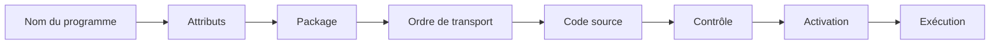
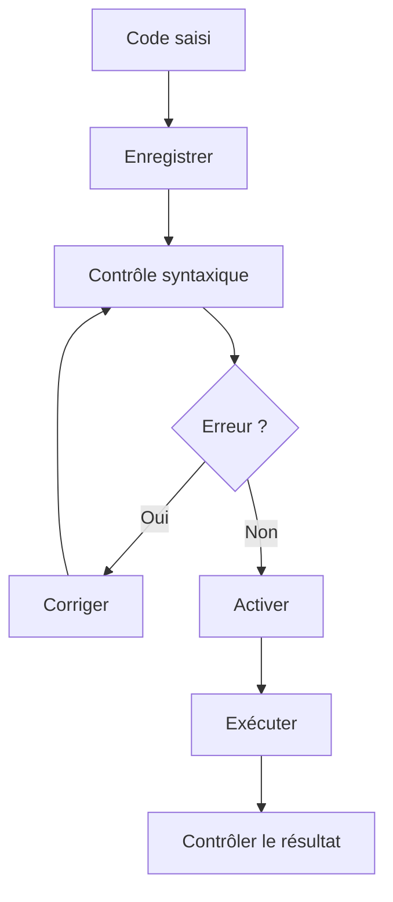

# 5. CRÉATION D’UN PREMIER PROGRAMME

## 5.A RÉSULTAT ATTENDU

- Créer un programme exécutable[^terme-programme-executable] dans SAP GUI[^terme-sap-gui]
- L’affecter au bon package[^terme-package] et au bon ordre de transport[^terme-ordre-transport]
- Saisir un code ABAP[^terme-abap] minimal
- Contrôler, activer et exécuter le programme
- Identifier les artefacts créés autour du programme

## 5.B VUE D’ENSEMBLE



## 5.C PRÉREQUIS

Avant de créer le programme, disposer de :

- l’environnement[^terme-environnement] de développement correct ;
- l’autorisation de créer des objets du Repository ;
- la convention de nommage du projet ;
- un package cible ;
- une requête Workbench adaptée ;
- un objectif de test clairement défini.

## 5.D NOM DU PROGRAMME

Un développement client utilise généralement un nom commençant par `Z` ou `Y`, sauf utilisation d’un espace de noms enregistré.

Exemple :

```text
ZDEMO_FONDAMENTAUX_ABAP
```

Le nom doit être :

- explicite ;
- stable ;
- cohérent avec le projet ;
- conforme aux règles internes ;
- suffisamment spécifique pour éviter les collisions.

## 5.E CRÉATION AVEC `SE38`

1. ouvrir la transaction `SE38`[^outil-se38] ;
2. saisir le nom du programme ;
3. choisir **Créer** ;
4. renseigner une description courte ;
5. sélectionner le type **Programme exécutable** ;
6. enregistrer ;
7. affecter le programme au package prévu ;
8. sélectionner la tâche de transport[^terme-tache-transport] ;
9. saisir le code source ;
10. contrôler, activer et exécuter.

Les libellés exacts peuvent varier selon la version du système et la langue de connexion.

## 5.F CRÉATION AVEC `SE80`

1. ouvrir la transaction `SE80`[^outil-se80] ;
2. sélectionner le Repository Browser ;
3. afficher le package cible ;
4. créer un programme depuis le menu contextuel du package ;
5. renseigner les attributs ;
6. affecter l’objet à la tâche de transport ;
7. ouvrir le code source ;
8. contrôler, activer et exécuter.

Cette approche permet de créer directement l’objet dans son contexte applicatif.

## 5.G CODE MINIMAL

```abap
REPORT zdemo_fondamentaux_abap.

WRITE / 'Premier programme ABAP'.
```

### 5.G.1 ANALYSE

```abap
REPORT zdemo_fondamentaux_abap.
```

- `REPORT` introduit un programme exécutable ;
- le nom doit correspondre au programme du Repository ;
- l’instruction se termine par un point.

```abap
WRITE / 'Premier programme ABAP'.
```

- `WRITE` produit une sortie de liste classique ;
- `/` commence une nouvelle ligne ;
- le texte est un littéral caractère.

> [!NOTE]
> Ce programme utilise volontairement une sortie de liste classique. Les technologies d’interface utilisateur et de restitution structurée seront traitées séparément.

## 5.H VERSION AVEC PARAMÈTRE

```abap
REPORT zdemo_fondamentaux_abap.

PARAMETERS p_name TYPE c LENGTH 30 LOWER CASE.

START-OF-SELECTION.
  WRITE: / 'Bonjour', p_name.
```

Ce programme :

1. génère un écran de sélection standard ;
2. récupère une valeur dans `p_name` ;
3. exécute le bloc `START-OF-SELECTION` ;
4. affiche le résultat dans une liste classique.

## 5.I CONTRÔLE, ACTIVATION ET EXÉCUTION



L’exécution n’est pas une preuve de conformité fonctionnelle. Elle confirme uniquement que le scénario testé a pu atteindre un résultat sans erreur bloquante visible.

## 5.J OBJETS ET INFORMATIONS À CONTRÔLER

Après création :

- nom et description du programme ;
- type de programme ;
- package ;
- tâche de transport ;
- statut actif ;
- textes de sélection si des paramètres existent ;
- documentation technique si le projet l’exige ;
- autorisations nécessaires à l’exécution.

## 5.K ERREURS FRÉQUENTES

| Situation                           | Cause probable                                     |
| ----------------------------------- | -------------------------------------------------- |
| Le programme n’est pas transporté   | Affectation à `$TMP`[^terme-objet-local-tmp]                               |
| L’ancienne version s’exécute        | Modifications enregistrées mais non activées       |
| Le programme ne s’exécute pas       | Type de programme incorrect ou erreur d’activation |
| Le texte du paramètre est technique | Texte de sélection non maintenu                    |
| La création est refusée             | Autorisation, verrou ou client non modifiable      |

## 5.L PROCESS

### 5.L.1 Étape 1 — Créer le report

1. Saisir `/nSE38`.
2. Entrer `ZREF_HELLO_WORLD` puis choisir **Créer**.
3. Si le système indique que le nom existe déjà, annuler et choisir un nom client libre ; ne pas écraser un programme existant.
4. Saisir un titre explicite et sélectionner **Programme exécutable**.

Le type exécutable permet un lancement direct avec `F8`. Un include ou un module pool[^terme-module-pool] ne répond pas à ce scénario.

### 5.L.2 Étape 2 — Affecter le package et le transport

1. Utiliser `$TMP` seulement si l’exercice doit rester local.
2. Pour un développement transportable, saisir le package fourni par le projet.
3. Affecter la tâche de transport correspondant à l’utilisateur et au sujet.

Avant de poursuivre, vérifier dans les attributs que le package affiché est celui choisi. Une mauvaise affectation doit être corrigée avant la livraison.

### 5.L.3 Étape 3 — Saisir un programme minimal

Copier le snippet du chapitre en conservant la déclaration `REPORT` et l’instruction de sortie. Remplacer le nom du report dans le code s’il diffère du nom créé.

Après la saisie, enregistrer. Le système doit conserver une version inactive tant que l’activation n’a pas été exécutée.

### 5.L.4 Étape 4 — Contrôler la syntaxe

1. Exécuter `Ctrl+F2`.
2. Si une erreur apparaît, double-cliquer sur le message pour atteindre la ligne.
3. Corriger le nom, le point final, le type ou l’instruction signalés.
4. Relancer le contrôle jusqu’à obtenir un résultat sans erreur.

Ne pas activer en ignorant une erreur. Les avertissements doivent également être lus et justifiés.

### 5.L.5 Étape 5 — Activer et exécuter

1. Exécuter `Ctrl+F3`.
2. Vérifier que le statut de l’objet devient actif.
3. Lancer le programme avec `F8`.
4. Comparer la sortie affichée avec le texte attendu par le snippet.

Si l’ancienne sortie apparaît, revenir à l’éditeur et contrôler que la dernière version a été activée dans le même système.

### 5.L.6 Étape 6 — Prouver le cycle de modification

Modifier une valeur visible, enregistrer, contrôler, réactiver puis relancer avec `F8`. La sortie doit refléter la nouvelle valeur.

Le chapitre est terminé lorsque le programme existe dans le bon package, est actif, s’exécute sans erreur et produit la valeur correspondant exactement au dernier source activé.

## 5.M VÉRIFICATION

- Le contrôle syntaxique réussit.
- La version active correspond au code sauvegardé.
- L’exécution produit le résultat décrit dans le chapitre.
- Les cas vide, limite et erreur sont testés séparément lorsque la syntaxe le permet.

## 5.N SNIPPET À RÉUTILISER

> [!NOTE]
> Adapter les noms `Z*`, les types DDIC[^terme-acro-ddic], les données et les autorisations au système cible. Effectuer un contrôle syntaxique avant activation.

```abap
REPORT zdemo_fondamentaux_abap.

PARAMETERS p_name TYPE c LENGTH 30 LOWER CASE.

START-OF-SELECTION.
  WRITE: / 'Bonjour', p_name.
```

## 5.O TERMES DU LEXIQUE

- [Système SAP](<../🧩 00 ├── LEXIQUE SAP ET ABAP/01 ├── SYSTEMES ENVIRONNEMENTS ET MANDANTS.md#systeme-sap>)
- [Mandant](<../🧩 00 ├── LEXIQUE SAP ET ABAP/01 ├── SYSTEMES ENVIRONNEMENTS ET MANDANTS.md#mandant>)
- [SAP GUI](<../🧩 00 ├── LEXIQUE SAP ET ABAP/02 ├── SAP GUI NAVIGATION ET TRANSACTIONS.md#sap-gui>)
- [Transaction](<../🧩 00 ├── LEXIQUE SAP ET ABAP/02 ├── SAP GUI NAVIGATION ET TRANSACTIONS.md#transaction>)
- [Repository ABAP](<../🧩 00 ├── LEXIQUE SAP ET ABAP/03 ├── REPOSITORY PACKAGES ET TRANSPORTS.md#repository-abap>)
- [Package](<../🧩 00 ├── LEXIQUE SAP ET ABAP/03 ├── REPOSITORY PACKAGES ET TRANSPORTS.md#package>)

## 5.P RÉFÉRENCES OFFICIELLES SAP

- [Creating a Program](https://help.sap.com/docs/ABAP_PLATFORM_NEW/bd833c8355f34e96a6e83096b38bf192/d1801a47454211d189710000e8322d00-65.html)
- [REPORT — ABAP Keyword Documentation](https://help.sap.com/doc/abapdocu_latest_index_htm/latest/en-US/ABAPREPORT.html)
- [ABAP Source Code Editor](https://help.sap.com/docs/ABAP_PLATFORM_NEW/c238d694b825421f940829321ffa326a/9ac600a0fad14967aaf2964be5a21963.html)

---

[Chapitre suivant — STRUCTURE D’UN PROGRAMME ABAP](<./06 ├── STRUCTURE D UN PROGRAMME ABAP.md>)

[^terme-programme-executable]: **PROGRAMME EXÉCUTABLE.** Programme ABAP de type report pouvant être lancé directement, généralement avec `F8` ou par une transaction. Voir [l’entrée du lexique](<../🧩 00 ├── LEXIQUE SAP ET ABAP/06 ├── PROGRAMMES CLASSES ET OBJETS TECHNIQUES.md#programme-executable>).
[^terme-sap-gui]: **SAP GUI.** Client graphique permettant d’utiliser les transactions et écrans d’un système SAP. Voir [l’entrée du lexique](<../🧩 00 ├── LEXIQUE SAP ET ABAP/02 ├── SAP GUI NAVIGATION ET TRANSACTIONS.md#sap-gui>).
[^terme-package]: **PACKAGE.** Conteneur logique qui regroupe les objets de développement et détermine notamment leur transportabilité. Voir [l’entrée du lexique](<../🧩 00 ├── LEXIQUE SAP ET ABAP/03 ├── REPOSITORY PACKAGES ET TRANSPORTS.md#package>).
[^terme-ordre-transport]: **ORDRE DE TRANSPORT.** Conteneur qui regroupe des modifications à exporter puis importer dans d’autres systèmes. Voir [l’entrée du lexique](<../🧩 00 ├── LEXIQUE SAP ET ABAP/03 ├── REPOSITORY PACKAGES ET TRANSPORTS.md#ordre-transport>).
[^terme-abap]: **ABAP.** Langage de programmation de la plateforme ABAP, conçu pour développer des applications métier et techniques SAP. Voir [l’entrée du lexique](<../🧩 00 ├── LEXIQUE SAP ET ABAP/04 ├── LANGAGE ET DEVELOPPEMENT ABAP.md#abap>).
[^terme-environnement]: **ENVIRONNEMENT.** Rôle fonctionnel attribué à un système dans le cycle de vie : développement, test, recette, préproduction ou production. Voir [l’entrée du lexique](<../🧩 00 ├── LEXIQUE SAP ET ABAP/01 ├── SYSTEMES ENVIRONNEMENTS ET MANDANTS.md#environnement>).
[^terme-tache-transport]: **TÂCHE DE TRANSPORT.** Sous-conteneur affecté à un utilisateur dans un ordre de transport. Voir [l’entrée du lexique](<../🧩 00 ├── LEXIQUE SAP ET ABAP/03 ├── REPOSITORY PACKAGES ET TRANSPORTS.md#tache-transport>).
[^terme-objet-local-tmp]: **OBJET LOCAL $TMP.** Objet affecté au package local `$TMP`, non destiné au transport vers un autre système. Voir [l’entrée du lexique](<../🧩 00 ├── LEXIQUE SAP ET ABAP/03 ├── REPOSITORY PACKAGES ET TRANSPORTS.md#objet-local-tmp>).
[^terme-module-pool]: **MODULE POOL.** Programme ABAP classique pilotant des dynpros au moyen de modules PBO et PAI. Voir [l’entrée du lexique](<../🧩 00 ├── LEXIQUE SAP ET ABAP/06 ├── PROGRAMMES CLASSES ET OBJETS TECHNIQUES.md#module-pool>).
[^terme-acro-ddic]: **DDIC.** Data Dictionary, abréviation courante de l’ABAP Dictionary. Voir [l’entrée du lexique](<../🧩 00 ├── LEXIQUE SAP ET ABAP/10 └── ACRONYMES SAP.md#acro-ddic>).

[^outil-se38]: **SE38.** Éditeur ABAP classique utilisé pour créer, modifier, vérifier et exécuter des programmes. Voir [le chapitre associé](<04 ├── EDITEURS ABAP SE38 ET SE80.md>).
[^outil-se80]: **SE80.** Object Navigator utilisé pour parcourir et maintenir les objets du Repository ABAP. Voir [le chapitre associé](<04 ├── EDITEURS ABAP SE38 ET SE80.md>).
