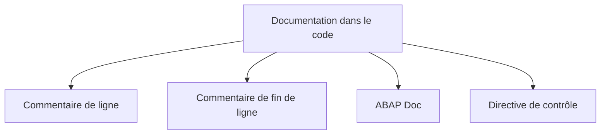

# 8. COMMENTAIRES ET CONVENTIONS

## 8.A RÉSULTAT ATTENDU

- Utiliser les différentes formes de commentaires ABAP[^terme-abap]
- Distinguer commentaire, ABAP Doc, pseudo-commentaire et pragma
- Documenter l’intention sans paraphraser le code
- Appliquer des conventions cohérentes sans les confondre avec la syntaxe ABAP
- Éviter les cartouches et commentaires devenus faux

## 8.B VUE D’ENSEMBLE



## 8.C COMMENTAIRE DE LIGNE

Un astérisque placé en première position transforme la ligne en commentaire.

```abap
* Ce commentaire occupe toute la ligne.
WRITE / 'Exemple'.
```

Cette forme existe dans les programmes classiques, mais elle est moins flexible pour l’indentation.

## 8.D COMMENTAIRE AVEC GUILLEMET

Le guillemet double commence un commentaire jusqu’à la fin de la ligne.

```abap
" Commentaire de ligne indenté
DATA gv_count TYPE i. " Commentaire de fin de ligne
```

Cette forme permet d’aligner le commentaire avec le bloc concerné.

## 8.E ABAP DOC

Une ligne commençant par `"!` est un commentaire ABAP Doc lorsqu’elle est placée devant un élément déclaratif compatible.

Exemple :

```abap
CLASS lcl_calculator DEFINITION.
  PUBLIC SECTION.
    "! Additionne deux nombres entiers.
    "! @parameter iv_left  | Première valeur
    "! @parameter iv_right | Deuxième valeur
    "! @parameter rv_sum   | Résultat
    METHODS add
      IMPORTING
        iv_left       TYPE i
        iv_right      TYPE i
      RETURNING
        VALUE(rv_sum) TYPE i.
ENDCLASS.
```

ABAP Doc est destiné à documenter des éléments d’API[^terme-api] ou de déclaration. Il ne remplace pas une documentation fonctionnelle ou d’architecture.

## 8.F PSEUDO-COMMENTAIRES ET PRAGMAS

Certains commentaires spéciaux ou pragmas influencent les contrôles statiques.

Exemples de formes :

```abap
"#EC ...
##...
```

Ils ne doivent être utilisés que lorsque :

- le contrôle est compris ;
- le cas est justifié ;
- une correction réelle n’est pas possible ou pertinente ;
- la règle du projet autorise cette suppression ;
- la justification reste traçable.

> [!CAUTION]
> Ne jamais ajouter une directive uniquement pour faire disparaître un avertissement sans analyser sa cause.

## 8.G QUOI COMMENTER

Un commentaire utile explique principalement :

- une contrainte métier non évidente ;
- une raison technique ;
- une incompatibilité de version ;
- un contournement validé ;
- une hypothèse importante ;
- un effet de bord ;
- la raison d’un choix non intuitif.

Exemple utile :

```abap
" La date de fin est exclusive dans l’API appelée.
gv_end_date = gv_requested_end_date + 1.
```

Exemple inutile :

```abap
" Ajoute 1 à la date.
gv_end_date = gv_requested_end_date + 1.
```

## 8.H COMMENTAIRE OBSOLÈTE

Un commentaire faux est plus dangereux qu’une absence de commentaire.

Lors d’une modification :

- mettre à jour le commentaire concerné ;
- supprimer les explications devenues inutiles ;
- ne pas conserver du code mort commenté ;
- utiliser la gestion de versions pour retrouver l’ancien code.

## 8.I CONVENTIONS DE NOMMAGE

ABAP n’impose pas une convention universelle telle que `lv_`, `gv_`, `lt_` ou `ls_`.

Ces préfixes sont des conventions de projet fréquemment rencontrées :

| Préfixe fréquent    | Signification conventionnelle              |
| ------------------- | ------------------------------------------ |
| `lv_`               | variable locale                            |
| `gv_`               | variable globale                           |
| `ls_`               | structure locale                           |
| `lt_`               | table interne[^terme-table-interne] locale                       |
| `lo_`               | référence d’objet[^terme-reference] locale                   |
| `lc_`               | constante locale                           |
| `iv_`, `ev_`, `rv_` | paramètres de méthode[^terme-methode] selon leur direction |

> [!IMPORTANT]
> Ces préfixes ne font pas partie du langage. Appliquer la convention réellement retenue par le projet et éviter de mélanger plusieurs systèmes de nommage dans un même objet.

## 8.J CARTOUCHE DE PROGRAMME

Un cartouche en début de programme est une convention documentaire, pas une exigence ABAP.

Un cartouche peut contenir :

- objectif du programme ;
- application ou domaine ;
- restrictions majeures ;
- référence documentaire stable.

Éviter d’y dupliquer des informations déjà fiables dans :

- le Repository ;
- l’ordre de transport[^terme-ordre-transport] ;
- l’outil de suivi ;
- l’historique de versions.

Exemple minimal :

```abap
************************************************************************
* Objet       : Extraction des données de démonstration
* Périmètre   : Développement interne
* Remarque    : Programme exécutable sans mise à jour de données
************************************************************************
REPORT zdemo_comments.
```

## 8.K PRINCIPES DE LISIBILITÉ

- choisir des noms qui décrivent le rôle métier ou technique ;
- limiter les abréviations ambiguës ;
- utiliser une indentation constante ;
- limiter la profondeur des blocs ;
- séparer les responsabilités ;
- commenter la raison, pas la syntaxe ;
- retirer le code commenté ;
- conserver les messages et textes destinés aux utilisateurs dans les mécanismes adaptés.

## 8.L PROCESS

### 8.L.1 Étape 1 — Choisir un code de travail

Ouvrir un programme Z autorisé en modification et sélectionner un bloc dont l’intention n’est pas évidente. Ne pas utiliser un objet standard pour cet exercice.

### 8.L.2 Étape 2 — Commenter la décision

Ajouter un commentaire avec `"` au-dessus de la décision technique ou métier. Décrire la raison, la contrainte ou l’effet non visible ; ne pas reformuler littéralement l’instruction suivante.

### 8.L.3 Étape 3 — Normaliser les noms

Comparer variables, constantes, types et références avec les conventions du projet. Renommer uniquement dans un périmètre dont les utilisations ont été identifiées, puis relancer la liste d’utilisation si l’objet est partagé.

### 8.L.4 Étape 4 — Formater et relire

Appliquer le Pretty Printer configuré par l’équipe. Examiner le diff : seules les lignes utiles doivent changer. Retirer les commentaires sans valeur et vérifier que le code reste compréhensible sans connaissance implicite.

### 8.L.5 Étape 5 — Valider

Exécuter contrôle syntaxique et contrôles statiques. Pour une logique sensible, faire relire la décision commentée. Le chapitre est validé lorsque noms, formatage et commentaires expliquent le code sans masquer une complexité évitable.

## 8.M VÉRIFICATION

- Le contrôle syntaxique réussit.
- La version active correspond au code sauvegardé.
- L’exécution produit le résultat décrit dans le chapitre.
- Les cas vide, limite et erreur sont testés séparément lorsque la syntaxe le permet.

## 8.N ERREURS FRÉQUENTES

- Copier un exemple sans adapter les types, noms d’objets et données disponibles dans le système.
- Tester uniquement le cas nominal et ignorer les valeurs initiales, absentes ou invalides.
- Intervenir dans le mauvais système ou mandant[^terme-mandant].
- Confondre sauvegarde et activation.

## 8.O SNIPPET À RÉUTILISER

> [!NOTE]
> Adapter les noms `Z*`, les types DDIC[^terme-acro-ddic], les données et les autorisations au système cible. Effectuer un contrôle syntaxique avant activation.

```abap
CLASS lcl_calculator DEFINITION.
  PUBLIC SECTION.
    "! Additionne deux nombres entiers.
    "! @parameter iv_left  | Première valeur
    "! @parameter iv_right | Deuxième valeur
    "! @parameter rv_sum   | Résultat
    METHODS add
      IMPORTING
        iv_left       TYPE i
        iv_right      TYPE i
      RETURNING
        VALUE(rv_sum) TYPE i.
ENDCLASS.
```

## 8.P TERMES DU LEXIQUE

- [Système SAP](<../🧩 00 ├── LEXIQUE SAP ET ABAP/01 ├── SYSTEMES ENVIRONNEMENTS ET MANDANTS.md#systeme-sap>)
- [Mandant](<../🧩 00 ├── LEXIQUE SAP ET ABAP/01 ├── SYSTEMES ENVIRONNEMENTS ET MANDANTS.md#mandant>)
- [SAP GUI](<../🧩 00 ├── LEXIQUE SAP ET ABAP/02 ├── SAP GUI NAVIGATION ET TRANSACTIONS.md#sap-gui>)
- [Transaction](<../🧩 00 ├── LEXIQUE SAP ET ABAP/02 ├── SAP GUI NAVIGATION ET TRANSACTIONS.md#transaction>)
- [Repository ABAP](<../🧩 00 ├── LEXIQUE SAP ET ABAP/03 ├── REPOSITORY PACKAGES ET TRANSPORTS.md#repository-abap>)
- [Package](<../🧩 00 ├── LEXIQUE SAP ET ABAP/03 ├── REPOSITORY PACKAGES ET TRANSPORTS.md#package>)

## 8.Q RÉFÉRENCES OFFICIELLES SAP

- [Comments — SAP Help Portal](https://help.sap.com/docs/abap-cloud/abap-concepts/comments)
- [Adding ABAP Doc Comments](https://help.sap.com/doc/c238d694b825421f940829321ffa326a/7.40.25/en-US/17e98e1c1ff545cea3f95b85a0539322.html)
- [Clean ABAP — SAP Style Guides](https://github.com/SAP/styleguides/blob/main/clean-abap/CleanABAP.md)

---

[Chapitre suivant — ACTIVATION, EXÉCUTION ET VÉRIFICATION](<./09 ├── ACTIVATION EXECUTION ET VERIFICATION.md>)

[^terme-abap]: **ABAP.** Langage de programmation de la plateforme ABAP, conçu pour développer des applications métier et techniques SAP. Voir [l’entrée du lexique](<../🧩 00 ├── LEXIQUE SAP ET ABAP/04 ├── LANGAGE ET DEVELOPPEMENT ABAP.md#abap>).
[^terme-api]: **API.** Application Programming Interface, contrat exposant des opérations ou données utilisables par d’autres composants. Voir [l’entrée du lexique](<../🧩 00 ├── LEXIQUE SAP ET ABAP/10 └── ACRONYMES SAP.md#api>).
[^terme-table-interne]: **TABLE INTERNE.** Collection dynamique de lignes stockée en mémoire dans le programme ABAP. Voir [l’entrée du lexique](<../🧩 00 ├── LEXIQUE SAP ET ABAP/04 ├── LANGAGE ET DEVELOPPEMENT ABAP.md#table-interne>).
[^terme-reference]: **RÉFÉRENCE.** Valeur qui pointe vers un objet de données ou une instance de classe. Voir [l’entrée du lexique](<../🧩 00 ├── LEXIQUE SAP ET ABAP/04 ├── LANGAGE ET DEVELOPPEMENT ABAP.md#reference>).
[^terme-methode]: **MÉTHODE.** Comportement déclaré dans une classe ou une interface et appelé avec une liste de paramètres définie. Voir [l’entrée du lexique](<../🧩 00 ├── LEXIQUE SAP ET ABAP/04 ├── LANGAGE ET DEVELOPPEMENT ABAP.md#methode>).
[^terme-ordre-transport]: **ORDRE DE TRANSPORT.** Conteneur qui regroupe des modifications à exporter puis importer dans d’autres systèmes. Voir [l’entrée du lexique](<../🧩 00 ├── LEXIQUE SAP ET ABAP/03 ├── REPOSITORY PACKAGES ET TRANSPORTS.md#ordre-transport>).
[^terme-mandant]: **MANDANT.** Subdivision logique d’un système SAP. Il est identifié par un numéro à trois chiffres et isole une partie des données, du paramétrage et des utilisateurs. Voir [l’entrée du lexique](<../🧩 00 ├── LEXIQUE SAP ET ABAP/01 ├── SYSTEMES ENVIRONNEMENTS ET MANDANTS.md#mandant>).
[^terme-acro-ddic]: **DDIC.** Data Dictionary, abréviation courante de l’ABAP Dictionary. Voir [l’entrée du lexique](<../🧩 00 ├── LEXIQUE SAP ET ABAP/10 └── ACRONYMES SAP.md#acro-ddic>).
