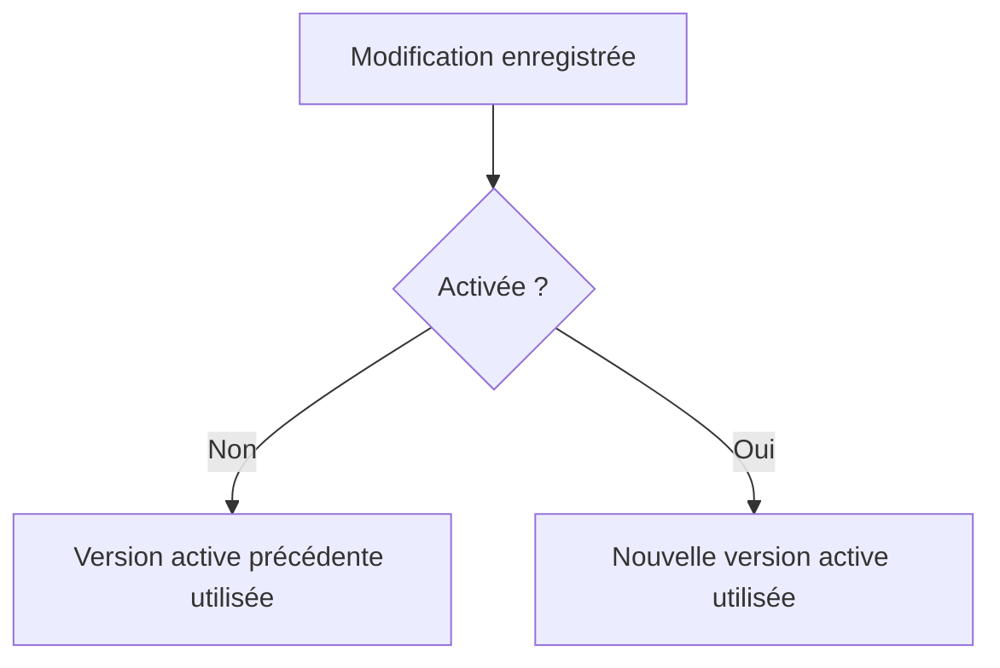

# 9. ACTIVATION, EXÉCUTION ET VÉRIFICATION

## 9.A RÉSULTAT ATTENDU

- Distinguer enregistrement, contrôle syntaxique et activation
- Comprendre quelle version est exécutée
- Exécuter correctement un programme exécutable[^terme-programme-executable]
- Identifier les contrôles minimaux avant livraison
- Localiser les principales sources d’erreur

## 9.B VUE D’ENSEMBLE


## 9.C ENREGISTREMENT

L’enregistrement conserve les modifications dans le système. Il ne signifie pas nécessairement que l’objet est actif.

Une version inactive peut donc exister en parallèle de la version active.

> [!IMPORTANT]
> Enregistrer protège le travail en cours. Activer rend la nouvelle version utilisable comme version active.

## 9.D CONTRÔLE SYNTAXIQUE

Le contrôle syntaxique analyse le code sans exécuter le scénario fonctionnel.

Il peut détecter notamment :

- mot-clé incorrect ;
- bloc non fermé ;
- identifiant inconnu ;
- incompatibilité de type ;
- appel invalide ;
- erreur de contexte syntaxique.

Exemple invalide :

```abap
DATA gv_value TYPE i

gv_value = 'ABC'.
```

Problèmes :

- point manquant après la déclaration ;
- affectation incompatible susceptible d’échouer ou d’être refusée selon le contexte.

## 9.E ACTIVATION

L’activation :

1. contrôle l’objet ;
2. génère sa représentation exécutable ou active ;
3. publie la nouvelle version active ;
4. peut déclencher l’activation de dépendances ou révéler des erreurs dans les objets liés.

Une activation peut échouer si :

- le code contient une erreur ;
- une dépendance est inactive ou incompatible ;
- un objet du Dictionnaire est incohérent ;
- un verrou empêche une opération ;
- une autorisation manque.

## 9.F EXÉCUTION

Un programme exécutable peut être lancé depuis `SE38`[^outil-se38] ou `SE80`[^outil-se80].

Séquence classique :

1. l’environnement[^terme-environnement] d’exécution charge le programme ;
2. l’écran de sélection est traité s’il existe ;
3. les événements du programme sont déclenchés ;
4. le traitement produit un résultat ou un effet ;
5. les erreurs non gérées peuvent provoquer un arrêt ou un dump.

### 9.F.1 EXÉCUTION DIRECTE

`F8` exécute le programme dans le contexte courant.

### 9.F.2 EXÉCUTION EN MODE DEBUG

Le menu de test permet de démarrer le programme directement sous contrôle du Debugger.

## 9.G QUELLE VERSION EST UTILISÉE ?

L’exécution normale utilise la version active disponible.



C’est la cause classique d’un test qui semble ignorer une correction récente.

## 9.H TEST TECHNIQUE MINIMAL

Pour un programme simple :

- contrôle syntaxique sans erreur ;
- activation réussie ;
- exécution nominale ;
- valeurs limites ;
- absence de saisie si le champ est facultatif ;
- saisie invalide ;
- absence de données ;
- volume représentatif lorsque pertinent ;
- contrôle des autorisations ;
- contrôle de l’absence d’effet de bord non prévu.

## 9.I CONTRÔLES COMPLÉMENTAIRES

Selon le contexte :

| Outil                        | Usage                                                            |
| ---------------------------- | ---------------------------------------------------------------- |
| Contrôle étendu du programme | Recherche d’anomalies supplémentaires sur un programme classique |
| Code Inspector               | Contrôles statiques selon une variante                           |
| ABAP[^terme-abap] Test Cockpit            | Contrôles qualité centralisés selon la configuration du système  |
| ABAP Unit                    | Tests automatisés de code testable                               |
| Runtime Analysis             | Analyse du temps d’exécution                                     |
| SQL[^terme-acro-sql] Trace[^terme-trace]                    | Analyse des accès SQL                                            |

Ces outils seront détaillés dans les dossiers consacrés à la qualité et à la performance.

## 9.J ERREURS D’EXÉCUTION

### 9.J.1 MESSAGE APPLICATIF

Un message peut signaler une erreur gérée par le programme.

### 9.J.2 DUMP ABAP

Une erreur d’exécution non gérée peut produire un dump analysable avec `ST22`[^outil-st22].

Exemples de causes :

- conversion impossible ;
- accès à une référence non liée ;
- débordement numérique ;
- exception[^terme-exception] non gérée ;
- absence d’autorisation selon le traitement ;
- incohérence technique.

### 9.J.3 JOURNAUX

Selon le programme, analyser également :

- journal applicatif ;
- spool[^terme-spool] ;
- journal de job[^terme-job] ;
- messages système ;
- traces techniques adaptées.

## 9.K CHECKLIST AVANT TRANSPORT

- [ ] tous les objets modifiés sont activés ;
- [ ] le programme s’exécute sur les cas prévus ;
- [ ] les erreurs sont gérées ;
- [ ] les textes sont maintenus ;
- [ ] les objets dépendants sont transportés ;
- [ ] les contrôles qualité requis sont exécutés ;
- [ ] aucun objet sans rapport n’est présent dans la requête ;
- [ ] le test après import est défini.

## 9.L PROCESS

### 9.L.1 Étape 1 — Créer une version inactive observable

Ouvrir un report Z actif dans `SE38`, modifier une valeur visible puis enregistrer sans activer. Vérifier l’indicateur de statut : le source sauvegardé doit être inactif tandis que l’ancienne version reste active.

### 9.L.2 Étape 2 — Contrôler avant activation

Exécuter `Ctrl+F2`. Corriger les erreurs dans l’ordre indiqué. Si une erreur vient d’un objet dépendant, ouvrir cet objet et déterminer s’il doit être activé dans la même livraison.

### 9.L.3 Étape 3 — Activer

Exécuter `Ctrl+F3` et examiner la liste des objets proposée. Activer uniquement le périmètre cohérent. En cas d’échec, relever l’objet et le message qui bloquent l’activation au lieu de relancer sans correction.

### 9.L.4 Étape 4 — Prouver la version exécutée

Lancer avec `F8` et vérifier que la valeur modifiée apparaît. Si l’ancienne valeur persiste, confirmer le système, le programme et le statut actif.

### 9.L.5 Étape 5 — Comparer si nécessaire

Utiliser la gestion des versions pour comparer la version active avec une version antérieure. Le contrôle est terminé lorsque le source sauvegardé et la version active attendue correspondent et que l’exécution produit le résultat prévu.

## 9.M VÉRIFICATION

- Le contrôle syntaxique réussit.
- La version active correspond au code sauvegardé.
- L’exécution produit le résultat décrit dans le chapitre.
- Les cas vide, limite et erreur sont testés séparément lorsque la syntaxe le permet.

## 9.N ERREURS FRÉQUENTES

- Copier un exemple sans adapter les types, noms d’objets et données disponibles dans le système.
- Tester uniquement le cas nominal et ignorer les valeurs initiales, absentes ou invalides.
- Intervenir dans le mauvais système ou mandant[^terme-mandant].
- Confondre sauvegarde et activation.

## 9.O SNIPPET À RÉUTILISER

> [!NOTE]
> Adapter les noms `Z*`, les types DDIC[^terme-acro-ddic], les données et les autorisations au système cible. Effectuer un contrôle syntaxique avant activation.

```abap
DATA gv_value TYPE i

gv_value = 'ABC'.
```

## 9.P TERMES DU LEXIQUE

- [Système SAP](<../🧩 00 ├── LEXIQUE SAP ET ABAP/01 ├── SYSTEMES ENVIRONNEMENTS ET MANDANTS.md#systeme-sap>)
- [Mandant](<../🧩 00 ├── LEXIQUE SAP ET ABAP/01 ├── SYSTEMES ENVIRONNEMENTS ET MANDANTS.md#mandant>)
- [SAP GUI](<../🧩 00 ├── LEXIQUE SAP ET ABAP/02 ├── SAP GUI NAVIGATION ET TRANSACTIONS.md#sap-gui>)
- [Transaction](<../🧩 00 ├── LEXIQUE SAP ET ABAP/02 ├── SAP GUI NAVIGATION ET TRANSACTIONS.md#transaction>)
- [Repository ABAP](<../🧩 00 ├── LEXIQUE SAP ET ABAP/03 ├── REPOSITORY PACKAGES ET TRANSPORTS.md#repository-abap>)
- [Package](<../🧩 00 ├── LEXIQUE SAP ET ABAP/03 ├── REPOSITORY PACKAGES ET TRANSPORTS.md#package>)

## 9.Q RÉFÉRENCES OFFICIELLES SAP

- [ABAP Source Code Editor](https://help.sap.com/docs/ABAP_PLATFORM_NEW/c238d694b825421f940829321ffa326a/9ac600a0fad14967aaf2964be5a21963.html)
- [Starting and Directly Debugging ABAP Programs](https://help.sap.com/docs/ABAP_PLATFORM_NEW/ba879a6e2ea04d9bb94c7ccd7cdac446/a95208086a6e448aa35f08357d958af5.html)
- [Running Local Quality Checks with the ATC](https://help.sap.com/docs/ABAP_PLATFORM_NEW/ba879a6e2ea04d9bb94c7ccd7cdac446/ca5e041535c0491db596d3ca6658cd7d.html)

---

[Chapitre suivant — ÉVÉNEMENTS D’UN PROGRAMME EXÉCUTABLE](<./10 ├── EVENEMENTS D UN PROGRAMME EXECUTABLE.md>)

[^terme-programme-executable]: **PROGRAMME EXÉCUTABLE.** Programme ABAP de type report pouvant être lancé directement, généralement avec `F8` ou par une transaction. Voir [l’entrée du lexique](<../🧩 00 ├── LEXIQUE SAP ET ABAP/06 ├── PROGRAMMES CLASSES ET OBJETS TECHNIQUES.md#programme-executable>).
[^terme-environnement]: **ENVIRONNEMENT.** Rôle fonctionnel attribué à un système dans le cycle de vie : développement, test, recette, préproduction ou production. Voir [l’entrée du lexique](<../🧩 00 ├── LEXIQUE SAP ET ABAP/01 ├── SYSTEMES ENVIRONNEMENTS ET MANDANTS.md#environnement>).
[^terme-abap]: **ABAP.** Langage de programmation de la plateforme ABAP, conçu pour développer des applications métier et techniques SAP. Voir [l’entrée du lexique](<../🧩 00 ├── LEXIQUE SAP ET ABAP/04 ├── LANGAGE ET DEVELOPPEMENT ABAP.md#abap>).
[^terme-acro-sql]: **SQL.** Structured Query Language. Voir [l’entrée du lexique](<../🧩 00 ├── LEXIQUE SAP ET ABAP/10 └── ACRONYMES SAP.md#acro-sql>).
[^terme-trace]: **TRACE.** Enregistrement détaillé d’événements techniques pour analyser exécution, SQL ou appels. Voir [l’entrée du lexique](<../🧩 00 ├── LEXIQUE SAP ET ABAP/08 ├── EXECUTION EXPLOITATION ET ADMINISTRATION.md#trace>).
[^terme-exception]: **EXCEPTION.** Objet ou signal représentant une situation anormale qu’un appelant peut traiter. Voir [l’entrée du lexique](<../🧩 00 ├── LEXIQUE SAP ET ABAP/04 ├── LANGAGE ET DEVELOPPEMENT ABAP.md#exception>).
[^terme-spool]: **SPOOL.** Infrastructure stockant et acheminant les sorties imprimables produites par les traitements SAP. Voir [l’entrée du lexique](<../🧩 00 ├── LEXIQUE SAP ET ABAP/06 ├── PROGRAMMES CLASSES ET OBJETS TECHNIQUES.md#spool>).
[^terme-job]: **JOB.** Traitement planifié en arrière-plan composé d’une ou plusieurs étapes. Voir [l’entrée du lexique](<../🧩 00 ├── LEXIQUE SAP ET ABAP/06 ├── PROGRAMMES CLASSES ET OBJETS TECHNIQUES.md#job>).
[^terme-mandant]: **MANDANT.** Subdivision logique d’un système SAP. Il est identifié par un numéro à trois chiffres et isole une partie des données, du paramétrage et des utilisateurs. Voir [l’entrée du lexique](<../🧩 00 ├── LEXIQUE SAP ET ABAP/01 ├── SYSTEMES ENVIRONNEMENTS ET MANDANTS.md#mandant>).
[^terme-acro-ddic]: **DDIC.** Data Dictionary, abréviation courante de l’ABAP Dictionary. Voir [l’entrée du lexique](<../🧩 00 ├── LEXIQUE SAP ET ABAP/10 └── ACRONYMES SAP.md#acro-ddic>).

[^outil-se38]: **SE38.** Éditeur ABAP classique utilisé pour créer, modifier, vérifier et exécuter des programmes. Voir [le chapitre associé](<04 ├── EDITEURS ABAP SE38 ET SE80.md>).
[^outil-se80]: **SE80.** Object Navigator utilisé pour parcourir et maintenir les objets du Repository ABAP. Voir [le chapitre associé](<04 ├── EDITEURS ABAP SE38 ET SE80.md>).
[^outil-st22]: **ST22.** Transaction d’analyse des terminaisons anormales et dumps ABAP. Voir [le chapitre associé](<../🧩 11 ├── DEBUG ET ANALYSE/13 ├── ANALYSER LES DUMPS AVEC ST22.md>).
