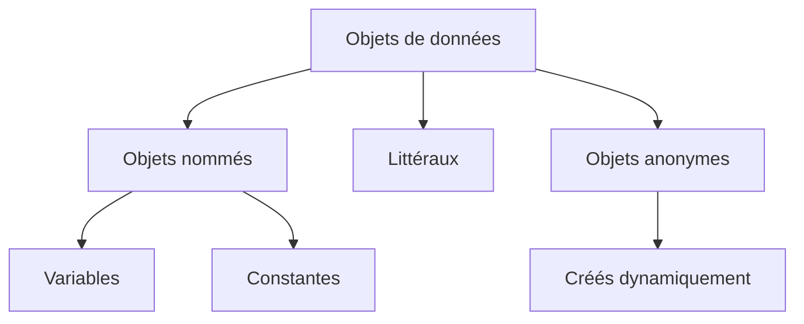

# 3. OBJETS DE DONNÉES ET VALEURS INITIALES

## 3.A RÉSULTAT ATTENDU

- Identifier les différentes formes d’objets de données
- Distinguer objet nommé, littéral et objet anonyme
- Comprendre la valeur initiale associée à un type
- Réinitialiser proprement un objet avec `CLEAR`
- Éviter les tests basés sur une représentation externe trompeuse

## 3.B DÉFINITION

Un objet de données[^terme-objet-donnees] contient ou représente une valeur pendant l’exécution d’un programme ABAP[^terme-abap]. Son type définit les valeurs possibles et les opérations applicables.



## 3.C OBJETS NOMMÉS

Les variables et les constantes possèdent un nom utilisable dans le code.

```abap
DATA lv_status TYPE c LENGTH 1 VALUE 'A'.
CONSTANTS lc_active TYPE c LENGTH 1 VALUE 'A'.
```

- `lv_status` peut être modifiée ;
- `lc_active` ne peut pas être modifiée après sa déclaration.

Les paramètres d’interface, les paramètres d’écran de sélection et les attributs de classes sont également des objets de données nommés, mais ils seront détaillés dans leurs contextes respectifs.

## 3.D LITTÉRAUX

Un littéral représente une valeur directement écrite dans le code.

```abap
DATA lv_count TYPE i.

lv_count = 10.
WRITE / 'Traitement terminé'.
```

Dans cet exemple :

- `10` est un littéral numérique ;
- `'Traitement terminé'` est un littéral texte de type caractère.

Les littéraux ne doivent pas remplacer les constantes lorsque la valeur porte une signification fonctionnelle ou technique réutilisée.

## 3.E OBJETS ANONYMES

Un objet anonyme est créé dynamiquement et n’est pas identifié directement par un nom de variable métier. Il est accessible par une référence de données[^terme-reference].

```abap
DATA lr_value TYPE REF TO i.

CREATE DATA lr_value.
lr_value->* = 25.
```

L’objet entier créé par `CREATE DATA` est anonyme. `lr_value` contient la référence permettant d’y accéder.

## 3.F VALEUR INITIALE

Chaque type possède une valeur initiale déterminée par le langage.

```abap
DATA lv_count TYPE i.
DATA lv_text  TYPE c LENGTH 10.
DATA lv_date  TYPE d.
```

Sans addition `VALUE`, les objets reçoivent leur valeur initiale :

| Objet      | Valeur logique initiale |
| ---------- | ----------------------- |
| `lv_count` | `0`                     |
| `lv_text`  | Espaces                 |
| `lv_date`  | `00000000`              |

Une structure est initiale lorsque chacun de ses composants est initial. Une référence initiale ne pointe vers aucun objet.

## 3.G TEST AVEC `IS INITIAL`

```abap
IF lv_date IS INITIAL.
  WRITE / 'La date n’est pas renseignée'.
ENDIF.
```

`IS INITIAL` compare l’objet à la valeur initiale définie par son type. Il est préférable à des comparaisons techniques dispersées telles que :

```abap
IF lv_date = '00000000'.
```

Le test typé exprime plus clairement l’intention.

## 3.H RÉINITIALISATION AVEC `CLEAR`

```abap
DATA lv_quantity TYPE i VALUE 12.

CLEAR lv_quantity.
```

Après `CLEAR`, `lv_quantity` vaut `0`.

```abap
TYPES:
  BEGIN OF ty_result,
    code    TYPE i,
    message TYPE string,
  END OF ty_result.

DATA ls_result TYPE ty_result.

ls_result-code    = 4.
ls_result-message = `Erreur`.

CLEAR ls_result.
```

`CLEAR ls_result` remet tous les composants de la structure à leur valeur initiale.

## 3.I `VALUE` À LA DÉCLARATION

```abap
DATA lv_retries TYPE i VALUE 3.
```

L’addition `VALUE` définit la valeur reçue lors de la création de l’objet. Elle ne rend pas la variable constante.

```abap
lv_retries = 5.
```

Cette affectation reste autorisée.

Pour imposer l’absence de modification, utiliser `CONSTANTS` lorsque la valeur est connue statiquement.

## 3.J ÉTAT INITIAL ET VALEUR MÉTIER

Une valeur initiale technique ne signifie pas toujours « donnée absente » au niveau fonctionnel.

Exemples :

- `0` peut être une quantité métier valide ;
- une chaîne vide peut être autorisée ;
- une date initiale peut signifier « non renseignée » selon l’interface ;
- une structure initiale peut être différente d’une structure fonctionnellement incomplète.

Le contrôle métier doit donc être défini explicitement.

## 3.K EXEMPLE COMPLET

```abap
REPORT zdemo_data_objects.

CONSTANTS lc_max_retries TYPE i VALUE 3.

DATA lv_retry_count TYPE i.
DATA lv_message     TYPE string VALUE `Prêt`.

IF lv_retry_count IS INITIAL.
  lv_retry_count = 1.
ENDIF.

WRITE: / lv_message,
       / 'Tentative :', lv_retry_count,
       / 'Maximum   :', lc_max_retries.

CLEAR: lv_retry_count, lv_message.
```

La forme chaînée de `CLEAR` est valide. Dans du code professionnel, des instructions séparées peuvent être préférées lorsqu’elles facilitent la lecture ou le débogage.

## 3.L VÉRIFICATION

- Le contrôle syntaxique réussit.
- La version active correspond au code sauvegardé.
- L’exécution produit le résultat décrit dans le chapitre.
- Les cas vide, limite et erreur sont testés séparément lorsque la syntaxe le permet.

## 3.M ERREURS FRÉQUENTES

- Copier un exemple sans adapter les types, noms d’objets et données disponibles dans le système.
- Tester uniquement le cas nominal et ignorer les valeurs initiales, absentes ou invalides.
- Choisir un type trop générique ou dépendant d’une variable existante sans justification.
- Utiliser une référence ou un field-symbol[^terme-field-symbol] non lié.

## 3.N SNIPPET À RÉUTILISER

> [!NOTE]
> Adapter les noms `Z*`, les types DDIC[^terme-acro-ddic], les données et les autorisations au système cible. Effectuer un contrôle syntaxique avant activation.

```abap
REPORT zdemo_data_objects.

CONSTANTS lc_max_retries TYPE i VALUE 3.

DATA lv_retry_count TYPE i.
DATA lv_message     TYPE string VALUE `Prêt`.

IF lv_retry_count IS INITIAL.
  lv_retry_count = 1.
ENDIF.

WRITE: / lv_message,
       / 'Tentative :', lv_retry_count,
       / 'Maximum   :', lc_max_retries.

CLEAR: lv_retry_count, lv_message.
```

## 3.O TERMES DU LEXIQUE

- [Type de données](<../🧩 00 ├── LEXIQUE SAP ET ABAP/04 ├── LANGAGE ET DEVELOPPEMENT ABAP.md#type-donnees>)
- [Objet de données](<../🧩 00 ├── LEXIQUE SAP ET ABAP/04 ├── LANGAGE ET DEVELOPPEMENT ABAP.md#objet-donnees>)
- [Structure](<../🧩 00 ├── LEXIQUE SAP ET ABAP/04 ├── LANGAGE ET DEVELOPPEMENT ABAP.md#structure-abap>)
- [Table interne](<../🧩 00 ├── LEXIQUE SAP ET ABAP/04 ├── LANGAGE ET DEVELOPPEMENT ABAP.md#table-interne>)
- [Field-symbol](<../🧩 00 ├── LEXIQUE SAP ET ABAP/04 ├── LANGAGE ET DEVELOPPEMENT ABAP.md#field-symbol>)
- [Référence](<../🧩 00 ├── LEXIQUE SAP ET ABAP/04 ├── LANGAGE ET DEVELOPPEMENT ABAP.md#reference>)

## 3.P RÉFÉRENCES OFFICIELLES SAP

- [Data Objects — ABAP Keyword Documentation](https://help.sap.com/doc/abapdocu_latest_index_htm/latest/en-US/ABENDATA_OBJECTS.html)
- [Initial Values — ABAP Keyword Documentation](https://help.sap.com/doc/abapdocu_latest_index_htm/latest/en-US/ABENINITIAL_VALUES.html)
- [CLEAR — ABAP Keyword Documentation](https://help.sap.com/doc/abapdocu_latest_index_htm/latest/en-US/ABAPCLEAR.html)


---

[Chapitre suivant — VARIABLES AVEC `DATA`](<./04 ├── VARIABLES AVEC DATA.md>)

[^terme-objet-donnees]: **OBJET DE DONNÉES.** Zone de mémoire typée contenant une valeur pendant l’exécution. Voir [l’entrée du lexique](<../🧩 00 ├── LEXIQUE SAP ET ABAP/04 ├── LANGAGE ET DEVELOPPEMENT ABAP.md#objet-donnees>).
[^terme-abap]: **ABAP.** Langage de programmation de la plateforme ABAP, conçu pour développer des applications métier et techniques SAP. Voir [l’entrée du lexique](<../🧩 00 ├── LEXIQUE SAP ET ABAP/04 ├── LANGAGE ET DEVELOPPEMENT ABAP.md#abap>).
[^terme-reference]: **RÉFÉRENCE.** Valeur qui pointe vers un objet de données ou une instance de classe. Voir [l’entrée du lexique](<../🧩 00 ├── LEXIQUE SAP ET ABAP/04 ├── LANGAGE ET DEVELOPPEMENT ABAP.md#reference>).
[^terme-field-symbol]: **FIELD-SYMBOL.** Alias dynamique vers une zone de mémoire existante. Voir [l’entrée du lexique](<../🧩 00 ├── LEXIQUE SAP ET ABAP/04 ├── LANGAGE ET DEVELOPPEMENT ABAP.md#field-symbol>).
[^terme-acro-ddic]: **DDIC.** Data Dictionary, abréviation courante de l’ABAP Dictionary. Voir [l’entrée du lexique](<../🧩 00 ├── LEXIQUE SAP ET ABAP/10 └── ACRONYMES SAP.md#acro-ddic>).
