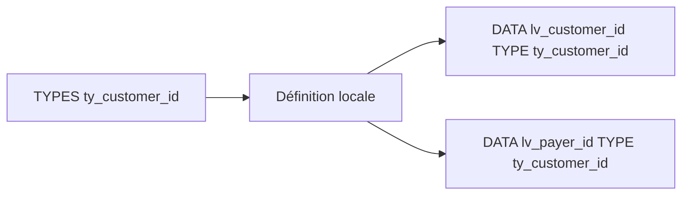

# 6. TYPES LOCAUX AVEC `TYPES`

## 6.A RÉSULTAT ATTENDU

- Définir un type local réutilisable avec `TYPES`
- Distinguer définition de type et création d’un objet de données[^terme-objet-donnees]
- Construire des types élémentaires et structurés
- Comprendre la portée d’un type local
- Choisir entre type local et type global du Dictionnaire ABAP[^terme-abap]

## 6.B `TYPES` NE CRÉE PAS DE VARIABLE

```abap
TYPES ty_customer_id TYPE c LENGTH 10.
```

Cette instruction définit un type nommé `ty_customer_id`. Elle ne réserve pas de zone de données et ne contient aucune valeur.

Pour créer une variable :

```abap
DATA lv_customer_id TYPE ty_customer_id.
```



## 6.C TYPE ÉLÉMENTAIRE LOCAL

```abap
TYPES ty_percentage TYPE p LENGTH 3 DECIMALS 2.

DATA lv_discount_rate TYPE ty_percentage.
DATA lv_tax_rate      TYPE ty_percentage.
```

L’intérêt est de centraliser une définition technique utilisée plusieurs fois dans la même zone de visibilité[^terme-visibilite].

## 6.D TYPE BASÉ SUR UN TYPE GLOBAL

```abap
TYPES ty_company_code TYPE bukrs.
```

Cet alias local peut améliorer la lisibilité dans certains contextes, mais il ne faut pas multiplier les alias qui masquent inutilement le type métier global.

## 6.E TYPE STRUCTURÉ LOCAL

```abap
TYPES:
  BEGIN OF ty_employee,
    id        TYPE i,
    first_name TYPE c LENGTH 30,
    last_name  TYPE c LENGTH 30,
  END OF ty_employee.
```

Puis :

```abap
DATA ls_employee TYPE ty_employee.
```

Les composants de la structure sont accessibles avec le tiret :

```abap
ls_employee-id         = 1.
ls_employee-first_name = 'Ada'.
ls_employee-last_name  = 'Lovelace'.
```

## 6.F TYPES IMBRIQUÉS

```abap
TYPES:
  BEGIN OF ty_address,
    city    TYPE c LENGTH 40,
    country TYPE c LENGTH 3,
  END OF ty_address.

TYPES:
  BEGIN OF ty_customer,
    id      TYPE c LENGTH 10,
    name    TYPE c LENGTH 60,
    address TYPE ty_address,
  END OF ty_customer.
```

Accès à un composant imbriqué :

```abap
DATA ls_customer TYPE ty_customer.

ls_customer-address-city = 'Paris'.
```

## 6.G PORTÉE

Un type déclaré dans la partie globale d’un programme est utilisable dans les blocs de traitement et procédures de ce programme.

Un type déclaré dans une procédure n’est utilisable que dans cette procédure.

```abap
FORM display_value.
  TYPES ty_local_text TYPE c LENGTH 20.
  DATA lv_text TYPE ty_local_text.

  lv_text = 'Valeur locale'.
  WRITE / lv_text.
ENDFORM.
```

Pour une classe locale[^terme-classe-locale] ou globale, la visibilité dépend de la section et de l’emplacement de la déclaration.

## 6.H TYPE LOCAL OU DICTIONNAIRE ABAP

| Besoin                                       | Choix généralement adapté                               |
| -------------------------------------------- | ------------------------------------------------------- |
| Type utilisé uniquement dans une procédure   | Type local                                              |
| Structure technique interne à un programme   | Type local                                              |
| Type partagé par plusieurs objets Repository | Dictionnaire ABAP ou type public d’une classe/interface |
| Donnée métier SAP[^terme-acro-sap] existante                  | Réutilisation du type global approprié                  |
| Champ d’interface RFC[^terme-rfc], table ou écran        | Type global selon les contraintes de l’interface        |

> [!IMPORTANT]
> Ne créer un type global que lorsqu’un partage réel ou une sémantique globale le justifie. Un type global devient un contrat utilisé par d’autres objets.

## 6.I TYPES TABULAIRES

`TYPES` permet également de définir des types de tables internes :

```abap
TYPES ty_texts TYPE STANDARD TABLE OF string WITH EMPTY KEY.
```

Cette syntaxe est indiquée ici pour situer le rôle de `TYPES`. Les catégories de tables, les clés et les opérations associées seront traitées dans le dossier consacré aux tables internes.

## 6.J CONVENTIONS DE NOMMAGE

Les préfixes suivants sont fréquents :

| Préfixe      | Usage courant                                          |
| ------------ | ------------------------------------------------------ |
| `ty_`        | Type local                                             |
| `ts_`        | Type de structure                                      |
| `tt_`        | Type de table                                          |
| `ty_` unique | Convention simplifiée recommandée par certains projets |

Aucun de ces préfixes n’est imposé par le langage. Le projet doit appliquer une convention homogène.

## 6.K EXEMPLE COMPLET

```abap
REPORT zdemo_local_types.

TYPES ty_order_id TYPE c LENGTH 10.

TYPES:
  BEGIN OF ty_order_header,
    order_id TYPE ty_order_id,
    status   TYPE c LENGTH 1,
    amount   TYPE p LENGTH 8 DECIMALS 2,
  END OF ty_order_header.

DATA ls_order TYPE ty_order_header.

ls_order-order_id = '4500000010'.
ls_order-status   = 'N'.
ls_order-amount   = '125.50'.

WRITE: / ls_order-order_id,
         ls_order-status,
         ls_order-amount.
```

## 6.L VÉRIFICATION

- Le contrôle syntaxique réussit.
- La version active correspond au code sauvegardé.
- L’exécution produit le résultat décrit dans le chapitre.
- Les cas vide, limite et erreur sont testés séparément lorsque la syntaxe le permet.

## 6.M ERREURS FRÉQUENTES

- Copier un exemple sans adapter les types, noms d’objets et données disponibles dans le système.
- Tester uniquement le cas nominal et ignorer les valeurs initiales, absentes ou invalides.
- Choisir un type trop générique ou dépendant d’une variable existante sans justification.
- Utiliser une référence ou un field-symbol[^terme-field-symbol] non lié.

## 6.N SNIPPET À RÉUTILISER

> [!NOTE]
> Adapter les noms `Z*`, les types DDIC[^terme-acro-ddic], les données et les autorisations au système cible. Effectuer un contrôle syntaxique avant activation.

```abap
REPORT zdemo_local_types.

TYPES ty_order_id TYPE c LENGTH 10.

TYPES:
  BEGIN OF ty_order_header,
    order_id TYPE ty_order_id,
    status   TYPE c LENGTH 1,
    amount   TYPE p LENGTH 8 DECIMALS 2,
  END OF ty_order_header.

DATA ls_order TYPE ty_order_header.

ls_order-order_id = '4500000010'.
ls_order-status   = 'N'.
ls_order-amount   = '125.50'.

WRITE: / ls_order-order_id,
         ls_order-status,
         ls_order-amount.
```

## 6.O TERMES DU LEXIQUE

- [Type de données](<../🧩 00 ├── LEXIQUE SAP ET ABAP/04 ├── LANGAGE ET DEVELOPPEMENT ABAP.md#type-donnees>)
- [Objet de données](<../🧩 00 ├── LEXIQUE SAP ET ABAP/04 ├── LANGAGE ET DEVELOPPEMENT ABAP.md#objet-donnees>)
- [Structure](<../🧩 00 ├── LEXIQUE SAP ET ABAP/04 ├── LANGAGE ET DEVELOPPEMENT ABAP.md#structure-abap>)
- [Table interne](<../🧩 00 ├── LEXIQUE SAP ET ABAP/04 ├── LANGAGE ET DEVELOPPEMENT ABAP.md#table-interne>)
- [Field-symbol](<../🧩 00 ├── LEXIQUE SAP ET ABAP/04 ├── LANGAGE ET DEVELOPPEMENT ABAP.md#field-symbol>)
- [Référence](<../🧩 00 ├── LEXIQUE SAP ET ABAP/04 ├── LANGAGE ET DEVELOPPEMENT ABAP.md#reference>)

## 6.P RÉFÉRENCES OFFICIELLES SAP

- [TYPES — ABAP Keyword Documentation](https://help.sap.com/doc/abapdocu_latest_index_htm/latest/en-US/ABAPTYPES.html)
- [Declaration of Local Data Types — SAP Help Portal](https://help.sap.com/docs/abap-cloud/abap-concepts/declaration-of-local-data-types)
- [Bound and Standalone Data Types — ABAP Keyword Documentation](https://help.sap.com/doc/abapdocu_latest_index_htm/latest/en-US/ABENBOUND_INDEPENDENT_DTYPE_GUIDL.html)


---

[Chapitre suivant — STRUCTURES](<./07 ├── STRUCTURES.md>)

[^terme-objet-donnees]: **OBJET DE DONNÉES.** Zone de mémoire typée contenant une valeur pendant l’exécution. Voir [l’entrée du lexique](<../🧩 00 ├── LEXIQUE SAP ET ABAP/04 ├── LANGAGE ET DEVELOPPEMENT ABAP.md#objet-donnees>).
[^terme-abap]: **ABAP.** Langage de programmation de la plateforme ABAP, conçu pour développer des applications métier et techniques SAP. Voir [l’entrée du lexique](<../🧩 00 ├── LEXIQUE SAP ET ABAP/04 ├── LANGAGE ET DEVELOPPEMENT ABAP.md#abap>).
[^terme-visibilite]: **VISIBILITÉ.** Règle déterminant où un composant de classe peut être utilisé : `PUBLIC`, `PROTECTED` ou `PRIVATE`. Voir [l’entrée du lexique](<../🧩 00 ├── LEXIQUE SAP ET ABAP/04 ├── LANGAGE ET DEVELOPPEMENT ABAP.md#visibilite>).
[^terme-classe-locale]: **CLASSE LOCALE.** Classe définie dans le code source d’un programme, d’un include ou d’un Class Pool et visible uniquement dans ce contexte de compilation. Voir [l’entrée du lexique](<../🧩 00 ├── LEXIQUE SAP ET ABAP/06 ├── PROGRAMMES CLASSES ET OBJETS TECHNIQUES.md#classe-locale>).
[^terme-acro-sap]: **SAP.** Nom de l’éditeur et de son écosystème logiciel ; l’acronyme historique provient de l’allemand. Voir [l’entrée du lexique](<../🧩 00 ├── LEXIQUE SAP ET ABAP/10 └── ACRONYMES SAP.md#acro-sap>).
[^terme-rfc]: **RFC.** Remote Function Call, mécanisme permettant d’appeler un module fonction compatible dans un autre contexte ou système. Voir [l’entrée du lexique](<../🧩 00 ├── LEXIQUE SAP ET ABAP/06 ├── PROGRAMMES CLASSES ET OBJETS TECHNIQUES.md#rfc>).
[^terme-field-symbol]: **FIELD-SYMBOL.** Alias dynamique vers une zone de mémoire existante. Voir [l’entrée du lexique](<../🧩 00 ├── LEXIQUE SAP ET ABAP/04 ├── LANGAGE ET DEVELOPPEMENT ABAP.md#field-symbol>).
[^terme-acro-ddic]: **DDIC.** Data Dictionary, abréviation courante de l’ABAP Dictionary. Voir [l’entrée du lexique](<../🧩 00 ├── LEXIQUE SAP ET ABAP/10 └── ACRONYMES SAP.md#acro-ddic>).
