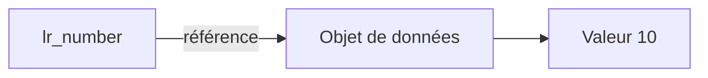

# 11. RÉFÉRENCES DE DONNÉES

## 11.A RÉSULTAT ATTENDU

- Déclarer une référence de données[^terme-reference] typée
- Référencer un objet existant
- Créer un objet de données[^terme-objet-donnees] anonyme
- Déréférencer avec `->*`
- Contrôler une référence avec `IS BOUND`
- Distinguer référence et field-symbol[^terme-field-symbol]

## 11.B PRINCIPE

Une variable de référence contient une référence vers un objet de données. Elle ne contient pas directement la valeur métier de cet objet.



## 11.C DÉCLARATION

```abap
DATA lr_number TYPE REF TO i.
```

Après la déclaration, `lr_number` est initiale et ne référence aucun objet.

## 11.D RÉFÉRENCER UN OBJET EXISTANT

```abap
DATA lv_number TYPE i VALUE 10.
DATA lr_number TYPE REF TO i.

GET REFERENCE OF lv_number INTO lr_number.
```

Accès à la valeur référencée :

```abap
WRITE / lr_number->*.
```

Modification :

```abap
lr_number->* = 25.
```

`lv_number` vaut alors `25`.

## 11.E CRÉER UN OBJET ANONYME

```abap
DATA lr_number TYPE REF TO i.

CREATE DATA lr_number.
lr_number->* = 10.
```

`CREATE DATA` crée un objet de données anonyme du type référencé. La référence constitue le moyen d’accès à cet objet.

## 11.F CONTRÔLE AVEC `IS BOUND`

```abap
IF lr_number IS BOUND.
  WRITE / lr_number->*.
ENDIF.
```

Déréférencer une référence initiale ou non valide peut provoquer une erreur d’exécution.

> [!IMPORTANT]
> Tester `IS BOUND` lorsque le flux du programme ne garantit pas que la référence a été initialisée correctement.

## 11.G OPÉRATEUR `REF`

Sur les versions ABAP[^terme-abap] compatibles :

```abap
DATA(lr_number) = REF #( lv_number ).
```

`#` demande au compilateur de déduire le type depuis le contexte.

Forme explicite :

```abap
DATA lr_number TYPE REF TO i.

lr_number = REF #( lv_number ).
```

La disponibilité de cette syntaxe dépend de la version du serveur ABAP.

## 11.H RÉFÉRENCE GÉNÉRIQUE

```abap
DATA lr_data TYPE REF TO data.
```

Cette référence peut pointer vers des objets de données de types différents. Pour accéder à la valeur, une affectation à un field-symbol compatible est couramment utilisée :

```abap
DATA lv_text TYPE string VALUE `ABAP`.
DATA lr_data TYPE REF TO data.
FIELD-SYMBOLS <lv_value> TYPE any.

GET REFERENCE OF lv_text INTO lr_data.
ASSIGN lr_data->* TO <lv_value>.

IF <lv_value> IS ASSIGNED.
  WRITE / <lv_value>.
ENDIF.
```

Le typage générique doit être limité aux mécanismes qui en ont réellement besoin.

## 11.I RÉFÉRENCE ET FIELD-SYMBOL

| Caractéristique | Référence de données          | Field-symbol             |
| --------------- | ----------------------------- | ------------------------ |
| Nature          | Objet contenant une référence | Alias symbolique         |
| Déclaration     | `TYPE REF TO ...`             | `FIELD-SYMBOLS ...`      |
| Accès           | `->*`                         | Directement avec `<...>` |
| Contrôle        | `IS BOUND`                    | `IS ASSIGNED`            |
| Objet anonyme   | Peut le créer et le conserver | Ne crée pas l’objet      |
| Réaffectation   | Possible                      | Possible avec `ASSIGN`   |

## 11.J DURÉE DE VIE D’UN OBJET ANONYME

Un objet anonyme reste accessible tant qu’une référence valide permet de l’atteindre. Lorsqu’il n’est plus référencé, l’environnement[^terme-environnement] d’exécution peut récupérer sa mémoire.

Il ne faut pas baser la logique fonctionnelle sur le moment exact de cette récupération mémoire.

## 11.K EXEMPLE COMPLET

```abap
REPORT zdemo_data_references.

TYPES:
  BEGIN OF ty_result,
    code    TYPE i,
    message TYPE string,
  END OF ty_result.

DATA lr_result TYPE REF TO ty_result.

CREATE DATA lr_result.

IF lr_result IS BOUND.
  lr_result->*-code    = 0.
  lr_result->*-message = `Succès`.

  WRITE: / lr_result->*-code,
           lr_result->*-message.
ENDIF.
```

La syntaxe `lr_result->*-code` déréférence l’objet puis accède au composant `code`.

## 11.L ERREURS FRÉQUENTES

| Erreur                                           | Conséquence              |
| ------------------------------------------------ | ------------------------ |
| Déréférencer sans contrôle                       | Erreur d’exécution       |
| Utiliser `REF TO data` partout                   | Perte de typage statique |
| Confondre la référence et la valeur              | Affectations incorrectes |
| Créer dynamiquement sans besoin                  | Complexité inutile       |
| Conserver des références globales non maîtrisées | État difficile à suivre  |

## 11.M VÉRIFICATION

- Le contrôle syntaxique réussit.
- La version active correspond au code sauvegardé.
- L’exécution produit le résultat décrit dans le chapitre.
- Les cas vide, limite et erreur sont testés séparément lorsque la syntaxe le permet.

## 11.N SNIPPET À RÉUTILISER

> [!NOTE]
> Adapter les noms `Z*`, les types DDIC[^terme-acro-ddic], les données et les autorisations au système cible. Effectuer un contrôle syntaxique avant activation.

```abap
REPORT zdemo_data_references.

TYPES:
  BEGIN OF ty_result,
    code    TYPE i,
    message TYPE string,
  END OF ty_result.

DATA lr_result TYPE REF TO ty_result.

CREATE DATA lr_result.

IF lr_result IS BOUND.
  lr_result->*-code    = 0.
  lr_result->*-message = `Succès`.

  WRITE: / lr_result->*-code,
           lr_result->*-message.
ENDIF.
```

## 11.O TERMES DU LEXIQUE

- [Référence](<../🧩 00 ├── LEXIQUE SAP ET ABAP/04 ├── LANGAGE ET DEVELOPPEMENT ABAP.md#reference>)
- [Type de données](<../🧩 00 ├── LEXIQUE SAP ET ABAP/04 ├── LANGAGE ET DEVELOPPEMENT ABAP.md#type-donnees>)
- [Objet de données](<../🧩 00 ├── LEXIQUE SAP ET ABAP/04 ├── LANGAGE ET DEVELOPPEMENT ABAP.md#objet-donnees>)
- [Structure](<../🧩 00 ├── LEXIQUE SAP ET ABAP/04 ├── LANGAGE ET DEVELOPPEMENT ABAP.md#structure-abap>)
- [Table interne](<../🧩 00 ├── LEXIQUE SAP ET ABAP/04 ├── LANGAGE ET DEVELOPPEMENT ABAP.md#table-interne>)
- [Field-symbol](<../🧩 00 ├── LEXIQUE SAP ET ABAP/04 ├── LANGAGE ET DEVELOPPEMENT ABAP.md#field-symbol>)

## 11.P RÉFÉRENCES OFFICIELLES SAP

- [Data References — ABAP Keyword Documentation](https://help.sap.com/doc/abapdocu_latest_index_htm/latest/en-US/ABENREFERENCES_DATA.html)
- [GET REFERENCE — ABAP Keyword Documentation](https://help.sap.com/doc/abapdocu_latest_index_htm/latest/en-US/ABAPGET_REFERENCE.html)
- [CREATE DATA — ABAP Keyword Documentation](https://help.sap.com/doc/abapdocu_latest_index_htm/latest/en-US/ABAPCREATE_DATA.html)
- [Reference Operator REF — ABAP Keyword Documentation](https://help.sap.com/doc/abapdocu_latest_index_htm/latest/en-US/ABENCONSTRUCTOR_EXPRESSION_REF.html)


---

[Chapitre suivant — PORTÉE, DURÉE DE VIE ET `STATICS`](<./12 └── PORTEE DUREE DE VIE ET STATICS.md>)

[^terme-reference]: **RÉFÉRENCE.** Valeur qui pointe vers un objet de données ou une instance de classe. Voir [l’entrée du lexique](<../🧩 00 ├── LEXIQUE SAP ET ABAP/04 ├── LANGAGE ET DEVELOPPEMENT ABAP.md#reference>).
[^terme-objet-donnees]: **OBJET DE DONNÉES.** Zone de mémoire typée contenant une valeur pendant l’exécution. Voir [l’entrée du lexique](<../🧩 00 ├── LEXIQUE SAP ET ABAP/04 ├── LANGAGE ET DEVELOPPEMENT ABAP.md#objet-donnees>).
[^terme-field-symbol]: **FIELD-SYMBOL.** Alias dynamique vers une zone de mémoire existante. Voir [l’entrée du lexique](<../🧩 00 ├── LEXIQUE SAP ET ABAP/04 ├── LANGAGE ET DEVELOPPEMENT ABAP.md#field-symbol>).
[^terme-abap]: **ABAP.** Langage de programmation de la plateforme ABAP, conçu pour développer des applications métier et techniques SAP. Voir [l’entrée du lexique](<../🧩 00 ├── LEXIQUE SAP ET ABAP/04 ├── LANGAGE ET DEVELOPPEMENT ABAP.md#abap>).
[^terme-environnement]: **ENVIRONNEMENT.** Rôle fonctionnel attribué à un système dans le cycle de vie : développement, test, recette, préproduction ou production. Voir [l’entrée du lexique](<../🧩 00 ├── LEXIQUE SAP ET ABAP/01 ├── SYSTEMES ENVIRONNEMENTS ET MANDANTS.md#environnement>).
[^terme-acro-ddic]: **DDIC.** Data Dictionary, abréviation courante de l’ABAP Dictionary. Voir [l’entrée du lexique](<../🧩 00 ├── LEXIQUE SAP ET ABAP/10 └── ACRONYMES SAP.md#acro-ddic>).
