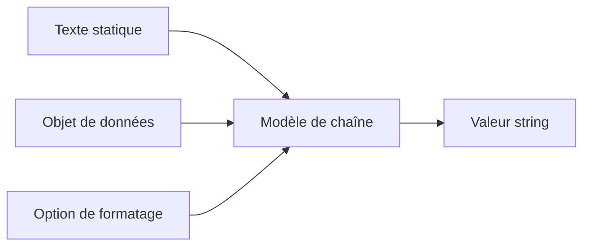

# 9. CONCATÉNATION ET MODÈLES DE CHAÎNES

## 9.A RÉSULTAT ATTENDU

- Concaténer plusieurs valeurs
- Utiliser `CONCATENATE` et l’opérateur `&&`
- Construire un texte avec un modèle de chaîne
- Formater une valeur intégrée dans un texte
- Choisir une forme lisible et compatible avec la version ABAP[^terme-abap]

## 9.B INSTRUCTION CONCATENATE

```abap
DATA lv_first_name TYPE string VALUE `Ada`.
DATA lv_last_name  TYPE string VALUE `Lovelace`.
DATA lv_full_name  TYPE string.

CONCATENATE lv_first_name lv_last_name
       INTO lv_full_name
       SEPARATED BY space.
```

Résultat :

```text
Ada Lovelace
```

`CONCATENATE` reste utile dans le code classique et permet une séparation explicite.

## 9.C OPÉRATEUR &&

```abap
lv_full_name = lv_first_name && ` ` && lv_last_name.
```

L’opérateur `&&` produit une expression de chaîne.

Pour une concaténation simple, cette forme est compacte. Pour une phrase comportant plusieurs valeurs et formats, utiliser un modèle de chaîne.

## 9.D MODÈLES DE CHAÎNES

Un modèle de chaîne est délimité par `|`.

```abap
DATA lv_name TYPE string VALUE `Ada`.
DATA lv_message TYPE string.

lv_message = |Bonjour { lv_name }|.
```

Une expression embarquée est placée entre accolades.



## 9.E EXPRESSIONS EMBARQUÉES

```abap
DATA lv_quantity TYPE i VALUE 3.
DATA lv_price    TYPE p LENGTH 8 DECIMALS 2 VALUE '12.50'.

DATA(lv_message) = |Quantité : { lv_quantity }, prix : { lv_price }|.
```

Une expression peut être utilisée :

```abap
DATA(lv_total_text) = |Total : { lv_quantity * lv_price }|.
```

Pour un calcul métier important, conserver le résultat dans une variable avant le formatage.

## 9.F FORMATAGE

Exemples d’options :

```abap
DATA(lv_date_text) = |{ sy-datum DATE = USER }|.
DATA(lv_number_text) = |{ lv_price NUMBER = USER }|.
DATA(lv_left) = |{ lv_name WIDTH = 20 ALIGN = LEFT }|.
```

Les options d’affichage ne modifient pas la valeur source.

> [!IMPORTANT]
> Une chaîne formatée pour l’utilisateur ne doit pas être réutilisée comme valeur technique destinée à une interface ou à un calcul.

## 9.G CARACTÈRES DE CONTRÔLE

Les modèles de chaînes permettent d’insérer des caractères de contrôle :

```abap
DATA(lv_multiline) = |Ligne 1\nLigne 2|.
```

Selon le contexte de sortie, préférer les constantes prévues par les API[^terme-api] utilisées, par exemple `cl_abap_char_utilities=>newline`, lorsque le consommateur attend une séquence précise.

```abap
DATA(lv_multiline) = |Ligne 1{ cl_abap_char_utilities=>newline }Ligne 2|.
```

## 9.H CONVERSION ALPHA DANS UN MODÈLE

Pour un champ utilisant la conversion ALPHA :

```abap
DATA lv_customer TYPE kunnr VALUE '0000123456'.
DATA(lv_external) = |{ lv_customer ALPHA = OUT }|.
```

La conversion inverse peut être appliquée avec `ALPHA = IN` lorsque le contexte le justifie.

## 9.I CHOIX DE LA TECHNIQUE

| Cas                                         | Technique                                                   |
| ------------------------------------------- | ----------------------------------------------------------- |
| Code classique simple                       | `CONCATENATE`                                               |
| Deux ou trois fragments sans formatage      | `&&`                                                        |
| Message comprenant plusieurs valeurs        | Modèle de chaîne                                            |
| Formatage de date, nombre ou identifiant    | Modèle de chaîne avec option                                |
| Construction d’un format d’interface strict | API ou sérialiseur adapté, pas une concaténation improvisée |

## 9.J VÉRIFICATION

- Le contrôle syntaxique réussit.
- La version active correspond au code sauvegardé.
- L’exécution produit le résultat décrit dans le chapitre.
- Les cas vide, limite et erreur sont testés séparément lorsque la syntaxe le permet.

## 9.K ERREURS FRÉQUENTES

- Copier un exemple sans adapter les types, noms d’objets et données disponibles dans le système.
- Tester uniquement le cas nominal et ignorer les valeurs initiales, absentes ou invalides.
- S’appuyer sur une conversion implicite pouvant tronquer ou arrondir.
- Ignorer l’encodage[^terme-encodage] et les formats externes.

## 9.L SNIPPET À RÉUTILISER

> [!NOTE]
> Adapter les noms `Z*`, les types DDIC[^terme-acro-ddic], les données et les autorisations au système cible. Effectuer un contrôle syntaxique avant activation.

```abap
DATA lv_quantity TYPE i VALUE 3.
DATA lv_price    TYPE p LENGTH 8 DECIMALS 2 VALUE '12.50'.

DATA(lv_message) = |Quantité : { lv_quantity }, prix : { lv_price }|.
```

## 9.M TERMES DU LEXIQUE

- [Instruction ABAP](<../🧩 00 ├── LEXIQUE SAP ET ABAP/04 ├── LANGAGE ET DEVELOPPEMENT ABAP.md#instruction-abap>)
- [Expression](<../🧩 00 ├── LEXIQUE SAP ET ABAP/04 ├── LANGAGE ET DEVELOPPEMENT ABAP.md#expression>)
- [Type de données](<../🧩 00 ├── LEXIQUE SAP ET ABAP/04 ├── LANGAGE ET DEVELOPPEMENT ABAP.md#type-donnees>)

## 9.N RÉFÉRENCES OFFICIELLES SAP

- [String Expressions — ABAP Keyword Documentation](https://help.sap.com/doc/abapdocu_latest_index_htm/latest/en-US/ABENSTRING_EXPRESSIONS.html)
- [String Templates — ABAP Keyword Documentation](https://help.sap.com/doc/abapdocu_latest_index_htm/latest/en-US/ABENSTRING_TEMPLATES.html)
- [Character String Processing in ABAP Release 7.40 — ABAP Keyword Documentation](https://help.sap.com/doc/abapdocu_latest_index_htm/latest/en-US/ABENNEWS-740-CHARACTER_PROCESSING.html)


---

[Chapitre suivant — ACCÈS PAR OFFSET ET LONGUEUR](<./10 ├── ACCES PAR OFFSET ET LONGUEUR.md>)

[^terme-abap]: **ABAP.** Langage de programmation de la plateforme ABAP, conçu pour développer des applications métier et techniques SAP. Voir [l’entrée du lexique](<../🧩 00 ├── LEXIQUE SAP ET ABAP/04 ├── LANGAGE ET DEVELOPPEMENT ABAP.md#abap>).
[^terme-api]: **API.** Application Programming Interface, contrat exposant des opérations ou données utilisables par d’autres composants. Voir [l’entrée du lexique](<../🧩 00 ├── LEXIQUE SAP ET ABAP/10 └── ACRONYMES SAP.md#api>).
[^terme-encodage]: **ENCODAGE.** Règle transformant les caractères en octets et inversement. Voir [l’entrée du lexique](<../🧩 00 ├── LEXIQUE SAP ET ABAP/07 ├── INTERFACES ET INTEGRATION.md#encodage>).
[^terme-acro-ddic]: **DDIC.** Data Dictionary, abréviation courante de l’ABAP Dictionary. Voir [l’entrée du lexique](<../🧩 00 ├── LEXIQUE SAP ET ABAP/10 └── ACRONYMES SAP.md#acro-ddic>).
