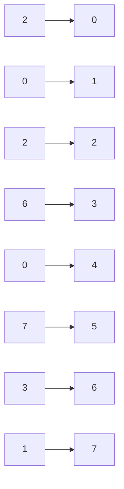

# 10. ACCÈS PAR OFFSET ET LONGUEUR

## 10.A RÉSULTAT ATTENDU

- Extraire une partie d’un objet caractère
- Comprendre l’indexation à partir de zéro
- Utiliser un offset et une longueur statiques ou dynamiques
- Modifier une sous-zone lorsque le type l’autorise
- Prévenir les accès hors limites

## 10.B SYNTAXE

```abap
source+offset(length)
```

- `offset` indique le nombre de caractères ignorés depuis le début ;
- `length` indique le nombre de caractères sélectionnés ;
- le premier caractère se trouve à l’offset `0`.

```abap
DATA lv_date  TYPE d VALUE '20260731'.
DATA lv_year  TYPE c LENGTH 4.
DATA lv_month TYPE c LENGTH 2.
DATA lv_day   TYPE c LENGTH 2.

lv_year  = lv_date+0(4).
lv_month = lv_date+4(2).
lv_day   = lv_date+6(2).
```

Forme abrégée lorsque l’offset vaut zéro :

```abap
lv_year = lv_date(4).
```

## 10.C REPRÉSENTATION



Pour la valeur `20260731` :

| Sous-zone | Accès          | Résultat |
| --------- | -------------- | -------- |
| Année     | `lv_date+0(4)` | `2026`   |
| Mois      | `lv_date+4(2)` | `07`     |
| Jour      | `lv_date+6(2)` | `31`     |

## 10.D OFFSET DYNAMIQUE

```abap
DATA lv_text   TYPE string VALUE `SAP-ABAP`.
DATA lv_offset TYPE i VALUE 4.
DATA lv_length TYPE i VALUE 4.
DATA lv_part   TYPE string.

lv_part = lv_text+lv_offset(lv_length).
```

Le programme doit vérifier que l’offset et la longueur restent dans les limites de la valeur.

## 10.E MODIFICATION D’UNE SOUS-ZONE

Pour un objet modifiable compatible :

```abap
DATA lv_date TYPE d VALUE '20260731'.

lv_date+4(2) = '08'.
```

La valeur devient `20260831`.

> [!WARNING]
> Modifier directement les composantes textuelles d’une date peut produire une date invalide. Cette technique convient à l’extraction ; les calculs de calendrier doivent utiliser les mécanismes de date adaptés.

## 10.F RISQUES D’ACCÈS HORS LIMITES

Un offset négatif ou une sous-zone dépassant la longueur disponible peut produire une exception[^terme-exception] d’exécution.

Validation préalable :

```abap
DATA(lv_text_length) = strlen( lv_text ).

IF lv_offset >= 0
   AND lv_length >= 0
   AND lv_offset + lv_length <= lv_text_length.
  lv_part = lv_text+lv_offset(lv_length).
ENDIF.
```

## 10.G FONCTION SUBSTRING

Une autre forme consiste à utiliser `substring( )` :

```abap
lv_part = substring(
  val = lv_text
  off = lv_offset
  len = lv_length ).
```

Choix :

| Besoin                               | Forme                                                  |
| ------------------------------------ | ------------------------------------------------------ |
| Accès compact à une zone connue      | Offset/longueur                                        |
| Traitement intégré à une expression  | `substring( )`                                         |
| Paramètres dynamiques nommés         | `substring( )`                                         |
| Modification directe d’une sous-zone | Offset/longueur dans une position d’écriture autorisée |

## 10.H EXEMPLE AVEC UN IDENTIFIANT STRUCTURÉ

```abap
DATA lv_reference TYPE string VALUE `FR-2026-000123`.
DATA lv_country   TYPE string.
DATA lv_year      TYPE string.
DATA lv_number    TYPE string.

lv_country = lv_reference+0(2).
lv_year    = lv_reference+3(4).
lv_number  = lv_reference+8(6).
```

Cette technique suppose que le format a été validé avant l’extraction.

## 10.I VÉRIFICATION

- Le contrôle syntaxique réussit.
- La version active correspond au code sauvegardé.
- L’exécution produit le résultat décrit dans le chapitre.
- Les cas vide, limite et erreur sont testés séparément lorsque la syntaxe le permet.

## 10.J ERREURS FRÉQUENTES

- Copier un exemple sans adapter les types, noms d’objets et données disponibles dans le système.
- Tester uniquement le cas nominal et ignorer les valeurs initiales, absentes ou invalides.
- S’appuyer sur une conversion implicite pouvant tronquer ou arrondir.
- Ignorer l’encodage[^terme-encodage] et les formats externes.

## 10.K SNIPPET À RÉUTILISER

> [!NOTE]
> Adapter les noms `Z*`, les types DDIC[^terme-acro-ddic], les données et les autorisations au système cible. Effectuer un contrôle syntaxique avant activation.

```abap
DATA(lv_text_length) = strlen( lv_text ).

IF lv_offset >= 0
   AND lv_length >= 0
   AND lv_offset + lv_length <= lv_text_length.
  lv_part = lv_text+lv_offset(lv_length).
ENDIF.
```

## 10.L TERMES DU LEXIQUE

- [Instruction ABAP](<../🧩 00 ├── LEXIQUE SAP ET ABAP/04 ├── LANGAGE ET DEVELOPPEMENT ABAP.md#instruction-abap>)
- [Expression](<../🧩 00 ├── LEXIQUE SAP ET ABAP/04 ├── LANGAGE ET DEVELOPPEMENT ABAP.md#expression>)
- [Type de données](<../🧩 00 ├── LEXIQUE SAP ET ABAP/04 ├── LANGAGE ET DEVELOPPEMENT ABAP.md#type-donnees>)

## 10.M RÉFÉRENCES OFFICIELLES SAP

- [Substring Access — ABAP Keyword Documentation](https://help.sap.com/doc/abapdocu_latest_index_htm/latest/en-US/ABENOFFSET_LENGTH.html)
- [substring — ABAP Keyword Documentation](https://help.sap.com/doc/abapdocu_latest_index_htm/latest/en-US/ABENSUBSTRING_FUNCTIONS.html)
- [Calculating with Dates, Times, and Timestamps — SAP Learning](https://learning.sap.com/courses/deepening-your-abap-programming-knowledge/calculating-with-dates-times-and-timestamps_a393cf01-946e-487b-a690-0aab8fc49a39)


---

[Chapitre suivant — RECHERCHE ET REMPLACEMENT](<./11 ├── RECHERCHE ET REMPLACEMENT.md>)

[^terme-exception]: **EXCEPTION.** Objet ou signal représentant une situation anormale qu’un appelant peut traiter. Voir [l’entrée du lexique](<../🧩 00 ├── LEXIQUE SAP ET ABAP/04 ├── LANGAGE ET DEVELOPPEMENT ABAP.md#exception>).
[^terme-encodage]: **ENCODAGE.** Règle transformant les caractères en octets et inversement. Voir [l’entrée du lexique](<../🧩 00 ├── LEXIQUE SAP ET ABAP/07 ├── INTERFACES ET INTEGRATION.md#encodage>).
[^terme-acro-ddic]: **DDIC.** Data Dictionary, abréviation courante de l’ABAP Dictionary. Voir [l’entrée du lexique](<../🧩 00 ├── LEXIQUE SAP ET ABAP/10 └── ACRONYMES SAP.md#acro-ddic>).
