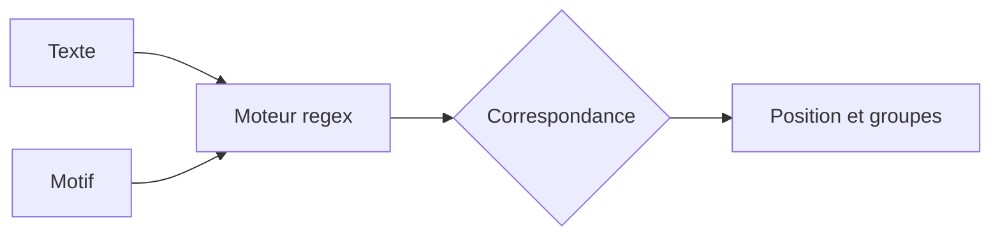

# 12. EXPRESSIONS RÉGULIÈRES

## 12.A RÉSULTAT ATTENDU

- Comprendre l’usage d’une expression régulière
- Distinguer recherche littérale, motif `CP` et regex
- Utiliser les formes disponibles selon la version ABAP[^terme-abap]
- Valider un format simple
- Éviter les expressions trop complexes et difficiles à maintenir

## 12.B PRINCIPE

Une expression régulière décrit un ensemble de chaînes correspondant à un motif.

Exemples de besoins :

- vérifier un format de code ;
- extraire une partie structurée d’un texte ;
- remplacer plusieurs formes équivalentes ;
- identifier des séparateurs variables ;
- contrôler une donnée technique avant traitement.



## 12.C LITTÉRAL, CP OU REGEX

| Besoin                                      | Technique                        |
| ------------------------------------------- | -------------------------------- |
| Sous-chaîne exacte                          | `FIND` littéral ou `contains( )` |
| Motif simple avec `*` et `+`                | Opérateur `CP`                   |
| Format avec classes, groupes ou répétitions | Expression régulière             |

Exemple `CP` :

```abap
IF lv_code CP `Z*-2026`.
  WRITE / 'Motif simple trouvé'.
ENDIF.
```

`CP` n’utilise pas la syntaxe des expressions régulières.

## 12.D PCRE ET REGEX

Les versions ABAP récentes proposent la syntaxe `PCRE`, fondée sur les expressions régulières compatibles Perl.

```abap
DATA lv_code TYPE string VALUE `ABAP-2026`.

FIND PCRE `^[A-Z]+-[0-9]{4}$` IN lv_code.
```

Les systèmes plus anciens utilisent notamment l’addition `REGEX`, fondée sur l’ancien moteur pris en charge par la version concernée.

```abap
FIND REGEX `^[[:alpha:]]+-[[:digit:]]{4}$` IN lv_code.
```

> [!IMPORTANT]
> La disponibilité de `PCRE` dépend de la version du serveur ABAP. Vérifier la documentation intégrée du système avec `F1`[^terme-aide-f1] avant de remplacer une implémentation existante.

## 12.E ANCRES ET QUANTIFICATEURS

| Élément | Signification courante en PCRE |
| ------- | ------------------------------ |
| `^`     | Début du texte                 |
| `$`     | Fin du texte                   |
| `.`     | Un caractère                   |
| `*`     | Zéro ou plusieurs occurrences  |
| `+`     | Une ou plusieurs occurrences   |
| `?`     | Zéro ou une occurrence         |
| `{n}`   | Exactement `n` occurrences     |
| `[A-Z]` | Un caractère dans l’intervalle |
| `(...)` | Groupe                         |

Exemple de code client sur dix chiffres :

```abap
FIND PCRE `^[0-9]{10}$` IN lv_customer.
```

## 12.F CAPTURER DES SOUS-GROUPES

Pour des traitements avancés, les résultats de `FIND` ou les classes système de regex permettent de récupérer les correspondances et sous-groupes.

Exemple conceptuel de format `PAYS-ANNÉE-NUMÉRO` :

```text
^([A-Z]{2})-([0-9]{4})-([0-9]{6})$
```

Groupes :

1. pays ;
2. année ;
3. numéro.

Pour une extraction simple dans un format stable, un accès offset/longueur peut rester plus lisible après validation du format.

## 12.G REMPLACEMENT PAR MOTIF

```abap
DATA lv_text TYPE string VALUE `ABAP     SAP GUI`.

REPLACE ALL OCCURRENCES OF PCRE `\s+`
  IN lv_text
  WITH ` `.
```

Cette opération remplace une ou plusieurs occurrences d’espacement par un espace unique.

Sur les versions ne prenant pas en charge `PCRE`, adapter la syntaxe au moteur disponible.

## 12.H VALIDATION TECHNIQUE ET VALIDATION MÉTIER

Une regex peut valider une forme, mais pas nécessairement le sens métier.

Exemple :

```text
20260231
```

Le motif `[0-9]{8}` valide huit chiffres, mais ne valide pas l’existence du 31 février.

La validation complète doit combiner :

- contrôle de forme ;
- conversion technique ;
- règle métier[^terme-regle-metier] ;
- contrôle de référentiel si nécessaire.

## 12.I BONNES PRATIQUES

- Utiliser une recherche littérale lorsqu’elle suffit.
- Commenter l’objectif du motif, pas chaque caractère.
- Isoler les motifs importants dans des constantes nommées.
- Ajouter des cas de test positifs et négatifs.
- Éviter une regex unique lorsqu’une décomposition en étapes est plus claire.
- Vérifier la compatibilité avec la version ABAP cible.

## 12.J VÉRIFICATION

- Le contrôle syntaxique réussit.
- La version active correspond au code sauvegardé.
- L’exécution produit le résultat décrit dans le chapitre.
- Les cas vide, limite et erreur sont testés séparément lorsque la syntaxe le permet.

## 12.K ERREURS FRÉQUENTES

- Copier un exemple sans adapter les types, noms d’objets et données disponibles dans le système.
- Tester uniquement le cas nominal et ignorer les valeurs initiales, absentes ou invalides.
- S’appuyer sur une conversion implicite pouvant tronquer ou arrondir.
- Ignorer l’encodage[^terme-encodage] et les formats externes.

## 12.L SNIPPET À RÉUTILISER

> [!NOTE]
> Adapter les noms `Z*`, les types DDIC[^terme-acro-ddic], les données et les autorisations au système cible. Effectuer un contrôle syntaxique avant activation.

```abap
IF lv_code CP `Z*-2026`.
  WRITE / 'Motif simple trouvé'.
ENDIF.
```

## 12.M TERMES DU LEXIQUE

- [Expression](<../🧩 00 ├── LEXIQUE SAP ET ABAP/04 ├── LANGAGE ET DEVELOPPEMENT ABAP.md#expression>)
- [Instruction ABAP](<../🧩 00 ├── LEXIQUE SAP ET ABAP/04 ├── LANGAGE ET DEVELOPPEMENT ABAP.md#instruction-abap>)
- [Type de données](<../🧩 00 ├── LEXIQUE SAP ET ABAP/04 ├── LANGAGE ET DEVELOPPEMENT ABAP.md#type-donnees>)

## 12.N RÉFÉRENCES OFFICIELLES SAP

- [Regular Expressions — ABAP Keyword Documentation](https://help.sap.com/doc/abapdocu_latest_index_htm/latest/en-US/ABENREGEX_MTCH.html)
- [Search Patterns — ABAP Keyword Documentation](https://help.sap.com/doc/abapdocu_latest_index_htm/latest/en-US/ABENREGEX_PCRE_SYNTAX.html)
- [FIND — ABAP Keyword Documentation](https://help.sap.com/doc/abapdocu_latest_index_htm/latest/en-US/ABAPFIND_OPTIONS.html)
- [REPLACE — ABAP Keyword Documentation](https://help.sap.com/doc/abapdocu_latest_index_htm/latest/en-US/ABAPREPLACE_PATTERN.html)


---

[Chapitre suivant — DATES, HEURES ET HORODATAGES](<./13 └── DATES HEURES ET HORODATAGES.md>)

[^terme-abap]: **ABAP.** Langage de programmation de la plateforme ABAP, conçu pour développer des applications métier et techniques SAP. Voir [l’entrée du lexique](<../🧩 00 ├── LEXIQUE SAP ET ABAP/04 ├── LANGAGE ET DEVELOPPEMENT ABAP.md#abap>).
[^terme-aide-f1]: **AIDE F1.** Aide contextuelle expliquant un champ, une fonction ou un mot-clé. Voir [l’entrée du lexique](<../🧩 00 ├── LEXIQUE SAP ET ABAP/02 ├── SAP GUI NAVIGATION ET TRANSACTIONS.md#aide-f1>).
[^terme-regle-metier]: **RÈGLE MÉTIER.** Condition ou calcul imposé par le processus fonctionnel. Voir [l’entrée du lexique](<../🧩 00 ├── LEXIQUE SAP ET ABAP/09 ├── NOTIONS FONCTIONNELLES ET ORGANISATIONNELLES.md#regle-metier>).
[^terme-encodage]: **ENCODAGE.** Règle transformant les caractères en octets et inversement. Voir [l’entrée du lexique](<../🧩 00 ├── LEXIQUE SAP ET ABAP/07 ├── INTERFACES ET INTEGRATION.md#encodage>).
[^terme-acro-ddic]: **DDIC.** Data Dictionary, abréviation courante de l’ABAP Dictionary. Voir [l’entrée du lexique](<../🧩 00 ├── LEXIQUE SAP ET ABAP/10 └── ACRONYMES SAP.md#acro-ddic>).
