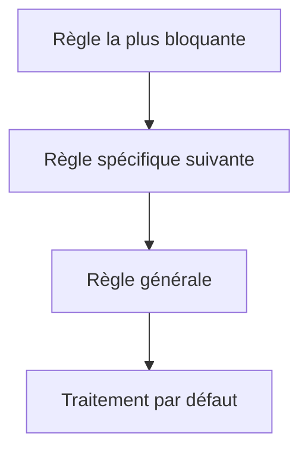

# 4. CHOISIR ENTRE IF ET CASE

## 4.A RÉSULTAT ATTENDU

- Identifier la structure la plus lisible pour un besoin donné
- Distinguer comparaison de valeur et condition générale
- Réduire les branches redondantes
- Organiser les règles par priorité
- Préparer des traitements faciles à tester

## 4.B RÈGLE DE CHOIX

Utiliser `CASE` lorsque :

- une seule expression pilote le branchement ;
- chaque branche repose principalement sur une égalité ;
- les valeurs possibles sont distinctes et lisibles.

Utiliser `IF` lorsque :

- plusieurs objets de données participent à la décision ;
- les conditions utilisent des plages, des inégalités ou des prédicats ;
- l’ordre de priorité des règles est important.

| Besoin                                  | Structure recommandée |
| --------------------------------------- | --------------------- |
| Comparer un statut à plusieurs codes    | `CASE`                |
| Vérifier un montant et une devise       | `IF`                  |
| Tester une plage de dates               | `IF`                  |
| Traiter plusieurs commandes utilisateur | `CASE`                |
| Combiner autorisation, état et quantité | `IF`                  |

## 4.C EXEMPLE ADAPTÉ À CASE

Version `IF` valide mais répétitive :

```abap
IF lv_status = 'N'.
  WRITE: / 'Nouveau'.
ELSEIF lv_status = 'P'.
  WRITE: / 'En cours'.
ELSEIF lv_status = 'C'.
  WRITE: / 'Clôturé'.
ELSE.
  WRITE: / 'Statut inconnu'.
ENDIF.
```

Version `CASE` plus directe :

```abap
CASE lv_status.
  WHEN 'N'.
    WRITE: / 'Nouveau'.
  WHEN 'P'.
    WRITE: / 'En cours'.
  WHEN 'C'.
    WRITE: / 'Clôturé'.
  WHEN OTHERS.
    WRITE: / 'Statut inconnu'.
ENDCASE.
```

## 4.D EXEMPLE ADAPTÉ À IF

```abap
IF lv_amount <= 0.
  WRITE: / 'Montant invalide'.
ELSEIF lv_currency IS INITIAL.
  WRITE: / 'Devise obligatoire'.
ELSEIF lv_blocked = abap_true.
  WRITE: / 'Document bloqué'.
ELSE.
  WRITE: / 'Document valide'.
ENDIF.
```

Un `CASE` ne rendrait pas cette décision plus claire, car plusieurs critères indépendants sont vérifiés.

## 4.E PRIORISER LES RÈGLES

Dans une chaîne `IF ... ELSEIF`, la première condition vraie gagne.



Exemple :

```abap
IF lv_deleted = abap_true.
  WRITE: / 'Document supprimé'.
ELSEIF lv_blocked = abap_true.
  WRITE: / 'Document bloqué'.
ELSEIF lv_complete = abap_true.
  WRITE: / 'Document complet'.
ELSE.
  WRITE: / 'Document incomplet'.
ENDIF.
```

## 4.F ÉVITER LES DUPLICATIONS

Si plusieurs branches exécutent le même traitement, regrouper la condition ou extraire le traitement commun.

Avant :

```abap
IF lv_country = 'FR'.
  lv_region = 'EU'.
ELSEIF lv_country = 'BE'.
  lv_region = 'EU'.
ENDIF.
```

Après :

```abap
IF lv_country = 'FR' OR lv_country = 'BE'.
  lv_region = 'EU'.
ENDIF.
```

Ou avec `CASE` :

```abap
CASE lv_country.
  WHEN 'FR' OR 'BE'.
    lv_region = 'EU'.
  WHEN OTHERS.
    CLEAR lv_region.
ENDCASE.
```

## 4.G TESTABILITÉ

Chaque branche représente un chemin de traitement à tester.

| Structure                | Cas minimaux à tester                       |
| ------------------------ | ------------------------------------------- |
| `IF` sans `ELSE`         | Condition vraie, condition fausse           |
| `IF ... ELSEIF ... ELSE` | Chaque condition et la branche par défaut   |
| `CASE`                   | Chaque `WHEN` et, si présent, `WHEN OTHERS` |

La couverture de toutes les branches réduit les anomalies liées aux cas limites.

## 4.H VÉRIFICATION

- Le contrôle syntaxique réussit.
- La version active correspond au code sauvegardé.
- L’exécution produit le résultat décrit dans le chapitre.
- Les cas vide, limite et erreur sont testés séparément lorsque la syntaxe le permet.

## 4.I ERREURS FRÉQUENTES

- Copier un exemple sans adapter les types, noms d’objets et données disponibles dans le système.
- Tester uniquement le cas nominal et ignorer les valeurs initiales, absentes ou invalides.
- Créer une boucle sans condition de sortie fiable.
- Utiliser `CHECK`, `CONTINUE`, `EXIT` ou `RETURN` sans rendre le flux lisible.

## 4.J SNIPPET À RÉUTILISER

> [!NOTE]
> Adapter les noms `Z*`, les types DDIC[^terme-acro-ddic], les données et les autorisations au système cible. Effectuer un contrôle syntaxique avant activation.

```abap
IF lv_status = 'N'.
  WRITE: / 'Nouveau'.
ELSEIF lv_status = 'P'.
  WRITE: / 'En cours'.
ELSEIF lv_status = 'C'.
  WRITE: / 'Clôturé'.
ELSE.
  WRITE: / 'Statut inconnu'.
ENDIF.
```

## 4.K TERMES DU LEXIQUE

- [Instruction ABAP](<../🧩 00 ├── LEXIQUE SAP ET ABAP/04 ├── LANGAGE ET DEVELOPPEMENT ABAP.md#instruction-abap>)
- [Expression](<../🧩 00 ├── LEXIQUE SAP ET ABAP/04 ├── LANGAGE ET DEVELOPPEMENT ABAP.md#expression>)

## 4.L RÉFÉRENCES OFFICIELLES SAP

- [Using Control Structures in ABAP — SAP Learning](https://learning.sap.com/courses/basic-abap-programming/using-control-structures-in-abap_a4d7803e-eac2-458e-acf9-8628289f3701)
- [Control Flow — SAP Help Portal](https://help.sap.com/docs/ABAP_PLATFORM_NEW/8132142fd1a144a59303663a03a7c2d4/94e1b1978adf45c1a72bd9d8075436d3.html)
- [Branch Code Coverage — SAP Help Portal](https://help.sap.com/docs/ABAP_PLATFORM_NEW/ba879a6e2ea04d9bb94c7ccd7cdac446/7f27a2638ee64d1d97dd53c69c562e7b.html)


---

[Chapitre suivant — EXPRESSIONS CONDITIONNELLES COND ET SWITCH](<./05 ├── EXPRESSIONS CONDITIONNELLES COND ET SWITCH.md>)

[^terme-acro-ddic]: **DDIC.** Data Dictionary, abréviation courante de l’ABAP Dictionary. Voir [l’entrée du lexique](<../🧩 00 ├── LEXIQUE SAP ET ABAP/10 └── ACRONYMES SAP.md#acro-ddic>).
