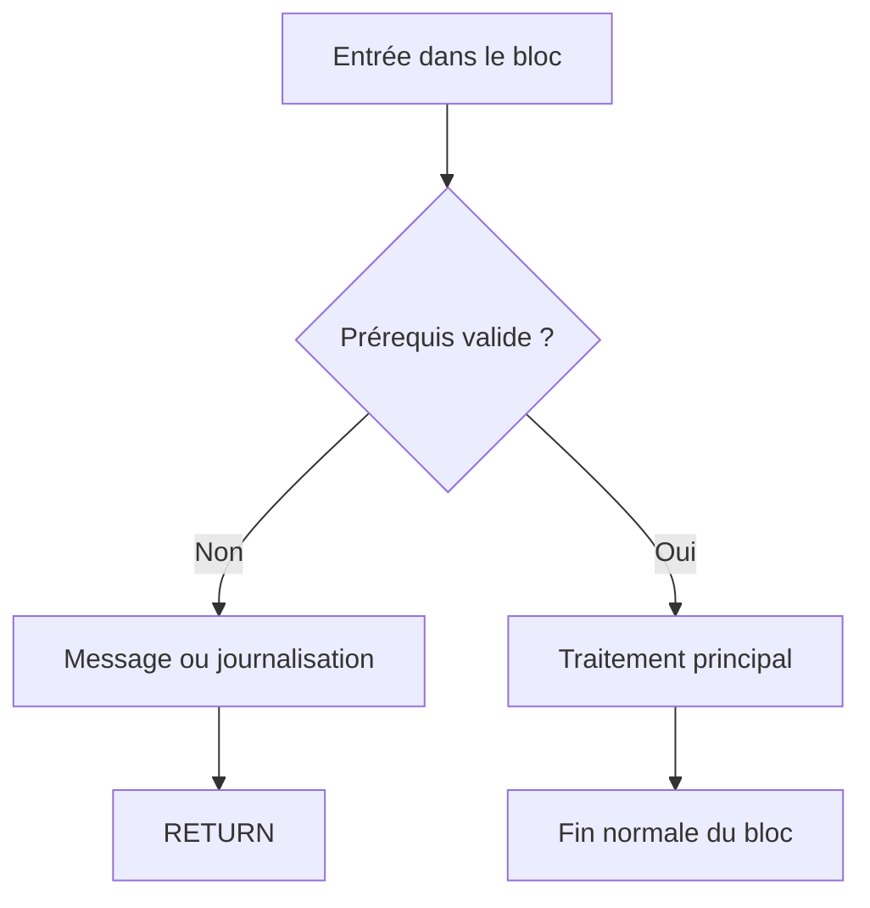

# 11. QUITTER UN BLOC AVEC RETURN

## 11.A RÉSULTAT ATTENDU

- Quitter le bloc de traitement courant
- Utiliser `RETURN` comme garde
- Distinguer `RETURN` de `EXIT` et `CONTINUE`
- Préserver la lisibilité d’un traitement
- Comprendre l’effet dans un événement ou une procédure

## 11.B PRINCIPE

`RETURN` termine le bloc de traitement courant. Le contrôle revient au point prévu par le contexte d’exécution.

Dans un événement de programme exécutable[^terme-programme-executable] :

```abap
PARAMETERS p_value TYPE i.

START-OF-SELECTION.

  IF p_value <= 0.
    WRITE: / 'Valeur invalide'.
    RETURN.
  ENDIF.

  WRITE: / 'Traitement de la valeur :', p_value.
```

La seconde instruction `WRITE` n’est pas exécutée lorsque la valeur est invalide.

## 11.C RETURN COMME GARDE

Une garde traite immédiatement un prérequis non satisfait.

```abap
IF lv_authorized = abap_false.
  WRITE: / 'Utilisateur non autorisé'.
  RETURN.
ENDIF.

IF lv_document IS INITIAL.
  WRITE: / 'Document obligatoire'.
  RETURN.
ENDIF.

WRITE: / 'Début du traitement principal'.
```



## 11.D DIFFÉRENCE AVEC LES AUTRES INSTRUCTIONS

| Instruction             | Effet attendu                                           |
| ----------------------- | ------------------------------------------------------- |
| `CONTINUE`              | Passe à l’itération suivante                            |
| `EXIT`                  | Quitte la boucle active                                 |
| `RETURN`                | Quitte le bloc de traitement courant                    |
| `CHECK` dans une boucle | Passe à l’itération suivante si la condition est fausse |
| `CHECK` hors boucle     | Quitte le bloc si la condition est fausse               |

## 11.E RETURN DANS UNE BOUCLE

`RETURN` ne quitte pas seulement la boucle : il quitte le bloc de traitement qui contient la boucle.

```abap
START-OF-SELECTION.

  DO 10 TIMES.
    IF sy-index = 3.
      RETURN.
    ENDIF.

    WRITE: / sy-index.
  ENDDO.

  WRITE: / 'Cette ligne ne sera pas exécutée'.
```

Utiliser `EXIT` lorsque seule la boucle doit être interrompue.

## 11.F ÉVITER UN RETURN CACHÉ

Un `RETURN` placé au milieu d’un long bloc peut surprendre le lecteur.

Préférer :

- les gardes au début du bloc ;
- des conditions clairement nommées ;
- une journalisation ou un message avant la sortie lorsque nécessaire ;
- des blocs courts grâce à la modularisation.

## 11.G NE PAS CONFONDRE RETURN ET FIN DE PROGRAMME

`RETURN` termine le bloc courant. Il ne doit pas être présenté comme une instruction générique d’arrêt technique de toute session SAP[^terme-acro-sap].

Les instructions de navigation ou de terminaison spécifiques aux programmes de dialogue et aux transactions seront traitées dans les dossiers correspondants.

## 11.H RETOUR DE VALEUR

Dans une méthode[^terme-methode] fonctionnelle, la valeur de retour est affectée à un paramètre `RETURNING`, puis `RETURN` peut terminer le traitement de manière anticipée. La déclaration et l’appel des méthodes seront étudiés dans le dossier **ABAP OBJECTS[^terme-abap-objects]**.

Exemple conceptuel :

```abap
METHOD is_valid.
  result = abap_false.

  IF input IS INITIAL.
    RETURN.
  ENDIF.

  result = abap_true.
ENDMETHOD.
```

## 11.I VÉRIFICATION

- Le contrôle syntaxique réussit.
- La version active correspond au code sauvegardé.
- L’exécution produit le résultat décrit dans le chapitre.
- Les cas vide, limite et erreur sont testés séparément lorsque la syntaxe le permet.

## 11.J ERREURS FRÉQUENTES

- Copier un exemple sans adapter les types, noms d’objets et données disponibles dans le système.
- Tester uniquement le cas nominal et ignorer les valeurs initiales, absentes ou invalides.
- Créer une boucle sans condition de sortie fiable.
- Utiliser `CHECK`, `CONTINUE`, `EXIT` ou `RETURN` sans rendre le flux lisible.

## 11.K SNIPPET À RÉUTILISER

> [!NOTE]
> Adapter les noms `Z*`, les types DDIC[^terme-acro-ddic], les données et les autorisations au système cible. Effectuer un contrôle syntaxique avant activation.

```abap
PARAMETERS p_value TYPE i.

START-OF-SELECTION.

  IF p_value <= 0.
    WRITE: / 'Valeur invalide'.
    RETURN.
  ENDIF.

  WRITE: / 'Traitement de la valeur :', p_value.
```

## 11.L TERMES DU LEXIQUE

- [Instruction ABAP](<../🧩 00 ├── LEXIQUE SAP ET ABAP/04 ├── LANGAGE ET DEVELOPPEMENT ABAP.md#instruction-abap>)
- [Expression](<../🧩 00 ├── LEXIQUE SAP ET ABAP/04 ├── LANGAGE ET DEVELOPPEMENT ABAP.md#expression>)

## 11.M RÉFÉRENCES OFFICIELLES SAP

- [RETURN — ABAP Keyword Documentation](https://help.sap.com/doc/abapdocu_latest_index_htm/latest/en-US/index.htm?file=abapreturn.htm)
- [Calling and Exiting Program Units — ABAP Keyword Documentation](https://help.sap.com/doc/abapdocu_latest_index_htm/latest/en-US/index.htm?file=abencalling_processing_blocks.htm)
- [ABAP Statements, Overview — ABAP Keyword Documentation](https://help.sap.com/doc/abapdocu_latest_index_htm/latest/en-US/ABENABAP_STATEMENTS_OVERVIEW.html)


---

[Chapitre suivant — IMBRICATION, LISIBILITÉ ET SÉCURISATION](<./12 └── IMBRICATION LISIBILITE ET SECURISATION.md>)

[^terme-programme-executable]: **PROGRAMME EXÉCUTABLE.** Programme ABAP de type report pouvant être lancé directement, généralement avec `F8` ou par une transaction. Voir [l’entrée du lexique](<../🧩 00 ├── LEXIQUE SAP ET ABAP/06 ├── PROGRAMMES CLASSES ET OBJETS TECHNIQUES.md#programme-executable>).
[^terme-acro-sap]: **SAP.** Nom de l’éditeur et de son écosystème logiciel ; l’acronyme historique provient de l’allemand. Voir [l’entrée du lexique](<../🧩 00 ├── LEXIQUE SAP ET ABAP/10 └── ACRONYMES SAP.md#acro-sap>).
[^terme-methode]: **MÉTHODE.** Comportement déclaré dans une classe ou une interface et appelé avec une liste de paramètres définie. Voir [l’entrée du lexique](<../🧩 00 ├── LEXIQUE SAP ET ABAP/04 ├── LANGAGE ET DEVELOPPEMENT ABAP.md#methode>).
[^terme-abap-objects]: **ABAP OBJECTS.** Extension orientée objet du langage ABAP fournissant classes, interfaces, héritage, événements et exceptions de classe. Voir [l’entrée du lexique](<../🧩 00 ├── LEXIQUE SAP ET ABAP/04 ├── LANGAGE ET DEVELOPPEMENT ABAP.md#abap-objects>).
[^terme-acro-ddic]: **DDIC.** Data Dictionary, abréviation courante de l’ABAP Dictionary. Voir [l’entrée du lexique](<../🧩 00 ├── LEXIQUE SAP ET ABAP/10 └── ACRONYMES SAP.md#acro-ddic>).
