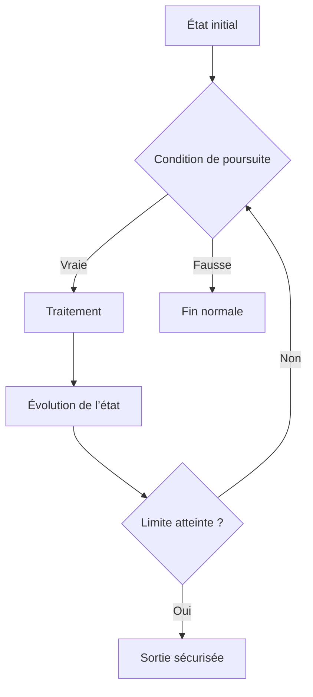

# 12. IMBRICATION, LISIBILITÉ ET SÉCURISATION

## 12.A RÉSULTAT ATTENDU

- Limiter la profondeur des structures imbriquées
- Séparer règles métier et mécanismes de boucle
- Prévenir les boucles infinies
- Préparer les cas de test de chaque branche
- Construire un flux de traitement vérifiable

## 12.B COÛT DE L’IMBRICATION

Chaque niveau supplémentaire augmente le nombre de chemins possibles et la difficulté de lecture.

```abap
IF lv_active = abap_true.
  IF lv_authorized = abap_true.
    DO 10 TIMES.
      IF sy-index MOD 2 = 0.
        WRITE: / sy-index.
      ENDIF.
    ENDDO.
  ENDIF.
ENDIF.
```

Version avec gardes :

```abap
IF lv_active = abap_false.
  WRITE: / 'Objet inactif'.
  RETURN.
ENDIF.

IF lv_authorized = abap_false.
  WRITE: / 'Accès refusé'.
  RETURN.
ENDIF.

DO 10 TIMES.
  CHECK sy-index MOD 2 = 0.
  WRITE: / sy-index.
ENDDO.
```

Le chemin principal reste aligné à gauche.

## 12.C SÉPARER LES RESPONSABILITÉS

Une boucle ne doit pas cumuler sans nécessité :

- validation d’entrée ;
- conversion complexe ;
- décision métier ;
- accès aux données ;
- affichage ;
- gestion d’erreur.

La modularisation permettra d’extraire ces responsabilités dans des procédures ou méthodes dédiées.

## 12.D PROTÉGER LES BOUCLES

Pour toute boucle conditionnelle, identifier :

1. l’état initial ;
2. la condition de poursuite ;
3. l’instruction qui fait évoluer cet état ;
4. la sortie normale ;
5. la limite technique éventuelle.



## 12.E EXEMPLE SÉCURISÉ

```abap
PARAMETERS p_target TYPE i DEFAULT 7.

CONSTANTS lc_max_iterations TYPE i VALUE 100.

DATA lv_found     TYPE abap_bool VALUE abap_false.
DATA lv_iteration TYPE i.

START-OF-SELECTION.

  IF p_target <= 0.
    WRITE: / 'La cible doit être positive'.
    RETURN.
  ENDIF.

  WHILE lv_found = abap_false
    AND lv_iteration < lc_max_iterations.

  lv_iteration = lv_iteration + 1.

    IF lv_iteration = p_target.
      lv_found = abap_true.
    ENDIF.
  ENDWHILE.

  IF lv_found = abap_true.
    WRITE: / 'Cible atteinte après', lv_iteration, 'itérations'.
  ELSE.
    WRITE: / 'Limite technique atteinte'.
  ENDIF.
```

## 12.F MATRICE DE CHOIX

| Besoin                                | Instruction principale | Instruction complémentaire éventuelle |
| ------------------------------------- | ---------------------- | ------------------------------------- |
| Exécuter selon une condition générale | `IF`                   | `RETURN` comme garde                  |
| Comparer un code à plusieurs valeurs  | `CASE`                 | `WHEN OTHERS`                         |
| Construire une valeur conditionnelle  | `COND` ou `SWITCH`     | Type de résultat explicite            |
| Répéter un nombre connu de fois       | `DO ... TIMES`         | `EXIT` pour arrêt anticipé            |
| Répéter tant qu’un état est vrai      | `WHILE`                | Limite technique                      |
| Ignorer une itération non pertinente  | `CHECK` ou `CONTINUE`  | —                                     |
| Quitter la boucle                     | `EXIT`                 | Indicateur de résultat                |
| Quitter le bloc courant               | `RETURN`               | Message ou journalisation             |

## 12.G CAS DE TEST MINIMAUX

Pour une condition :

- valeur qui satisfait chaque branche ;
- valeur limite ;
- valeur initiale ;
- valeur non prévue traitée par défaut.

Pour une boucle :

- zéro itération ;
- une itération ;
- plusieurs itérations ;
- sortie anticipée ;
- limite maximale atteinte ;
- condition qui reste fausse dès le départ.

## 12.H CONTRÔLE DANS LE DEBUGGER ABAP

Placer des points d’arrêt :

- avant l’entrée dans la structure ;
- sur chaque branche importante ;
- sur l’instruction qui modifie la condition de boucle ;
- sur `CHECK`, `CONTINUE`, `EXIT` ou `RETURN` ;
- après la structure pour vérifier le chemin réellement suivi.

Surveiller notamment :

- les valeurs utilisées dans la condition ;
- `sy-index` ;
- les indicateurs de sortie ;
- le nombre d’itérations ;
- les valeurs limites.

## 12.I RÈGLES DE SYNTHÈSE

- choisir la structure la plus spécifique au besoin ;
- classer les conditions par priorité métier ;
- traiter les prérequis en début de bloc ;
- rendre toute boucle finie ou techniquement bornée ;
- réserver `EXIT` aux boucles et `RETURN` aux blocs ;
- éviter les structures imbriquées lorsque des gardes suffisent ;
- tester chaque branche et chaque mode de sortie ;
- ne pas utiliser une construction moderne sans vérifier la version ABAP[^terme-abap] cible.

## 12.J PROCESS

### 12.J.1 Étape 1 — Cartographier les chemins imbriqués

1. Ouvrir la méthode[^terme-methode] ou le programme en mode affichage.
2. Repérer les blocs `IF`, `CASE`, `LOOP`, `DO` et `WHILE` imbriqués.
3. Pour chaque niveau, noter la condition d’entrée et la sortie attendue.
4. Identifier le chemin principal que le lecteur devrait suivre de haut en bas.

Si une condition ne correspond qu’à un cas d’erreur, elle est candidate à une clause de garde. Ne modifier encore aucun branchement : cette étape sert à conserver le comportement existant.

### 12.J.2 Étape 2 — Prouver le comportement avant refactorisation

Préparer au minimum un cas de test par branche : cas nominal, objet inactif, autorisation refusée et limite de boucle. Exécuter les tests et conserver les résultats observables.

Sans résultat de référence, une réduction visuelle de l’imbrication peut modifier silencieusement le flux métier.

### 12.J.3 Étape 3 — Extraire les sorties anticipées

1. Traiter en premier les entrées invalides ou les conditions bloquantes.
2. Utiliser `RETURN`, `CONTINUE`, `CHECK` ou une exception[^terme-exception] uniquement selon la portée voulue.
3. Replacer le traitement nominal au niveau d’indentation principal.

Après chaque déplacement, relancer le cas correspondant. Si une sortie quitte une méthode entière au lieu d’une boucle, annuler et choisir l’instruction adaptée à la portée.

### 12.J.4 Étape 4 — Sécuriser les boucles conditionnelles

Pour chaque `DO` ou `WHILE`, vérifier l’état initial, la condition de poursuite, l’instruction qui modifie cet état et la sortie normale. Ajouter une limite technique lorsque la condition dépend d’un état externe ou complexe.

Le test de limite doit produire un résultat contrôlé : message, exception ou journal. Une boucle interrompue sans diagnostic reste inexploitable.

### 12.J.5 Étape 5 — Valider tous les chemins

Relancer exactement les cas conservés à l’étape 2. Comparer résultats, messages et effets de bord. La refactorisation est terminée lorsque le chemin nominal est lisible, chaque sortie est explicite et aucun comportement observé n’a changé.

## 12.K VÉRIFICATION

- Le scénario reproduit correspond au même utilisateur, mandant[^terme-mandant], transaction et jeu de données.
- L’horodatage et l’identifiant de l’analyse sont conservés.
- La cause retenue est soutenue par une ligne source, une trace[^terme-trace] ou une valeur observée.
- Après correction, le même scénario ne reproduit plus le défaut et le résultat métier reste identique.

## 12.L ERREURS FRÉQUENTES

- Copier un exemple sans adapter les types, noms d’objets et données disponibles dans le système.
- Tester uniquement le cas nominal et ignorer les valeurs initiales, absentes ou invalides.
- Créer une boucle sans condition de sortie fiable.
- Utiliser `CHECK`, `CONTINUE`, `EXIT` ou `RETURN` sans rendre le flux lisible.

## 12.M SNIPPET À RÉUTILISER

> [!NOTE]
> Adapter les noms `Z*`, les types DDIC[^terme-acro-ddic], les données et les autorisations au système cible. Effectuer un contrôle syntaxique avant activation.

```abap
PARAMETERS p_target TYPE i DEFAULT 7.

CONSTANTS lc_max_iterations TYPE i VALUE 100.

DATA lv_found     TYPE abap_bool VALUE abap_false.
DATA lv_iteration TYPE i.

START-OF-SELECTION.

  IF p_target <= 0.
    WRITE: / 'La cible doit être positive'.
    RETURN.
  ENDIF.

  WHILE lv_found = abap_false
    AND lv_iteration < lc_max_iterations.

  lv_iteration = lv_iteration + 1.

    IF lv_iteration = p_target.
      lv_found = abap_true.
    ENDIF.
  ENDWHILE.

  IF lv_found = abap_true.
    WRITE: / 'Cible atteinte après', lv_iteration, 'itérations'.
  ELSE.
    WRITE: / 'Limite technique atteinte'.
  ENDIF.
```

## 12.N TERMES DU LEXIQUE

- [Instruction ABAP](<../🧩 00 ├── LEXIQUE SAP ET ABAP/04 ├── LANGAGE ET DEVELOPPEMENT ABAP.md#instruction-abap>)
- [Expression](<../🧩 00 ├── LEXIQUE SAP ET ABAP/04 ├── LANGAGE ET DEVELOPPEMENT ABAP.md#expression>)

## 12.O RÉFÉRENCES OFFICIELLES SAP

- [Using Control Structures in ABAP — SAP Learning](https://learning.sap.com/courses/basic-abap-programming/using-control-structures-in-abap_a4d7803e-eac2-458e-acf9-8628289f3701)
- [Branch Code Coverage — SAP Help Portal](https://help.sap.com/docs/ABAP_PLATFORM_NEW/ba879a6e2ea04d9bb94c7ccd7cdac446/7f27a2638ee64d1d97dd53c69c562e7b.html)
- [Modern ABAP — ABAP Keyword Documentation](https://help.sap.com/doc/abapdocu_latest_index_htm/latest/en-US/ABENMODERN_ABAP_GUIDL.html)

[^terme-abap]: **ABAP.** Langage de programmation de la plateforme ABAP, conçu pour développer des applications métier et techniques SAP. Voir [l’entrée du lexique](<../🧩 00 ├── LEXIQUE SAP ET ABAP/04 ├── LANGAGE ET DEVELOPPEMENT ABAP.md#abap>).
[^terme-methode]: **MÉTHODE.** Comportement déclaré dans une classe ou une interface et appelé avec une liste de paramètres définie. Voir [l’entrée du lexique](<../🧩 00 ├── LEXIQUE SAP ET ABAP/04 ├── LANGAGE ET DEVELOPPEMENT ABAP.md#methode>).
[^terme-exception]: **EXCEPTION.** Objet ou signal représentant une situation anormale qu’un appelant peut traiter. Voir [l’entrée du lexique](<../🧩 00 ├── LEXIQUE SAP ET ABAP/04 ├── LANGAGE ET DEVELOPPEMENT ABAP.md#exception>).
[^terme-mandant]: **MANDANT.** Subdivision logique d’un système SAP. Il est identifié par un numéro à trois chiffres et isole une partie des données, du paramétrage et des utilisateurs. Voir [l’entrée du lexique](<../🧩 00 ├── LEXIQUE SAP ET ABAP/01 ├── SYSTEMES ENVIRONNEMENTS ET MANDANTS.md#mandant>).
[^terme-trace]: **TRACE.** Enregistrement détaillé d’événements techniques pour analyser exécution, SQL ou appels. Voir [l’entrée du lexique](<../🧩 00 ├── LEXIQUE SAP ET ABAP/08 ├── EXECUTION EXPLOITATION ET ADMINISTRATION.md#trace>).
[^terme-acro-ddic]: **DDIC.** Data Dictionary, abréviation courante de l’ABAP Dictionary. Voir [l’entrée du lexique](<../🧩 00 ├── LEXIQUE SAP ET ABAP/10 └── ACRONYMES SAP.md#acro-ddic>).
