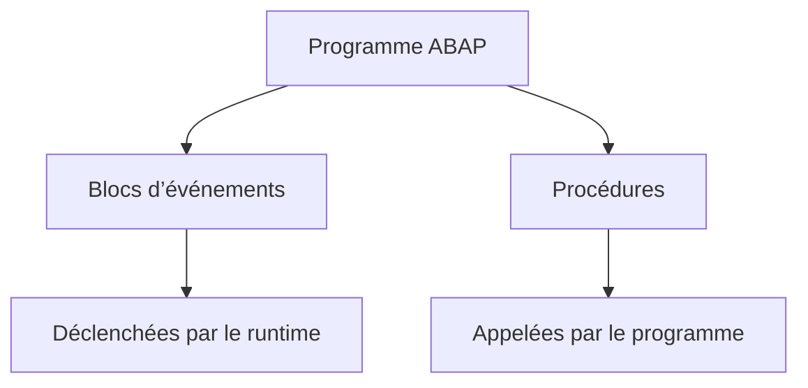

# 2. BLOCS DE TRAITEMENT ET PROCÉDURES

## 2.A RÉSULTAT ATTENDU

- Distinguer bloc d’événement et procédure
- Comprendre qui déclenche chaque bloc de traitement
- Identifier les limites d’un bloc de traitement
- Situer les sous-programmes dans un programme exécutable[^terme-programme-executable]
- Éviter de confondre séquence source et séquence d’exécution

## 2.B BLOC DE TRAITEMENT

Un programme ABAP[^terme-abap] est composé de blocs de traitement. Chaque bloc possède un point d’entrée et une fin déterminée par sa syntaxe.

Les deux catégories principales utiles ici sont :

- les blocs d’événements, déclenchés par l’environnement[^terme-environnement] d’exécution ABAP ;
- les procédures, appelées explicitement par une instruction ABAP[^terme-instruction-abap].



## 2.C BLOC D’ÉVÉNEMENT

Exemple :

```abap
START-OF-SELECTION.
  WRITE / 'Traitement principal'.
```

Le programme ne contient pas d’instruction qui appelle directement `START-OF-SELECTION`. Le runtime déclenche cet événement selon le type de programme et son cycle d’exécution.

## 2.D PROCÉDURE

Exemple :

```abap
START-OF-SELECTION.
  PERFORM display_title.

FORM display_title.
  WRITE / 'Traitement principal'.
ENDFORM.
```

Le sous-programme n’est exécuté que lorsque `PERFORM display_title` est atteint.

## 2.E ORDRE SOURCE ET ORDRE D’EXÉCUTION

La position d’un `FORM` dans le fichier source ne signifie pas qu’il est exécuté à cet endroit.

```abap
REPORT z_demo_blocks.

START-OF-SELECTION.
  PERFORM second_step.
  PERFORM first_step.

FORM first_step.
  WRITE / 'Étape 1'.
ENDFORM.

FORM second_step.
  WRITE / 'Étape 2'.
ENDFORM.
```

Résultat :

```text
Étape 2
Étape 1
```

## 2.F VARIABLES LOCALES ET GLOBALES

Les données déclarées hors d’une procédure sont globales au programme concerné.

Les données déclarées dans un `FORM` sont locales à cet appel du sous-programme.

```abap
DATA gv_counter TYPE i.

FORM increment_counter.
  DATA lv_previous TYPE i.

  lv_previous = gv_counter.
  gv_counter = gv_counter + 1.
ENDFORM.
```

`gv_counter` est accessible depuis le sous-programme. `lv_previous` ne l’est pas en dehors du `FORM`.

## 2.G TABLEAU DE SYNTHÈSE

| Élément          | Déclenchement            | Interface explicite | Exemple               |
| ---------------- | ------------------------ | ------------------- | --------------------- |
| Bloc d’événement | Runtime ABAP             | Non                 | `START-OF-SELECTION`  |
| Sous-programme   | Instruction du programme | Oui                 | `PERFORM` vers `FORM` |
| Module fonction[^terme-module-fonction]  | `CALL FUNCTION`          | Oui                 | Dossier dédié         |
| Méthode[^terme-methode]          | Appel de méthode         | Oui                 | Dossier ABAP Objects[^terme-abap-objects]  |

## 2.H POINTS À RETENIR

- Un bloc d’événement est déclenché par le runtime.
- Une procédure est appelée explicitement.
- L’ordre du fichier source ne détermine pas à lui seul l’ordre d’exécution.
- Les variables locales limitent les dépendances et les effets de bord.
- Les sous-programmes sont des procédures classiques, principalement rencontrées dans du code ABAP historique ou procédural.

## 2.I VÉRIFICATION

- Le contrôle syntaxique réussit.
- La version active correspond au code sauvegardé.
- L’exécution produit le résultat décrit dans le chapitre.
- Les cas vide, limite et erreur sont testés séparément lorsque la syntaxe le permet.

## 2.J ERREURS FRÉQUENTES

- Copier un exemple sans adapter les types, noms d’objets et données disponibles dans le système.
- Tester uniquement le cas nominal et ignorer les valeurs initiales, absentes ou invalides.
- Créer des sous-programmes avec trop de paramètres globaux.
- Utiliser des appels externes ou dynamiques sans contrôle du nom et de l’existence.

## 2.K SNIPPET À RÉUTILISER

> [!NOTE]
> Adapter les noms `Z*`, les types DDIC[^terme-acro-ddic], les données et les autorisations au système cible. Effectuer un contrôle syntaxique avant activation.

```abap
REPORT z_demo_blocks.

START-OF-SELECTION.
  PERFORM second_step.
  PERFORM first_step.

FORM first_step.
  WRITE / 'Étape 1'.
ENDFORM.

FORM second_step.
  WRITE / 'Étape 2'.
ENDFORM.
```

## 2.L TERMES DU LEXIQUE

- [Programme exécutable](<../🧩 00 ├── LEXIQUE SAP ET ABAP/06 ├── PROGRAMMES CLASSES ET OBJETS TECHNIQUES.md#programme-executable>)
- [Module fonction](<../🧩 00 ├── LEXIQUE SAP ET ABAP/06 ├── PROGRAMMES CLASSES ET OBJETS TECHNIQUES.md#module-fonction>)
- [ABAP](<../🧩 00 ├── LEXIQUE SAP ET ABAP/10 └── ACRONYMES SAP.md#acro-abap>)

## 2.M RÉFÉRENCES OFFICIELLES SAP

- [Source Code Modularization — ABAP Keyword Documentation](https://help.sap.com/doc/abapdocu_latest_index_htm/latest/en-US/ABENSOURCE_CODE_MODULAR_GUIDL.html)
- [FORM — ABAP Keyword Documentation](https://help.sap.com/doc/abapdocu_latest_index_htm/latest/en-US/ABAPFORM.html)
- [PERFORM — ABAP Keyword Documentation](https://help.sap.com/doc/abapdocu_latest_index_htm/latest/en-US/ABAPPERFORM.html)


---

[Chapitre suivant — SOUS-PROGRAMMES AVEC FORM ET ENDFORM](<./03 ├── SOUS PROGRAMMES AVEC FORM ET ENDFORM.md>)

[^terme-programme-executable]: **PROGRAMME EXÉCUTABLE.** Programme ABAP de type report pouvant être lancé directement, généralement avec `F8` ou par une transaction. Voir [l’entrée du lexique](<../🧩 00 ├── LEXIQUE SAP ET ABAP/06 ├── PROGRAMMES CLASSES ET OBJETS TECHNIQUES.md#programme-executable>).
[^terme-abap]: **ABAP.** Langage de programmation de la plateforme ABAP, conçu pour développer des applications métier et techniques SAP. Voir [l’entrée du lexique](<../🧩 00 ├── LEXIQUE SAP ET ABAP/04 ├── LANGAGE ET DEVELOPPEMENT ABAP.md#abap>).
[^terme-environnement]: **ENVIRONNEMENT.** Rôle fonctionnel attribué à un système dans le cycle de vie : développement, test, recette, préproduction ou production. Voir [l’entrée du lexique](<../🧩 00 ├── LEXIQUE SAP ET ABAP/01 ├── SYSTEMES ENVIRONNEMENTS ET MANDANTS.md#environnement>).
[^terme-instruction-abap]: **INSTRUCTION ABAP.** Unité syntaxique terminée par un point. Voir [l’entrée du lexique](<../🧩 00 ├── LEXIQUE SAP ET ABAP/04 ├── LANGAGE ET DEVELOPPEMENT ABAP.md#instruction-abap>).
[^terme-module-fonction]: **MODULE FONCTION.** Procédure globale appelée avec `CALL FUNCTION` et définie dans un groupe de fonctions. Voir [l’entrée du lexique](<../🧩 00 ├── LEXIQUE SAP ET ABAP/06 ├── PROGRAMMES CLASSES ET OBJETS TECHNIQUES.md#module-fonction>).
[^terme-methode]: **MÉTHODE.** Comportement déclaré dans une classe ou une interface et appelé avec une liste de paramètres définie. Voir [l’entrée du lexique](<../🧩 00 ├── LEXIQUE SAP ET ABAP/04 ├── LANGAGE ET DEVELOPPEMENT ABAP.md#methode>).
[^terme-abap-objects]: **ABAP OBJECTS.** Extension orientée objet du langage ABAP fournissant classes, interfaces, héritage, événements et exceptions de classe. Voir [l’entrée du lexique](<../🧩 00 ├── LEXIQUE SAP ET ABAP/04 ├── LANGAGE ET DEVELOPPEMENT ABAP.md#abap-objects>).
[^terme-acro-ddic]: **DDIC.** Data Dictionary, abréviation courante de l’ABAP Dictionary. Voir [l’entrée du lexique](<../🧩 00 ├── LEXIQUE SAP ET ABAP/10 └── ACRONYMES SAP.md#acro-ddic>).
