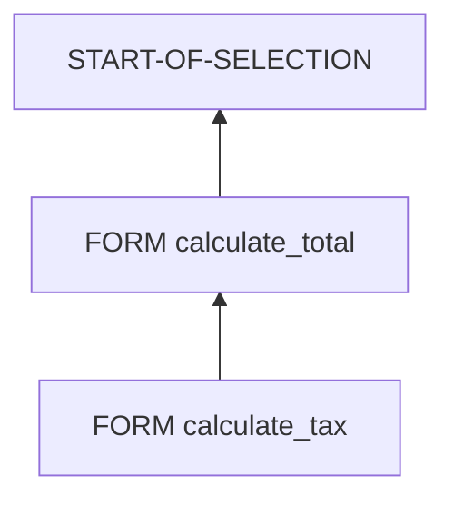

# 11. DEBUG ET ANALYSE DES APPELS

## 11.A RÉSULTAT ATTENDU

- Poser un point d’arrêt dans un sous-programme
- Entrer dans un appel `PERFORM`
- Lire la pile d’appels
- Comparer paramètres formels et réels
- Diagnostiquer un effet de bord

## 11.B POINT D’ARRÊT DANS UN FORM

Placer un point d’arrêt sur une instruction du sous-programme :

```abap
FORM calculate_total
  USING    iv_quantity TYPE i
           iv_price    TYPE ty_amount
  CHANGING cv_total    TYPE ty_amount.

  BREAK-POINT.
  cv_total = iv_quantity * iv_price.
ENDFORM.
```

`BREAK-POINT` ne doit pas rester dans le code productif. Utiliser de préférence un point d’arrêt de session ou externe depuis l’éditeur ou le débogueur.

## 11.C PROCESS

### 11.C.1 ÉTAPE 1 — PLACER UN POINT D’ARRÊT NON PERSISTANT

Poser un point d’arrêt de session sur la première instruction du `FORM` ou sur le `PERFORM` appelant. Ne pas ajouter durablement `BREAK-POINT` au code destiné à être transporté.

### 11.C.2 ÉTAPE 2 — REPRODUIRE LE SCÉNARIO EXACT

Exécuter le programme avec les mêmes paramètres et données que le défaut. Lorsque le débogueur s’arrête, relever le nom du programme, le sous-programme appelé et les valeurs des paramètres réels.

### 11.C.3 ÉTAPE 3 — ENTRER DANS LE PERFORM

Utiliser **Entrer dans** pour exécuter la première instruction du sous-programme. **Exécuter** traite l’appel comme une seule étape et s’arrête après son retour ; **Retour** poursuit jusqu’à la sortie du bloc courant selon le débogueur utilisé.

### 11.C.4 ÉTAPE 4 — COMPARER PARAMÈTRES RÉELS ET FORMELS

À l’entrée, comparer l’ordre, le type et la valeur des paramètres `USING` et `CHANGING`. Après chaque instruction sensible, vérifier si un passage par référence modifie immédiatement la donnée de l’appelant ou si `VALUE(...)` utilise une copie locale.

### 11.C.5 ÉTAPE 5 — LOCALISER LES EFFETS DE BORD

Si une globale change sans apparaître dans l’interface, poser un watchpoint[^terme-watchpoint] sur cette donnée puis relancer. À l’arrêt, lire la pile d’appels et identifier l’instruction exacte qui effectue la modification.

### 11.C.6 ÉTAPE 6 — CONTRÔLER LES APPELS DYNAMIQUES

Pour `PERFORM (lv_form_name)`, relever le nom construit, le programme cible et les paramètres. Vérifier que la valeur provient d’une liste maîtrisée et correspond à une routine réellement prévue par le programme.

### 11.C.7 ÉTAPE 7 — VALIDER LA CORRECTION

Corriger l’ordre des paramètres, la portée des données ou la dépendance globale identifiée. Rejouer le scénario nominal et un cas limite, puis supprimer les breakpoints et watchpoints créés pour l’analyse.

## 11.D PILE D’APPELS

La pile montre l’enchaînement des blocs actifs.



Elle permet de répondre à deux questions :

- quel bloc a appelé le sous-programme courant ;
- par quels appels successifs l’exécution est arrivée ici.

## 11.E PARAMÈTRES FORMELS ET RÉELS

Dans le débogueur, comparer :

- la valeur du paramètre réel avant l’appel ;
- la valeur du paramètre formel à l’entrée ;
- les modifications pendant la procédure ;
- la valeur du paramètre réel après le retour.

Pour un passage par référence, le paramètre formel désigne la donnée réelle. Une modification peut donc être immédiatement visible.

Pour `VALUE(...)`, une copie locale est visible dans la procédure.

## 11.F DIAGNOSTIQUER UNE MODIFICATION INATTENDUE

Scénario : une globale change alors qu’elle ne figure pas dans l’appel.

Méthode[^terme-methode] :

1. poser un watchpoint sur la variable globale ;
2. relancer le scénario ;
3. consulter la pile lorsque le watchpoint se déclenche ;
4. identifier le sous-programme responsable ;
5. vérifier si cette dépendance doit devenir un paramètre explicite.

## 11.G APPELS DYNAMIQUES

Pour un `PERFORM (lv_form_name)`, contrôler avant l’appel :

- le contenu exact du nom ;
- les espaces ou conversions ;
- le programme cible éventuel ;
- le nombre et le type des paramètres ;
- le chemin qui a construit cette valeur.

## 11.H ANALYSE STATIQUE

Selon les outils installés sur le système SAP[^terme-systeme-sap] GUI[^terme-acro-gui] :

- recherche d’utilisations dans `SE80`[^outil-se80] ;
- liste des sous-programmes du programme ;
- Code Inspector `SCI`[^outil-sci] ;
- ABAP[^terme-abap] Test Cockpit lorsqu’il est disponible ;
- analyse de temps `SAT`[^outil-sat] si le problème concerne les performances.

Ces outils seront approfondis dans le dossier consacré au débogage et à l’analyse.

## 11.I CHECKLIST

- [ ] La cible du `PERFORM` est-elle celle attendue ?
- [ ] L’ordre des paramètres réels correspond-il à la définition ?
- [ ] Une donnée `USING` est-elle modifiée ?
- [ ] Une globale change-t-elle sans apparaître dans l’interface ?
- [ ] Une copie `VALUE(...)` explique-t-elle une valeur non retransmise ?
- [ ] Un appel dynamique dépend-il d’un nom incorrect ?
- [ ] La pile d’appels confirme-t-elle le chemin supposé ?

## 11.J POINTS À RETENIR

- Entrer dans le `PERFORM` permet d’observer l’interface réelle.
- La pile d’appels montre le chemin d’exécution.
- Les watchpoints sont efficaces pour localiser un effet de bord.
- Le passage par référence et `VALUE(...)` produisent des comportements distincts dans le débogueur.
- Les appels dynamiques exigent une vérification des noms au runtime.

## 11.K VÉRIFICATION

- Le contrôle syntaxique réussit.
- La version active correspond au code sauvegardé.
- L’exécution produit le résultat décrit dans le chapitre.
- Les cas vide, limite et erreur sont testés séparément lorsque la syntaxe le permet.

## 11.L ERREURS FRÉQUENTES

- Copier un exemple sans adapter les types, noms d’objets et données disponibles dans le système.
- Tester uniquement le cas nominal et ignorer les valeurs initiales, absentes ou invalides.
- Créer des sous-programmes avec trop de paramètres globaux.
- Utiliser des appels externes ou dynamiques sans contrôle du nom et de l’existence.

## 11.M SNIPPET À RÉUTILISER

> [!NOTE]
> Adapter les noms `Z*`, les types DDIC[^terme-acro-ddic], les données et les autorisations au système cible. Effectuer un contrôle syntaxique avant activation.

```abap
FORM calculate_total
  USING    iv_quantity TYPE i
           iv_price    TYPE ty_amount
  CHANGING cv_total    TYPE ty_amount.

  BREAK-POINT.
  cv_total = iv_quantity * iv_price.
ENDFORM.
```

## 11.N TERMES DU LEXIQUE

- [Programme exécutable](<../🧩 00 ├── LEXIQUE SAP ET ABAP/06 ├── PROGRAMMES CLASSES ET OBJETS TECHNIQUES.md#programme-executable>)
- [Module fonction](<../🧩 00 ├── LEXIQUE SAP ET ABAP/06 ├── PROGRAMMES CLASSES ET OBJETS TECHNIQUES.md#module-fonction>)
- [ABAP](<../🧩 00 ├── LEXIQUE SAP ET ABAP/10 └── ACRONYMES SAP.md#acro-abap>)

## 11.O RÉFÉRENCES OFFICIELLES SAP

- [PERFORM — ABAP Keyword Documentation](https://help.sap.com/doc/abapdocu_latest_index_htm/latest/en-US/ABAPPERFORM.html)
- [Source Code Organization — ABAP Keyword Documentation](https://help.sap.com/doc/abapdocu_latest_index_htm/latest/en-US/ABENSOURCE_CODE_ORGA_GDL.html)
- [Utilities for Technical Information About a Program — SAP Help Portal](https://help.sap.com/docs/ABAP_PLATFORM_NEW/bd833c8355f34e96a6e83096b38bf192/d1801b0a454211d189710000e8322d00.html)


---

[Chapitre suivant — BONNES PRATIQUES ET REFACTORISATION](<./12 └── BONNES PRATIQUES ET REFACTORISATION.md>)

[^terme-watchpoint]: **WATCHPOINT.** Arrêt conditionné par la modification ou la valeur d’une donnée observée. Voir [l’entrée du lexique](<../🧩 00 ├── LEXIQUE SAP ET ABAP/08 ├── EXECUTION EXPLOITATION ET ADMINISTRATION.md#watchpoint>).
[^terme-methode]: **MÉTHODE.** Comportement déclaré dans une classe ou une interface et appelé avec une liste de paramètres définie. Voir [l’entrée du lexique](<../🧩 00 ├── LEXIQUE SAP ET ABAP/04 ├── LANGAGE ET DEVELOPPEMENT ABAP.md#methode>).
[^terme-systeme-sap]: **SYSTÈME SAP.** Ensemble technique cohérent comprenant au minimum une base de données et un ou plusieurs serveurs d’applications. Il est généralement identifié par un SID de trois caractères. Voir [l’entrée du lexique](<../🧩 00 ├── LEXIQUE SAP ET ABAP/01 ├── SYSTEMES ENVIRONNEMENTS ET MANDANTS.md#systeme-sap>).
[^terme-acro-gui]: **GUI.** Graphical User Interface. Voir [l’entrée du lexique](<../🧩 00 ├── LEXIQUE SAP ET ABAP/10 └── ACRONYMES SAP.md#acro-gui>).
[^terme-abap]: **ABAP.** Langage de programmation de la plateforme ABAP, conçu pour développer des applications métier et techniques SAP. Voir [l’entrée du lexique](<../🧩 00 ├── LEXIQUE SAP ET ABAP/04 ├── LANGAGE ET DEVELOPPEMENT ABAP.md#abap>).
[^terme-acro-ddic]: **DDIC.** Data Dictionary, abréviation courante de l’ABAP Dictionary. Voir [l’entrée du lexique](<../🧩 00 ├── LEXIQUE SAP ET ABAP/10 └── ACRONYMES SAP.md#acro-ddic>).

[^outil-se80]: **SE80.** Object Navigator utilisé pour parcourir et maintenir les objets du Repository ABAP. Voir [le chapitre associé](<../🧩 01 ├── FONDAMENTAUX ABAP/04 ├── EDITEURS ABAP SE38 ET SE80.md>).
[^outil-sci]: **SCI.** Code Inspector utilisé pour exécuter des contrôles statiques sur un ensemble d’objets ABAP. Voir [le chapitre associé](<../🧩 20 ├── PERFORMANCE QUALITE ET TESTS/13 ├── CODE INSPECTOR AVEC SCI.md>).
[^outil-sat]: **SAT.** Runtime Analysis utilisée pour mesurer et analyser le temps d’exécution ABAP. Voir [le chapitre associé](<../🧩 20 ├── PERFORMANCE QUALITE ET TESTS/07 ├── MESURER LE TEMPS D EXECUTION AVEC SAT.md>).
