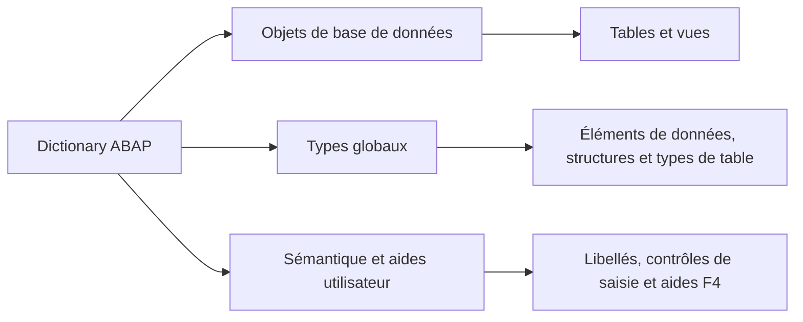

# 1. PRINCIPES DU DICTIONNAIRE ABAP

## 1.A RÉSULTAT ATTENDU

- Comprendre le rôle du Dictionary ABAP[^terme-abap]
- Identifier les principales catégories d’objets DDIC[^terme-acro-ddic]
- Distinguer définition technique, type global et information sémantique
- Comprendre les dépendances entre les objets
- Délimiter le périmètre du Dictionary classique dans SAP GUI[^terme-sap-gui]

## 1.B RÔLE DU DICTIONNAIRE ABAP

Le Dictionary ABAP, souvent abrégé **DDIC**, centralise les métadonnées utilisées par le système ABAP.

Il remplit principalement trois fonctions :

1. définir des objets persistants représentés dans la base de données ;
2. fournir des types globaux utilisables dans les programmes ABAP ;
3. porter des informations sémantiques utilisées par les technologies classiques SAP GUI.



## 1.C PRINCIPAUX OBJETS

| Objet                 | Fonction principale                                            | Objet physique en base |
| --------------------- | -------------------------------------------------------------- | ---------------------: |
| Domaine               | Définir les caractéristiques techniques et la plage de valeurs |                    Non |
| Élément de données[^terme-element-donnees]    | Donner un type global et une signification métier              |                    Non |
| Structure             | Regrouper plusieurs composants                                 |                    Non |
| Type de table         | Définir un type global de table interne[^terme-table-interne]                        |                    Non |
| Table transparente[^terme-table-transparente]    | Définir une table persistante                                  |                    Oui |
| Vue classique         | Présenter une projection ou une combinaison de données         |          Selon le type |
| Aide à la recherche   | Définir une aide à la saisie F4[^terme-aide-f4]                                |                    Non |
| Objet de verrouillage | Définir un verrou logique SAP                                  |                    Non |

## 1.D DÉPENDANCES ENTRE OBJETS

Les objets DDIC sont généralement construits par couches.


Une modification d’un domaine peut donc rendre inactifs plusieurs éléments de données, structures, tables et programmes dépendants.

## 1.E OBJETS GLOBAUX ET TYPES LOCAUX

Un type déclaré avec `TYPES` dans un programme est local à ce programme ou à son contexte de déclaration.

Un élément de données, une structure ou un type de table créé dans SE11[^outil-se11] est global au système ABAP et réutilisable par plusieurs objets de développement.

```abap
DATA lv_vbeln TYPE vbeln_va.
DATA ls_bapiret TYPE bapiret2.
```

Dans cet exemple, `VBELN_VA` est un élément de données et `BAPIRET2` une structure du Dictionary.

## 1.F PÉRIMÈTRE DU DOSSIER

Ce dossier traite des objets classiques accessibles depuis SAP GUI, principalement avec les transactions `SE11`, `SE14`[^outil-se14], `SE54`[^outil-se54] et `SM30`[^outil-sm30].

Les définitions CDS[^terme-acro-cds] et leur édition dans ADT[^terme-acro-adt] ne sont pas détaillées ici. Elles feront partie d’un dossier distinct consacré aux développements sous Eclipse.

## 1.G POINTS À RETENIR

- Le Dictionary est le référentiel central des métadonnées ABAP.
- Les domaines ne sont pas des types ABAP directement utilisables.
- Les éléments de données, structures et types de table sont des types globaux.
- Les tables transparentes définissent également des objets persistants en base.
- Les dépendances doivent être analysées avant toute modification.

## 1.H PROCESS

### 1.H.1 Étape 1 — Identifier le besoin sémantique

Décrire la donnée à modéliser, son format, ses valeurs autorisées, son libellé et les objets qui la réutiliseront. Ne commencer aucune création tant qu’il est impossible de distinguer domaine, élément de données, structure, type de table et table persistante.

### 1.H.2 Étape 2 — Rechercher une définition existante

1. Ouvrir `/nSE11`.
2. Rechercher par nom connu, puis utiliser les aides de recherche et les objets applicatifs proches.
3. Afficher les domaines et éléments de données déjà utilisés par des champs comparables.
4. Consulter leur liste d’utilisation.

Réutiliser un objet uniquement si sa sémantique et ses règles de valeur correspondent exactement au besoin, pas seulement sa longueur technique.

### 1.H.3 Étape 3 — Choisir l’objet DDIC à créer

- créer un domaine pour mutualiser format et valeurs autorisées ;
- créer un élément de données pour porter la signification et les libellés ;
- créer une structure pour regrouper des champs sans persistance ;
- créer un type de table pour une interface partagée ;
- créer une table transparente uniquement lorsqu’une persistance propre est nécessaire.

### 1.H.4 Étape 4 — Construire puis activer du bas vers le haut

Créer et activer d’abord les dépendances : domaine, élément de données, structure, puis objet consommateur. Après chaque activation, lire tous les messages avant de poursuivre.

### 1.H.5 Étape 5 — Vérifier l’utilisation réelle

Déclarer un petit objet ABAP consommateur ou examiner l’objet applicatif cible. Contrôler type, aide F1[^terme-aide-f1]/F4, libellés et valeurs autorisées. La modélisation est validée lorsque l’objet DDIC apporte la même sémantique partout où il est réutilisé.

## 1.I VÉRIFICATION

- Le contrôle de cohérence ne retourne aucune erreur bloquante.
- L’objet est actif et son entrée de répertoire pointe vers le package[^terme-package] attendu.
- La liste d’utilisation et les dépendances correspondent au périmètre prévu.
- Pour une table Z, la structure active et la structure de base sont cohérentes.

## 1.J ERREURS FRÉQUENTES

- Copier un exemple sans adapter les types, noms d’objets et données disponibles dans le système.
- Tester uniquement le cas nominal et ignorer les valeurs initiales, absentes ou invalides.
- Modifier un objet standard au lieu d’utiliser une extension.
- Activer une table sans vérifier clé, paramètres techniques et impact base.

## 1.K SNIPPET À RÉUTILISER

> [!NOTE]
> Adapter les noms `Z*`, les types DDIC, les données et les autorisations au système cible. Effectuer un contrôle syntaxique avant activation.

```abap
DATA lv_vbeln TYPE vbeln_va.
DATA ls_bapiret TYPE bapiret2.
```

## 1.L TERMES DU LEXIQUE

- [ABAP](<../🧩 00 ├── LEXIQUE SAP ET ABAP/10 └── ACRONYMES SAP.md#acro-abap>)
- [ABAP Dictionary](<../🧩 00 ├── LEXIQUE SAP ET ABAP/05 ├── DONNEES DICTIONNAIRE ET BASE DE DONNEES.md#abap-dictionary>)
- [Domaine](<../🧩 00 ├── LEXIQUE SAP ET ABAP/05 ├── DONNEES DICTIONNAIRE ET BASE DE DONNEES.md#domaine>)
- [Élément de données](<../🧩 00 ├── LEXIQUE SAP ET ABAP/05 ├── DONNEES DICTIONNAIRE ET BASE DE DONNEES.md#element-donnees>)
- [Table transparente](<../🧩 00 ├── LEXIQUE SAP ET ABAP/05 ├── DONNEES DICTIONNAIRE ET BASE DE DONNEES.md#table-transparente>)
- [MANDT](<../🧩 00 ├── LEXIQUE SAP ET ABAP/05 ├── DONNEES DICTIONNAIRE ET BASE DE DONNEES.md#mandt>)

## 1.M RÉFÉRENCES OFFICIELLES SAP

- [Exploring ABAP Dictionary — SAP Learning](https://learning.sap.com/courses/building-data-models-with-the-abap-dictionary-and-abap-core-data-services/exploring-abap-dictionary_af8fdedf-0a10-43ab-aa1b-20abbece9d8b)
- [ABAP Dictionary — SAP Help Portal](https://help.sap.com/docs/SAP_NETWEAVER_740/ec1c9c8191b74de98feb94001a95dd76/cf21ea0b446011d189700000e8322d00.html)
- [Repository Information System — SAP Help Portal](https://help.sap.com/docs/SAP_NETWEAVER_740/bd833c8355f34e96a6e83096b38bf192/d180198c454211d189710000e8322d00.html)

---

[Chapitre suivant — NAVIGATION ET ANALYSE AVEC SE11](<./02 ├── NAVIGATION ET ANALYSE AVEC SE11.md>)

[^terme-abap]: **ABAP.** Langage de programmation de la plateforme ABAP, conçu pour développer des applications métier et techniques SAP. Voir [l’entrée du lexique](<../🧩 00 ├── LEXIQUE SAP ET ABAP/04 ├── LANGAGE ET DEVELOPPEMENT ABAP.md#abap>).
[^terme-acro-ddic]: **DDIC.** Data Dictionary, abréviation courante de l’ABAP Dictionary. Voir [l’entrée du lexique](<../🧩 00 ├── LEXIQUE SAP ET ABAP/10 └── ACRONYMES SAP.md#acro-ddic>).
[^terme-sap-gui]: **SAP GUI.** Client graphique permettant d’utiliser les transactions et écrans d’un système SAP. Voir [l’entrée du lexique](<../🧩 00 ├── LEXIQUE SAP ET ABAP/02 ├── SAP GUI NAVIGATION ET TRANSACTIONS.md#sap-gui>).
[^terme-element-donnees]: **ÉLÉMENT DE DONNÉES.** Objet DDIC qui attribue une signification métier, des libellés et une documentation à un type élémentaire ou à un domaine. Voir [l’entrée du lexique](<../🧩 00 ├── LEXIQUE SAP ET ABAP/05 ├── DONNEES DICTIONNAIRE ET BASE DE DONNEES.md#element-donnees>).
[^terme-table-interne]: **TABLE INTERNE.** Collection dynamique de lignes stockée en mémoire dans le programme ABAP. Voir [l’entrée du lexique](<../🧩 00 ├── LEXIQUE SAP ET ABAP/04 ├── LANGAGE ET DEVELOPPEMENT ABAP.md#table-interne>).
[^terme-table-transparente]: **TABLE TRANSPARENTE.** Table DDIC correspondant directement à une table physique de la base de données. Voir [l’entrée du lexique](<../🧩 00 ├── LEXIQUE SAP ET ABAP/05 ├── DONNEES DICTIONNAIRE ET BASE DE DONNEES.md#table-transparente>).
[^terme-aide-f4]: **AIDE F4.** Aide à la saisie proposant des valeurs autorisées ou recherchables. Voir [l’entrée du lexique](<../🧩 00 ├── LEXIQUE SAP ET ABAP/02 ├── SAP GUI NAVIGATION ET TRANSACTIONS.md#aide-f4>).
[^terme-acro-cds]: **CDS.** Core Data Services, langage de modélisation de vues et entités de données. Voir [l’entrée du lexique](<../🧩 00 ├── LEXIQUE SAP ET ABAP/10 └── ACRONYMES SAP.md#acro-cds>).
[^terme-acro-adt]: **ADT.** ABAP Development Tools, environnement de développement ABAP intégré à Eclipse. Voir [l’entrée du lexique](<../🧩 00 ├── LEXIQUE SAP ET ABAP/10 └── ACRONYMES SAP.md#acro-adt>).
[^terme-aide-f1]: **AIDE F1.** Aide contextuelle expliquant un champ, une fonction ou un mot-clé. Voir [l’entrée du lexique](<../🧩 00 ├── LEXIQUE SAP ET ABAP/02 ├── SAP GUI NAVIGATION ET TRANSACTIONS.md#aide-f1>).
[^terme-package]: **PACKAGE.** Conteneur logique qui regroupe les objets de développement et détermine notamment leur transportabilité. Voir [l’entrée du lexique](<../🧩 00 ├── LEXIQUE SAP ET ABAP/03 ├── REPOSITORY PACKAGES ET TRANSPORTS.md#package>).

[^outil-se11]: **SE11.** Transaction de l’ABAP Dictionary utilisée pour analyser et maintenir les objets DDIC. Voir [le chapitre associé](<02 ├── NAVIGATION ET ANALYSE AVEC SE11.md>).
[^outil-se14]: **SE14.** Utilitaire de base de données du Dictionary utilisé pour comparer ou ajuster la définition DDIC et l’objet physique. Voir [le chapitre associé](<16 ├── ACTIVATION AJUSTEMENT BASE ET ANALYSE DES DEPENDANCES.md>).
[^outil-se54]: **SE54.** Outil de génération et de maintenance des dialogues de mise à jour de tables et vues. Voir [le chapitre associé](<14 ├── GENERATEUR DE MAINTENANCE ET SM30.md>).
[^outil-sm30]: **SM30.** Transaction d’exécution d’un dialogue de maintenance généré pour une table ou une vue. Voir [le chapitre associé](<14 ├── GENERATEUR DE MAINTENANCE ET SM30.md>).
