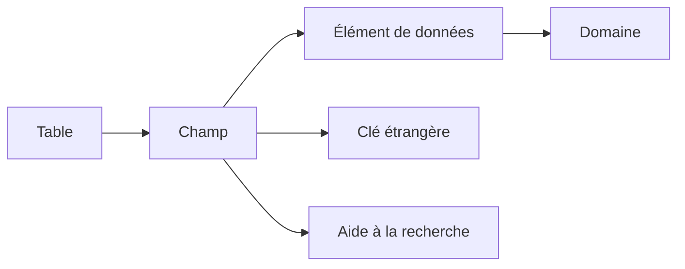

# 2. NAVIGATION ET ANALYSE AVEC SE11

## 2.A RÉSULTAT ATTENDU

- Naviguer dans la transaction SE11[^outil-se11]
- Afficher un objet sans le modifier
- Suivre les dépendances entre objets DDIC[^terme-acro-ddic]
- Identifier les transactions complémentaires
- Analyser un objet standard avant une intervention

## 2.B ÉCRAN INITIAL DE SE11

La transaction `SE11` permet de créer, afficher et modifier les principaux objets du Dictionary.

Selon la version du système, l’écran propose notamment :

- table de base de données ;
- vue ;
- type de données[^terme-type-donnees] ;
- domaine ;
- aide à la recherche ;
- objet de verrouillage.

Pour un type de données, le système demande ensuite s’il s’agit d’un élément de données[^terme-element-donnees], d’une structure ou d’un type de table.

## 2.C MODE AFFICHAGE AVANT MODE MODIFICATION

Lors d’une analyse, commencer par **Afficher**.

Le mode affichage permet de consulter :

- la définition active ;
- les attributs techniques ;
- la documentation ;
- les objets dépendants ;
- les versions disponibles ;
- l’entrée de répertoire et le package[^terme-package].

Ne jamais modifier directement un objet standard SAP[^terme-acro-sap] pour corriger rapidement un besoin client. Vérifier d’abord les mécanismes d’extension disponibles.

## 2.D NAVIGATION PAR DOUBLE-CLIC

Dans les écrans DDIC, un double-clic sur un objet référencé ouvre généralement sa définition.

Exemples :

- double-clic sur un élément de données depuis un champ de table ;
- double-clic sur le domaine depuis un élément de données ;
- double-clic sur une table de contrôle[^terme-table-controle] depuis une clé étrangère[^terme-cle-etrangere] ;
- double-clic sur une aide à la recherche affectée.



## 2.E OUTILS D’ANALYSE

| Fonction             | Usage                                                    |
| -------------------- | -------------------------------------------------------- |
| Liste d’utilisation  | Identifier les objets qui référencent l’objet courant    |
| Contrôle             | Vérifier la cohérence de la définition                   |
| Versions             | Comparer la version active avec des versions antérieures |
| Entrée de répertoire | Consulter le package et le responsable                   |
| Documentation        | Lire la documentation technique ou métier disponible     |
| Contenu              | Afficher les données d’une table ou d’une vue autorisée  |

La liste d’utilisation doit être consultée avant de modifier un objet fortement réutilisé.

## 2.F TRANSACTIONS COMPLÉMENTAIRES

| Transaction      | Usage principal                                           |
| ---------------- | --------------------------------------------------------- |
| `SE11`           | Définition des objets du Dictionary                       |
| `SE12`           | Affichage du Dictionary                                   |
| `SE14`[^outil-se14]           | Utilitaire de base de données et ajustements              |
| `SE16`[^outil-se16] / `SE16N`[^outil-se16n] | Consultation des données selon les autorisations          |
| `SE54`[^outil-se54]           | Génération et administration des dialogues de maintenance |
| `SM30`[^outil-sm30]           | Maintenance des données de tables ou vues générées        |
| `SE84`[^outil-se84]           | Recherche dans le Repository Information System           |

## 2.G MÉTHODE D’ANALYSE D’UN CHAMP

Pour comprendre un champ standard :

1. afficher la table ou la structure dans `SE11` ;
2. ouvrir l’élément de données ;
3. lire ses libellés et sa documentation ;
4. ouvrir le domaine ;
5. vérifier les valeurs fixes, la table de valeurs et la routine de conversion[^terme-routine-conversion] ;
6. revenir au champ et analyser sa clé étrangère ou son aide à la recherche ;
7. consulter la liste d’utilisation si une modification est envisagée.

## 2.H POINTS À RETENIR

- SE11 est l’outil central d’analyse des objets DDIC dans SAP GUI[^terme-sap-gui].
- Le mode affichage doit être privilégié pendant le diagnostic.
- La navigation suit les références entre table, élément de données et domaine.
- La liste d’utilisation permet d’évaluer l’impact d’une modification.
- SE14, SE54, SM30 et SE84 complètent SE11 pour des usages précis.

## 2.I PROCESS

### 2.I.1 Étape 1 — Ouvrir le bon type d’objet

1. Saisir `/nSE11`.
2. Sélectionner explicitement table, vue, type de données, domaine, aide à la recherche ou objet de verrouillage.
3. Saisir le nom technique et choisir **Afficher**.

Si le système propose une création, annuler et vérifier le type et le nom. Ne pas créer un homonyme dans une autre catégorie.

### 2.I.2 Étape 2 — Lire les dépendances descendantes

Pour une table ou structure, parcourir chaque composant et ouvrir son élément de données puis son domaine. Relever type, longueur, décimales, valeurs fixes, libellés et documentation.

Une incohérence entre la sémantique du champ et celle de l’élément de données doit être signalée avant toute réutilisation.

### 2.I.3 Étape 3 — Lire les attributs propres à l’objet

Contrôler les clés et paramètres techniques d’une table, les paramètres d’une aide de recherche, les tables d’un objet de verrouillage ou la catégorie d’un type de données. Noter les valeurs qui influencent l’exécution, pas seulement la structure visible.

### 2.I.4 Étape 4 — Examiner les consommateurs

Ouvrir la liste d’utilisation et séparer objets DDIC, programmes, classes et interfaces. Une liste statique vide ne garantit pas l’absence d’utilisation dynamique.

### 2.I.5 Étape 5 — Confirmer l’état actif

Vérifier le statut d’activation et le journal disponible. Pour une table, comparer si nécessaire la définition DDIC et l’objet physique avec les outils d’ajustement, sans lancer de conversion. L’analyse est terminée lorsque structure, dépendances, consommateurs et état actif sont identifiés.

## 2.J VÉRIFICATION

- Le contrôle de cohérence ne retourne aucune erreur bloquante.
- L’objet est actif et son entrée de répertoire pointe vers le package attendu.
- La liste d’utilisation et les dépendances correspondent au périmètre prévu.
- Pour une table Z, la structure active et la structure de base sont cohérentes.

## 2.K ERREURS FRÉQUENTES

- Modifier un objet standard au lieu d’utiliser une extension.
- Activer une table sans vérifier clé, paramètres techniques et impact base.

## 2.L FICHE DE CONTRÔLE À COPIER

```text
Système / SID       :
Mandant             :
Utilisateur         :
Transaction / outil :
Objet technique     :
Jeu de données      :
Résultat attendu    :
Résultat observé    :
Horodatage          :
Ordre de transport  :
```

## 2.M TERMES DU LEXIQUE

- [ABAP Dictionary](<../🧩 00 ├── LEXIQUE SAP ET ABAP/05 ├── DONNEES DICTIONNAIRE ET BASE DE DONNEES.md#abap-dictionary>)
- [Domaine](<../🧩 00 ├── LEXIQUE SAP ET ABAP/05 ├── DONNEES DICTIONNAIRE ET BASE DE DONNEES.md#domaine>)
- [Élément de données](<../🧩 00 ├── LEXIQUE SAP ET ABAP/05 ├── DONNEES DICTIONNAIRE ET BASE DE DONNEES.md#element-donnees>)
- [Table transparente](<../🧩 00 ├── LEXIQUE SAP ET ABAP/05 ├── DONNEES DICTIONNAIRE ET BASE DE DONNEES.md#table-transparente>)
- [MANDT](<../🧩 00 ├── LEXIQUE SAP ET ABAP/05 ├── DONNEES DICTIONNAIRE ET BASE DE DONNEES.md#mandt>)

## 2.N RÉFÉRENCES OFFICIELLES SAP

- [ABAP Dictionary — SAP Help Portal](https://help.sap.com/docs/SAP_NETWEAVER_740/ec1c9c8191b74de98feb94001a95dd76/cf21ea0b446011d189700000e8322d00.html)
- [Repository Information System — SAP Help Portal](https://help.sap.com/docs/SAP_NETWEAVER_740/bd833c8355f34e96a6e83096b38bf192/d180198c454211d189710000e8322d00.html)

---

[Chapitre suivant — DOMAINES ET PLAGES DE VALEURS](<./03 ├── DOMAINES ET PLAGES DE VALEURS.md>)

[^terme-acro-ddic]: **DDIC.** Data Dictionary, abréviation courante de l’ABAP Dictionary. Voir [l’entrée du lexique](<../🧩 00 ├── LEXIQUE SAP ET ABAP/10 └── ACRONYMES SAP.md#acro-ddic>).
[^terme-type-donnees]: **TYPE DE DONNÉES.** Définition des propriétés d’une valeur : nature, longueur, précision et opérations autorisées. Voir [l’entrée du lexique](<../🧩 00 ├── LEXIQUE SAP ET ABAP/04 ├── LANGAGE ET DEVELOPPEMENT ABAP.md#type-donnees>).
[^terme-element-donnees]: **ÉLÉMENT DE DONNÉES.** Objet DDIC qui attribue une signification métier, des libellés et une documentation à un type élémentaire ou à un domaine. Voir [l’entrée du lexique](<../🧩 00 ├── LEXIQUE SAP ET ABAP/05 ├── DONNEES DICTIONNAIRE ET BASE DE DONNEES.md#element-donnees>).
[^terme-package]: **PACKAGE.** Conteneur logique qui regroupe les objets de développement et détermine notamment leur transportabilité. Voir [l’entrée du lexique](<../🧩 00 ├── LEXIQUE SAP ET ABAP/03 ├── REPOSITORY PACKAGES ET TRANSPORTS.md#package>).
[^terme-acro-sap]: **SAP.** Nom de l’éditeur et de son écosystème logiciel ; l’acronyme historique provient de l’allemand. Voir [l’entrée du lexique](<../🧩 00 ├── LEXIQUE SAP ET ABAP/10 └── ACRONYMES SAP.md#acro-sap>).
[^terme-table-controle]: **TABLE DE CONTRÔLE.** Table contenant les valeurs de référence autorisées pour une relation de clé étrangère. Voir [l’entrée du lexique](<../🧩 00 ├── LEXIQUE SAP ET ABAP/05 ├── DONNEES DICTIONNAIRE ET BASE DE DONNEES.md#table-controle>).
[^terme-cle-etrangere]: **CLÉ ÉTRANGÈRE.** Relation DDIC entre des champs d’une table et une table de contrôle. Voir [l’entrée du lexique](<../🧩 00 ├── LEXIQUE SAP ET ABAP/05 ├── DONNEES DICTIONNAIRE ET BASE DE DONNEES.md#cle-etrangere>).
[^terme-routine-conversion]: **ROUTINE DE CONVERSION.** Mécanisme DDIC convertissant une valeur entre représentation interne et affichage externe. Voir [l’entrée du lexique](<../🧩 00 ├── LEXIQUE SAP ET ABAP/05 ├── DONNEES DICTIONNAIRE ET BASE DE DONNEES.md#routine-conversion>).
[^terme-sap-gui]: **SAP GUI.** Client graphique permettant d’utiliser les transactions et écrans d’un système SAP. Voir [l’entrée du lexique](<../🧩 00 ├── LEXIQUE SAP ET ABAP/02 ├── SAP GUI NAVIGATION ET TRANSACTIONS.md#sap-gui>).

[^outil-se11]: **SE11.** Transaction de l’ABAP Dictionary utilisée pour analyser et maintenir les objets DDIC. Voir [le chapitre associé](<02 ├── NAVIGATION ET ANALYSE AVEC SE11.md>).
[^outil-se14]: **SE14.** Utilitaire de base de données du Dictionary utilisé pour comparer ou ajuster la définition DDIC et l’objet physique. Voir [le chapitre associé](<16 ├── ACTIVATION AJUSTEMENT BASE ET ANALYSE DES DEPENDANCES.md>).
[^outil-se16]: **SE16.** Navigateur de données standard utilisé pour afficher le contenu d’une table selon les autorisations disponibles. Voir [le chapitre associé](<02 ├── NAVIGATION ET ANALYSE AVEC SE11.md>).
[^outil-se16n]: **SE16N.** Navigateur général de tables utilisé pour consulter des données selon les autorisations disponibles. Voir [le chapitre associé](<02 ├── NAVIGATION ET ANALYSE AVEC SE11.md>).
[^outil-se54]: **SE54.** Outil de génération et de maintenance des dialogues de mise à jour de tables et vues. Voir [le chapitre associé](<14 ├── GENERATEUR DE MAINTENANCE ET SM30.md>).
[^outil-sm30]: **SM30.** Transaction d’exécution d’un dialogue de maintenance généré pour une table ou une vue. Voir [le chapitre associé](<14 ├── GENERATEUR DE MAINTENANCE ET SM30.md>).
[^outil-se84]: **SE84.** Repository Information System utilisé pour rechercher des objets et analyser leurs utilisations. Voir [le chapitre associé](<../🧩 01 ├── FONDAMENTAUX ABAP/02 ├── OBJETS DU REPOSITORY ABAP.md>).
