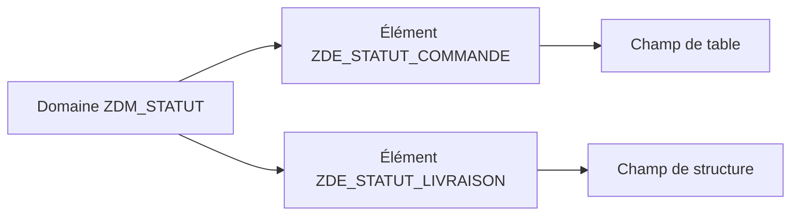
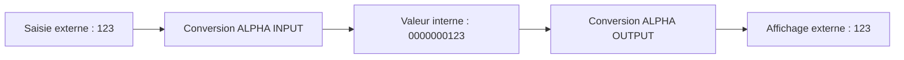

# 3. DOMAINES ET PLAGES DE VALEURS

## 3.A RÉSULTAT ATTENDU

- Comprendre le rôle d’un domaine
- Définir les caractéristiques techniques d’une valeur
- Configurer une plage de valeurs
- Distinguer valeurs fixes, table de valeurs et table de contrôle[^terme-table-controle]
- Identifier le rôle des routines de conversion

## 3.B DÉFINITION

Un domaine définit les caractéristiques techniques communes d’une valeur :

- type de données[^terme-type-donnees] ;
- longueur ;
- nombre de décimales ;
- signe éventuel ;
- gestion des minuscules ;
- longueur de sortie ;
- plage de valeurs ;
- routine de conversion[^terme-routine-conversion] éventuelle.

Un domaine n’est pas un type ABAP[^terme-abap] directement utilisable. Il est affecté à un ou plusieurs éléments de données.



## 3.C ATTRIBUTS TECHNIQUES

| Attribut[^terme-attribut]           | Exemple | Effet                                                             |
| ------------------ | ------- | ----------------------------------------------------------------- |
| Type               | `CHAR`  | Représentation technique                                          |
| Longueur           | `1`     | Nombre de positions                                               |
| Décimales          | `0`     | Précision pour les types numériques concernés                     |
| Signe              | Activé  | Autorise les valeurs négatives lorsque pertinent                  |
| Minuscules         | Activé  | Évite la conversion automatique en majuscules pour les caractères |
| Longueur de sortie | `10`    | Longueur d’affichage proposée                                     |

## 3.D VALEURS FIXES

Les valeurs fixes définissent une liste ou des intervalles autorisés au niveau du domaine.

Exemple :

| Valeur | Texte    |
| ------ | -------- |
| `N`    | Nouveau  |
| `E`    | En cours |
| `T`    | Terminé  |
| `A`    | Annulé   |

Les textes peuvent être traduits. Dans les technologies classiques, ils peuvent être utilisés par les aides à la saisie et certains contrôles d’écran.

## 3.E TABLE DE VALEURS

La table de valeurs indique la table généralement associée au domaine.

Elle sert notamment de proposition lorsque le développeur définit une clé étrangère[^terme-cle-etrangere] pour un champ utilisant ce domaine.

> Une table de valeurs ne crée pas à elle seule un contrôle d’intégrité. Le contrôle est défini par une clé étrangère sur le champ concerné.

## 3.F ROUTINES DE CONVERSION

Une routine de conversion transforme la représentation externe affichée à l’utilisateur et la représentation interne stockée ou traitée par ABAP.

Exemple classique : la routine `ALPHA` complète une valeur numérique représentée sous forme de caractères avec des zéros à gauche pour obtenir sa forme interne.



La routine doit correspondre au sens réel de la donnée. Elle ne doit pas être ajoutée uniquement pour modifier un affichage ponctuel.

## 3.G EXEMPLE DE CONCEPTION

Pour un statut de commande :

- domaine : `ZDM_ORDER_STATUS` ;
- type : `CHAR` ;
- longueur : `1` ;
- valeurs fixes : `N`, `E`, `T`, `A` ;
- un ou plusieurs éléments de données utilisent ce domaine selon leur sémantique métier.

## 3.H POINTS À RETENIR

- Le domaine centralise les propriétés techniques et la plage de valeurs.
- Plusieurs éléments de données peuvent utiliser le même domaine.
- Les valeurs fixes conviennent aux listes courtes et stables.
- La table de valeurs n’est pas une table de contrôle automatique.
- Une routine de conversion distingue format interne et format externe.

## 3.I PROCESS

### 3.I.1 Étape 1 — Définir le format commun

Établir le type ABAP/DDIC[^terme-acro-ddic], la longueur, les décimales, le signe et les éventuelles règles de casse. Vérifier qu’un domaine standard de même sémantique n’existe pas.

### 3.I.2 Étape 2 — Créer le domaine

1. Ouvrir `SE11`[^outil-se11], sélectionner **Domaine** et saisir un nom `Z...`.
2. Choisir **Créer**, renseigner le texte court et l’onglet de définition.
3. Saisir le type de données, la longueur et les décimales décidés.
4. Maintenir les propriétés de sortie uniquement selon la donnée réelle.

Le contrôle doit confirmer que le format peut représenter toutes les valeurs métier sans troncature.

### 3.I.3 Étape 3 — Définir les valeurs autorisées

Dans l’onglet des valeurs, choisir soit des valeurs fixes/intervalles, soit une table de valeurs adaptée. Ne dupliquer pas dans le domaine une liste déjà gouvernée par une table de contrôle.

Pour chaque valeur fixe, renseigner le libellé utilisateur. Une valeur techniquement possible mais non documentée ne doit pas être ajoutée par anticipation.

### 3.I.4 Étape 4 — Activer et tester

Contrôler puis activer le domaine. Créer ou ouvrir un élément de données[^terme-element-donnees] de test utilisant ce domaine et vérifier la saisie ainsi que l’aide disponible dans un champ consommateur.

### 3.I.5 Étape 5 — Gérer une modification

Avant de changer longueur ou valeurs d’un domaine existant, utiliser la liste d’utilisation et mesurer l’impact sur toutes les tables et interfaces. La modification est validée uniquement après activation des dépendances et test des valeurs existantes.

## 3.J VÉRIFICATION

- Le contrôle de cohérence ne retourne aucune erreur bloquante.
- L’objet est actif et son entrée de répertoire pointe vers le package[^terme-package] attendu.
- La liste d’utilisation et les dépendances correspondent au périmètre prévu.
- Pour une table Z, la structure active et la structure de base sont cohérentes.

## 3.K ERREURS FRÉQUENTES

- Modifier un objet standard au lieu d’utiliser une extension.
- Activer une table sans vérifier clé, paramètres techniques et impact base.

## 3.L FICHE DE CONTRÔLE À COPIER

```text
Système / SID       :
Mandant             :
Utilisateur         :
Transaction / outil :
Objet technique     :
Jeu de données      :
Résultat attendu    :
Résultat observé    :
Horodatage          :
Ordre de transport  :
```

## 3.M TERMES DU LEXIQUE

- [Domaine](<../🧩 00 ├── LEXIQUE SAP ET ABAP/05 ├── DONNEES DICTIONNAIRE ET BASE DE DONNEES.md#domaine>)
- [ABAP Dictionary](<../🧩 00 ├── LEXIQUE SAP ET ABAP/05 ├── DONNEES DICTIONNAIRE ET BASE DE DONNEES.md#abap-dictionary>)
- [Élément de données](<../🧩 00 ├── LEXIQUE SAP ET ABAP/05 ├── DONNEES DICTIONNAIRE ET BASE DE DONNEES.md#element-donnees>)
- [Table transparente](<../🧩 00 ├── LEXIQUE SAP ET ABAP/05 ├── DONNEES DICTIONNAIRE ET BASE DE DONNEES.md#table-transparente>)
- [MANDT](<../🧩 00 ├── LEXIQUE SAP ET ABAP/05 ├── DONNEES DICTIONNAIRE ET BASE DE DONNEES.md#mandt>)

## 3.N RÉFÉRENCES OFFICIELLES SAP

- [Domains — SAP Help Portal](https://help.sap.com/docs/SAP_NETWEAVER_740/ec1c9c8191b74de98feb94001a95dd76/cf21ede5446011d189700000e8322d00.html)
- [Defining Domains and Data Elements — SAP Learning](https://learning.sap.com/courses/building-data-models-with-the-abap-dictionary-and-abap-core-data-services/defining-domains-and-data-elements_b65b511a-4ad1-4437-80f5-5ad689cab833)

---

[Chapitre suivant — ÉLÉMENTS DE DONNÉES ET SÉMANTIQUE](<./04 ├── ELEMENTS DE DONNEES ET SEMANTIQUE.md>)

[^terme-table-controle]: **TABLE DE CONTRÔLE.** Table contenant les valeurs de référence autorisées pour une relation de clé étrangère. Voir [l’entrée du lexique](<../🧩 00 ├── LEXIQUE SAP ET ABAP/05 ├── DONNEES DICTIONNAIRE ET BASE DE DONNEES.md#table-controle>).
[^terme-type-donnees]: **TYPE DE DONNÉES.** Définition des propriétés d’une valeur : nature, longueur, précision et opérations autorisées. Voir [l’entrée du lexique](<../🧩 00 ├── LEXIQUE SAP ET ABAP/04 ├── LANGAGE ET DEVELOPPEMENT ABAP.md#type-donnees>).
[^terme-routine-conversion]: **ROUTINE DE CONVERSION.** Mécanisme DDIC convertissant une valeur entre représentation interne et affichage externe. Voir [l’entrée du lexique](<../🧩 00 ├── LEXIQUE SAP ET ABAP/05 ├── DONNEES DICTIONNAIRE ET BASE DE DONNEES.md#routine-conversion>).
[^terme-abap]: **ABAP.** Langage de programmation de la plateforme ABAP, conçu pour développer des applications métier et techniques SAP. Voir [l’entrée du lexique](<../🧩 00 ├── LEXIQUE SAP ET ABAP/04 ├── LANGAGE ET DEVELOPPEMENT ABAP.md#abap>).
[^terme-attribut]: **ATTRIBUT.** Composant de données déclaré dans une classe et appartenant soit à chaque instance, soit à la classe elle-même. Voir [l’entrée du lexique](<../🧩 00 ├── LEXIQUE SAP ET ABAP/04 ├── LANGAGE ET DEVELOPPEMENT ABAP.md#attribut>).
[^terme-cle-etrangere]: **CLÉ ÉTRANGÈRE.** Relation DDIC entre des champs d’une table et une table de contrôle. Voir [l’entrée du lexique](<../🧩 00 ├── LEXIQUE SAP ET ABAP/05 ├── DONNEES DICTIONNAIRE ET BASE DE DONNEES.md#cle-etrangere>).
[^terme-acro-ddic]: **DDIC.** Data Dictionary, abréviation courante de l’ABAP Dictionary. Voir [l’entrée du lexique](<../🧩 00 ├── LEXIQUE SAP ET ABAP/10 └── ACRONYMES SAP.md#acro-ddic>).
[^terme-element-donnees]: **ÉLÉMENT DE DONNÉES.** Objet DDIC qui attribue une signification métier, des libellés et une documentation à un type élémentaire ou à un domaine. Voir [l’entrée du lexique](<../🧩 00 ├── LEXIQUE SAP ET ABAP/05 ├── DONNEES DICTIONNAIRE ET BASE DE DONNEES.md#element-donnees>).
[^terme-package]: **PACKAGE.** Conteneur logique qui regroupe les objets de développement et détermine notamment leur transportabilité. Voir [l’entrée du lexique](<../🧩 00 ├── LEXIQUE SAP ET ABAP/03 ├── REPOSITORY PACKAGES ET TRANSPORTS.md#package>).

[^outil-se11]: **SE11.** Transaction de l’ABAP Dictionary utilisée pour analyser et maintenir les objets DDIC. Voir [le chapitre associé](<02 ├── NAVIGATION ET ANALYSE AVEC SE11.md>).
