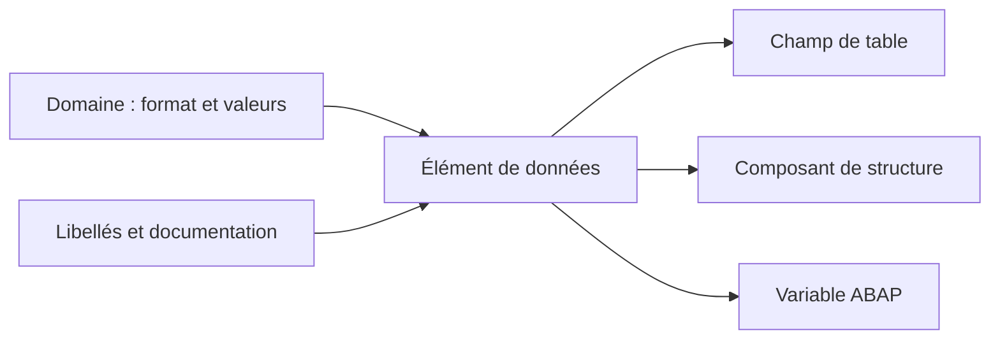

# 4. ÉLÉMENTS DE DONNÉES ET SÉMANTIQUE

## 4.A RÉSULTAT ATTENDU

- Comprendre le rôle d’un élément de données[^terme-element-donnees]
- Séparer caractéristiques techniques et signification métier
- Maintenir les libellés et la documentation
- Réutiliser un élément de données dans les objets DDIC[^terme-acro-ddic] et le code ABAP[^terme-abap]
- Choisir entre domaine et type prédéfini

## 4.B DÉFINITION

Un élément de données définit un type élémentaire global et lui associe une signification fonctionnelle.

Il peut être basé :

- sur un domaine ;
- directement sur un type prédéfini du Dictionary.

Pour les champs de tables persistantes, l’utilisation d’un élément de données basé sur un domaine favorise la cohérence et la réutilisation.

## 4.C CONTENU D’UN ÉLÉMENT DE DONNÉES

| Information                            | Fonction                                                 |
| -------------------------------------- | -------------------------------------------------------- |
| Domaine ou type prédéfini              | Définition technique                                     |
| Texte court                            | Description technique de l’objet                         |
| Libellés court, moyen, long et en-tête | Textes proposés aux interfaces classiques                |
| Documentation                          | Définition détaillée de la donnée                        |
| Aide à la recherche éventuelle         | Proposition de valeurs F4[^terme-aide-f4]                                |
| ID de paramètre éventuel               | Mémorisation utilisateur dans certains écrans classiques |



## 4.D DOMAINE ET ÉLÉMENT DE DONNÉES

| Question                           | Domaine |             Élément de données |
| ---------------------------------- | ------: | -----------------------------: |
| Quelle est la longueur technique ? |     Oui | Héritée ou définie directement |
| Quelles valeurs sont autorisées ?  |     Oui |                Non directement |
| Que signifie la donnée ?           |     Non |                            Oui |
| Quels libellés afficher ?          |     Non |                            Oui |
| Peut-il typer une variable ABAP ?  |     Non |                            Oui |

Deux données peuvent partager le même format sans avoir la même signification. Elles utilisent alors le même domaine, mais des éléments de données distincts.

## 4.E EXEMPLE

Le domaine `ZDM_ID_10` définit un identifiant alphanumérique de dix caractères.

Il peut être utilisé par :

- `ZDE_CUSTOMER_ID` : identifiant client ;
- `ZDE_CONTRACT_ID` : identifiant contrat ;
- `ZDE_REQUEST_ID` : identifiant demande.

Les trois éléments ont la même représentation technique, mais pas la même sémantique.

```abap
DATA lv_customer_id TYPE zde_customer_id.
DATA lv_contract_id TYPE zde_contract_id.
```

## 4.F LIBELLÉS

Les quatre longueurs de libellés permettent aux écrans et listes classiques de choisir un texte adapté à l’espace disponible.

Les libellés doivent rester cohérents entre eux et décrire la donnée, pas le traitement courant.

| Type    | Exemple               |
| ------- | --------------------- |
| Court   | Client                |
| Moyen   | Identifiant client    |
| Long    | Identifiant du client |
| En-tête | ID client             |

## 4.G DOCUMENTATION

La documentation doit préciser, lorsque nécessaire :

- le sens fonctionnel ;
- les valeurs particulières ;
- les règles d’alimentation ;
- l’unité ou la devise ;
- les restrictions d’usage.

Elle ne doit pas reproduire uniquement le nom technique.

## 4.H POINTS À RETENIR

- L’élément de données est un type global élémentaire.
- Le domaine porte le format ; l’élément de données porte la sémantique.
- Les libellés et la documentation font partie de la conception.
- Un même domaine peut alimenter plusieurs éléments de données métier.
- Un élément de données peut être utilisé directement avec `TYPE` en ABAP.

## 4.I PROCESS

### 4.I.1 Étape 1 — Définir la signification du champ

Nommer la donnée métier indépendamment de la table qui l’utilisera. Définir ses libellés court, moyen et long ainsi que la documentation F1[^terme-aide-f1] nécessaire.

Si deux champs ont le même format mais des significations différentes, ils ne doivent pas partager automatiquement le même élément de données.

### 4.I.2 Étape 2 — Créer l’élément de données

1. Ouvrir `SE11`[^outil-se11], choisir **Type de données[^terme-type-donnees]** et saisir un nom `Z...`.
2. Choisir **Élément de données**.
3. Référencer le domaine correspondant à la même sémantique technique.
4. Utiliser un type prédéfini uniquement si aucun domaine partagé n’est requis et si la règle du projet l’autorise.

### 4.I.3 Étape 3 — Maintenir les textes et propriétés

Renseigner la désignation et les libellés selon les longueurs d’écran. Ajouter la documentation F1 utile. Activer l’indicateur de document de modification uniquement si le champ doit participer au mécanisme SCDO[^outil-scdo] et si le scénario est conçu pour cela.

### 4.I.4 Étape 4 — Contrôler et activer

Exécuter le contrôle, traiter les messages puis activer. Si le domaine est inactif, l’activer d’abord au lieu de forcer l’objet supérieur.

### 4.I.5 Étape 5 — Tester dans un consommateur

Utiliser l’élément dans une structure ou un écran de test. Vérifier type, libellés, aide F1 et comportement F4. La création est terminée lorsque l’utilisateur comprend la donnée affichée sans dépendre du nom technique du champ.

## 4.J VÉRIFICATION

- Le contrôle de cohérence ne retourne aucune erreur bloquante.
- L’objet est actif et son entrée de répertoire pointe vers le package[^terme-package] attendu.
- La liste d’utilisation et les dépendances correspondent au périmètre prévu.
- Pour une table Z, la structure active et la structure de base sont cohérentes.

## 4.K ERREURS FRÉQUENTES

- Copier un exemple sans adapter les types, noms d’objets et données disponibles dans le système.
- Tester uniquement le cas nominal et ignorer les valeurs initiales, absentes ou invalides.
- Modifier un objet standard au lieu d’utiliser une extension.
- Activer une table sans vérifier clé, paramètres techniques et impact base.

## 4.L SNIPPET À RÉUTILISER

> [!NOTE]
> Adapter les noms `Z*`, les types DDIC, les données et les autorisations au système cible. Effectuer un contrôle syntaxique avant activation.

```abap
DATA lv_customer_id TYPE zde_customer_id.
DATA lv_contract_id TYPE zde_contract_id.
```

## 4.M TERMES DU LEXIQUE

- [ABAP Dictionary](<../🧩 00 ├── LEXIQUE SAP ET ABAP/05 ├── DONNEES DICTIONNAIRE ET BASE DE DONNEES.md#abap-dictionary>)
- [Domaine](<../🧩 00 ├── LEXIQUE SAP ET ABAP/05 ├── DONNEES DICTIONNAIRE ET BASE DE DONNEES.md#domaine>)
- [Élément de données](<../🧩 00 ├── LEXIQUE SAP ET ABAP/05 ├── DONNEES DICTIONNAIRE ET BASE DE DONNEES.md#element-donnees>)
- [Table transparente](<../🧩 00 ├── LEXIQUE SAP ET ABAP/05 ├── DONNEES DICTIONNAIRE ET BASE DE DONNEES.md#table-transparente>)
- [MANDT](<../🧩 00 ├── LEXIQUE SAP ET ABAP/05 ├── DONNEES DICTIONNAIRE ET BASE DE DONNEES.md#mandt>)

## 4.N RÉFÉRENCES OFFICIELLES SAP

- [Data Elements — SAP Help Portal](https://help.sap.com/docs/SAP_NETWEAVER_740/ec1c9c8191b74de98feb94001a95dd76/908d72feb1af11d194f600a0c929b3c3.html)
- [Using Dictionary Objects as Data Types — SAP Learning](https://learning.sap.com/courses/building-data-models-with-the-abap-dictionary-and-abap-core-data-services/using-dictionary-objects-as-data-types_e28df7c3-7686-414e-9827-673dceeb21fb)

---

[Chapitre suivant — STRUCTURES ET STRUCTURES INCLUDE](<./05 ├── STRUCTURES ET STRUCTURES INCLUDE.md>)

[^terme-element-donnees]: **ÉLÉMENT DE DONNÉES.** Objet DDIC qui attribue une signification métier, des libellés et une documentation à un type élémentaire ou à un domaine. Voir [l’entrée du lexique](<../🧩 00 ├── LEXIQUE SAP ET ABAP/05 ├── DONNEES DICTIONNAIRE ET BASE DE DONNEES.md#element-donnees>).
[^terme-acro-ddic]: **DDIC.** Data Dictionary, abréviation courante de l’ABAP Dictionary. Voir [l’entrée du lexique](<../🧩 00 ├── LEXIQUE SAP ET ABAP/10 └── ACRONYMES SAP.md#acro-ddic>).
[^terme-abap]: **ABAP.** Langage de programmation de la plateforme ABAP, conçu pour développer des applications métier et techniques SAP. Voir [l’entrée du lexique](<../🧩 00 ├── LEXIQUE SAP ET ABAP/04 ├── LANGAGE ET DEVELOPPEMENT ABAP.md#abap>).
[^terme-aide-f4]: **AIDE F4.** Aide à la saisie proposant des valeurs autorisées ou recherchables. Voir [l’entrée du lexique](<../🧩 00 ├── LEXIQUE SAP ET ABAP/02 ├── SAP GUI NAVIGATION ET TRANSACTIONS.md#aide-f4>).
[^terme-aide-f1]: **AIDE F1.** Aide contextuelle expliquant un champ, une fonction ou un mot-clé. Voir [l’entrée du lexique](<../🧩 00 ├── LEXIQUE SAP ET ABAP/02 ├── SAP GUI NAVIGATION ET TRANSACTIONS.md#aide-f1>).
[^terme-type-donnees]: **TYPE DE DONNÉES.** Définition des propriétés d’une valeur : nature, longueur, précision et opérations autorisées. Voir [l’entrée du lexique](<../🧩 00 ├── LEXIQUE SAP ET ABAP/04 ├── LANGAGE ET DEVELOPPEMENT ABAP.md#type-donnees>).
[^terme-package]: **PACKAGE.** Conteneur logique qui regroupe les objets de développement et détermine notamment leur transportabilité. Voir [l’entrée du lexique](<../🧩 00 ├── LEXIQUE SAP ET ABAP/03 ├── REPOSITORY PACKAGES ET TRANSPORTS.md#package>).

[^outil-se11]: **SE11.** Transaction de l’ABAP Dictionary utilisée pour analyser et maintenir les objets DDIC. Voir [le chapitre associé](<02 ├── NAVIGATION ET ANALYSE AVEC SE11.md>).
[^outil-scdo]: **SCDO.** Transaction de création et de génération des objets de documents de modification. Voir [le chapitre associé](<../🧩 23 ├── NUMEROTATION ET DOCUMENTS DE MODIFICATION/02 └── TRACER UNE MODIFICATION AVEC SCDO.md>).
