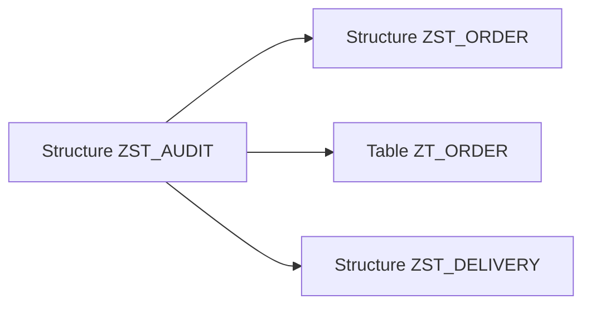

# 5. STRUCTURES ET STRUCTURES INCLUDE

## 5.A RÉSULTAT ATTENDU

- Créer un type structuré global
- Distinguer structure plate, imbriquée et profonde
- Réutiliser une structure avec un include
- Différencier include et append
- Gérer les références de devise et d’unité

## 5.B DÉFINITION

Une structure DDIC[^terme-structure-abap] regroupe plusieurs composants dans un type global.

Elle ne crée aucune table physique dans la base de données.

```abap
DATA ls_address TYPE zst_address.
```

## 5.C CATÉGORIES DE STRUCTURES

| Catégorie | Contenu                                                                        |
| --------- | ------------------------------------------------------------------------------ |
| Plate     | Uniquement des composants élémentaires sans chaîne, référence ni table interne[^terme-table-interne] |
| Imbriquée | Au moins un composant structuré                                                |
| Profonde  | Au moins une chaîne, référence ou table interne                                |

La distinction est importante car certains usages classiques exigent des structures plates.

## 5.D PROCESS

### 5.D.1 Étape 1 — Définir le contrat de la structure

Lister les composants, leur ordre et leur signification. Pour chaque composant, rechercher un élément de données[^terme-element-donnees] existant qui porte la même sémantique. Une structure destinée à une interface partagée ne doit pas dépendre de types locaux au programme.

### 5.D.2 Étape 2 — Créer la structure

1. Ouvrir `SE11`[^outil-se11] et choisir **Type de données[^terme-type-donnees]**.
2. Saisir un nom client puis choisir **Créer** et **Structure**.
3. Renseigner le texte court.
4. Ajouter chaque composant avec son élément de données ou son type DDIC[^terme-acro-ddic].

Si un composant est inconnu, créer et activer sa dépendance avant de reprendre la structure.

### 5.D.3 Étape 3 — Ajouter une structure include si nécessaire

Utiliser une structure include uniquement pour réutiliser un groupe de champs possédant une identité commune. Vérifier les noms de composants afin d’éviter les collisions avec ceux de la structure principale.

Après insertion, développer l’include et contrôler l’ordre final des composants tel qu’il sera vu par le code ABAP[^terme-abap].

### 5.D.4 Étape 4 — Définir la catégorie d’amélioration

Choisir la catégorie compatible avec la nature réelle des composants et la politique d’extension de l’objet. Ne pas sélectionner une catégorie plus permissive uniquement pour supprimer un avertissement.

### 5.D.5 Étape 5 — Activer et tester

Contrôler puis activer. Déclarer une variable de ce type dans un report de test et accéder à un composant direct puis à un composant issu de l’include. La création est validée lorsque tous les composants sont typés, visibles et actifs.

## 5.E EXEMPLE DE STRUCTURE

| Composant     | Type                |
| ------------- | ------------------- |
| `CUSTOMER_ID` | `ZDE_CUSTOMER_ID`   |
| `NAME`        | `ZDE_CUSTOMER_NAME` |
| `CITY`        | `ORT01`             |
| `COUNTRY`     | `LAND1`             |

```abap
DATA ls_customer TYPE zst_customer.

ls_customer-customer_id = 'C000000001'.
ls_customer-city        = 'PARIS'.
```

## 5.F STRUCTURES INCLUDE

Une structure include permet de réutiliser un groupe de composants dans plusieurs structures ou tables.



Exemple de composants communs :

- utilisateur de création ;
- date de création ;
- utilisateur de modification ;
- date de modification.

Les composants ne sont pas copiés indépendamment : les objets consommateurs dépendent de la structure incluse.

## 5.G INCLUDE ET APPEND

| Mécanisme | Objectif                                                                         |
| --------- | -------------------------------------------------------------------------------- |
| Include   | Réutiliser volontairement un groupe de composants dans un objet que l’on conçoit |
| Append    | Étendre un objet existant sans modifier sa définition d’origine                  |

Une structure include peut être positionnée dans la liste des composants. Les champs d’un append sont ajoutés à l’objet cible lors de l’activation.

## 5.H MONTANTS ET QUANTITÉS

Un composant de type montant ou quantité doit référencer le composant qui contient respectivement la devise ou l’unité.

| Type   | Champ de référence attendu                   |
| ------ | -------------------------------------------- |
| `CURR` | Code devise, généralement de type `CUKY`     |
| `QUAN` | Unité de mesure, généralement de type `UNIT` |

Cette référence permet aux technologies classiques d’interpréter correctement le nombre de décimales et l’affichage.

## 5.I POINTS À RETENIR

- Une structure DDIC est un type global sans persistance propre.
- Une structure profonde contient au moins un composant profond.
- Un include factorise un groupe de composants communs.
- Un append étend un objet existant et répond à un autre besoin.
- Les montants et quantités doivent être associés à leur devise ou unité.

## 5.J PROCESS

### 5.J.1 Étape 1 — Vérifier la définition active

Rouvrir la structure en mode affichage et contrôler le statut actif, le package[^terme-package] et les composants réellement générés. Comparer cette définition avec le contrat préparé avant la création.

### 5.J.2 Étape 2 — Examiner les dépendances

Ouvrir les éléments de données et structures incluses. Toute dépendance inactive doit être corrigée à sa source ; ne pas remplacer son type par un type générique pour forcer l’activation.

### 5.J.3 Étape 3 — Examiner les consommateurs

Utiliser la liste d’utilisation et identifier programmes, classes, modules fonction et autres structures. Avant toute évolution, déterminer quels consommateurs dépendent de l’ordre ou du nom des composants.

### 5.J.4 Étape 4 — Tester une évolution contrôlée

Ajouter un composant uniquement dans un environnement[^terme-environnement] de développement, activer puis contrôler les consommateurs. En cas d’incompatibilité, annuler l’évolution ou adapter explicitement les interfaces concernées.

Le contrôle est terminé lorsque la définition active, ses dépendances et l’impact sur les consommateurs sont connus.

## 5.K VÉRIFICATION

- Le contrôle de cohérence ne retourne aucune erreur bloquante.
- L’objet est actif et son entrée de répertoire pointe vers le package attendu.
- La liste d’utilisation et les dépendances correspondent au périmètre prévu.
- Pour une table Z, la structure active et la structure de base sont cohérentes.

## 5.L ERREURS FRÉQUENTES

- Copier un exemple sans adapter les types, noms d’objets et données disponibles dans le système.
- Tester uniquement le cas nominal et ignorer les valeurs initiales, absentes ou invalides.
- Modifier un objet standard au lieu d’utiliser une extension.
- Activer une table sans vérifier clé, paramètres techniques et impact base.

## 5.M SNIPPET À RÉUTILISER

> [!NOTE]
> Adapter les noms `Z*`, les types DDIC, les données et les autorisations au système cible. Effectuer un contrôle syntaxique avant activation.

```abap
DATA ls_customer TYPE zst_customer.

ls_customer-customer_id = 'C000000001'.
ls_customer-city        = 'PARIS'.
```

## 5.N TERMES DU LEXIQUE

- [Structure](<../🧩 00 ├── LEXIQUE SAP ET ABAP/04 ├── LANGAGE ET DEVELOPPEMENT ABAP.md#structure-abap>)
- [ABAP Dictionary](<../🧩 00 ├── LEXIQUE SAP ET ABAP/05 ├── DONNEES DICTIONNAIRE ET BASE DE DONNEES.md#abap-dictionary>)
- [Domaine](<../🧩 00 ├── LEXIQUE SAP ET ABAP/05 ├── DONNEES DICTIONNAIRE ET BASE DE DONNEES.md#domaine>)
- [Élément de données](<../🧩 00 ├── LEXIQUE SAP ET ABAP/05 ├── DONNEES DICTIONNAIRE ET BASE DE DONNEES.md#element-donnees>)
- [Table transparente](<../🧩 00 ├── LEXIQUE SAP ET ABAP/05 ├── DONNEES DICTIONNAIRE ET BASE DE DONNEES.md#table-transparente>)
- [MANDT](<../🧩 00 ├── LEXIQUE SAP ET ABAP/05 ├── DONNEES DICTIONNAIRE ET BASE DE DONNEES.md#mandt>)

## 5.O RÉFÉRENCES OFFICIELLES SAP

- [Structures — SAP Help Portal](https://help.sap.com/docs/SAP_NETWEAVER_740/ec1c9c8191b74de98feb94001a95dd76/908d7301b1af11d194f600a0c929b3c3.html)
- [Creating Database Tables — Include Structures — SAP Learning](https://learning.sap.com/courses/building-data-models-with-the-abap-dictionary-and-abap-core-data-services/creating-database-tables_ebc1477d-96ed-414b-82d4-4171da43f4a6)

---

[Chapitre suivant — TYPES DE TABLE DU DICTIONNAIRE](<./06 ├── TYPES DE TABLE DU DICTIONNAIRE.md>)

[^terme-structure-abap]: **STRUCTURE.** Objet ou type composé de plusieurs composants nommés. Voir [l’entrée du lexique](<../🧩 00 ├── LEXIQUE SAP ET ABAP/04 ├── LANGAGE ET DEVELOPPEMENT ABAP.md#structure-abap>).
[^terme-table-interne]: **TABLE INTERNE.** Collection dynamique de lignes stockée en mémoire dans le programme ABAP. Voir [l’entrée du lexique](<../🧩 00 ├── LEXIQUE SAP ET ABAP/04 ├── LANGAGE ET DEVELOPPEMENT ABAP.md#table-interne>).
[^terme-element-donnees]: **ÉLÉMENT DE DONNÉES.** Objet DDIC qui attribue une signification métier, des libellés et une documentation à un type élémentaire ou à un domaine. Voir [l’entrée du lexique](<../🧩 00 ├── LEXIQUE SAP ET ABAP/05 ├── DONNEES DICTIONNAIRE ET BASE DE DONNEES.md#element-donnees>).
[^terme-type-donnees]: **TYPE DE DONNÉES.** Définition des propriétés d’une valeur : nature, longueur, précision et opérations autorisées. Voir [l’entrée du lexique](<../🧩 00 ├── LEXIQUE SAP ET ABAP/04 ├── LANGAGE ET DEVELOPPEMENT ABAP.md#type-donnees>).
[^terme-acro-ddic]: **DDIC.** Data Dictionary, abréviation courante de l’ABAP Dictionary. Voir [l’entrée du lexique](<../🧩 00 ├── LEXIQUE SAP ET ABAP/10 └── ACRONYMES SAP.md#acro-ddic>).
[^terme-abap]: **ABAP.** Langage de programmation de la plateforme ABAP, conçu pour développer des applications métier et techniques SAP. Voir [l’entrée du lexique](<../🧩 00 ├── LEXIQUE SAP ET ABAP/04 ├── LANGAGE ET DEVELOPPEMENT ABAP.md#abap>).
[^terme-package]: **PACKAGE.** Conteneur logique qui regroupe les objets de développement et détermine notamment leur transportabilité. Voir [l’entrée du lexique](<../🧩 00 ├── LEXIQUE SAP ET ABAP/03 ├── REPOSITORY PACKAGES ET TRANSPORTS.md#package>).
[^terme-environnement]: **ENVIRONNEMENT.** Rôle fonctionnel attribué à un système dans le cycle de vie : développement, test, recette, préproduction ou production. Voir [l’entrée du lexique](<../🧩 00 ├── LEXIQUE SAP ET ABAP/01 ├── SYSTEMES ENVIRONNEMENTS ET MANDANTS.md#environnement>).

[^outil-se11]: **SE11.** Transaction de l’ABAP Dictionary utilisée pour analyser et maintenir les objets DDIC. Voir [le chapitre associé](<02 ├── NAVIGATION ET ANALYSE AVEC SE11.md>).
