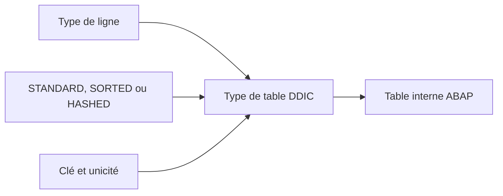

# 6. TYPES DE TABLE DU DICTIONNAIRE

## 6.A RÉSULTAT ATTENDU

- Définir un type global de table interne[^terme-table-interne]
- Choisir un type de ligne
- Définir la catégorie d’accès et la clé
- Réutiliser le type dans plusieurs programmes
- Distinguer type de table DDIC[^terme-acro-ddic] et table persistante

## 6.B DÉFINITION

Un type de table DDIC définit le type d’une table interne globale.

Il ne crée aucune table dans la base de données.

```abap
DATA lt_messages TYPE ztt_message.
```

## 6.C COMPOSANTS DU TYPE

Un type de table comprend :

- un type de ligne ;
- une catégorie de table ;
- une clé primaire[^terme-cle-primaire] ;
- éventuellement une taille initiale ou des propriétés complémentaires selon le système.



## 6.D TYPE DE LIGNE

Le type de ligne peut être :

- un élément de données[^terme-element-donnees] ;
- une structure DDIC[^terme-structure-abap] ;
- un type de référence ;
- un autre type compatible selon les possibilités de la version.

Pour une table métier comportant plusieurs colonnes, utiliser généralement une structure dédiée.

## 6.E CATÉGORIES DE TABLE

| Catégorie | Organisation             | Usage principal                   |
| --------- | ------------------------ | --------------------------------- |
| Standard  | Index primaire           | Parcours et accès par index       |
| Triée     | Ordre permanent par clé  | Accès par clé et parcours ordonné |
| Hachée    | Organisation par hachage | Accès exact par clé unique        |

Le choix doit refléter les accès réels. Il ne doit pas être effectué uniquement par habitude.

## 6.F CLÉ

La clé peut être :

- unique ou non unique selon la catégorie ;
- composée de plusieurs composants ;
- définie explicitement ;
- standard dans certains cas simples.

Une table hachée exige une clé unique. Une table triée peut utiliser une clé unique ou non unique.

## 6.G EXEMPLE DE CONCEPTION

Structure de ligne : `ZST_MESSAGE`

| Composant | Type         |
| --------- | ------------ |
| `TYPE`    | `BAPI_MTYPE` |
| `ID`      | `SYMSGID`    |
| `NUMBER`  | `SYMSGNO`    |
| `TEXT`    | `BAPI_MSG`   |

Type de table : `ZTT_MESSAGE`

- type de ligne : `ZST_MESSAGE` ;
- catégorie : table standard ;
- clé : standard ou vide selon le besoin.

## 6.H TYPE DE TABLE ET TABLE DE BASE DE DONNÉES

| Objet                   | Réside en mémoire interne | Persiste en base |
| ----------------------- | ------------------------: | ---------------: |
| Type de table DDIC      | Définit seulement un type |              Non |
| Table interne ABAP[^terme-abap]      |                       Oui |              Non |
| Table transparente[^terme-table-transparente] DDIC |           Non directement |              Oui |

## 6.I POINTS À RETENIR

- Un type de table DDIC est un type global de table interne.
- Il dépend d’un type de ligne et d’une catégorie de table.
- La clé doit correspondre aux accès prévus.
- Il ne crée aucun objet physique en base.
- Les opérations sur les tables internes restent détaillées dans le dossier dédié.

## 6.J PROCESS

### 6.J.1 Étape 1 — Définir la ligne et les accès attendus

Identifier le type de ligne partagé et les opérations dominantes : parcours séquentiel, lecture par clé exacte ou maintien trié. Le choix `STANDARD`, `SORTED` ou `HASHED` découle de ces accès, pas du volume seul.

### 6.J.2 Étape 2 — Créer le type de table

1. Ouvrir `SE11`[^outil-se11], choisir **Type de données[^terme-type-donnees]** et saisir un nom client.
2. Choisir **Type table**.
3. Renseigner comme type de ligne une structure ou un élément DDIC actif.
4. Sélectionner la catégorie de table décidée.

### 6.J.3 Étape 3 — Définir la clé

Pour une table triée ou hachée, déclarer explicitement les composants constituant l’unicité ou l’ordre. Choisir `UNIQUE` uniquement si deux lignes portant la même clé sont fonctionnellement interdites.

Si l’activation refuse la clé, vérifier que chaque composant appartient au type de ligne et qu’il possède un type autorisé pour cette catégorie.

### 6.J.4 Étape 4 — Activer puis déclarer une table

Contrôler, activer puis déclarer une table interne avec `TYPE z...`. Insérer deux lignes distinctes et effectuer une lecture avec la clé définie.

### 6.J.5 Étape 5 — Tester les contraintes

Pour une clé unique, tenter une deuxième insertion avec la même clé et traiter le résultat prévu. Le type est validé lorsque l’accès attendu fonctionne et que les doublons sont acceptés ou refusés conformément au contrat.

## 6.K VÉRIFICATION

- Le contrôle de cohérence ne retourne aucune erreur bloquante.
- L’objet est actif et son entrée de répertoire pointe vers le package[^terme-package] attendu.
- La liste d’utilisation et les dépendances correspondent au périmètre prévu.
- Pour une table Z, la structure active et la structure de base sont cohérentes.

## 6.L ERREURS FRÉQUENTES

- Copier un exemple sans adapter les types, noms d’objets et données disponibles dans le système.
- Tester uniquement le cas nominal et ignorer les valeurs initiales, absentes ou invalides.
- Modifier un objet standard au lieu d’utiliser une extension.
- Activer une table sans vérifier clé, paramètres techniques et impact base.

## 6.M SNIPPET À RÉUTILISER

> [!NOTE]
> Adapter les noms `Z*`, les types DDIC, les données et les autorisations au système cible. Effectuer un contrôle syntaxique avant activation.

```abap
DATA lt_messages TYPE ztt_message.
```

## 6.N TERMES DU LEXIQUE

- [ABAP Dictionary](<../🧩 00 ├── LEXIQUE SAP ET ABAP/05 ├── DONNEES DICTIONNAIRE ET BASE DE DONNEES.md#abap-dictionary>)
- [Domaine](<../🧩 00 ├── LEXIQUE SAP ET ABAP/05 ├── DONNEES DICTIONNAIRE ET BASE DE DONNEES.md#domaine>)
- [Élément de données](<../🧩 00 ├── LEXIQUE SAP ET ABAP/05 ├── DONNEES DICTIONNAIRE ET BASE DE DONNEES.md#element-donnees>)
- [Table transparente](<../🧩 00 ├── LEXIQUE SAP ET ABAP/05 ├── DONNEES DICTIONNAIRE ET BASE DE DONNEES.md#table-transparente>)
- [MANDT](<../🧩 00 ├── LEXIQUE SAP ET ABAP/05 ├── DONNEES DICTIONNAIRE ET BASE DE DONNEES.md#mandt>)

## 6.O RÉFÉRENCES OFFICIELLES SAP

- [Defining Dictionary Table Types — SAP Learning](https://learning.sap.com/courses/building-data-models-with-the-abap-dictionary-and-abap-core-data-services/defining-dictionary-table-types_df502cc6-441f-4fdc-aa9e-cc81caf6919c)
- [Data Types in the ABAP Dictionary — SAP Help Portal](https://help.sap.com/docs/SAP_NETWEAVER_740/ec1c9c8191b74de98feb94001a95dd76/cf21f2e5446011d189700000e8322d00.html)

---

[Chapitre suivant — TABLES TRANSPARENTES ET CHAMPS](<./07 ├── TABLES TRANSPARENTES ET CHAMPS.md>)

[^terme-table-interne]: **TABLE INTERNE.** Collection dynamique de lignes stockée en mémoire dans le programme ABAP. Voir [l’entrée du lexique](<../🧩 00 ├── LEXIQUE SAP ET ABAP/04 ├── LANGAGE ET DEVELOPPEMENT ABAP.md#table-interne>).
[^terme-acro-ddic]: **DDIC.** Data Dictionary, abréviation courante de l’ABAP Dictionary. Voir [l’entrée du lexique](<../🧩 00 ├── LEXIQUE SAP ET ABAP/10 └── ACRONYMES SAP.md#acro-ddic>).
[^terme-cle-primaire]: **CLÉ PRIMAIRE.** Ensemble minimal de champs identifiant de manière unique une ligne de table. Voir [l’entrée du lexique](<../🧩 00 ├── LEXIQUE SAP ET ABAP/05 ├── DONNEES DICTIONNAIRE ET BASE DE DONNEES.md#cle-primaire>).
[^terme-element-donnees]: **ÉLÉMENT DE DONNÉES.** Objet DDIC qui attribue une signification métier, des libellés et une documentation à un type élémentaire ou à un domaine. Voir [l’entrée du lexique](<../🧩 00 ├── LEXIQUE SAP ET ABAP/05 ├── DONNEES DICTIONNAIRE ET BASE DE DONNEES.md#element-donnees>).
[^terme-structure-abap]: **STRUCTURE.** Objet ou type composé de plusieurs composants nommés. Voir [l’entrée du lexique](<../🧩 00 ├── LEXIQUE SAP ET ABAP/04 ├── LANGAGE ET DEVELOPPEMENT ABAP.md#structure-abap>).
[^terme-abap]: **ABAP.** Langage de programmation de la plateforme ABAP, conçu pour développer des applications métier et techniques SAP. Voir [l’entrée du lexique](<../🧩 00 ├── LEXIQUE SAP ET ABAP/04 ├── LANGAGE ET DEVELOPPEMENT ABAP.md#abap>).
[^terme-table-transparente]: **TABLE TRANSPARENTE.** Table DDIC correspondant directement à une table physique de la base de données. Voir [l’entrée du lexique](<../🧩 00 ├── LEXIQUE SAP ET ABAP/05 ├── DONNEES DICTIONNAIRE ET BASE DE DONNEES.md#table-transparente>).
[^terme-type-donnees]: **TYPE DE DONNÉES.** Définition des propriétés d’une valeur : nature, longueur, précision et opérations autorisées. Voir [l’entrée du lexique](<../🧩 00 ├── LEXIQUE SAP ET ABAP/04 ├── LANGAGE ET DEVELOPPEMENT ABAP.md#type-donnees>).
[^terme-package]: **PACKAGE.** Conteneur logique qui regroupe les objets de développement et détermine notamment leur transportabilité. Voir [l’entrée du lexique](<../🧩 00 ├── LEXIQUE SAP ET ABAP/03 ├── REPOSITORY PACKAGES ET TRANSPORTS.md#package>).

[^outil-se11]: **SE11.** Transaction de l’ABAP Dictionary utilisée pour analyser et maintenir les objets DDIC. Voir [le chapitre associé](<02 ├── NAVIGATION ET ANALYSE AVEC SE11.md>).
