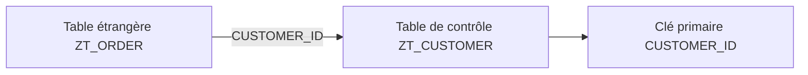
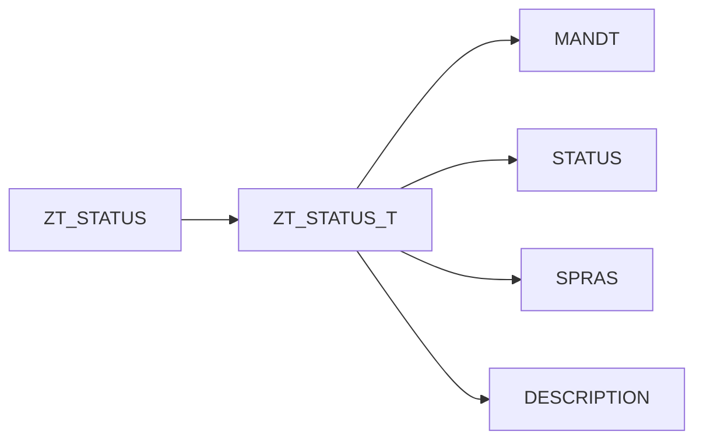

# 10. CLÉS ÉTRANGÈRES, TABLES DE CONTRÔLE ET TABLES DE TEXTE

## 10.A RÉSULTAT ATTENDU

- Définir une relation entre deux tables DDIC[^terme-acro-ddic]
- Distinguer table de valeurs et table de contrôle[^terme-table-controle]
- Comprendre les cardinalités
- Identifier une table de texte[^terme-table-texte]
- Connaître les limites des contrôles DDIC

## 10.B CLÉ ÉTRANGÈRE

Une clé étrangère[^terme-cle-etrangere] DDIC relie les champs d’une table à la clé primaire[^terme-cle-primaire] d’une table de contrôle.



La définition contient :

- la table de contrôle ;
- l’affectation entre les champs ;
- la cardinalité ;
- le type sémantique de la relation.

## 10.C TABLE ÉTRANGÈRE ET TABLE DE CONTRÔLE

| Rôle              | Description                                                                  |
| ----------------- | ---------------------------------------------------------------------------- |
| Table étrangère   | Contient le champ dont la valeur doit correspondre à une entrée de référence |
| Table de contrôle | Contient les valeurs de référence dans sa clé primaire                       |

Exemple : une commande contient un identifiant client ; la table client fournit les identifiants valides.

## 10.D TABLE DE VALEURS ET TABLE DE CONTRÔLE

| Table de valeurs du domaine               | Table de contrôle de la clé étrangère      |
| ----------------------------------------- | ------------------------------------------ |
| Proposition générique associée au domaine | Relation définie pour un champ précis      |
| Ne crée pas seule un contrôle             | Porte la relation et le contrôle classique |
| Peut être réutilisée comme proposition    | Dépend du contexte de la table étrangère   |

## 10.E CARDINALITÉ

La cardinalité décrit le nombre possible d’occurrences entre les tables.

Elle précise notamment :

- si une ligne de la table étrangère doit obligatoirement trouver une ligne de contrôle ;
- combien de lignes étrangères peuvent référencer une ligne de contrôle.

La cardinalité doit refléter la règle métier[^terme-regle-metier] réelle, pas seulement les données présentes au moment de la création.

## 10.F CONTRÔLE EFFECTIF

Une clé étrangère DDIC fournit des métadonnées utilisées par les écrans classiques, les aides F4[^terme-aide-f4], les vues de maintenance et divers générateurs.

Elle ne garantit pas à elle seule que toute écriture effectuée par n’importe quel programme ABAP[^terme-abap] sera contrôlée. Le code applicatif et les interfaces d’écriture doivent respecter l’intégrité attendue.

## 10.G TABLE DE TEXTE

Une table de texte contient les libellés dépendants de la langue d’une table principale.

Sa clé contient généralement :

- la clé de la table principale ;
- un champ de langue, typiquement `SPRAS`.



La relation doit être définie avec le type sémantique approprié pour que le Dictionary reconnaisse la table de texte.

## 10.H POINTS À RETENIR

- Une clé étrangère relie une table étrangère à une table de contrôle.
- La table de valeurs d’un domaine n’est qu’une proposition.
- La cardinalité représente une règle structurelle.
- Les métadonnées DDIC n’empêchent pas toutes les écritures incohérentes par elles-mêmes.
- Une table de texte associe une clé métier à des libellés traduits.

## 10.I PROCESS

### 10.I.1 Étape 1 — Identifier la relation à modéliser

Déterminer la table contenant la valeur saisie et la table de contrôle qui porte les valeurs autorisées. Comparer les champs de relation : domaine, type, longueur et rôle métier doivent être compatibles.

### 10.I.2 Étape 2 — Créer la clé étrangère

1. Ouvrir la table dépendante dans `SE11`[^outil-se11] et sélectionner le champ concerné.
2. Ouvrir la définition de clé étrangère.
3. Saisir la table de contrôle.
4. Affecter chaque champ de la clé de la table de contrôle au champ correspondant de la table dépendante ou à une constante autorisée.
5. Définir la cardinalité selon les données réellement possibles.

Si un champ clé ne peut pas être affecté, revoir le modèle plutôt que d’utiliser une correspondance artificielle.

### 10.I.3 Étape 3 — Tester le contrôle de saisie

Activer les deux tables puis tester le champ dans un écran ou une maintenance utilisant les contrôles DDIC. Une valeur présente dans la table de contrôle doit être acceptée ; une valeur absente doit produire le comportement prévu.

La clé étrangère DDIC contribue aux aides et contrôles d’écran, mais ne remplace pas nécessairement une validation applicative lors d’une écriture ABAP directe.

### 10.I.4 Étape 4 — Créer une table de textes

Créer une table dont la clé reprend celle de la table de base et ajoute la langue `SPRAS`. Ajouter le champ texte, définir la relation vers la table de base puis déclarer cette table comme table de textes selon les fonctions de `SE11`.

### 10.I.5 Étape 5 — Valider les langues

Créer deux textes pour une même clé dans deux langues, puis vérifier leur restitution selon `SY-LANGU`. La modélisation est validée lorsque la relation empêche les clés orphelines dans les outils concernés et que chaque langue possède au maximum un texte par objet.

## 10.J VÉRIFICATION

- Le contrôle de cohérence ne retourne aucune erreur bloquante.
- L’objet est actif et son entrée de répertoire pointe vers le package[^terme-package] attendu.
- La liste d’utilisation et les dépendances correspondent au périmètre prévu.
- Pour une table Z, la structure active et la structure de base sont cohérentes.

## 10.K ERREURS FRÉQUENTES

- Modifier un objet standard au lieu d’utiliser une extension.
- Activer une table sans vérifier clé, paramètres techniques et impact base.

## 10.L FICHE DE CONTRÔLE À COPIER

```text
Système / SID       :
Mandant             :
Utilisateur         :
Transaction / outil :
Objet technique     :
Jeu de données      :
Résultat attendu    :
Résultat observé    :
Horodatage          :
Ordre de transport  :
```

## 10.M TERMES DU LEXIQUE

- [ABAP Dictionary](<../🧩 00 ├── LEXIQUE SAP ET ABAP/05 ├── DONNEES DICTIONNAIRE ET BASE DE DONNEES.md#abap-dictionary>)
- [Domaine](<../🧩 00 ├── LEXIQUE SAP ET ABAP/05 ├── DONNEES DICTIONNAIRE ET BASE DE DONNEES.md#domaine>)
- [Élément de données](<../🧩 00 ├── LEXIQUE SAP ET ABAP/05 ├── DONNEES DICTIONNAIRE ET BASE DE DONNEES.md#element-donnees>)
- [Table transparente](<../🧩 00 ├── LEXIQUE SAP ET ABAP/05 ├── DONNEES DICTIONNAIRE ET BASE DE DONNEES.md#table-transparente>)
- [MANDT](<../🧩 00 ├── LEXIQUE SAP ET ABAP/05 ├── DONNEES DICTIONNAIRE ET BASE DE DONNEES.md#mandt>)

## 10.N RÉFÉRENCES OFFICIELLES SAP

- [Foreign Keys — SAP Help Portal](https://help.sap.com/docs/SAP_NETWEAVER_702/ff5206fc6c551014a1d28b076487e7df/cf21ea77446011d189700000e8322d00.html)
- [Generic and Constant Foreign Keys — SAP Help Portal](https://help.sap.com/docs/SAP_NETWEAVER_731_BW_ABAP/ec1c9c8191b74de98feb94001a95dd76/cf21ea84446011d189700000e8322d00.html)

---

[Chapitre suivant — AIDES À LA RECHERCHE ÉLÉMENTAIRES ET COLLECTIVES](<./11 ├── AIDES A LA RECHERCHE ELEMENTAIRES ET COLLECTIVES.md>)

[^terme-acro-ddic]: **DDIC.** Data Dictionary, abréviation courante de l’ABAP Dictionary. Voir [l’entrée du lexique](<../🧩 00 ├── LEXIQUE SAP ET ABAP/10 └── ACRONYMES SAP.md#acro-ddic>).
[^terme-table-controle]: **TABLE DE CONTRÔLE.** Table contenant les valeurs de référence autorisées pour une relation de clé étrangère. Voir [l’entrée du lexique](<../🧩 00 ├── LEXIQUE SAP ET ABAP/05 ├── DONNEES DICTIONNAIRE ET BASE DE DONNEES.md#table-controle>).
[^terme-table-texte]: **TABLE DE TEXTE.** Table dépendante de la langue contenant les descriptions associées à une table principale. Voir [l’entrée du lexique](<../🧩 00 ├── LEXIQUE SAP ET ABAP/05 ├── DONNEES DICTIONNAIRE ET BASE DE DONNEES.md#table-texte>).
[^terme-cle-etrangere]: **CLÉ ÉTRANGÈRE.** Relation DDIC entre des champs d’une table et une table de contrôle. Voir [l’entrée du lexique](<../🧩 00 ├── LEXIQUE SAP ET ABAP/05 ├── DONNEES DICTIONNAIRE ET BASE DE DONNEES.md#cle-etrangere>).
[^terme-cle-primaire]: **CLÉ PRIMAIRE.** Ensemble minimal de champs identifiant de manière unique une ligne de table. Voir [l’entrée du lexique](<../🧩 00 ├── LEXIQUE SAP ET ABAP/05 ├── DONNEES DICTIONNAIRE ET BASE DE DONNEES.md#cle-primaire>).
[^terme-regle-metier]: **RÈGLE MÉTIER.** Condition ou calcul imposé par le processus fonctionnel. Voir [l’entrée du lexique](<../🧩 00 ├── LEXIQUE SAP ET ABAP/09 ├── NOTIONS FONCTIONNELLES ET ORGANISATIONNELLES.md#regle-metier>).
[^terme-aide-f4]: **AIDE F4.** Aide à la saisie proposant des valeurs autorisées ou recherchables. Voir [l’entrée du lexique](<../🧩 00 ├── LEXIQUE SAP ET ABAP/02 ├── SAP GUI NAVIGATION ET TRANSACTIONS.md#aide-f4>).
[^terme-abap]: **ABAP.** Langage de programmation de la plateforme ABAP, conçu pour développer des applications métier et techniques SAP. Voir [l’entrée du lexique](<../🧩 00 ├── LEXIQUE SAP ET ABAP/04 ├── LANGAGE ET DEVELOPPEMENT ABAP.md#abap>).
[^terme-package]: **PACKAGE.** Conteneur logique qui regroupe les objets de développement et détermine notamment leur transportabilité. Voir [l’entrée du lexique](<../🧩 00 ├── LEXIQUE SAP ET ABAP/03 ├── REPOSITORY PACKAGES ET TRANSPORTS.md#package>).

[^outil-se11]: **SE11.** Transaction de l’ABAP Dictionary utilisée pour analyser et maintenir les objets DDIC. Voir [le chapitre associé](<02 ├── NAVIGATION ET ANALYSE AVEC SE11.md>).
