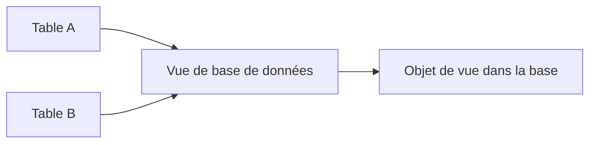
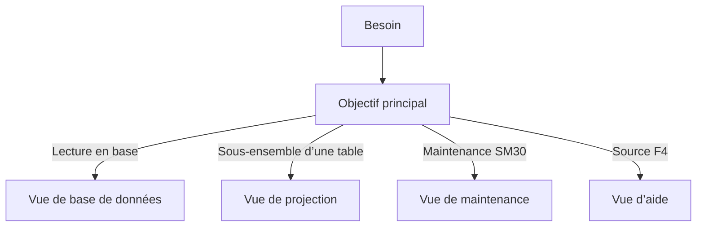

# 12. VUES CLASSIQUES DU DICTIONNAIRE

## 12.A RÉSULTAT ATTENDU

- Identifier les types de vues classiques de SE11[^outil-se11]
- Comprendre leur mode d’implémentation
- Choisir une vue selon le besoin
- Reconnaître les contraintes de jointure
- Situer les vues classiques par rapport aux développements modernes

## 12.B TYPES DE VUES

Le Dictionary classique propose plusieurs catégories de vues.

| Type                   | Usage                                                                                   | Objet correspondant en base |
| ---------------------- | --------------------------------------------------------------------------------------- | --------------------------: |
| Vue de base de données | Lire une projection ou une jointure interne                                             |                         Oui |
| Vue de projection      | Masquer certains champs d’une table                                                     |                         Non |
| Vue de maintenance     | Maintenir conjointement des données reliées                                             |                         Non |
| Vue d’aide             | Fournir une source pour une aide à la recherche, avec possibilités de jointure adaptées |                         Non |

## 12.C VUE DE BASE DE DONNÉES

Une vue de base de données est représentée par une vue correspondante dans la base.

Elle combine les tables avec des conditions de jointure de type interne et expose une sélection de champs.



Elle est principalement utilisée pour la lecture.

## 12.D VUE DE PROJECTION

Une vue de projection présente uniquement certains champs d’une table unique.

Elle ne possède pas d’objet de vue propre dans la base. Elle sert à limiter l’exposition d’une structure de table dans les usages classiques.

## 12.E VUE DE MAINTENANCE

Une vue de maintenance permet de générer un dialogue de maintenance commun à plusieurs tables reliées par des clés étrangères.

Elle est utilisée avec le générateur de maintenance et la transaction `SM30`[^outil-sm30].

Les relations entre tables doivent être correctement modélisées dans le Dictionary.

## 12.F VUE D’AIDE

Une vue d’aide sert principalement de méthode[^terme-methode] de sélection pour une aide à la recherche.

Elle permet de réunir des données de plusieurs tables en tenant compte des relations DDIC[^terme-acro-ddic] et des besoins de recherche.

## 12.G CHOIX DU TYPE



## 12.H POSITIONNEMENT ACTUEL

Les vues classiques restent présentes dans de nombreux systèmes et sont nécessaires pour maintenir des applications SAP GUI[^terme-sap-gui] existantes, des aides à la recherche et des dialogues de maintenance.

Pour de nouveaux modèles de lecture, SAP privilégie les vues CDS[^terme-acro-cds]. Leur conception nécessite un traitement distinct dans le futur dossier consacré à ADT[^terme-acro-adt].

## 12.I POINTS À RETENIR

- Les quatre types de vues classiques répondent à des usages différents.
- Seule la vue de base de données crée une vue correspondante dans la base.
- Les vues de maintenance et d’aide s’appuient sur les relations DDIC.
- Une vue de projection ne porte que sur une table.
- Les vues CDS ne sont pas traitées dans ce dossier SAP GUI.

## 12.J PROCESS

### 12.J.1 Étape 1 — Choisir le type de vue classique

Définir le besoin : jointure de lecture, projection, aide de recherche ou maintenance. Vérifier qu’une vue CDS n’appartient pas au périmètre prévu du projet ; ce chapitre traite uniquement les vues classiques `SE11`.

### 12.J.2 Étape 2 — Définir les sources et jointures

1. Ouvrir `SE11`, choisir **Vue** et créer un objet client.
2. Sélectionner le type de vue adapté.
3. Ajouter les tables sources.
4. Définir chaque condition de jointure sur des champs de types compatibles.

Pour une vue dépendante du mandant[^terme-mandant], contrôler la gestion de `MANDT`[^terme-mandt] et éviter une jointure qui combine des clients différents.

### 12.J.3 Étape 3 — Sélectionner les champs

Ajouter uniquement les champs nécessaires au consommateur. Conserver des noms non ambigus et vérifier les références de devise ou d’unité pour les montants et quantités.

### 12.J.4 Étape 4 — Définir les conditions de sélection autorisées

Ajouter les conditions fixes réellement inhérentes à la vue. Ne pas figer un filtre dépendant d’un utilisateur ou d’un scénario ponctuel ; ce filtre appartient au programme consommateur.

### 12.J.5 Étape 5 — Activer et comparer

Activer, tester le contenu dans `SE11`, puis exécuter une requête ABAP[^terme-abap] SQL[^terme-acro-sql] avec des critères précis. Comparer les lignes avec une jointure directe de référence. La vue est validée lorsque jointures, mandant, cardinalité observée et champs retournés correspondent au modèle attendu.

## 12.K VÉRIFICATION

- Le contrôle de cohérence ne retourne aucune erreur bloquante.
- L’objet est actif et son entrée de répertoire pointe vers le package[^terme-package] attendu.
- La liste d’utilisation et les dépendances correspondent au périmètre prévu.
- Pour une table Z, la structure active et la structure de base sont cohérentes.

## 12.L ERREURS FRÉQUENTES

- Modifier un objet standard au lieu d’utiliser une extension.
- Activer une table sans vérifier clé, paramètres techniques et impact base.

## 12.M FICHE DE CONTRÔLE À COPIER

```text
Système / SID       :
Mandant             :
Utilisateur         :
Transaction / outil :
Objet technique     :
Jeu de données      :
Résultat attendu    :
Résultat observé    :
Horodatage          :
Ordre de transport  :
```

## 12.N TERMES DU LEXIQUE

- [ABAP Dictionary](<../🧩 00 ├── LEXIQUE SAP ET ABAP/05 ├── DONNEES DICTIONNAIRE ET BASE DE DONNEES.md#abap-dictionary>)
- [Domaine](<../🧩 00 ├── LEXIQUE SAP ET ABAP/05 ├── DONNEES DICTIONNAIRE ET BASE DE DONNEES.md#domaine>)
- [Élément de données](<../🧩 00 ├── LEXIQUE SAP ET ABAP/05 ├── DONNEES DICTIONNAIRE ET BASE DE DONNEES.md#element-donnees>)
- [Table transparente](<../🧩 00 ├── LEXIQUE SAP ET ABAP/05 ├── DONNEES DICTIONNAIRE ET BASE DE DONNEES.md#table-transparente>)
- [MANDT](<../🧩 00 ├── LEXIQUE SAP ET ABAP/05 ├── DONNEES DICTIONNAIRE ET BASE DE DONNEES.md#mandt>)

## 12.O RÉFÉRENCES OFFICIELLES SAP

- [Views — ABAP Dictionary — SAP Help Portal](https://help.sap.com/docs/SAP_NETWEAVER_AS_ABAP_FOR_SOH_740/ec1c9c8191b74de98feb94001a95dd76/cf21ec5d446011d189700000e8322d00.html?version=7.40.30)
- [Maintenance Views — SAP Help Portal](https://help.sap.com/docs/SAP_NETWEAVER_731_BW_ABAP/ec1c9c8191b74de98feb94001a95dd76/cf21ecdf446011d189700000e8322d00.html)

---

[Chapitre suivant — OBJETS DE VERROUILLAGE](<./13 ├── OBJETS DE VERROUILLAGE.md>)

[^terme-methode]: **MÉTHODE.** Comportement déclaré dans une classe ou une interface et appelé avec une liste de paramètres définie. Voir [l’entrée du lexique](<../🧩 00 ├── LEXIQUE SAP ET ABAP/04 ├── LANGAGE ET DEVELOPPEMENT ABAP.md#methode>).
[^terme-acro-ddic]: **DDIC.** Data Dictionary, abréviation courante de l’ABAP Dictionary. Voir [l’entrée du lexique](<../🧩 00 ├── LEXIQUE SAP ET ABAP/10 └── ACRONYMES SAP.md#acro-ddic>).
[^terme-sap-gui]: **SAP GUI.** Client graphique permettant d’utiliser les transactions et écrans d’un système SAP. Voir [l’entrée du lexique](<../🧩 00 ├── LEXIQUE SAP ET ABAP/02 ├── SAP GUI NAVIGATION ET TRANSACTIONS.md#sap-gui>).
[^terme-acro-cds]: **CDS.** Core Data Services, langage de modélisation de vues et entités de données. Voir [l’entrée du lexique](<../🧩 00 ├── LEXIQUE SAP ET ABAP/10 └── ACRONYMES SAP.md#acro-cds>).
[^terme-acro-adt]: **ADT.** ABAP Development Tools, environnement de développement ABAP intégré à Eclipse. Voir [l’entrée du lexique](<../🧩 00 ├── LEXIQUE SAP ET ABAP/10 └── ACRONYMES SAP.md#acro-adt>).
[^terme-mandant]: **MANDANT.** Subdivision logique d’un système SAP. Il est identifié par un numéro à trois chiffres et isole une partie des données, du paramétrage et des utilisateurs. Voir [l’entrée du lexique](<../🧩 00 ├── LEXIQUE SAP ET ABAP/01 ├── SYSTEMES ENVIRONNEMENTS ET MANDANTS.md#mandant>).
[^terme-mandt]: **MANDT.** Champ technique de type mandant, généralement placé en première position de clé dans les tables dépendantes du mandant. Voir [l’entrée du lexique](<../🧩 00 ├── LEXIQUE SAP ET ABAP/05 ├── DONNEES DICTIONNAIRE ET BASE DE DONNEES.md#mandt>).
[^terme-abap]: **ABAP.** Langage de programmation de la plateforme ABAP, conçu pour développer des applications métier et techniques SAP. Voir [l’entrée du lexique](<../🧩 00 ├── LEXIQUE SAP ET ABAP/04 ├── LANGAGE ET DEVELOPPEMENT ABAP.md#abap>).
[^terme-acro-sql]: **SQL.** Structured Query Language. Voir [l’entrée du lexique](<../🧩 00 ├── LEXIQUE SAP ET ABAP/10 └── ACRONYMES SAP.md#acro-sql>).
[^terme-package]: **PACKAGE.** Conteneur logique qui regroupe les objets de développement et détermine notamment leur transportabilité. Voir [l’entrée du lexique](<../🧩 00 ├── LEXIQUE SAP ET ABAP/03 ├── REPOSITORY PACKAGES ET TRANSPORTS.md#package>).

[^outil-se11]: **SE11.** Transaction de l’ABAP Dictionary utilisée pour analyser et maintenir les objets DDIC. Voir [le chapitre associé](<02 ├── NAVIGATION ET ANALYSE AVEC SE11.md>).
[^outil-sm30]: **SM30.** Transaction d’exécution d’un dialogue de maintenance généré pour une table ou une vue. Voir [le chapitre associé](<14 ├── GENERATEUR DE MAINTENANCE ET SM30.md>).
