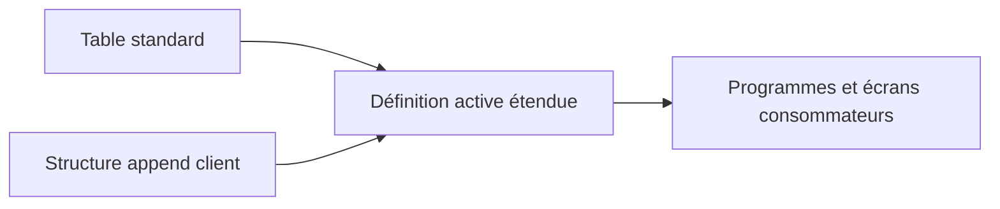

# 15. STRUCTURES APPEND ET EXTENSIONS

## 15.A RÉSULTAT ATTENDU

- Étendre une table ou une structure sans modifier sa définition d’origine
- Distinguer append, include et modification
- Comprendre l’effet de l’activation
- Ajouter des champs, clés étrangères ou aides à la recherche
- Sécuriser une extension d’objet standard

## 15.B PRINCIPE D’UN APPEND

Une structure append est affectée à une seule table ou structure cible.

Lors de l’activation, ses composants sont ajoutés à la définition active de l’objet cible.



Plusieurs structures append peuvent être affectées au même objet lorsque le système et la catégorie d’amélioration l’autorisent.

## 15.C POSSIBILITÉS

Un append peut notamment :

- ajouter de nouveaux champs ;
- définir une clé étrangère[^terme-cle-etrangere] sur certains champs existants ;
- affecter une aide à la recherche à certains champs existants.

Les éléments ajoutés appartiennent à l’append et sont transportés avec lui.

## 15.D APPEND, INCLUDE ET MODIFICATION

| Mécanisme    | Usage                                                                |
| ------------ | -------------------------------------------------------------------- |
| Include      | Composer un objet que l’on maîtrise à partir d’une structure commune |
| Append       | Étendre un objet existant sans changer directement son original      |
| Modification | Changer directement un objet livré par SAP[^terme-acro-sap]                           |

Pour une extension client, utiliser le mécanisme prévu par SAP. Une modification directe du standard complique les montées de version et doit être évitée.

## 15.E PROCESS

Depuis la table ou la structure dans `SE11`[^outil-se11] :

### 15.E.1 Étape 1 — Vérifier que l’extension est autorisée

Afficher l’objet cible dans `SE11`, relever son propriétaire, sa catégorie d’amélioration et les append existants. Pour un objet SAP, vérifier la documentation d’extension du composant avant d’ajouter un champ.

### 15.E.2 Étape 2 — Créer l’append

Ouvrir la fonction d’append, saisir un nom client et renseigner un texte court. Ajouter uniquement des composants client nommés selon l’espace réservé et typés avec des éléments de données actifs.

### 15.E.3 Étape 3 — Contrôler les contraintes techniques

Vérifier catégorie d’amélioration, types profonds/plats autorisés, références de devise ou d’unité et absence de collision de noms. Corriger la définition plutôt que forcer une catégorie incompatible.

### 15.E.4 Étape 4 — Activer dans le bon ordre

Activer d’abord les éléments de données, puis l’append et enfin contrôler l’objet cible. Lire le journal d’ajustement de base lorsqu’une table transparente[^terme-table-transparente] est étendue.

### 15.E.5 Étape 5 — Tester les consommateurs

Lire et renseigner le nouveau composant depuis un programme de test. Vérifier les interfaces, extractions et structures qui utilisent une correspondance par nom ou une longueur fixe. L’extension est validée lorsque l’objet cible et ses consommateurs restent actifs.

## 15.F CATÉGORIE D’AMÉLIORATION

La catégorie d’amélioration indique quels types de composants peuvent être ajoutés.

Elle protège notamment les usages qui exigent une structure plate ou sans types particuliers.

Ne pas choisir une catégorie plus permissive que nécessaire uniquement pour supprimer un avertissement.

## 15.G IMPACT TECHNIQUE

L’ajout d’un champ à une table persistante modifie sa structure en base. L’activation peut déclencher un ajustement technique selon le type de changement et le système.

Avant l’extension :

- vérifier la catégorie d’amélioration ;
- analyser la liste d’utilisation ;
- contrôler les structures de communication et interfaces ;
- anticiper l’alimentation du nouveau champ ;
- tester les programmes qui utilisent des affectations implicites ou des structures complètes.

## 15.H POINTS À RETENIR

- Un append étend un objet sans modifier sa définition d’origine.
- Il est lié à une seule table ou structure cible.
- L’activation ajoute ses composants à l’objet actif.
- La catégorie d’amélioration doit être respectée.
- Une extension de table peut nécessiter un ajustement physique et des tests de régression.

## 15.I PROCESS

### 15.I.1 Étape 1 — Rechercher l’impact avant modification

Utiliser la liste d’utilisation de l’objet cible et des composants concernés. Identifier les programmes, interfaces et formulaires qui pourraient traiter la structure complète.

### 15.I.2 Étape 2 — Comparer avant et après activation

Conserver la définition active, activer l’append puis comparer la structure finale. Vérifier que seuls les composants prévus ont été ajoutés et qu’aucun nom standard n’a été masqué.

### 15.I.3 Étape 3 — Contrôler le transport

Vérifier que l’append et toutes ses dépendances sont placés dans des ordres dont la séquence d’import est correcte. Le contrôle est terminé après activation et test dans le système cible de développement.

## 15.J VÉRIFICATION

- Le contrôle de cohérence ne retourne aucune erreur bloquante.
- L’objet est actif et son entrée de répertoire pointe vers le package[^terme-package] attendu.
- La liste d’utilisation et les dépendances correspondent au périmètre prévu.
- Pour une table Z, la structure active et la structure de base sont cohérentes.

## 15.K ERREURS FRÉQUENTES

- Modifier un objet standard au lieu d’utiliser une extension.
- Activer une table sans vérifier clé, paramètres techniques et impact base.

## 15.L FICHE DE CONTRÔLE À COPIER

```text
Système / SID       :
Mandant             :
Utilisateur         :
Transaction / outil :
Objet technique     :
Jeu de données      :
Résultat attendu    :
Résultat observé    :
Horodatage          :
Ordre de transport  :
```

## 15.M TERMES DU LEXIQUE

- [Structure](<../🧩 00 ├── LEXIQUE SAP ET ABAP/04 ├── LANGAGE ET DEVELOPPEMENT ABAP.md#structure-abap>)
- [ABAP Dictionary](<../🧩 00 ├── LEXIQUE SAP ET ABAP/05 ├── DONNEES DICTIONNAIRE ET BASE DE DONNEES.md#abap-dictionary>)
- [Domaine](<../🧩 00 ├── LEXIQUE SAP ET ABAP/05 ├── DONNEES DICTIONNAIRE ET BASE DE DONNEES.md#domaine>)
- [Élément de données](<../🧩 00 ├── LEXIQUE SAP ET ABAP/05 ├── DONNEES DICTIONNAIRE ET BASE DE DONNEES.md#element-donnees>)
- [Table transparente](<../🧩 00 ├── LEXIQUE SAP ET ABAP/05 ├── DONNEES DICTIONNAIRE ET BASE DE DONNEES.md#table-transparente>)
- [MANDT](<../🧩 00 ├── LEXIQUE SAP ET ABAP/05 ├── DONNEES DICTIONNAIRE ET BASE DE DONNEES.md#mandt>)

## 15.N RÉFÉRENCES OFFICIELLES SAP

- [Append Structures — SAP Help Portal](https://help.sap.com/docs/SAP_NETWEAVER_731_BW_ABAP/ec1c9c8191b74de98feb94001a95dd76/cf21eb61446011d189700000e8322d00.html)
- [Adding an Append Structure — SAP Help Portal](https://help.sap.com/docs/SAP_NETWEAVER_740/ec1c9c8191b74de98feb94001a95dd76/cf21ebc9446011d189700000e8322d00.html)

---

[Chapitre suivant — ACTIVATION, AJUSTEMENT BASE ET ANALYSE DES DÉPENDANCES](<./16 ├── ACTIVATION AJUSTEMENT BASE ET ANALYSE DES DEPENDANCES.md>)

[^terme-cle-etrangere]: **CLÉ ÉTRANGÈRE.** Relation DDIC entre des champs d’une table et une table de contrôle. Voir [l’entrée du lexique](<../🧩 00 ├── LEXIQUE SAP ET ABAP/05 ├── DONNEES DICTIONNAIRE ET BASE DE DONNEES.md#cle-etrangere>).
[^terme-acro-sap]: **SAP.** Nom de l’éditeur et de son écosystème logiciel ; l’acronyme historique provient de l’allemand. Voir [l’entrée du lexique](<../🧩 00 ├── LEXIQUE SAP ET ABAP/10 └── ACRONYMES SAP.md#acro-sap>).
[^terme-table-transparente]: **TABLE TRANSPARENTE.** Table DDIC correspondant directement à une table physique de la base de données. Voir [l’entrée du lexique](<../🧩 00 ├── LEXIQUE SAP ET ABAP/05 ├── DONNEES DICTIONNAIRE ET BASE DE DONNEES.md#table-transparente>).
[^terme-package]: **PACKAGE.** Conteneur logique qui regroupe les objets de développement et détermine notamment leur transportabilité. Voir [l’entrée du lexique](<../🧩 00 ├── LEXIQUE SAP ET ABAP/03 ├── REPOSITORY PACKAGES ET TRANSPORTS.md#package>).

[^outil-se11]: **SE11.** Transaction de l’ABAP Dictionary utilisée pour analyser et maintenir les objets DDIC. Voir [le chapitre associé](<02 ├── NAVIGATION ET ANALYSE AVEC SE11.md>).
