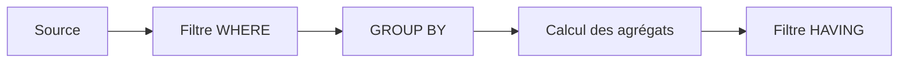

# 9. AGRÉGATIONS, GROUP BY ET HAVING

## 9.A RÉSULTAT ATTENDU

- Calculer des agrégats en base
- Utiliser `COUNT`, `SUM`, `MIN`, `MAX` et `AVG`
- Regrouper les lignes avec `GROUP BY`
- Filtrer les groupes avec `HAVING`
- Éviter les boucles ABAP[^terme-abap] d’agrégation inutiles

## 9.B FONCTIONS D’AGRÉGATION

```abap
" Exemple à éviter : identifier le défaut avant de choisir la correction.
SELECT COUNT( * ) AS flight_count,
       MIN( price ) AS min_price,
       MAX( price ) AS max_price,
       AVG( price ) AS avg_price
  FROM sflight
  WHERE carrid = @p_carrid
  INTO @DATA(ls_aggregates).
```

Une requête contenant uniquement des agrégats retourne normalement une ligne de résultat, y compris lorsque l’ensemble de départ est vide. La valeur exacte dépend de la fonction.

## 9.C GROUP BY

Lorsque la liste contient à la fois des colonnes normales et des agrégats, les colonnes non agrégées doivent généralement figurer dans `GROUP BY`.

```abap
" Lire uniquement les colonnes et les lignes nécessaires.
SELECT carrid,
       COUNT( * ) AS flight_count,
       MIN( price ) AS min_price,
       MAX( price ) AS max_price
  FROM sflight
  GROUP BY carrid
  INTO TABLE @DATA(lt_by_carrier).
```

## 9.D HAVING

`WHERE` filtre les lignes avant le regroupement. `HAVING` filtre les groupes après calcul des agrégats.

```abap
" Lire uniquement les colonnes et les lignes nécessaires.
SELECT carrid,
       COUNT( * ) AS flight_count
  FROM sflight
  WHERE fldate >= @sy-datum
  GROUP BY carrid
  HAVING COUNT( * ) >= 10
  INTO TABLE @DATA(lt_active_carriers).
```



## 9.E COUNT DISTINCT

```abap
" Lire uniquement les colonnes et les lignes nécessaires.
SELECT COUNT( DISTINCT connid )
  FROM sflight
  WHERE carrid = @p_carrid
  INTO @DATA(lv_connection_count).
```

## 9.F CODE PUSH-DOWN

Mauvais schéma : lire toutes les lignes, boucler, additionner et compter en ABAP.

Meilleur schéma : demander directement à la base le résultat agrégé nécessaire.

## 9.G VÉRIFICATION

- Le contrôle syntaxique réussit.
- La version active correspond au code sauvegardé.
- L’exécution produit le résultat décrit dans le chapitre.
- Les cas vide, limite et erreur sont testés séparément lorsque la syntaxe le permet.

## 9.H ERREURS FRÉQUENTES

- Copier un exemple sans adapter les types, noms d’objets et données disponibles dans le système.
- Tester uniquement le cas nominal et ignorer les valeurs initiales, absentes ou invalides.
- Lire toutes les colonnes ou toutes les lignes par défaut.
- Effectuer des commits dans une méthode[^terme-methode] réutilisable sans contrat explicite.

## 9.I SNIPPET À RÉUTILISER

> [!NOTE]
> Adapter les noms `Z*`, les types DDIC[^terme-acro-ddic], les données et les autorisations au système cible. Effectuer un contrôle syntaxique avant activation.

```abap
" Lire uniquement les colonnes et les lignes nécessaires.
SELECT carrid,
       COUNT( * ) AS flight_count,
       MIN( price ) AS min_price,
       MAX( price ) AS max_price
  FROM sflight
  GROUP BY carrid
  INTO TABLE @DATA(lt_by_carrier).
```

## 9.J TERMES DU LEXIQUE

- [SQL](<../🧩 00 ├── LEXIQUE SAP ET ABAP/10 └── ACRONYMES SAP.md#acro-sql>)
- [MANDT](<../🧩 00 ├── LEXIQUE SAP ET ABAP/05 ├── DONNEES DICTIONNAIRE ET BASE DE DONNEES.md#mandt>)
- [Table transparente](<../🧩 00 ├── LEXIQUE SAP ET ABAP/05 ├── DONNEES DICTIONNAIRE ET BASE DE DONNEES.md#table-transparente>)
- [LUW base de données](<../🧩 00 ├── LEXIQUE SAP ET ABAP/08 ├── EXECUTION EXPLOITATION ET ADMINISTRATION.md#luw-base>)

## 9.K MODÈLE DE DÉMONSTRATION SFLIGHT

> [!NOTE]
> Les tables `SCARR`, `SPFLI` et `SFLIGHT` appartiennent au modèle de démonstration SAP[^terme-acro-sap] et peuvent être absentes ou non alimentées dans certains systèmes. Dans ce cas, remplacer les exemples par une table Z de démonstration ou par une source en lecture seule autorisée, sans modifier une table applicative standard.

## 9.L RÉFÉRENCES OFFICIELLES SAP

- [Sorting and Condensing Data Sets in ABAP SQL — SAP Learning](https://learning.sap.com/courses/deepening-your-abap-programming-knowledge/sorting-and-condensing-data-sets-in-abap-sql_cd074ff4-ebc9-4b68-8708-7fa6043bf34c)
- [Aggregate Expressions — ABAP Keyword Documentation](https://help.sap.com/doc/abapdocu_latest_index_htm/latest/en-US/ABAPSELECT_AGGREGATE.html)
- [GROUP BY — ABAP Keyword Documentation](https://help.sap.com/doc/abapdocu_latest_index_htm/latest/en-US/ABAPGROUPBY_CLAUSE.html)
- [HAVING — ABAP Keyword Documentation](https://help.sap.com/doc/abapdocu_latest_index_htm/latest/en-US/ABAPHAVING_CLAUSE.html)


---

[Chapitre suivant — SOUS-REQUÊTES ET OPÉRATIONS D’ENSEMBLE](<./10 ├── SOUS REQUETES ET OPERATIONS D ENSEMBLE.md>)

[^terme-abap]: **ABAP.** Langage de programmation de la plateforme ABAP, conçu pour développer des applications métier et techniques SAP. Voir [l’entrée du lexique](<../🧩 00 ├── LEXIQUE SAP ET ABAP/04 ├── LANGAGE ET DEVELOPPEMENT ABAP.md#abap>).
[^terme-methode]: **MÉTHODE.** Comportement déclaré dans une classe ou une interface et appelé avec une liste de paramètres définie. Voir [l’entrée du lexique](<../🧩 00 ├── LEXIQUE SAP ET ABAP/04 ├── LANGAGE ET DEVELOPPEMENT ABAP.md#methode>).
[^terme-acro-ddic]: **DDIC.** Data Dictionary, abréviation courante de l’ABAP Dictionary. Voir [l’entrée du lexique](<../🧩 00 ├── LEXIQUE SAP ET ABAP/10 └── ACRONYMES SAP.md#acro-ddic>).
[^terme-acro-sap]: **SAP.** Nom de l’éditeur et de son écosystème logiciel ; l’acronyme historique provient de l’allemand. Voir [l’entrée du lexique](<../🧩 00 ├── LEXIQUE SAP ET ABAP/10 └── ACRONYMES SAP.md#acro-sap>).
