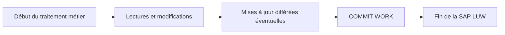

# 17. LUW, COMMIT WORK ET ROLLBACK WORK

## 17.A RÉSULTAT ATTENDU

- Comprendre la différence entre SAP LUW[^terme-sap-luw] et database LUW
- Savoir quand une modification devient persistante
- Utiliser `COMMIT WORK`[^terme-commit-work] et `ROLLBACK WORK`[^terme-rollback-work] avec prudence
- Éviter les validations techniques placées au mauvais niveau
- Préparer le futur dossier transactionnel

## 17.B DATABASE LUW ET SAP LUW

Une unité logique de travail de base de données est délimitée par un commit ou un rollback de la base.

Une **SAP LUW** regroupe un processus métier qui peut traverser plusieurs étapes de dialogue et utiliser les mécanismes de mise à jour SAP.



## 17.C COMMIT WORK

`COMMIT WORK` termine la SAP LUW courante et déclenche notamment les traitements enregistrés en update task[^terme-update-task].

```abap
" Modifier uniquement les données de la table cible maîtrisée.
INSERT zdev_product FROM @ls_product.

IF sy-subrc = 0.
  COMMIT WORK AND WAIT.
ENDIF.
```

`AND WAIT` attend la fin des mises à jour synchrones concernées et fournit un retour exploitable selon le contexte.

> [!WARNING]
> Ne pas placer un `COMMIT WORK` dans une méthode[^terme-methode] technique réutilisable, un exit, une BAdI[^terme-acro-badi] ou une fonction appelée au milieu d’un processus sans contrat explicite. Le niveau appelant doit généralement contrôler la transaction.

## 17.D ROLLBACK WORK

`ROLLBACK WORK` annule les modifications non validées de la SAP LUW courante et supprime certains enregistrements différés associés.

```abap
IF lv_error = abap_true.
  ROLLBACK WORK.
  RETURN.
ENDIF.
```

## 17.E VALIDATION IMPLICITE

Plusieurs événements du runtime SAP peuvent provoquer une fin de LUW ou un commit implicite selon le contexte. Il est donc incorrect de considérer qu’une transaction ABAP[^terme-abap] correspond toujours à une seule transaction de base de données du début à la fin de l’écran.

## 17.F BAPI ET COMMIT

De nombreuses BAPI[^terme-bapi] de modification ne réalisent pas elles-mêmes le commit. L’appelant utilise généralement les mécanismes BAPI prévus pour valider ou annuler après analyse des messages retournés.

Le sujet sera détaillé dans le dossier consacré aux modules fonction, RFC[^terme-rfc] et BAPI.

## 17.G VÉRIFICATION

- Le contrôle syntaxique réussit.
- La version active correspond au code sauvegardé.
- L’exécution produit le résultat décrit dans le chapitre.
- Les cas vide, limite et erreur sont testés séparément lorsque la syntaxe le permet.

## 17.H ERREURS FRÉQUENTES

- Copier un exemple sans adapter les types, noms d’objets et données disponibles dans le système.
- Tester uniquement le cas nominal et ignorer les valeurs initiales, absentes ou invalides.
- Lire toutes les colonnes ou toutes les lignes par défaut.
- Effectuer des commits dans une méthode réutilisable sans contrat explicite.

## 17.I SNIPPET À RÉUTILISER

> [!NOTE]
> Adapter les noms `Z*`, les types DDIC[^terme-acro-ddic], les données et les autorisations au système cible. Effectuer un contrôle syntaxique avant activation.

```abap
" Modifier uniquement les données de la table cible maîtrisée.
INSERT zdev_product FROM @ls_product.

IF sy-subrc = 0.
  COMMIT WORK AND WAIT.
ENDIF.
```

## 17.J TERMES DU LEXIQUE

- [COMMIT WORK](<../🧩 00 ├── LEXIQUE SAP ET ABAP/08 ├── EXECUTION EXPLOITATION ET ADMINISTRATION.md#commit-work>)
- [ROLLBACK WORK](<../🧩 00 ├── LEXIQUE SAP ET ABAP/08 ├── EXECUTION EXPLOITATION ET ADMINISTRATION.md#rollback-work>)
- [SQL](<../🧩 00 ├── LEXIQUE SAP ET ABAP/10 └── ACRONYMES SAP.md#acro-sql>)
- [MANDT](<../🧩 00 ├── LEXIQUE SAP ET ABAP/05 ├── DONNEES DICTIONNAIRE ET BASE DE DONNEES.md#mandt>)
- [Table transparente](<../🧩 00 ├── LEXIQUE SAP ET ABAP/05 ├── DONNEES DICTIONNAIRE ET BASE DE DONNEES.md#table-transparente>)
- [LUW base de données](<../🧩 00 ├── LEXIQUE SAP ET ABAP/08 ├── EXECUTION EXPLOITATION ET ADMINISTRATION.md#luw-base>)

## 17.K RÉFÉRENCES OFFICIELLES SAP

- [LUWs in ABAP — SAP Help Portal](https://help.sap.com/docs/ABAP_PLATFORM_NEW/8132142fd1a144a59303663a03a7c2d4/54f5462a9604498382319304869a4280.html)
- [COMMIT WORK — ABAP Keyword Documentation](https://help.sap.com/doc/abapdocu_latest_index_htm/latest/en-US/ABAPCOMMIT.html)
- [ROLLBACK WORK — ABAP Keyword Documentation](https://help.sap.com/doc/abapdocu_latest_index_htm/latest/en-US/ABAPROLLBACK.html)


---

[Chapitre suivant — PERFORMANCE, ANALYSE ET BONNES PRATIQUES](<./18 ├── PERFORMANCE ANALYSE ET BONNES PRATIQUES.md>)

[^terme-sap-luw]: **SAP LUW.** Unité logique métier SAP pouvant regrouper plusieurs étapes de dialogue et différer les mises à jour jusqu’au commit. Voir [l’entrée du lexique](<../🧩 00 ├── LEXIQUE SAP ET ABAP/08 ├── EXECUTION EXPLOITATION ET ADMINISTRATION.md#sap-luw>).
[^terme-commit-work]: **COMMIT WORK.** Instruction clôturant la SAP LUW courante, déclenchant notamment les mises à jour enregistrées et validant la base. Voir [l’entrée du lexique](<../🧩 00 ├── LEXIQUE SAP ET ABAP/08 ├── EXECUTION EXPLOITATION ET ADMINISTRATION.md#commit-work>).
[^terme-rollback-work]: **ROLLBACK WORK.** Instruction annulant les modifications non validées de la LUW courante et les tâches de mise à jour enregistrées. Voir [l’entrée du lexique](<../🧩 00 ├── LEXIQUE SAP ET ABAP/08 ├── EXECUTION EXPLOITATION ET ADMINISTRATION.md#rollback-work>).
[^terme-update-task]: **UPDATE TASK.** Mécanisme différant des mises à jour pour les exécuter lors du `COMMIT WORK` dans des processus de mise à jour. Voir [l’entrée du lexique](<../🧩 00 ├── LEXIQUE SAP ET ABAP/08 ├── EXECUTION EXPLOITATION ET ADMINISTRATION.md#update-task>).
[^terme-methode]: **MÉTHODE.** Comportement déclaré dans une classe ou une interface et appelé avec une liste de paramètres définie. Voir [l’entrée du lexique](<../🧩 00 ├── LEXIQUE SAP ET ABAP/04 ├── LANGAGE ET DEVELOPPEMENT ABAP.md#methode>).
[^terme-acro-badi]: **BADI.** Business Add-In, mécanisme d’extension orienté objet du standard SAP. Voir [l’entrée du lexique](<../🧩 00 ├── LEXIQUE SAP ET ABAP/10 └── ACRONYMES SAP.md#acro-badi>).
[^terme-abap]: **ABAP.** Langage de programmation de la plateforme ABAP, conçu pour développer des applications métier et techniques SAP. Voir [l’entrée du lexique](<../🧩 00 ├── LEXIQUE SAP ET ABAP/04 ├── LANGAGE ET DEVELOPPEMENT ABAP.md#abap>).
[^terme-bapi]: **BAPI.** Interface métier publiée autour d’un Business Object SAP, généralement implémentée par un module fonction RFC. Voir [l’entrée du lexique](<../🧩 00 ├── LEXIQUE SAP ET ABAP/06 ├── PROGRAMMES CLASSES ET OBJETS TECHNIQUES.md#bapi>).
[^terme-rfc]: **RFC.** Remote Function Call, mécanisme permettant d’appeler un module fonction compatible dans un autre contexte ou système. Voir [l’entrée du lexique](<../🧩 00 ├── LEXIQUE SAP ET ABAP/06 ├── PROGRAMMES CLASSES ET OBJETS TECHNIQUES.md#rfc>).
[^terme-acro-ddic]: **DDIC.** Data Dictionary, abréviation courante de l’ABAP Dictionary. Voir [l’entrée du lexique](<../🧩 00 ├── LEXIQUE SAP ET ABAP/10 └── ACRONYMES SAP.md#acro-ddic>).
