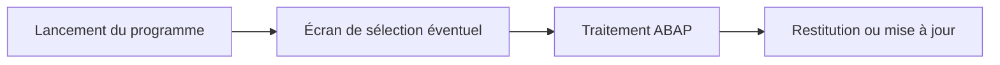

# 1. PRINCIPES DES PROGRAMMES EXÉCUTABLES

## 1.A RÉSULTAT ATTENDU

- Comprendre le rôle d’un programme exécutable[^terme-programme-executable] ABAP[^terme-abap]
- Identifier son point d’entrée et son cycle général
- Distinguer sélection, traitement et restitution
- Délimiter son usage dans une architecture SAP[^terme-acro-sap]
- Préparer un programme compatible avec SAP GUI[^terme-sap-gui]

## 1.B DÉFINITION

Un **programme exécutable** est un objet du Repository ABAP[^terme-repository-abap] pouvant être lancé directement. Il est généralement introduit par l’instruction `REPORT`.

```abap
REPORT zdev_flight_report.
```

Dans les attributs du programme, son type est **Programme exécutable**. Le terme historique **report** reste largement utilisé, même lorsque le programme ne produit pas uniquement un état.



## 1.C RESPONSABILITÉS HABITUELLES

Un programme exécutable peut notamment :

- lire et analyser des données ;
- produire une liste ou un ALV[^terme-alv] ;
- lancer un traitement de masse ;
- appeler une API[^terme-api] métier ;
- préparer des données pour une interface ;
- être exécuté en dialogue ou en arrière-plan.

Un programme exécutable n’est pas une couche métier réutilisable à lui seul. La logique importante doit être placée dans des procédures ou classes dédiées, puis appelée depuis le point d’entrée du programme.

## 1.D STRUCTURE RECOMMANDÉE

```abap
REPORT zdev_flight_report.

PARAMETERS p_carr TYPE scarr-carrid.

START-OF-SELECTION.
  lcl_application=>run( p_carr ).
```

Le bloc événementiel orchestre le traitement. Il ne doit pas contenir toute l’implémentation lorsque celle-ci devient significative.

## 1.E PROGRAMME EXÉCUTABLE ET TRANSACTION

Un programme peut être lancé :

- depuis `SE38`[^outil-se38] ou `SA38`[^outil-sa38] ;
- depuis `SE80`[^outil-se80] ;
- depuis une transaction de type programme et écran de sélection ;
- depuis un autre programme avec `SUBMIT` ;
- depuis un job[^terme-job] d’arrière-plan.

Le mode de lancement ne remplace pas les contrôles d’autorisation métier dans le code.

## 1.F PÉRIMÈTRE DU DOSSIER

Ce dossier couvre :

- les événements des programmes exécutables ;
- les écrans de sélection générés par ABAP ;
- les paramètres et critères de sélection ;
- les validations et adaptations dynamiques ;
- les variantes ;
- les appels avec `SUBMIT` ;
- la sortie classique minimale.

Les ALV, dynpros, jobs d’arrière-plan et messages avancés seront détaillés dans des dossiers distincts.

## 1.G VÉRIFICATION

- Le contrôle syntaxique réussit.
- La version active correspond au code sauvegardé.
- L’exécution produit le résultat décrit dans le chapitre.
- Les cas vide, limite et erreur sont testés séparément lorsque la syntaxe le permet.

## 1.H ERREURS FRÉQUENTES

- Copier un exemple sans adapter les types, noms d’objets et données disponibles dans le système.
- Tester uniquement le cas nominal et ignorer les valeurs initiales, absentes ou invalides.
- Mettre une logique lourde dans les événements de validation de l’écran.
- Créer une variante contenant des valeurs obsolètes ou sensibles.

## 1.I SNIPPET À RÉUTILISER

> [!NOTE]
> Adapter les noms `Z*`, les types DDIC[^terme-acro-ddic], les données et les autorisations au système cible. Effectuer un contrôle syntaxique avant activation.

```abap
REPORT zdev_flight_report.

PARAMETERS p_carr TYPE scarr-carrid.

START-OF-SELECTION.
  lcl_application=>run( p_carr ).
```

## 1.J TERMES DU LEXIQUE

- [Programme exécutable](<../🧩 00 ├── LEXIQUE SAP ET ABAP/06 ├── PROGRAMMES CLASSES ET OBJETS TECHNIQUES.md#programme-executable>)
- [Variante](<../🧩 00 ├── LEXIQUE SAP ET ABAP/06 ├── PROGRAMMES CLASSES ET OBJETS TECHNIQUES.md#variante>)
- [Transaction](<../🧩 00 ├── LEXIQUE SAP ET ABAP/02 ├── SAP GUI NAVIGATION ET TRANSACTIONS.md#transaction>)
- [Dynpro](<../🧩 00 ├── LEXIQUE SAP ET ABAP/02 ├── SAP GUI NAVIGATION ET TRANSACTIONS.md#dynpro>)

## 1.K MODÈLE DE DÉMONSTRATION SFLIGHT

> [!NOTE]
> Les tables `SCARR`, `SPFLI` et `SFLIGHT` appartiennent au modèle de démonstration SAP et peuvent être absentes ou non alimentées dans certains systèmes. Dans ce cas, remplacer les exemples par une table Z de démonstration ou par une source en lecture seule autorisée, sans modifier une table applicative standard.

## 1.L RÉFÉRENCES OFFICIELLES SAP

- [REPORT — ABAP Keyword Documentation](https://help.sap.com/doc/abapdocu_latest_index_htm/latest/en-US/ABAPREPORT.html)
- [Event Control — SAP Help Portal](https://help.sap.com/docs/ABAP_PLATFORM_NEW/7bfe8cdcfbb040dcb6702dada8c3e2f0/0b32146b63054bb293de32877a6ebfe9.html)
- [Accessing and Editing ABAP Repository Objects — SAP Learning](https://learning.sap.com/courses/technical-implementation-and-operation-i-of-sap-s-4hana-and-sap-business-suite/accessing-and-editing-abap-repository-objects)


---

[Chapitre suivant — ATTRIBUTS, EXÉCUTION ET DOCUMENTATION](<./02 ├── ATTRIBUTS EXECUTION ET DOCUMENTATION.md>)

[^terme-programme-executable]: **PROGRAMME EXÉCUTABLE.** Programme ABAP de type report pouvant être lancé directement, généralement avec `F8` ou par une transaction. Voir [l’entrée du lexique](<../🧩 00 ├── LEXIQUE SAP ET ABAP/06 ├── PROGRAMMES CLASSES ET OBJETS TECHNIQUES.md#programme-executable>).
[^terme-abap]: **ABAP.** Langage de programmation de la plateforme ABAP, conçu pour développer des applications métier et techniques SAP. Voir [l’entrée du lexique](<../🧩 00 ├── LEXIQUE SAP ET ABAP/04 ├── LANGAGE ET DEVELOPPEMENT ABAP.md#abap>).
[^terme-acro-sap]: **SAP.** Nom de l’éditeur et de son écosystème logiciel ; l’acronyme historique provient de l’allemand. Voir [l’entrée du lexique](<../🧩 00 ├── LEXIQUE SAP ET ABAP/10 └── ACRONYMES SAP.md#acro-sap>).
[^terme-sap-gui]: **SAP GUI.** Client graphique permettant d’utiliser les transactions et écrans d’un système SAP. Voir [l’entrée du lexique](<../🧩 00 ├── LEXIQUE SAP ET ABAP/02 ├── SAP GUI NAVIGATION ET TRANSACTIONS.md#sap-gui>).
[^terme-repository-abap]: **REPOSITORY ABAP.** Ensemble central des objets de développement d’un système ABAP. Voir [l’entrée du lexique](<../🧩 00 ├── LEXIQUE SAP ET ABAP/03 ├── REPOSITORY PACKAGES ET TRANSPORTS.md#repository-abap>).
[^terme-alv]: **ALV.** ABAP List Viewer, ensemble de technologies d’affichage tabulaire avec tri, filtre, total et variantes. Voir [l’entrée du lexique](<../🧩 00 ├── LEXIQUE SAP ET ABAP/06 ├── PROGRAMMES CLASSES ET OBJETS TECHNIQUES.md#alv>).
[^terme-api]: **API.** Application Programming Interface, contrat exposant des opérations ou données utilisables par d’autres composants. Voir [l’entrée du lexique](<../🧩 00 ├── LEXIQUE SAP ET ABAP/10 └── ACRONYMES SAP.md#api>).
[^terme-job]: **JOB.** Traitement planifié en arrière-plan composé d’une ou plusieurs étapes. Voir [l’entrée du lexique](<../🧩 00 ├── LEXIQUE SAP ET ABAP/06 ├── PROGRAMMES CLASSES ET OBJETS TECHNIQUES.md#job>).
[^terme-acro-ddic]: **DDIC.** Data Dictionary, abréviation courante de l’ABAP Dictionary. Voir [l’entrée du lexique](<../🧩 00 ├── LEXIQUE SAP ET ABAP/10 └── ACRONYMES SAP.md#acro-ddic>).

[^outil-se38]: **SE38.** Éditeur ABAP classique utilisé pour créer, modifier, vérifier et exécuter des programmes. Voir [le chapitre associé](<../🧩 01 ├── FONDAMENTAUX ABAP/04 ├── EDITEURS ABAP SE38 ET SE80.md>).
[^outil-sa38]: **SA38.** Transaction d’exécution d’un programme ABAP sans accès direct à son édition. Voir [le chapitre associé](<../🧩 01 ├── FONDAMENTAUX ABAP/04 ├── EDITEURS ABAP SE38 ET SE80.md>).
[^outil-se80]: **SE80.** Object Navigator utilisé pour parcourir et maintenir les objets du Repository ABAP. Voir [le chapitre associé](<../🧩 01 ├── FONDAMENTAUX ABAP/04 ├── EDITEURS ABAP SE38 ET SE80.md>).
