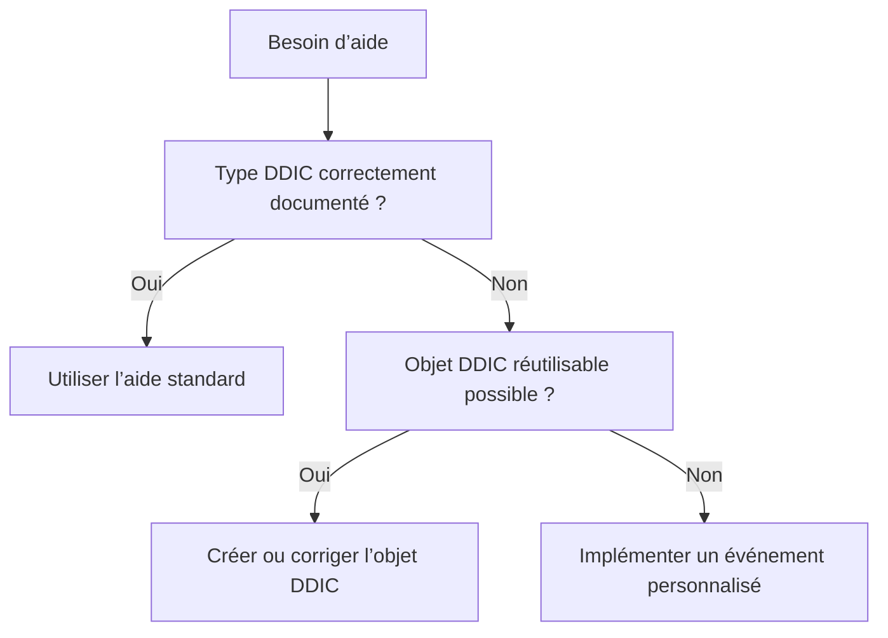

# 12. AIDES F1 ET F4

## 12.A RÉSULTAT ATTENDU

- Exploiter les aides issues du Dictionary ABAP[^terme-abap]
- Comprendre les événements d’aide personnalisée
- Fournir une aide F4[^terme-aide-f4] cohérente avec le type
- Fournir une aide F1[^terme-aide-f1] utile
- Éviter les listes de valeurs codées en dur

## 12.B AIDE AUTOMATIQUE DU DDIC

Un paramètre typé avec un élément de données[^terme-element-donnees] peut hériter :

- d’une documentation F1 ;
- d’une aide à la recherche F4 ;
- de valeurs fixes de domaine ;
- d’une routine de conversion[^terme-routine-conversion].

```abap
PARAMETERS p_carr TYPE scarr-carrid.
```

La première solution doit être de modéliser correctement l’objet DDIC[^terme-acro-ddic].

## 12.C AIDE F4 PERSONNALISÉE

```abap
AT SELECTION-SCREEN ON VALUE-REQUEST FOR p_file.
  PERFORM request_file CHANGING p_file.
```

L’événement est déclenché lorsque l’utilisateur demande l’aide à la saisie du champ.

La procédure peut appeler une API[^terme-api] standard adaptée au contexte. Vérifier sa compatibilité avec :

- SAP GUI[^terme-sap-gui] utilisé ;
- exécution en arrière-plan ;
- type du champ ;
- sécurité du poste utilisateur.

## 12.D AIDE F1 PERSONNALISÉE

```abap
AT SELECTION-SCREEN ON HELP-REQUEST FOR p_mode.
  MESSAGE text-h01 TYPE 'I'.
```

Cette solution convient à une aide courte. Pour une explication durable, maintenir la documentation DDIC ou la documentation du programme.

## 12.E PRIORITÉ DES SOLUTIONS



## 12.F ERREURS À ÉVITER

- présenter une valeur techniquement valide mais fonctionnellement interdite ;
- charger des milliers de valeurs sans filtre ;
- exécuter une sélection complète avant d’ouvrir l’aide ;
- dupliquer une aide déjà portée par le DDIC ;
- appeler une fonction frontend[^terme-frontend] dans un traitement destiné au background ;
- afficher des données sans contrôle d’autorisation.

## 12.G VÉRIFICATION

- Le contrôle syntaxique réussit.
- La version active correspond au code sauvegardé.
- L’exécution produit le résultat décrit dans le chapitre.
- Les cas vide, limite et erreur sont testés séparément lorsque la syntaxe le permet.

## 12.H ERREURS FRÉQUENTES

- Copier un exemple sans adapter les types, noms d’objets et données disponibles dans le système.
- Tester uniquement le cas nominal et ignorer les valeurs initiales, absentes ou invalides.
- Mettre une logique lourde dans les événements de validation de l’écran.
- Créer une variante contenant des valeurs obsolètes ou sensibles.

## 12.I SNIPPET À RÉUTILISER

> [!NOTE]
> Adapter les noms `Z*`, les types DDIC, les données et les autorisations au système cible. Effectuer un contrôle syntaxique avant activation.

```abap
AT SELECTION-SCREEN ON VALUE-REQUEST FOR p_file.
  PERFORM request_file CHANGING p_file.
```

## 12.J TERMES DU LEXIQUE

- [Programme exécutable](<../🧩 00 ├── LEXIQUE SAP ET ABAP/06 ├── PROGRAMMES CLASSES ET OBJETS TECHNIQUES.md#programme-executable>)
- [Variante](<../🧩 00 ├── LEXIQUE SAP ET ABAP/06 ├── PROGRAMMES CLASSES ET OBJETS TECHNIQUES.md#variante>)
- [Transaction](<../🧩 00 ├── LEXIQUE SAP ET ABAP/02 ├── SAP GUI NAVIGATION ET TRANSACTIONS.md#transaction>)
- [Dynpro](<../🧩 00 ├── LEXIQUE SAP ET ABAP/02 ├── SAP GUI NAVIGATION ET TRANSACTIONS.md#dynpro>)

## 12.K MODÈLE DE DÉMONSTRATION SFLIGHT

> [!NOTE]
> Les tables `SCARR`, `SPFLI` et `SFLIGHT` appartiennent au modèle de démonstration SAP et peuvent être absentes ou non alimentées dans certains systèmes. Dans ce cas, remplacer les exemples par une table Z de démonstration ou par une source en lecture seule autorisée, sans modifier une table applicative standard.

## 12.L RÉFÉRENCES OFFICIELLES SAP

- [PARAMETERS — ABAP Keyword Documentation](https://help.sap.com/doc/abapdocu_816_index_htm/8.16/en-US/ABAPPARAMETERS.html)
- [SELECT-OPTIONS, Value Options — ABAP Keyword Documentation](https://help.sap.com/doc/abapdocu_latest_index_htm/latest/en-US/abapselect-options_value.htm)
- [Selection Screen Processing — SAP Help Portal](https://help.sap.com/docs/SAP_NETWEAVER_700/a85596deeb19418982bee031d1fd1427/4a43c40d5a503f04e10000000a421937.html)


---

[Chapitre suivant — MODIFICATION DYNAMIQUE DE L’ÉCRAN](<./13 ├── MODIFICATION DYNAMIQUE DE L ECRAN.md>)

[^terme-abap]: **ABAP.** Langage de programmation de la plateforme ABAP, conçu pour développer des applications métier et techniques SAP. Voir [l’entrée du lexique](<../🧩 00 ├── LEXIQUE SAP ET ABAP/04 ├── LANGAGE ET DEVELOPPEMENT ABAP.md#abap>).
[^terme-aide-f4]: **AIDE F4.** Aide à la saisie proposant des valeurs autorisées ou recherchables. Voir [l’entrée du lexique](<../🧩 00 ├── LEXIQUE SAP ET ABAP/02 ├── SAP GUI NAVIGATION ET TRANSACTIONS.md#aide-f4>).
[^terme-aide-f1]: **AIDE F1.** Aide contextuelle expliquant un champ, une fonction ou un mot-clé. Voir [l’entrée du lexique](<../🧩 00 ├── LEXIQUE SAP ET ABAP/02 ├── SAP GUI NAVIGATION ET TRANSACTIONS.md#aide-f1>).
[^terme-element-donnees]: **ÉLÉMENT DE DONNÉES.** Objet DDIC qui attribue une signification métier, des libellés et une documentation à un type élémentaire ou à un domaine. Voir [l’entrée du lexique](<../🧩 00 ├── LEXIQUE SAP ET ABAP/05 ├── DONNEES DICTIONNAIRE ET BASE DE DONNEES.md#element-donnees>).
[^terme-routine-conversion]: **ROUTINE DE CONVERSION.** Mécanisme DDIC convertissant une valeur entre représentation interne et affichage externe. Voir [l’entrée du lexique](<../🧩 00 ├── LEXIQUE SAP ET ABAP/05 ├── DONNEES DICTIONNAIRE ET BASE DE DONNEES.md#routine-conversion>).
[^terme-acro-ddic]: **DDIC.** Data Dictionary, abréviation courante de l’ABAP Dictionary. Voir [l’entrée du lexique](<../🧩 00 ├── LEXIQUE SAP ET ABAP/10 └── ACRONYMES SAP.md#acro-ddic>).
[^terme-api]: **API.** Application Programming Interface, contrat exposant des opérations ou données utilisables par d’autres composants. Voir [l’entrée du lexique](<../🧩 00 ├── LEXIQUE SAP ET ABAP/10 └── ACRONYMES SAP.md#api>).
[^terme-sap-gui]: **SAP GUI.** Client graphique permettant d’utiliser les transactions et écrans d’un système SAP. Voir [l’entrée du lexique](<../🧩 00 ├── LEXIQUE SAP ET ABAP/02 ├── SAP GUI NAVIGATION ET TRANSACTIONS.md#sap-gui>).
[^terme-frontend]: **FRONTEND.** Poste ou couche cliente utilisée par l’utilisateur, par exemple SAP GUI for Windows. Voir [l’entrée du lexique](<../🧩 00 ├── LEXIQUE SAP ET ABAP/01 ├── SYSTEMES ENVIRONNEMENTS ET MANDANTS.md#frontend>).
