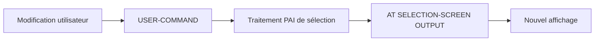

# 13. MODIFICATION DYNAMIQUE DE L’ÉCRAN

## 13.A RÉSULTAT ATTENDU

- Grouper des champs avec `MODIF ID`
- Modifier les propriétés avant affichage
- Utiliser la table système `SCREEN`
- Rafraîchir l’écran après une action utilisateur
- Éviter les écrans incohérents ou inaccessibles

## 13.B GROUPE DE MODIFICATION

```abap
PARAMETERS:
  p_detail AS CHECKBOX USER-COMMAND refresh,
  p_limit  TYPE i MODIF ID det.
```

`MODIF ID det` affecte le champ au groupe `DET`. L’identifiant comporte au maximum trois caractères significatifs pour le groupe d’écran.

## 13.C AT SELECTION-SCREEN OUTPUT

```abap
AT SELECTION-SCREEN OUTPUT.
  LOOP AT SCREEN.
    IF screen-group1 = 'DET'.
      IF p_detail = abap_true.
        screen-active = 1.
      ELSE.
        screen-active = 0.
      ENDIF.
      MODIFY SCREEN.
    ENDIF.
  ENDLOOP.
```

Cet événement correspond à la préparation de l’écran avant son affichage.

## 13.D PROPRIÉTÉS COURANTES

| Composant `SCREEN` | Effet général                                    |
| ------------------ | ------------------------------------------------ |
| `ACTIVE`           | Active ou désactive l’élément                    |
| `INPUT`            | Autorise ou interdit la saisie                   |
| `OUTPUT`           | Contrôle la restitution                          |
| `INVISIBLE`        | Masque le contenu ou l’élément selon le contexte |
| `REQUIRED`         | Marque le champ comme obligatoire                |
| `INTENSIFIED`      | Accentue l’affichage                             |
| `GROUP1`           | Groupe issu de `MODIF ID`                        |
| `NAME`             | Nom technique de l’élément                       |

Les interactions entre propriétés dépendent du type d’élément. Tester le comportement réel dans SAP GUI[^terme-sap-gui].

## 13.E RAFRAÎCHISSEMENT

`USER-COMMAND` sur une case à cocher ou un bouton radio déclenche un aller-retour vers le programme. Le prochain `AT SELECTION-SCREEN OUTPUT` peut alors reconstruire l’état des champs.



## 13.F RÈGLES DE SÉCURITÉ

- un champ masqué ne doit pas être considéré comme sécurisé ;
- une valeur désactivée doit encore être validée avant traitement ;
- ne pas rendre obligatoire un champ simultanément inactif ;
- conserver une logique déterministe ;
- éviter de modifier les éléments par leur nom si un groupe suffit ;
- ne pas réinitialiser les valeurs à chaque PBO.

## 13.G VÉRIFICATION

- Le contrôle syntaxique réussit.
- La version active correspond au code sauvegardé.
- L’exécution produit le résultat décrit dans le chapitre.
- Les cas vide, limite et erreur sont testés séparément lorsque la syntaxe le permet.

## 13.H ERREURS FRÉQUENTES

- Copier un exemple sans adapter les types, noms d’objets et données disponibles dans le système.
- Tester uniquement le cas nominal et ignorer les valeurs initiales, absentes ou invalides.
- Mettre une logique lourde dans les événements de validation de l’écran.
- Créer une variante contenant des valeurs obsolètes ou sensibles.

## 13.I SNIPPET À RÉUTILISER

> [!NOTE]
> Adapter les noms `Z*`, les types DDIC[^terme-acro-ddic], les données et les autorisations au système cible. Effectuer un contrôle syntaxique avant activation.

```abap
AT SELECTION-SCREEN OUTPUT.
  LOOP AT SCREEN.
    IF screen-group1 = 'DET'.
      IF p_detail = abap_true.
        screen-active = 1.
      ELSE.
        screen-active = 0.
      ENDIF.
      MODIFY SCREEN.
    ENDIF.
  ENDLOOP.
```

## 13.J TERMES DU LEXIQUE

- [Programme exécutable](<../🧩 00 ├── LEXIQUE SAP ET ABAP/06 ├── PROGRAMMES CLASSES ET OBJETS TECHNIQUES.md#programme-executable>)
- [Variante](<../🧩 00 ├── LEXIQUE SAP ET ABAP/06 ├── PROGRAMMES CLASSES ET OBJETS TECHNIQUES.md#variante>)
- [Transaction](<../🧩 00 ├── LEXIQUE SAP ET ABAP/02 ├── SAP GUI NAVIGATION ET TRANSACTIONS.md#transaction>)
- [Dynpro](<../🧩 00 ├── LEXIQUE SAP ET ABAP/02 ├── SAP GUI NAVIGATION ET TRANSACTIONS.md#dynpro>)

## 13.K RÉFÉRENCES OFFICIELLES SAP

- [SELECTION-SCREEN, MODIF ID — ABAP Keyword Documentation](https://help.sap.com/doc/abapdocu_latest_index_htm/latest/en-US/ABAPSELECTION-SCREEN_MODIF_ID.html)
- [Modifying Input Fields — SAP Help Portal](https://help.sap.com/saphelp_autoid2007/helpdata/EN/9f/dba70535c111d1829f0000e829fbfe/content.htm?no_cache=true)
- [Selection Screen Processing — SAP Help Portal](https://help.sap.com/docs/SAP_NETWEAVER_700/a85596deeb19418982bee031d1fd1427/4a43c40d5a503f04e10000000a421937.html)


---

[Chapitre suivant — VARIANTES DE SÉLECTION](<./14 ├── VARIANTES DE SELECTION.md>)

[^terme-sap-gui]: **SAP GUI.** Client graphique permettant d’utiliser les transactions et écrans d’un système SAP. Voir [l’entrée du lexique](<../🧩 00 ├── LEXIQUE SAP ET ABAP/02 ├── SAP GUI NAVIGATION ET TRANSACTIONS.md#sap-gui>).
[^terme-acro-ddic]: **DDIC.** Data Dictionary, abréviation courante de l’ABAP Dictionary. Voir [l’entrée du lexique](<../🧩 00 ├── LEXIQUE SAP ET ABAP/10 └── ACRONYMES SAP.md#acro-ddic>).
