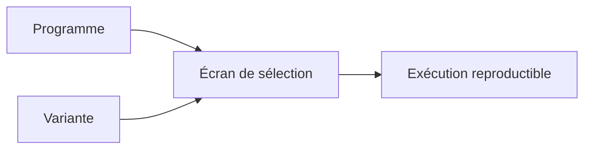

# 14. VARIANTES DE SÉLECTION

## 14.A RÉSULTAT ATTENDU

- Comprendre le rôle d’une variante
- Enregistrer un jeu de valeurs réutilisable
- Distinguer variante et variante d’affichage ALV[^terme-alv]
- Préparer une exécution récurrente ou en arrière-plan
- Gérer l’évolution du programme sans casser les variantes

## 14.B DÉFINITION

Une variante de sélection[^terme-variante] enregistre des valeurs et propriétés de l’écran de sélection d’un programme exécutable[^terme-programme-executable].



Une variante de sélection ne doit pas être confondue avec une variante de mise en page ALV.

## 14.C PROCESS

Depuis l’écran de sélection :

### 14.C.1 Étape 1 — Préparer une sélection représentative

Ouvrir le programme dans le système et le mandant[^terme-mandant] cibles. Saisir toutes les valeurs à mémoriser, y compris intervalles et exclusions, puis vérifier le récapitulatif de sélection avant l’enregistrement.

### 14.C.2 Étape 2 — Enregistrer la variante

Ouvrir la fonction **Variantes → Sauvegarder comme variante** depuis l’écran. Saisir un nom conforme à la convention, une description fonctionnelle et, si requis, le propriétaire ou le périmètre de protection.

### 14.C.3 Étape 3 — Définir les attributs des champs

Pour chaque champ, décider s’il doit être protégé, masqué, obligatoire ou alimenté dynamiquement. Ne protéger une valeur que si l’utilisateur ne doit réellement pas l’adapter.

### 14.C.4 Étape 4 — Sauvegarder et recharger

Enregistrer, quitter le programme puis le relancer en choisissant la variante. Comparer chaque paramètre et chaque ligne de `SELECT-OPTIONS` avec les valeurs préparées.

### 14.C.5 Étape 5 — Tester l’exécution réelle

Exécuter avec la variante et contrôler le périmètre traité. Pour une utilisation en job[^terme-job], tester la variante avec l’utilisateur d’exécution prévu et vérifier qu’aucune variable de sélection n’est résolue différemment.

La variante est validée lorsque son rechargement restitue exactement le périmètre autorisé et que son exécution produit le même résultat qu’une saisie manuelle équivalente.

La maintenance est également accessible depuis les fonctions de variantes de `SE38`[^outil-se38] ou `SA38`[^outil-sa38].

## 14.D USAGES

- exécutions manuelles répétitives ;
- jobs d’arrière-plan ;
- transactions associées à une variante ;
- appels `SUBMIT USING SELECTION-SET` ;
- jeux de test reproductibles.

## 14.E VALEURS DYNAMIQUES

Selon les possibilités du système et les attributs de variante, certaines valeurs peuvent être calculées dynamiquement, notamment des dates.

Ne pas remplacer une règle métier[^terme-regle-metier] complexe par une configuration de variante incompréhensible. Documenter les variables utilisées.

## 14.F ÉVOLUTION DU PROGRAMME

Une modification de l’écran peut affecter les variantes existantes :

- renommage d’un paramètre ;
- changement de type ;
- suppression d’un champ ;
- ajout d’un champ obligatoire ;
- modification des règles de validation.

Prévoir la compatibilité lors des évolutions productives.

## 14.G SÉCURITÉ

Ne jamais enregistrer dans une variante :

- mot de passe ;
- jeton ;
- secret technique ;
- donnée sensible sans justification et protection appropriée.

Une variante facilite l’entrée de valeurs ; elle ne crée aucune autorisation.

## 14.H TRANSPORT

Les possibilités de transport des variantes dépendent du type de variante, de son propriétaire et des procédures du système. Utiliser les fonctions standard de maintenance et l’ordre de transport[^terme-ordre-transport] prévu par le projet.

## 14.I VÉRIFICATION

- Le lecteur peut expliquer la différence entre cette notion et les concepts proches.
- Le choix technique est justifié par un besoin concret, pas uniquement par habitude.
- Les limites liées à la release, aux autorisations et au contexte d’exécution sont identifiées.

## 14.J ERREURS FRÉQUENTES

- Mettre une logique lourde dans les événements de validation de l’écran.
- Créer une variante contenant des valeurs obsolètes ou sensibles.

## 14.K FICHE DE CONTRÔLE À COPIER

```text
Système / SID       :
Mandant             :
Utilisateur         :
Transaction / outil :
Objet technique     :
Jeu de données      :
Résultat attendu    :
Résultat observé    :
Horodatage          :
Ordre de transport  :
```

## 14.L TERMES DU LEXIQUE

- [Variante](<../🧩 00 ├── LEXIQUE SAP ET ABAP/06 ├── PROGRAMMES CLASSES ET OBJETS TECHNIQUES.md#variante>)
- [Programme exécutable](<../🧩 00 ├── LEXIQUE SAP ET ABAP/06 ├── PROGRAMMES CLASSES ET OBJETS TECHNIQUES.md#programme-executable>)
- [Transaction](<../🧩 00 ├── LEXIQUE SAP ET ABAP/02 ├── SAP GUI NAVIGATION ET TRANSACTIONS.md#transaction>)
- [Dynpro](<../🧩 00 ├── LEXIQUE SAP ET ABAP/02 ├── SAP GUI NAVIGATION ET TRANSACTIONS.md#dynpro>)

## 14.M RÉFÉRENCES OFFICIELLES SAP

- [Variant Maintenance — SAP Help Portal](https://help.sap.com/saphelp_ewm900/helpdata/en/c0/980374e58611d194cc00a0c94260a5/content.htm)
- [Understanding the Concept of Background Processing — SAP Learning](https://learning.sap.com/courses/technical-implementation-and-operation-ii-of-sap-s-4hana-and-sap-business-suite/understanding-the-concept-of-background-processing-1)
- [SUBMIT — ABAP Keyword Documentation](https://help.sap.com/doc/abapdocu_latest_index_htm/latest/en-US/ABAPSUBMIT_SHORTREF.html)

---

[Chapitre suivant — APPEL D’UN RAPPORT AVEC SUBMIT](<./15 ├── APPEL D UN RAPPORT AVEC SUBMIT.md>)

[^terme-alv]: **ALV.** ABAP List Viewer, ensemble de technologies d’affichage tabulaire avec tri, filtre, total et variantes. Voir [l’entrée du lexique](<../🧩 00 ├── LEXIQUE SAP ET ABAP/06 ├── PROGRAMMES CLASSES ET OBJETS TECHNIQUES.md#alv>).
[^terme-variante]: **VARIANTE.** Enregistrement réutilisable des valeurs d’un écran de sélection. Voir [l’entrée du lexique](<../🧩 00 ├── LEXIQUE SAP ET ABAP/06 ├── PROGRAMMES CLASSES ET OBJETS TECHNIQUES.md#variante>).
[^terme-programme-executable]: **PROGRAMME EXÉCUTABLE.** Programme ABAP de type report pouvant être lancé directement, généralement avec `F8` ou par une transaction. Voir [l’entrée du lexique](<../🧩 00 ├── LEXIQUE SAP ET ABAP/06 ├── PROGRAMMES CLASSES ET OBJETS TECHNIQUES.md#programme-executable>).
[^terme-mandant]: **MANDANT.** Subdivision logique d’un système SAP. Il est identifié par un numéro à trois chiffres et isole une partie des données, du paramétrage et des utilisateurs. Voir [l’entrée du lexique](<../🧩 00 ├── LEXIQUE SAP ET ABAP/01 ├── SYSTEMES ENVIRONNEMENTS ET MANDANTS.md#mandant>).
[^terme-job]: **JOB.** Traitement planifié en arrière-plan composé d’une ou plusieurs étapes. Voir [l’entrée du lexique](<../🧩 00 ├── LEXIQUE SAP ET ABAP/06 ├── PROGRAMMES CLASSES ET OBJETS TECHNIQUES.md#job>).
[^terme-regle-metier]: **RÈGLE MÉTIER.** Condition ou calcul imposé par le processus fonctionnel. Voir [l’entrée du lexique](<../🧩 00 ├── LEXIQUE SAP ET ABAP/09 ├── NOTIONS FONCTIONNELLES ET ORGANISATIONNELLES.md#regle-metier>).
[^terme-ordre-transport]: **ORDRE DE TRANSPORT.** Conteneur qui regroupe des modifications à exporter puis importer dans d’autres systèmes. Voir [l’entrée du lexique](<../🧩 00 ├── LEXIQUE SAP ET ABAP/03 ├── REPOSITORY PACKAGES ET TRANSPORTS.md#ordre-transport>).

[^outil-se38]: **SE38.** Éditeur ABAP classique utilisé pour créer, modifier, vérifier et exécuter des programmes. Voir [le chapitre associé](<../🧩 01 ├── FONDAMENTAUX ABAP/04 ├── EDITEURS ABAP SE38 ET SE80.md>).
[^outil-sa38]: **SA38.** Transaction d’exécution d’un programme ABAP sans accès direct à son édition. Voir [le chapitre associé](<../🧩 01 ├── FONDAMENTAUX ABAP/04 ├── EDITEURS ABAP SE38 ET SE80.md>).
