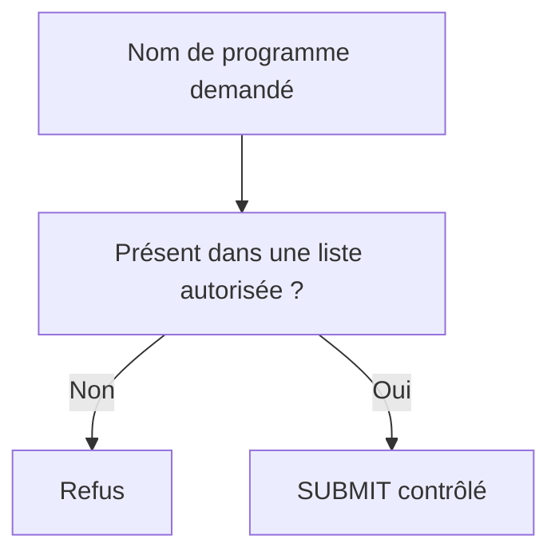

# 15. APPEL D’UN RAPPORT AVEC SUBMIT

## 15.A RÉSULTAT ATTENDU

- Appeler un programme exécutable[^terme-programme-executable] depuis ABAP[^terme-abap]
- Transmettre des paramètres et critères
- Revenir au programme appelant
- Utiliser une variante ou une table de sélection
- Maîtriser les risques des appels dynamiques

## 15.B APPEL SIMPLE

```abap
SUBMIT zdev_target
  WITH p_carr = p_carr
  AND RETURN.
```

`AND RETURN` restitue le contrôle au programme appelant après l’exécution du programme cible.

Sans cette addition, l’appel se comporte comme un remplacement du programme courant dans la chaîne d’appel.

## 15.C TRANSMETTRE UN SELECT-OPTIONS

```abap
SUBMIT zdev_target
  WITH s_carr IN s_carr
  AND RETURN.
```

Les noms `p_carr` et `s_carr` à gauche correspondent aux éléments de sélection du programme cible.

## 15.D UTILISER UNE VARIANTE

```abap
SUBMIT zdev_target
  USING SELECTION-SET 'Z_DAILY_RUN'
  AND RETURN.
```

La variante doit appartenir au programme appelé et rester compatible avec son écran de sélection.

## 15.E TABLE DE SÉLECTION DYNAMIQUE

La structure standard `RSPARAMS` permet de construire une interface de sélection dynamique.

```abap
DATA lt_selection TYPE STANDARD TABLE OF rsparams WITH EMPTY KEY.

APPEND VALUE #(
  selname = 'P_CARR'
  kind    = 'P'
  low     = 'LH'
) TO lt_selection.

APPEND VALUE #(
  selname = 'S_CONN'
  kind    = 'S'
  sign    = 'I'
  option  = 'BT'
  low     = '0400'
  high    = '0500'
) TO lt_selection.

SUBMIT zdev_target
  WITH SELECTION-TABLE lt_selection
  AND RETURN.
```

## 15.F AFFICHER L’ÉCRAN DU PROGRAMME CIBLE

L’addition `VIA SELECTION-SCREEN` demande le traitement de l’écran de sélection du programme appelé.

```abap
SUBMIT zdev_target
  VIA SELECTION-SCREEN
  AND RETURN.
```

Cette forme impose une interaction utilisateur et n’est pas adaptée à tous les contextes.

## 15.G SORTIE DE LISTE

`SUBMIT` permet aussi d’exporter une liste classique vers la mémoire ABAP ou le spool[^terme-spool] avec des additions dédiées. Cette technique est spécifique aux listes classiques.

Pour échanger des données structurées, préférer une interface de procédure ou de classe[^terme-classe] explicitement typée.

## 15.H APPEL DYNAMIQUE

Un nom de programme peut être déterminé dynamiquement. Ne jamais exécuter directement une valeur fournie par un utilisateur ou une source externe.



## 15.I VÉRIFICATION

- Le contrôle syntaxique réussit.
- La version active correspond au code sauvegardé.
- L’exécution produit le résultat décrit dans le chapitre.
- Les cas vide, limite et erreur sont testés séparément lorsque la syntaxe le permet.

## 15.J ERREURS FRÉQUENTES

- Copier un exemple sans adapter les types, noms d’objets et données disponibles dans le système.
- Tester uniquement le cas nominal et ignorer les valeurs initiales, absentes ou invalides.
- Mettre une logique lourde dans les événements de validation de l’écran.
- Créer une variante contenant des valeurs obsolètes ou sensibles.

## 15.K SNIPPET À RÉUTILISER

> [!NOTE]
> Adapter les noms `Z*`, les types DDIC[^terme-acro-ddic], les données et les autorisations au système cible. Effectuer un contrôle syntaxique avant activation.

```abap
DATA lt_selection TYPE STANDARD TABLE OF rsparams WITH EMPTY KEY.

APPEND VALUE #(
  selname = 'P_CARR'
  kind    = 'P'
  low     = 'LH'
) TO lt_selection.

APPEND VALUE #(
  selname = 'S_CONN'
  kind    = 'S'
  sign    = 'I'
  option  = 'BT'
  low     = '0400'
  high    = '0500'
) TO lt_selection.

SUBMIT zdev_target
  WITH SELECTION-TABLE lt_selection
  AND RETURN.
```

## 15.L TERMES DU LEXIQUE

- [Programme exécutable](<../🧩 00 ├── LEXIQUE SAP ET ABAP/06 ├── PROGRAMMES CLASSES ET OBJETS TECHNIQUES.md#programme-executable>)
- [Variante](<../🧩 00 ├── LEXIQUE SAP ET ABAP/06 ├── PROGRAMMES CLASSES ET OBJETS TECHNIQUES.md#variante>)
- [Transaction](<../🧩 00 ├── LEXIQUE SAP ET ABAP/02 ├── SAP GUI NAVIGATION ET TRANSACTIONS.md#transaction>)
- [Dynpro](<../🧩 00 ├── LEXIQUE SAP ET ABAP/02 ├── SAP GUI NAVIGATION ET TRANSACTIONS.md#dynpro>)

## 15.M RÉFÉRENCES OFFICIELLES SAP

- [SUBMIT — ABAP Keyword Documentation](https://help.sap.com/doc/abapdocu_latest_index_htm/latest/en-US/ABAPSUBMIT_SHORTREF.html)
- [SUBMIT, Selection Screen Interface — ABAP Keyword Documentation](https://help.sap.com/doc/abapdocu_latest_index_htm/latest/en-US/ABAPSUBMIT_INTERFACE.html)
- [CALL SELECTION-SCREEN — ABAP Keyword Documentation](https://help.sap.com/doc/abapdocu_816_index_htm/8.16/en-US/ABAPCALL_SELECTION_SCREEN.html)


---

[Chapitre suivant — SORTIE D’UN PROGRAMME EXÉCUTABLE](<./16 ├── SORTIE D UN PROGRAMME EXECUTABLE.md>)

[^terme-programme-executable]: **PROGRAMME EXÉCUTABLE.** Programme ABAP de type report pouvant être lancé directement, généralement avec `F8` ou par une transaction. Voir [l’entrée du lexique](<../🧩 00 ├── LEXIQUE SAP ET ABAP/06 ├── PROGRAMMES CLASSES ET OBJETS TECHNIQUES.md#programme-executable>).
[^terme-abap]: **ABAP.** Langage de programmation de la plateforme ABAP, conçu pour développer des applications métier et techniques SAP. Voir [l’entrée du lexique](<../🧩 00 ├── LEXIQUE SAP ET ABAP/04 ├── LANGAGE ET DEVELOPPEMENT ABAP.md#abap>).
[^terme-spool]: **SPOOL.** Infrastructure stockant et acheminant les sorties imprimables produites par les traitements SAP. Voir [l’entrée du lexique](<../🧩 00 ├── LEXIQUE SAP ET ABAP/06 ├── PROGRAMMES CLASSES ET OBJETS TECHNIQUES.md#spool>).
[^terme-classe]: **CLASSE.** Modèle orienté objet définissant état et comportements. Voir [l’entrée du lexique](<../🧩 00 ├── LEXIQUE SAP ET ABAP/04 ├── LANGAGE ET DEVELOPPEMENT ABAP.md#classe>).
[^terme-acro-ddic]: **DDIC.** Data Dictionary, abréviation courante de l’ABAP Dictionary. Voir [l’entrée du lexique](<../🧩 00 ├── LEXIQUE SAP ET ABAP/10 └── ACRONYMES SAP.md#acro-ddic>).
