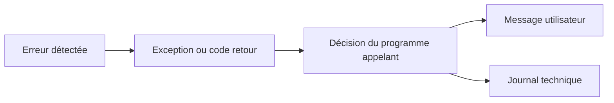

# 1. PRINCIPES DE GESTION DES ERREURS

## 1.A RÉSULTAT ATTENDU

- Distinguer message, code retour, exception[^terme-exception] et erreur d’exécution
- Choisir un mécanisme adapté au contexte
- Séparer détection, propagation et présentation
- Éviter les erreurs silencieuses
- Construire un traitement exploitable en dialogue et en arrière-plan

## 1.B QUATRE MÉCANISMES À NE PAS CONFONDRE

| Mécanisme              | Usage principal                                       |
| ---------------------- | ----------------------------------------------------- |
| Message `MESSAGE`      | Informer l’utilisateur ou piloter un écran SAP GUI[^terme-sap-gui]    |
| Code retour `sy-subrc` | Contrôler immédiatement le résultat d’une instruction |
| Exception de classe[^terme-classe]    | Signaler et propager une erreur entre procédures      |
| Erreur d’exécution     | Arrêt non géré analysable notamment dans `ST22`[^outil-st22]       |

Un même incident peut traverser plusieurs couches. Une méthode[^terme-methode] peut lever une exception, le programme appelant peut l’intercepter, puis convertir son texte en message utilisateur.



## 1.C DÉTECTION

Une erreur doit être détectée au plus près de sa cause :

- contrôle d’une donnée d’entrée ;
- absence d’un enregistrement attendu ;
- conversion impossible ;
- autorisation refusée ;
- incohérence d’un état interne ;
- échec d’une opération technique.

La détection ne doit pas être retardée jusqu’à une ligne de code qui ne connaît plus la cause réelle.

## 1.D PROPAGATION

La couche qui détecte l’erreur ne sait pas toujours comment la présenter. Elle doit alors transmettre une information structurée au niveau supérieur.

```abap
" Propager ou traiter l’erreur au niveau qui sait prendre une décision.
METHOD read_product.
  IF iv_matnr IS INITIAL.
    RAISE EXCEPTION TYPE zcx_dev_invalid_input.
  ENDIF.
ENDMETHOD.
```

L’appelant décide ensuite de poursuivre, corriger, annuler ou présenter un message.

## 1.E PRÉSENTATION

Une couche métier réutilisable ne doit pas dépendre inutilement d’un écran SAP GUI. Éviter d’y placer directement des messages modaux ou des interactions utilisateur.

```abap
" Exemple à éviter : comparer avec la correction décrite après le bloc.
TRY.
    lo_service->process( iv_matnr = p_matnr ).
  CATCH zcx_dev_error INTO DATA(lx_error).
    MESSAGE lx_error->get_text( ) TYPE 'E'.
ENDTRY.
```

La classe métier fournit l’erreur. Le programme exécutable[^terme-programme-executable] choisit le type de message adapté à son contexte.

## 1.F ERREUR ATTENDUE ET DÉFAUT DE PROGRAMMATION

| Situation                            | Traitement adapté                                            |
| ------------------------------------ | ------------------------------------------------------------ |
| Donnée saisie invalide               | Message contrôlé ou exception métier                         |
| Enregistrement absent                | Code retour ou exception selon l’interface                   |
| Division par zéro imprévue           | Exception système à intercepter si une réaction est possible |
| État interne impossible              | Assertion ou exception technique                             |
| Corruption empêchant toute poursuite | Arrêt contrôlé et analyse technique                          |

Ne pas utiliser un dump pour une erreur fonctionnelle prévisible. Ne pas masquer un défaut de programmation sous un message générique.

## 1.G RÈGLE DE BASE

Une erreur doit toujours produire au moins un résultat exploitable :

- réaction immédiate ;
- exception propagée ;
- message utilisateur ;
- trace[^terme-trace] technique ;
- arrêt explicite.

Une instruction échouée suivie d’une poursuite silencieuse est généralement plus dangereuse qu’un arrêt clair.

## 1.H PROCESS

### 1.H.1 Étape 1 — Reproduire et horodater l’erreur

Noter système, mandant[^terme-mandant], utilisateur, transaction, date, heure, saisie et dernière action effectuée. Si l’erreur est reproductible sans effet métier supplémentaire, la reproduire une seule fois pour obtenir un horodatage précis.

### 1.H.2 Étape 2 — Déterminer le canal d’erreur

Rechercher d’abord le résultat observable : message applicatif, exception interceptée, journal `SLG1`[^outil-slg1], échec de job[^terme-job], erreur RFC[^terme-rfc] ou dump. Ouvrir `ST22` uniquement lorsqu’un arrêt d’exécution non intercepté est plausible.

### 1.H.3 Étape 3 — Rechercher le dump dans ST22

1. Saisir `/nST22`.
2. Choisir la date et l’intervalle correspondant à la reproduction.
3. Filtrer avec l’utilisateur et, si connu, le runtime error.
4. Ouvrir l’entrée dont l’horodatage et le contexte correspondent exactement au test.

Plusieurs dumps du même nom peuvent avoir des causes fonctionnelles différentes. Ne pas analyser un dump uniquement parce que son titre ressemble au symptôme.

### 1.H.4 Étape 4 — Relever la cause technique

Lire **Error analysis**, **How to correct the error**, exception, programme actif, include, ligne et extrait source. Examiner ensuite la pile d’appels pour trouver le premier objet client ou point d’extension responsable.

### 1.H.5 Étape 5 — Corréler avec les données et la version

Comparer les variables ou clés mentionnées avec la saisie du test. Ouvrir la version active de la ligne source et vérifier qu’elle correspond à l’extrait du dump.

### 1.H.6 Étape 6 — Corriger puis tester les deux chemins

Corriger la cause dans l’objet responsable, puis exécuter le cas ayant échoué et un cas nominal. Le diagnostic est terminé lorsque le dump ne réapparaît pas et que l’erreur fonctionnelle est désormais traitée par un message, une exception ou un résultat contrôlé.

## 1.I VÉRIFICATION

- Le scénario reproduit correspond au même utilisateur, mandant, transaction et jeu de données.
- L’horodatage et l’identifiant de l’analyse sont conservés.
- La cause retenue est soutenue par une ligne source, une trace ou une valeur observée.
- Après correction, le même scénario ne reproduit plus le défaut et le résultat métier reste identique.

## 1.J ERREURS FRÉQUENTES

- Copier un exemple sans adapter les types, noms d’objets et données disponibles dans le système.
- Tester uniquement le cas nominal et ignorer les valeurs initiales, absentes ou invalides.
- Afficher un message technique incompréhensible à l’utilisateur.
- Attraper une exception sans action ni propagation.

## 1.K SNIPPET À RÉUTILISER

> [!NOTE]
> Adapter les noms `Z*`, les types DDIC[^terme-acro-ddic], les données et les autorisations au système cible. Effectuer un contrôle syntaxique avant activation.

```abap
" Propager ou traiter l’erreur au niveau qui sait prendre une décision.
METHOD read_product.
  IF iv_matnr IS INITIAL.
    RAISE EXCEPTION TYPE zcx_dev_invalid_input.
  ENDIF.
ENDMETHOD.
```

## 1.L TERMES DU LEXIQUE

- [Exception](<../🧩 00 ├── LEXIQUE SAP ET ABAP/04 ├── LANGAGE ET DEVELOPPEMENT ABAP.md#exception>)
- [Dump ABAP](<../🧩 00 ├── LEXIQUE SAP ET ABAP/08 ├── EXECUTION EXPLOITATION ET ADMINISTRATION.md#dump-abap>)

## 1.M RÉFÉRENCES OFFICIELLES SAP

- [MESSAGE — ABAP Keyword Documentation](https://help.sap.com/doc/abapdocu_latest_index_htm/latest/en-US/ABAPMESSAGE_SHORTREF.html)
- [Return Code — ABAP Programming Guideline](https://help.sap.com/doc/abapdocu_latest_index_htm/latest/en-US/ABENRETURN_CODE_GUIDL.html)
- [System Response After a Class-Based Exception — ABAP Keyword Documentation](https://help.sap.com/doc/abapdocu_latest_index_htm/latest/en-US/ABENEXCEPTIONS_SYSTEM_RESPONSE.html)

---

[Chapitre suivant — CLASSES DE MESSAGES ET TRANSACTION SE91](<./02 ├── CLASSES DE MESSAGES ET TRANSACTION SE91.md>)

[^terme-exception]: **EXCEPTION.** Objet ou signal représentant une situation anormale qu’un appelant peut traiter. Voir [l’entrée du lexique](<../🧩 00 ├── LEXIQUE SAP ET ABAP/04 ├── LANGAGE ET DEVELOPPEMENT ABAP.md#exception>).
[^terme-sap-gui]: **SAP GUI.** Client graphique permettant d’utiliser les transactions et écrans d’un système SAP. Voir [l’entrée du lexique](<../🧩 00 ├── LEXIQUE SAP ET ABAP/02 ├── SAP GUI NAVIGATION ET TRANSACTIONS.md#sap-gui>).
[^terme-classe]: **CLASSE.** Modèle orienté objet définissant état et comportements. Voir [l’entrée du lexique](<../🧩 00 ├── LEXIQUE SAP ET ABAP/04 ├── LANGAGE ET DEVELOPPEMENT ABAP.md#classe>).
[^terme-methode]: **MÉTHODE.** Comportement déclaré dans une classe ou une interface et appelé avec une liste de paramètres définie. Voir [l’entrée du lexique](<../🧩 00 ├── LEXIQUE SAP ET ABAP/04 ├── LANGAGE ET DEVELOPPEMENT ABAP.md#methode>).
[^terme-programme-executable]: **PROGRAMME EXÉCUTABLE.** Programme ABAP de type report pouvant être lancé directement, généralement avec `F8` ou par une transaction. Voir [l’entrée du lexique](<../🧩 00 ├── LEXIQUE SAP ET ABAP/06 ├── PROGRAMMES CLASSES ET OBJETS TECHNIQUES.md#programme-executable>).
[^terme-trace]: **TRACE.** Enregistrement détaillé d’événements techniques pour analyser exécution, SQL ou appels. Voir [l’entrée du lexique](<../🧩 00 ├── LEXIQUE SAP ET ABAP/08 ├── EXECUTION EXPLOITATION ET ADMINISTRATION.md#trace>).
[^terme-mandant]: **MANDANT.** Subdivision logique d’un système SAP. Il est identifié par un numéro à trois chiffres et isole une partie des données, du paramétrage et des utilisateurs. Voir [l’entrée du lexique](<../🧩 00 ├── LEXIQUE SAP ET ABAP/01 ├── SYSTEMES ENVIRONNEMENTS ET MANDANTS.md#mandant>).
[^terme-job]: **JOB.** Traitement planifié en arrière-plan composé d’une ou plusieurs étapes. Voir [l’entrée du lexique](<../🧩 00 ├── LEXIQUE SAP ET ABAP/06 ├── PROGRAMMES CLASSES ET OBJETS TECHNIQUES.md#job>).
[^terme-rfc]: **RFC.** Remote Function Call, mécanisme permettant d’appeler un module fonction compatible dans un autre contexte ou système. Voir [l’entrée du lexique](<../🧩 00 ├── LEXIQUE SAP ET ABAP/06 ├── PROGRAMMES CLASSES ET OBJETS TECHNIQUES.md#rfc>).
[^terme-acro-ddic]: **DDIC.** Data Dictionary, abréviation courante de l’ABAP Dictionary. Voir [l’entrée du lexique](<../🧩 00 ├── LEXIQUE SAP ET ABAP/10 └── ACRONYMES SAP.md#acro-ddic>).

[^outil-st22]: **ST22.** Transaction d’analyse des terminaisons anormales et dumps ABAP. Voir [le chapitre associé](<../🧩 11 ├── DEBUG ET ANALYSE/13 ├── ANALYSER LES DUMPS AVEC ST22.md>).
[^outil-slg1]: **SLG1.** Transaction de recherche et d’affichage des journaux applicatifs persistés. Voir [le chapitre associé](<../🧩 19 ├── JOURNAUX APPLICATIFS/05 ├── ANALYSER LES JOURNAUX AVEC SLG1.md>).
