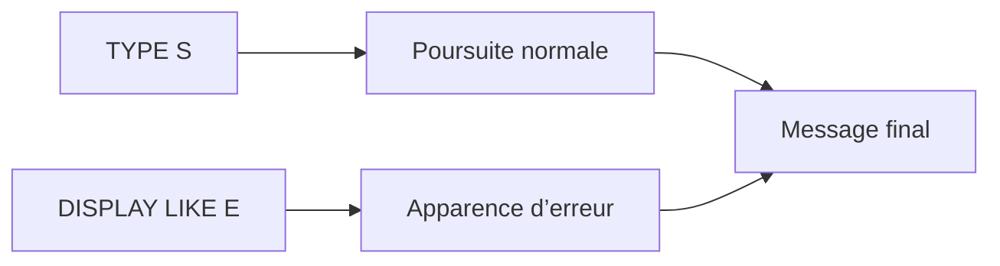

# 6. MESSAGE INTO ET DISPLAY LIKE

## 6.A RÉSULTAT ATTENDU

- Construire un texte sans afficher de message
- Utiliser `MESSAGE ... INTO`
- Modifier uniquement l’apparence avec `DISPLAY LIKE`
- Éviter de confondre type réel et apparence
- Préparer des textes pour un log ou une exception[^terme-exception]

## 6.B CONSTRUIRE LE TEXTE AVEC INTO

```abap
" Exemple à éviter : comparer avec la correction décrite après le bloc.
DATA lv_text TYPE string.

MESSAGE e001(zdev_msg)
  WITH lv_matnr
  INTO lv_text.
```

L’ajout `INTO` renvoie le texte formaté dans une variable au lieu de déclencher le comportement normal d’affichage du type indiqué.

Cette forme est utile pour :

- alimenter un journal ;
- construire un résultat d’API[^terme-api] ;
- transmettre un texte à une exception ;
- préparer une liste de messages ;
- tester le rendu d’un message.

## 6.C LE TYPE RESTE NÉCESSAIRE

Même avec `INTO`, la syntaxe exige un type de message. Il sert notamment à renseigner le contexte de message dans les champs système.

```abap
MESSAGE ID lv_msgid
        TYPE lv_msgty
      NUMBER lv_msgno
        WITH lv_msgv1 lv_msgv2
        INTO lv_text.
```

## 6.D DISPLAY LIKE

```abap
MESSAGE s006(zdev_msg) DISPLAY LIKE 'E'.
```

Le message conserve le comportement du type `S`, mais il est affiché avec l’apparence du type `E`.

Cette distinction est essentielle :



## 6.E USAGE PRUDENT DE DISPLAY LIKE

`DISPLAY LIKE` peut être utile pour signaler visuellement une anomalie sans modifier le flux. Il ne doit pas servir à contourner une stratégie de gestion des erreurs incohérente.

Un message présenté comme une erreur mais suivi d’une validation métier peut tromper l’utilisateur.

## 6.F EXEMPLE DE FIN DE TRAITEMENT PARTIEL

```abap
IF lv_error_count = 0.
  MESSAGE s003(zdev_msg) WITH lv_success_count.
ELSE.
  MESSAGE s007(zdev_msg)
    WITH lv_success_count lv_error_count
    DISPLAY LIKE 'W'.
ENDIF.
```

Le type réel reste `S` afin de terminer normalement. L’apparence avertit que le résultat est partiel.

## 6.G MESSAGE INTO OU EXCEPTION

Utiliser `MESSAGE ... INTO` pour produire un texte. Utiliser une exception pour signaler une erreur entre procédures.

Ne pas remplacer une exception structurée par une simple chaîne si l’appelant doit identifier la nature de l’erreur.

## 6.H VÉRIFICATION

- Le contrôle syntaxique réussit.
- La version active correspond au code sauvegardé.
- L’exécution produit le résultat décrit dans le chapitre.
- Les cas vide, limite et erreur sont testés séparément lorsque la syntaxe le permet.

## 6.I ERREURS FRÉQUENTES

- Copier un exemple sans adapter les types, noms d’objets et données disponibles dans le système.
- Tester uniquement le cas nominal et ignorer les valeurs initiales, absentes ou invalides.
- Afficher un message technique incompréhensible à l’utilisateur.
- Attraper une exception sans action ni propagation.

## 6.J SNIPPET À RÉUTILISER

> [!NOTE]
> Adapter les noms `Z*`, les types DDIC[^terme-acro-ddic], les données et les autorisations au système cible. Effectuer un contrôle syntaxique avant activation.

```abap
IF lv_error_count = 0.
  MESSAGE s003(zdev_msg) WITH lv_success_count.
ELSE.
  MESSAGE s007(zdev_msg)
    WITH lv_success_count lv_error_count
    DISPLAY LIKE 'W'.
ENDIF.
```

## 6.K TERMES DU LEXIQUE

- [Exception](<../🧩 00 ├── LEXIQUE SAP ET ABAP/04 ├── LANGAGE ET DEVELOPPEMENT ABAP.md#exception>)
- [Dump ABAP](<../🧩 00 ├── LEXIQUE SAP ET ABAP/08 ├── EXECUTION EXPLOITATION ET ADMINISTRATION.md#dump-abap>)

## 6.L RÉFÉRENCES OFFICIELLES SAP

- [MESSAGE — ABAP Keyword Documentation](https://help.sap.com/doc/abapdocu_latest_index_htm/latest/en-US/ABAPMESSAGE_SHORTREF.html)
- [Messages and Message Classes — SAP Help Portal](https://help.sap.com/docs/ABAP_PLATFORM_NEW/c238d694b825421f940829321ffa326a/4ec242f66e391014adc9fffe4e204223.html)


---

[Chapitre suivant — CODES RETOUR ET SY-SUBRC](<./07 ├── CODES RETOUR ET SY SUBRC.md>)

[^terme-exception]: **EXCEPTION.** Objet ou signal représentant une situation anormale qu’un appelant peut traiter. Voir [l’entrée du lexique](<../🧩 00 ├── LEXIQUE SAP ET ABAP/04 ├── LANGAGE ET DEVELOPPEMENT ABAP.md#exception>).
[^terme-api]: **API.** Application Programming Interface, contrat exposant des opérations ou données utilisables par d’autres composants. Voir [l’entrée du lexique](<../🧩 00 ├── LEXIQUE SAP ET ABAP/10 └── ACRONYMES SAP.md#api>).
[^terme-acro-ddic]: **DDIC.** Data Dictionary, abréviation courante de l’ABAP Dictionary. Voir [l’entrée du lexique](<../🧩 00 ├── LEXIQUE SAP ET ABAP/10 └── ACRONYMES SAP.md#acro-ddic>).
