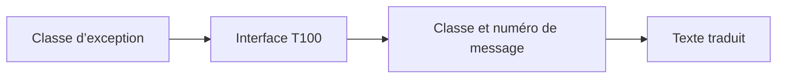

# 12. TEXTES D’EXCEPTION ET INTERFACES T100

## 12.A RÉSULTAT ATTENDU

- Associer une exception[^terme-exception] à une classe[^terme-classe] de messages
- Comprendre `IF_T100_MESSAGE`
- Comprendre `IF_T100_DYN_MSG`
- Récupérer un texte traduit
- Réutiliser un message intercepté

## 12.B POURQUOI UTILISER T100

Une exception doit fournir un texte compréhensible, stable et traduisible. Les messages T100 répondent à ce besoin.



## 12.C IF_T100_MESSAGE

L’interface `IF_T100_MESSAGE` permet d’associer des identifiants de texte définis dans la classe d’exception à des messages T100.

Lors de la création de la classe d’exception dans le Workbench, les outils SAP[^terme-acro-sap] peuvent générer les éléments nécessaires selon les options choisies.

L’appelant peut ensuite récupérer le texte :

```abap
" Propager ou traiter l’erreur au niveau qui sait prendre une décision.
CATCH zcx_dev_product_not_found INTO DATA(lx_not_found).
  DATA(lv_text) = lx_not_found->get_text( ).
```

## 12.D IF_T100_DYN_MSG

L’interface `IF_T100_DYN_MSG` étend le mécanisme pour permettre l’association dynamique d’un message T100 à l’exception.

Exemple conceptuel :

```abap
" Propager ou traiter l’erreur au niveau qui sait prendre une décision.
RAISE EXCEPTION TYPE zcx_dev_error
  MESSAGE ID 'ZDEV_MSG'
          TYPE 'E'
        NUMBER '001'
          WITH iv_matnr.
```

La disponibilité exacte de certaines formes syntaxiques dépend de la version ABAP[^terme-abap]. Vérifier la documentation du système cible.

## 12.E RÉUTILISER UN MESSAGE EXISTANT

Une couche peut intercepter un message ou une erreur provenant d’une API[^terme-api], puis la représenter sous forme d’exception sans perdre :

- la classe ;
- le numéro ;
- les variables ;
- le texte traduit ;
- la cause précédente.

Cette conservation est préférable à la création d’un texte générique comme `Erreur technique`.

## 12.F TEXTID

Une classe d’exception peut définir plusieurs constantes `TEXTID`, chaque constante représentant une situation précise.

```abap
" Propager ou traiter l’erreur au niveau qui sait prendre une décision.
RAISE EXCEPTION TYPE zcx_dev_product
  EXPORTING
    textid = zcx_dev_product=>not_found
    matnr  = iv_matnr.
```

Le `TEXTID` rend l’erreur identifiable sans analyser son texte.

## 12.G GET_TEXT ET GET_LONGTEXT

Les exceptions héritent de fonctionnalités permettant d’obtenir leur texte. Le texte court sert à la restitution immédiate. Un texte long peut fournir des informations complémentaires si la classe et son référentiel le prévoient.

Le programme ne doit pas dépendre du contenu littéral du texte pour prendre une décision.

Mauvais :

```abap
IF lx_error->get_text( ) CS 'introuvable'.
```

Correct : intercepter une classe ou analyser un identifiant stable.

## 12.H VÉRIFICATION

- Le contrôle syntaxique réussit.
- La version active correspond au code sauvegardé.
- L’exécution produit le résultat décrit dans le chapitre.
- Les cas vide, limite et erreur sont testés séparément lorsque la syntaxe le permet.

## 12.I ERREURS FRÉQUENTES

- Copier un exemple sans adapter les types, noms d’objets et données disponibles dans le système.
- Tester uniquement le cas nominal et ignorer les valeurs initiales, absentes ou invalides.
- Afficher un message technique incompréhensible à l’utilisateur.
- Attraper une exception sans action ni propagation.

## 12.J SNIPPET À RÉUTILISER

> [!NOTE]
> Adapter les noms `Z*`, les types DDIC[^terme-acro-ddic], les données et les autorisations au système cible. Effectuer un contrôle syntaxique avant activation.

```abap
" Propager ou traiter l’erreur au niveau qui sait prendre une décision.
CATCH zcx_dev_product_not_found INTO DATA(lx_not_found).
  DATA(lv_text) = lx_not_found->get_text( ).
```

## 12.K TERMES DU LEXIQUE

- [Exception](<../🧩 00 ├── LEXIQUE SAP ET ABAP/04 ├── LANGAGE ET DEVELOPPEMENT ABAP.md#exception>)
- [Interface](<../🧩 00 ├── LEXIQUE SAP ET ABAP/07 ├── INTERFACES ET INTEGRATION.md#interface-integration>)
- [Dump ABAP](<../🧩 00 ├── LEXIQUE SAP ET ABAP/08 ├── EXECUTION EXPLOITATION ET ADMINISTRATION.md#dump-abap>)

## 12.L RÉFÉRENCES OFFICIELLES SAP

- [Exception Classes for Messages — ABAP Keyword Documentation](https://help.sap.com/doc/abapdocu_latest_index_htm/latest/en-US/ABENMESSAGE_EXCEPTIONS.html)
- [Message Interface Reuse Example — ABAP Keyword Documentation](https://help.sap.com/doc/abapdocu_latest_index_htm/latest/en-US/ABENMESSAGE_INTERFACE_REUSE_ABEXA.html)
- [Creating an Exception Class — SAP Help Portal](https://help.sap.com/docs/ABAP_PLATFORM_NEW/bd833c8355f34e96a6e83096b38bf192/92823e6017aa11d5969b00a0c94260a5.html)


---

[Chapitre suivant — EXCEPTIONS SYSTÈME CX_SY](<./13 ├── EXCEPTIONS SYSTEME CX SY.md>)

[^terme-exception]: **EXCEPTION.** Objet ou signal représentant une situation anormale qu’un appelant peut traiter. Voir [l’entrée du lexique](<../🧩 00 ├── LEXIQUE SAP ET ABAP/04 ├── LANGAGE ET DEVELOPPEMENT ABAP.md#exception>).
[^terme-classe]: **CLASSE.** Modèle orienté objet définissant état et comportements. Voir [l’entrée du lexique](<../🧩 00 ├── LEXIQUE SAP ET ABAP/04 ├── LANGAGE ET DEVELOPPEMENT ABAP.md#classe>).
[^terme-acro-sap]: **SAP.** Nom de l’éditeur et de son écosystème logiciel ; l’acronyme historique provient de l’allemand. Voir [l’entrée du lexique](<../🧩 00 ├── LEXIQUE SAP ET ABAP/10 └── ACRONYMES SAP.md#acro-sap>).
[^terme-abap]: **ABAP.** Langage de programmation de la plateforme ABAP, conçu pour développer des applications métier et techniques SAP. Voir [l’entrée du lexique](<../🧩 00 ├── LEXIQUE SAP ET ABAP/04 ├── LANGAGE ET DEVELOPPEMENT ABAP.md#abap>).
[^terme-api]: **API.** Application Programming Interface, contrat exposant des opérations ou données utilisables par d’autres composants. Voir [l’entrée du lexique](<../🧩 00 ├── LEXIQUE SAP ET ABAP/10 └── ACRONYMES SAP.md#api>).
[^terme-acro-ddic]: **DDIC.** Data Dictionary, abréviation courante de l’ABAP Dictionary. Voir [l’entrée du lexique](<../🧩 00 ├── LEXIQUE SAP ET ABAP/10 └── ACRONYMES SAP.md#acro-ddic>).
