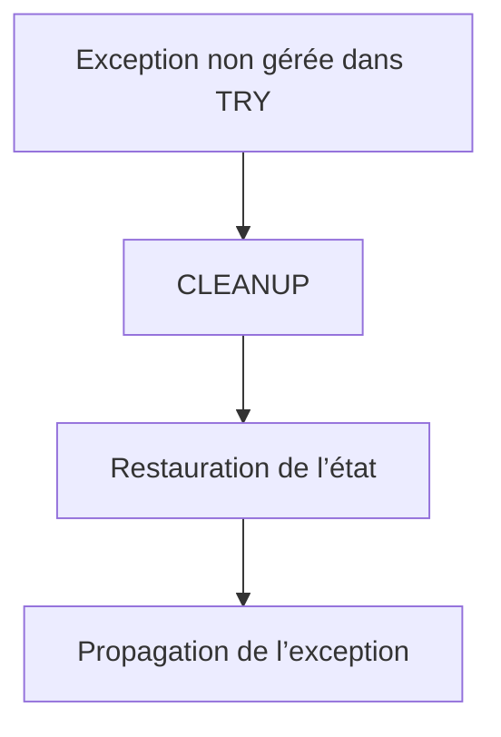

# 14. CLEANUP ET COHÉRENCE DU TRAITEMENT

## 14.A RÉSULTAT ATTENDU

- Comprendre le rôle du bloc `CLEANUP`
- Restaurer un état avant propagation
- Ne pas confondre `CLEANUP` avec un bloc exécuté systématiquement
- Préserver la cohérence des données en mémoire
- Choisir des opérations de nettoyage sûres

## 14.B PRINCIPE

Un bloc `CLEANUP` appartient à une structure `TRY`. Il est utilisé lorsqu’une exception[^terme-exception] quitte la structure sans être gérée par un `CATCH` de cette structure et qu’un nettoyage doit être effectué avant la propagation.

```abap
" Propager ou traiter l’erreur au niveau qui sait prendre une décision.
TRY.
    lo_resource->open( ).
    lo_resource->process( ).
  CLEANUP.
    lo_resource->close( ).
ENDTRY.
```

Le comportement exact doit être vérifié selon la forme utilisée et la version ABAP[^terme-abap]. `CLEANUP` n’est pas l’équivalent général d’un bloc `FINALLY` exécuté dans tous les cas.

## 14.C RÉSULTAT ATTENDU DU NETTOYAGE

Le nettoyage peut servir à :

- remettre une variable globale dans un état cohérent ;
- libérer une ressource applicative ;
- annuler une modification temporaire en mémoire ;
- supprimer un verrou posé avant l’erreur ;
- préparer une propagation propre.



## 14.D NE PAS MASQUER L’EXCEPTION

Le nettoyage ne doit pas remplacer l’erreur d’origine par une nouvelle erreur sans conserver la cause.

Si l’opération de nettoyage peut elle-même échouer, définir une stratégie explicite :

- conserver l’exception initiale ;
- chaîner la nouvelle erreur ;
- produire une trace[^terme-trace] technique ;
- éviter une seconde erreur qui masque la première.

## 14.E CLEANUP ET TRANSACTION

`CLEANUP` ne constitue pas automatiquement une annulation de SAP LUW[^terme-sap-luw]. Il ne remplace pas une conception transactionnelle correcte.

Ne pas placer mécaniquement `ROLLBACK WORK`[^terme-rollback-work] dans chaque nettoyage. La décision de valider ou annuler une transaction appartient à une frontière métier clairement définie.

## 14.F ALTERNATIVE PAR CONCEPTION

Une ressource peut parfois être gérée par une classe[^terme-classe] encapsulant son cycle de vie, ce qui réduit le besoin de nettoyage dispersé.

```abap
" Propager ou traiter l’erreur au niveau qui sait prendre une décision.
TRY.
    lo_service->execute( ).
  CATCH zcx_dev_error INTO DATA(lx_error).
    lo_service->reset( ).
    RAISE EXCEPTION lx_error.
ENDTRY.
```

Cette forme explicite peut être plus lisible lorsqu’une exception est traitée puis relancée.

## 14.G CAS À ÉVITER

- utiliser `CLEANUP` pour afficher un message utilisateur ;
- effectuer un traitement métier supplémentaire ;
- valider une transaction ;
- ignorer la cause initiale ;
- supposer que le bloc s’exécute après tout succès normal.

## 14.H VÉRIFICATION

- Le contrôle syntaxique réussit.
- La version active correspond au code sauvegardé.
- L’exécution produit le résultat décrit dans le chapitre.
- Les cas vide, limite et erreur sont testés séparément lorsque la syntaxe le permet.

## 14.I ERREURS FRÉQUENTES

- Copier un exemple sans adapter les types, noms d’objets et données disponibles dans le système.
- Tester uniquement le cas nominal et ignorer les valeurs initiales, absentes ou invalides.
- Afficher un message technique incompréhensible à l’utilisateur.
- Attraper une exception sans action ni propagation.

## 14.J SNIPPET À RÉUTILISER

> [!NOTE]
> Adapter les noms `Z*`, les types DDIC[^terme-acro-ddic], les données et les autorisations au système cible. Effectuer un contrôle syntaxique avant activation.

```abap
" Propager ou traiter l’erreur au niveau qui sait prendre une décision.
TRY.
    lo_service->execute( ).
  CATCH zcx_dev_error INTO DATA(lx_error).
    lo_service->reset( ).
    RAISE EXCEPTION lx_error.
ENDTRY.
```

## 14.K TERMES DU LEXIQUE

- [Exception](<../🧩 00 ├── LEXIQUE SAP ET ABAP/04 ├── LANGAGE ET DEVELOPPEMENT ABAP.md#exception>)
- [Dump ABAP](<../🧩 00 ├── LEXIQUE SAP ET ABAP/08 ├── EXECUTION EXPLOITATION ET ADMINISTRATION.md#dump-abap>)

## 14.L RÉFÉRENCES OFFICIELLES SAP

- [TRY — ABAP Keyword Documentation](https://help.sap.com/doc/abapdocu_latest_index_htm/latest/en-US/ABAPTRY.html)
- [Handling Exceptions — SAP Help Portal](https://help.sap.com/docs/SAP_NETWEAVER_700/10a002cd6c531014b5e1cb16d2455072/a9b8eef8fe9411d4b2ee0050dadfb92b.html)
- [Planning Exception Handling and Delegating Exceptions — SAP Help Portal](https://help.sap.com/docs/SAP_NETWEAVER_700/12ac3fe96c531014b0ff8cfd062efa6f/e7c4934257a5c96ae10000000a155106.html)


---

[Chapitre suivant — ASSERTIONS ET POINTS DE CONTRÔLE](<./15 ├── ASSERTIONS ET POINTS DE CONTROLE.md>)

[^terme-exception]: **EXCEPTION.** Objet ou signal représentant une situation anormale qu’un appelant peut traiter. Voir [l’entrée du lexique](<../🧩 00 ├── LEXIQUE SAP ET ABAP/04 ├── LANGAGE ET DEVELOPPEMENT ABAP.md#exception>).
[^terme-abap]: **ABAP.** Langage de programmation de la plateforme ABAP, conçu pour développer des applications métier et techniques SAP. Voir [l’entrée du lexique](<../🧩 00 ├── LEXIQUE SAP ET ABAP/04 ├── LANGAGE ET DEVELOPPEMENT ABAP.md#abap>).
[^terme-trace]: **TRACE.** Enregistrement détaillé d’événements techniques pour analyser exécution, SQL ou appels. Voir [l’entrée du lexique](<../🧩 00 ├── LEXIQUE SAP ET ABAP/08 ├── EXECUTION EXPLOITATION ET ADMINISTRATION.md#trace>).
[^terme-sap-luw]: **SAP LUW.** Unité logique métier SAP pouvant regrouper plusieurs étapes de dialogue et différer les mises à jour jusqu’au commit. Voir [l’entrée du lexique](<../🧩 00 ├── LEXIQUE SAP ET ABAP/08 ├── EXECUTION EXPLOITATION ET ADMINISTRATION.md#sap-luw>).
[^terme-rollback-work]: **ROLLBACK WORK.** Instruction annulant les modifications non validées de la LUW courante et les tâches de mise à jour enregistrées. Voir [l’entrée du lexique](<../🧩 00 ├── LEXIQUE SAP ET ABAP/08 ├── EXECUTION EXPLOITATION ET ADMINISTRATION.md#rollback-work>).
[^terme-classe]: **CLASSE.** Modèle orienté objet définissant état et comportements. Voir [l’entrée du lexique](<../🧩 00 ├── LEXIQUE SAP ET ABAP/04 ├── LANGAGE ET DEVELOPPEMENT ABAP.md#classe>).
[^terme-acro-ddic]: **DDIC.** Data Dictionary, abréviation courante de l’ABAP Dictionary. Voir [l’entrée du lexique](<../🧩 00 ├── LEXIQUE SAP ET ABAP/10 └── ACRONYMES SAP.md#acro-ddic>).
