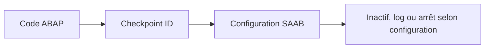

# 15. ASSERTIONS ET POINTS DE CONTRÔLE

## 15.A RÉSULTAT ATTENDU

- Utiliser `ASSERT` pour vérifier un invariant[^terme-invariant]
- Distinguer assertion et validation métier
- Comprendre les groupes de points de contrôle
- Utiliser la transaction `SAAB`[^outil-saab]
- Éviter les assertions sur des erreurs utilisateur prévisibles

## 15.B PRINCIPE

Une assertion vérifie qu’une expression logique représente un état qui doit toujours être vrai à cet endroit du programme.

```abap
" Exemple à éviter : comparer avec la correction décrite après le bloc.
ASSERT lv_total >= 0.
```

Si l’expression est fausse, le comportement dépend de la forme de l’assertion et de l’activation du point de contrôle.

## 15.C INVARIANT TECHNIQUE

Exemple adapté :

```abap
" Vérifier un seul comportement observable avec une attente explicite.
ASSERT lines( lt_items ) = lv_expected_count.
```

Le programme considère que son propre traitement garantit cette égalité. Une violation indique potentiellement un défaut de programmation.

## 15.D VALIDATION MÉTIER

Mauvais :

```abap
" Vérifier un seul comportement observable avec une attente explicite.
ASSERT p_quantity > 0.
```

Une quantité saisie à zéro est une situation prévisible. L’utilisateur doit recevoir un message contrôlé ou une exception[^terme-exception] métier.

Correct :

```abap
IF p_quantity <= 0.
  MESSAGE e008(zdev_msg).
ENDIF.
```

## 15.E GROUPES DE POINTS DE CONTRÔLE

```abap
" Vérifier un seul comportement observable avec une attente explicite.
ASSERT ID zdev_check
  SUBKEY sy-uname
  FIELDS lv_total lv_expected_count
  CONDITION lv_total = lv_expected_count.
```

L’ajout `ID` associe l’assertion à un groupe de points de contrôle. La transaction `SAAB` permet de configurer son activation et son comportement selon le système.

Les ajouts disponibles dépendent de la syntaxe supportée par la version ABAP[^terme-abap].

## 15.F POINTS DE CONTRÔLE ACTIVABLES

Les groupes peuvent aussi être utilisés avec des instructions comme :

- `BREAK-POINT ID` ;
- `LOG-POINT ID` ;
- `ASSERT ID`.

Ils permettent d’activer un diagnostic sans modifier le code à chaque analyse.



## 15.G DONNÉES SENSIBLES

Ne pas journaliser avec `FIELDS` des données sensibles sans nécessité. Un point de contrôle peut enregistrer des valeurs consultables par des administrateurs ou développeurs autorisés.

## 15.H ASSERTION ET ABAP UNIT

`ASSERT` dans le code productif ne remplace pas les méthodes d’assertion d’ABAP Unit. Les tests automatisés disposent de classes dédiées comme `CL_ABAP_UNIT_ASSERT`.

Les tests seront traités dans le dossier qualité et tests.

## 15.I VÉRIFICATION

- Le contrôle syntaxique réussit.
- La version active correspond au code sauvegardé.
- L’exécution produit le résultat décrit dans le chapitre.
- Les cas vide, limite et erreur sont testés séparément lorsque la syntaxe le permet.

## 15.J ERREURS FRÉQUENTES

- Copier un exemple sans adapter les types, noms d’objets et données disponibles dans le système.
- Tester uniquement le cas nominal et ignorer les valeurs initiales, absentes ou invalides.
- Afficher un message technique incompréhensible à l’utilisateur.
- Attraper une exception sans action ni propagation.

## 15.K SNIPPET À RÉUTILISER

> [!NOTE]
> Adapter les noms `Z*`, les types DDIC[^terme-acro-ddic], les données et les autorisations au système cible. Effectuer un contrôle syntaxique avant activation.

```abap
" Vérifier un seul comportement observable avec une attente explicite.
ASSERT ID zdev_check
  SUBKEY sy-uname
  FIELDS lv_total lv_expected_count
  CONDITION lv_total = lv_expected_count.
```

## 15.L TERMES DU LEXIQUE

- [Exception](<../🧩 00 ├── LEXIQUE SAP ET ABAP/04 ├── LANGAGE ET DEVELOPPEMENT ABAP.md#exception>)
- [Dump ABAP](<../🧩 00 ├── LEXIQUE SAP ET ABAP/08 ├── EXECUTION EXPLOITATION ET ADMINISTRATION.md#dump-abap>)

## 15.M RÉFÉRENCES OFFICIELLES SAP

- [ASSERT — ABAP Keyword Documentation](https://help.sap.com/doc/abapdocu_latest_index_htm/latest/en-US/ABAPASSERT_SHORTREF.html)
- [Activatable Checkpoints — SAP Help Portal](https://help.sap.com/docs/SAP_NETWEAVER_750/ba879a6e2ea04d9bb94c7ccd7cdac446/491c002326bc14cde10000000a42189b.html)
- [ABAP Test Support — SAP Help Portal](https://help.sap.com/docs/ABAP_PLATFORM_NEW/7bfe8cdcfbb040dcb6702dada8c3e2f0/f7eaddabcb9e4c84b83b5b1da863c28e.html)


---

[Chapitre suivant — STRATÉGIE ET BONNES PRATIQUES](<./16 └── STRATEGIE ET BONNES PRATIQUES.md>)

[^terme-invariant]: **INVARIANT.** Condition qui doit rester vraie pendant toute la durée de vie valide d’un objet. Voir [l’entrée du lexique](<../🧩 00 ├── LEXIQUE SAP ET ABAP/04 ├── LANGAGE ET DEVELOPPEMENT ABAP.md#invariant>).
[^terme-exception]: **EXCEPTION.** Objet ou signal représentant une situation anormale qu’un appelant peut traiter. Voir [l’entrée du lexique](<../🧩 00 ├── LEXIQUE SAP ET ABAP/04 ├── LANGAGE ET DEVELOPPEMENT ABAP.md#exception>).
[^terme-abap]: **ABAP.** Langage de programmation de la plateforme ABAP, conçu pour développer des applications métier et techniques SAP. Voir [l’entrée du lexique](<../🧩 00 ├── LEXIQUE SAP ET ABAP/04 ├── LANGAGE ET DEVELOPPEMENT ABAP.md#abap>).
[^terme-acro-ddic]: **DDIC.** Data Dictionary, abréviation courante de l’ABAP Dictionary. Voir [l’entrée du lexique](<../🧩 00 ├── LEXIQUE SAP ET ABAP/10 └── ACRONYMES SAP.md#acro-ddic>).

[^outil-saab]: **SAAB.** Transaction de maintenance des groupes de points de contrôle et de leurs activations. Voir [le chapitre associé](<../🧩 11 ├── DEBUG ET ANALYSE/03 ├── BREAKPOINTS DE SESSION EXTERNES ET DU DEBUGGER.md>).
