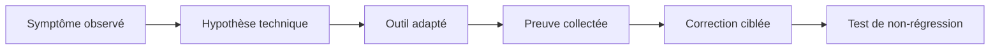

# 1. PRINCIPES DE DEBUG ET D’ANALYSE

## 1.A RÉSULTAT ATTENDU

- Distinguer observation, débogage, trace[^terme-trace] et analyse postérieure
- Choisir l’outil adapté au symptôme
- Reproduire un problème sans modifier son contexte
- Collecter des preuves avant de corriger le code
- Limiter l’impact des outils techniques sur le système

## 1.B FINALITÉ

Le débogage ne consiste pas à parcourir le programme au hasard. Il sert à vérifier une hypothèse précise sur :

- le chemin d’exécution ;
- la valeur d’une donnée ;
- le contexte d’appel ;
- le résultat d’une instruction ;
- l’origine d’un arrêt ou d’une lenteur.



## 1.C OUTILS PRINCIPAUX

| Besoin                                             | Outil principal  |
| -------------------------------------------------- | ---------------- |
| Suivre le code et les données                      | Débogueur ABAP[^terme-abap]   |
| Arrêter sur une ligne ou une instruction           | Breakpoint[^terme-breakpoint]       |
| Arrêter sur la modification d’une donnée           | Watchpoint[^terme-watchpoint]       |
| Comprendre un arrêt d’exécution                    | `ST22`[^outil-st22]           |
| Mesurer le temps ABAP                              | `SAT`[^outil-sat]            |
| Observer les accès SQL[^terme-acro-sql] et certaines traces système | `ST05`[^outil-st05]           |
| Corréler une exécution et plusieurs traces         | `ST12`[^outil-st12]           |
| Comparer des consommations mémoire                 | Memory Inspector |

## 1.D OBSERVATION AVANT MODIFICATION

Avant toute correction :

1. relever l’utilisateur, le système et le mandant[^terme-mandant] ;
2. noter l’heure exacte ;
3. identifier la transaction, le programme ou le service ;
4. conserver les paramètres et données d’entrée ;
5. reproduire sur un système adapté ;
6. capturer la première divergence entre résultat attendu et résultat réel.

Modifier une variable dans le débogueur peut aider à tester une hypothèse, mais ne prouve pas que le programme fonctionne normalement.

## 1.E REPRODUCTIBILITÉ

Une anomalie exploitable doit décrire :

- les préconditions ;
- les données utilisées ;
- les actions réalisées ;
- le résultat attendu ;
- le résultat constaté ;
- la fréquence ;
- le contexte technique.

Un problème intermittent nécessite souvent une trace ou un point d’arrêt conditionnel plutôt qu’un pas-à-pas complet.

## 1.F IMPACT SUR LE SYSTÈME

Le débogage et les traces peuvent :

- ralentir l’exécution ;
- conserver des données techniques sensibles ;
- immobiliser un processus de travail[^terme-processus-travail] ;
- perturber une transaction utilisateur ;
- produire un volume important de trace.

Activer l’outil le plus tard possible, limiter son périmètre, puis le désactiver immédiatement après la reproduction.

## 1.G RÈGLE DE DIAGNOSTIC

Toujours répondre séparément à quatre questions :

1. **Où** le comportement diverge-t-il ?
2. **Quelle donnée** provoque cette divergence ?
3. **Pourquoi** cette donnée ou ce chemin est-il obtenu ?
4. **Quelle correction minimale** rétablit la règle attendue ?

## 1.H PROCESS

### 1.H.1 Étape 1 — Définir le symptôme

Relever système, mandant, utilisateur, transaction, données d’entrée et résultat attendu. Distinguer résultat faux, message, blocage, lenteur et dump afin de choisir l’outil adapté.

### 1.H.2 Étape 2 — Réduire le scénario

Reproduire avec le plus petit jeu de données qui conserve le défaut. Noter l’horodatage et vérifier le symptôme une fois sans débogueur.

### 1.H.3 Étape 3 — Placer le premier arrêt utile

Positionner le breakpoint avant la première décision pouvant expliquer l’écart. Confirmer que la ligne appartient au chemin réellement exécuté par l’utilisateur concerné.

### 1.H.4 Étape 4 — Chercher la première divergence

Comparer à chaque décision les entrées, valeurs calculées, branche choisie et sortie. La première différence entre attendu et réel localise la cause ; les suivantes peuvent n’être que des conséquences.

### 1.H.5 Étape 5 — Corriger et rejouer

Modifier uniquement la cause prouvée, activer puis rejouer le cas fautif et un cas nominal. Le diagnostic est terminé lorsque les deux résultats sont corrects.

## 1.I VÉRIFICATION

- Le scénario reproduit correspond au même utilisateur, mandant, transaction et jeu de données.
- L’horodatage et l’identifiant de l’analyse sont conservés.
- La cause retenue est soutenue par une ligne source, une trace ou une valeur observée.
- Après correction, le même scénario ne reproduit plus le défaut et le résultat métier reste identique.

## 1.J ERREURS FRÉQUENTES

- Modifier les données dans le débogueur puis considérer le résultat comme reproductible.
- Laisser une trace active trop longtemps.

## 1.K FICHE DE CONTRÔLE À COPIER

```text
Système / SID       :
Mandant             :
Utilisateur         :
Transaction / outil :
Objet technique     :
Jeu de données      :
Résultat attendu    :
Résultat observé    :
Horodatage          :
Ordre de transport  :
```

## 1.L TERMES DU LEXIQUE

- [Breakpoint](<../🧩 00 ├── LEXIQUE SAP ET ABAP/08 ├── EXECUTION EXPLOITATION ET ADMINISTRATION.md#breakpoint>)
- [Watchpoint](<../🧩 00 ├── LEXIQUE SAP ET ABAP/08 ├── EXECUTION EXPLOITATION ET ADMINISTRATION.md#watchpoint>)
- [Dump ABAP](<../🧩 00 ├── LEXIQUE SAP ET ABAP/08 ├── EXECUTION EXPLOITATION ET ADMINISTRATION.md#dump-abap>)
- [Trace](<../🧩 00 ├── LEXIQUE SAP ET ABAP/08 ├── EXECUTION EXPLOITATION ET ADMINISTRATION.md#trace>)

## 1.M RÉFÉRENCES OFFICIELLES SAP

- [ABAP Test and Analysis Tools — SAP Help Portal](https://help.sap.com/docs/ABAP_PLATFORM_NEW/ba879a6e2ea04d9bb94c7ccd7cdac446/491aa66f87041903e10000000a42189c.html)
- [Standard ABAP Debugger — SAP Help Portal](https://help.sap.com/docs/SAP_NETWEAVER_AS_ABAP_751_IP/ba879a6e2ea04d9bb94c7ccd7cdac446/49250c884d7216b5e10000000a42189d.html)
- [ABAP Dump Analysis — SAP Help Portal](https://help.sap.com/docs/ABAP_PLATFORM_NEW/ba879a6e2ea04d9bb94c7ccd7cdac446/b134ab1cd8e44562b0fee9524c638cca.html)


---

[Chapitre suivant — DÉMARRER LE DÉBOGUEUR DANS SAP GUI](<./02 ├── DEMARRER LE DEBUGGER DANS SAP GUI.md>)

[^terme-trace]: **TRACE.** Enregistrement détaillé d’événements techniques pour analyser exécution, SQL ou appels. Voir [l’entrée du lexique](<../🧩 00 ├── LEXIQUE SAP ET ABAP/08 ├── EXECUTION EXPLOITATION ET ADMINISTRATION.md#trace>).
[^terme-abap]: **ABAP.** Langage de programmation de la plateforme ABAP, conçu pour développer des applications métier et techniques SAP. Voir [l’entrée du lexique](<../🧩 00 ├── LEXIQUE SAP ET ABAP/04 ├── LANGAGE ET DEVELOPPEMENT ABAP.md#abap>).
[^terme-breakpoint]: **BREAKPOINT.** Point d’arrêt suspendant l’exécution dans le débogueur. Voir [l’entrée du lexique](<../🧩 00 ├── LEXIQUE SAP ET ABAP/08 ├── EXECUTION EXPLOITATION ET ADMINISTRATION.md#breakpoint>).
[^terme-watchpoint]: **WATCHPOINT.** Arrêt conditionné par la modification ou la valeur d’une donnée observée. Voir [l’entrée du lexique](<../🧩 00 ├── LEXIQUE SAP ET ABAP/08 ├── EXECUTION EXPLOITATION ET ADMINISTRATION.md#watchpoint>).
[^terme-acro-sql]: **SQL.** Structured Query Language. Voir [l’entrée du lexique](<../🧩 00 ├── LEXIQUE SAP ET ABAP/10 └── ACRONYMES SAP.md#acro-sql>).
[^terme-mandant]: **MANDANT.** Subdivision logique d’un système SAP. Il est identifié par un numéro à trois chiffres et isole une partie des données, du paramétrage et des utilisateurs. Voir [l’entrée du lexique](<../🧩 00 ├── LEXIQUE SAP ET ABAP/01 ├── SYSTEMES ENVIRONNEMENTS ET MANDANTS.md#mandant>).
[^terme-processus-travail]: **PROCESSUS DE TRAVAIL.** Processus serveur exécutant une catégorie de traitement ABAP. Voir [l’entrée du lexique](<../🧩 00 ├── LEXIQUE SAP ET ABAP/08 ├── EXECUTION EXPLOITATION ET ADMINISTRATION.md#processus-travail>).

[^outil-st22]: **ST22.** Transaction d’analyse des terminaisons anormales et dumps ABAP. Voir [le chapitre associé](<13 ├── ANALYSER LES DUMPS AVEC ST22.md>).
[^outil-sat]: **SAT.** Runtime Analysis utilisée pour mesurer et analyser le temps d’exécution ABAP. Voir [le chapitre associé](<../🧩 20 ├── PERFORMANCE QUALITE ET TESTS/07 ├── MESURER LE TEMPS D EXECUTION AVEC SAT.md>).
[^outil-st05]: **ST05.** Performance Trace utilisée notamment pour enregistrer et analyser les accès SQL. Voir [le chapitre associé](<../🧩 20 ├── PERFORMANCE QUALITE ET TESTS/08 ├── ANALYSER LES ACCES SQL AVEC ST05.md>).
[^outil-st12]: **ST12.** Outil d’analyse ciblée combinant des traces ABAP et SQL pour un scénario reproduit. Voir [le chapitre associé](<16 ├── ANALYSE CIBLEE AVEC ST12.md>).
