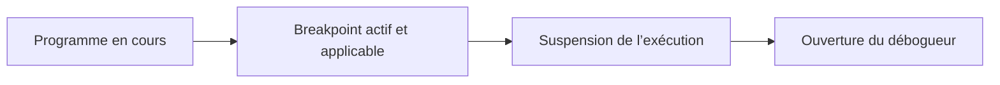

# 3. BREAKPOINTS DE SESSION, EXTERNES ET DU DÉBOGUEUR

## 3.A RÉSULTAT ATTENDU

- Choisir le bon type de breakpoint[^terme-breakpoint]
- Comprendre sa portée et sa durée de validité
- Arrêter un traitement dialogué ou externe
- Éviter les breakpoints placés sur le mauvais utilisateur

## 3.B PRINCIPE

Un breakpoint demande au processeur ABAP[^terme-abap] de suspendre l’exécution à un emplacement déterminé.



## 3.C BREAKPOINT DE SESSION

Le breakpoint de session concerne normalement les traitements exécutés par le même utilisateur dans la session SAP GUI[^terme-session-sap-gui] correspondante.

Utilisation typique :

- rapport lancé depuis `SE38`[^outil-se38] ;
- transaction dialoguée ;
- programme appelé dans le même contexte utilisateur.

Il convient aux tests manuels réalisés directement dans SAP GUI.

## 3.D BREAKPOINT EXTERNE

Le breakpoint externe est destiné aux traitements dont l’appel arrive depuis un autre canal ou une autre session, par exemple :

- requête HTTP ;
- service ICF ;
- appel RFC[^terme-rfc] ;
- application web utilisant le système ABAP ;
- scénario où la session SAP GUI qui pose le breakpoint n’exécute pas directement le traitement.

Le traitement doit généralement s’exécuter avec l’utilisateur pour lequel le breakpoint externe est défini. Certains contextes techniques utilisent un autre utilisateur que celui attendu.

## 3.E BREAKPOINT DU DÉBOGUEUR

Un breakpoint créé pendant une session de débogage est géré dans cette session. Il permet de préparer plusieurs arrêts après avoir déjà interrompu le programme.

Le Breakpoints Tool permet de lister et gérer :

- breakpoints ;
- watchpoints ;
- checkpoints.

## 3.F BREAKPOINT DANS LE CODE

L’instruction suivante inscrit un breakpoint dans le source :

```abap
BREAK-POINT.
```

Un breakpoint codé ne doit pas être livré sans justification. Il peut interrompre les utilisateurs autorisés au débogage et polluer le code applicatif.

Pour un besoin temporaire, préférer un breakpoint défini dans l’éditeur ou le débogueur.

## 3.G CHOIX RAPIDE

| Contexte                                  | Breakpoint conseillé               |
| ----------------------------------------- | ---------------------------------- |
| Rapport exécuté dans SAP GUI              | Session                            |
| Transaction dialoguée du même utilisateur | Session                            |
| Appel HTTP ou OData                       | Externe                            |
| Appel RFC entrant                         | Externe                            |
| Analyse après entrée dans le débogueur    | Débogueur                          |
| Point permanent contrôlé par le code      | Instruction seulement si justifiée |

## 3.H DIAGNOSTIC D UN BREAKPOINT IGNORÉ

Contrôler :

1. utilisateur réel du traitement ;
2. ligne réellement exécutée ;
3. version active de l’objet ;
4. type de breakpoint ;
5. date d’expiration éventuelle ;
6. contexte système ou mise à jour ;
7. autorisations.

## 3.I VÉRIFICATION

- Le scénario reproduit correspond au même utilisateur, mandant[^terme-mandant], transaction et jeu de données.
- L’horodatage et l’identifiant de l’analyse sont conservés.
- La cause retenue est soutenue par une ligne source, une trace[^terme-trace] ou une valeur observée.
- Après correction, le même scénario ne reproduit plus le défaut et le résultat métier reste identique.

## 3.J ERREURS FRÉQUENTES

- Copier un exemple sans adapter les types, noms d’objets et données disponibles dans le système.
- Tester uniquement le cas nominal et ignorer les valeurs initiales, absentes ou invalides.
- Modifier les données dans le débogueur puis considérer le résultat comme reproductible.
- Laisser une trace active trop longtemps.

## 3.K SNIPPET À RÉUTILISER

> [!NOTE]
> Adapter les noms `Z*`, les types DDIC[^terme-acro-ddic], les données et les autorisations au système cible. Effectuer un contrôle syntaxique avant activation.

```abap
BREAK-POINT.
```

## 3.L TERMES DU LEXIQUE

- [Breakpoint](<../🧩 00 ├── LEXIQUE SAP ET ABAP/08 ├── EXECUTION EXPLOITATION ET ADMINISTRATION.md#breakpoint>)
- [Watchpoint](<../🧩 00 ├── LEXIQUE SAP ET ABAP/08 ├── EXECUTION EXPLOITATION ET ADMINISTRATION.md#watchpoint>)
- [Dump ABAP](<../🧩 00 ├── LEXIQUE SAP ET ABAP/08 ├── EXECUTION EXPLOITATION ET ADMINISTRATION.md#dump-abap>)
- [Trace](<../🧩 00 ├── LEXIQUE SAP ET ABAP/08 ├── EXECUTION EXPLOITATION ET ADMINISTRATION.md#trace>)

## 3.M RÉFÉRENCES OFFICIELLES SAP

- [Breakpoints — SAP Help Portal](https://help.sap.com/docs/ABAP_PLATFORM_NEW/ba879a6e2ea04d9bb94c7ccd7cdac446/491e9433f3ee6492e10000000a42189b.html)
- [Breakpoints Tool — SAP Help Portal](https://help.sap.com/docs/ABAP_PLATFORM_NEW/ba879a6e2ea04d9bb94c7ccd7cdac446/492535784d7216b5e10000000a42189d.html)
- [Managing Breakpoints in the ABAP Editor — SAP Help Portal](https://help.sap.com/docs/ABAP_PLATFORM_NEW/ba879a6e2ea04d9bb94c7ccd7cdac446/0d1f9c93dc474415810224f98551577b.html)
- [Managing Breakpoints in the ABAP Debugger — SAP Help Portal](https://help.sap.com/docs/ABAP_PLATFORM_NEW/ba879a6e2ea04d9bb94c7ccd7cdac446/e6c585648f054f33ac6384ba6a2e3bf2.html)


---

[Chapitre suivant — BREAKPOINTS CONDITIONNELS ET DYNAMIQUES](<./04 ├── BREAKPOINTS CONDITIONNELS ET DYNAMIQUES.md>)

[^terme-breakpoint]: **BREAKPOINT.** Point d’arrêt suspendant l’exécution dans le débogueur. Voir [l’entrée du lexique](<../🧩 00 ├── LEXIQUE SAP ET ABAP/08 ├── EXECUTION EXPLOITATION ET ADMINISTRATION.md#breakpoint>).
[^terme-abap]: **ABAP.** Langage de programmation de la plateforme ABAP, conçu pour développer des applications métier et techniques SAP. Voir [l’entrée du lexique](<../🧩 00 ├── LEXIQUE SAP ET ABAP/04 ├── LANGAGE ET DEVELOPPEMENT ABAP.md#abap>).
[^terme-session-sap-gui]: **SESSION SAP GUI.** Fenêtre de travail indépendante ouverte pour un même utilisateur et un même système. Voir [l’entrée du lexique](<../🧩 00 ├── LEXIQUE SAP ET ABAP/02 ├── SAP GUI NAVIGATION ET TRANSACTIONS.md#session-sap-gui>).
[^terme-rfc]: **RFC.** Remote Function Call, mécanisme permettant d’appeler un module fonction compatible dans un autre contexte ou système. Voir [l’entrée du lexique](<../🧩 00 ├── LEXIQUE SAP ET ABAP/06 ├── PROGRAMMES CLASSES ET OBJETS TECHNIQUES.md#rfc>).
[^terme-mandant]: **MANDANT.** Subdivision logique d’un système SAP. Il est identifié par un numéro à trois chiffres et isole une partie des données, du paramétrage et des utilisateurs. Voir [l’entrée du lexique](<../🧩 00 ├── LEXIQUE SAP ET ABAP/01 ├── SYSTEMES ENVIRONNEMENTS ET MANDANTS.md#mandant>).
[^terme-trace]: **TRACE.** Enregistrement détaillé d’événements techniques pour analyser exécution, SQL ou appels. Voir [l’entrée du lexique](<../🧩 00 ├── LEXIQUE SAP ET ABAP/08 ├── EXECUTION EXPLOITATION ET ADMINISTRATION.md#trace>).
[^terme-acro-ddic]: **DDIC.** Data Dictionary, abréviation courante de l’ABAP Dictionary. Voir [l’entrée du lexique](<../🧩 00 ├── LEXIQUE SAP ET ABAP/10 └── ACRONYMES SAP.md#acro-ddic>).

[^outil-se38]: **SE38.** Éditeur ABAP classique utilisé pour créer, modifier, vérifier et exécuter des programmes. Voir [le chapitre associé](<../🧩 01 ├── FONDAMENTAUX ABAP/04 ├── EDITEURS ABAP SE38 ET SE80.md>).
