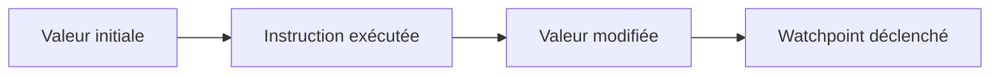

# 5. WATCHPOINTS

## 5.A RÉSULTAT ATTENDU

- Arrêter l’exécution lors de la modification d’une donnée
- Distinguer watchpoint[^terme-watchpoint] et breakpoint[^terme-breakpoint]
- Ajouter une condition de déclenchement
- Retrouver l’instruction qui altère une valeur

## 5.B PRINCIPE

Un watchpoint surveille un objet de données[^terme-objet-donnees] pendant la session de débogage. Le débogueur s’arrête lorsque la valeur surveillée change ou lorsque la condition associée devient vraie.



## 5.C DIFFÉRENCE AVEC UN BREAKPOINT

| Breakpoint                                 | Watchpoint                                            |
| ------------------------------------------ | ----------------------------------------------------- |
| Associé à un emplacement ou événement      | Associé à une donnée                                  |
| Arrête avant ou sur une instruction ciblée | Arrête après la modification détectée                 |
| Requiert de connaître le point probable    | Utile lorsque l’auteur de la modification est inconnu |

## 5.D EXEMPLE

Une quantité devient négative, mais plusieurs procédures peuvent la modifier.

1. démarrer le débogueur avant la divergence ;
2. afficher `lv_quantity` ;
3. créer un watchpoint sur cette variable ;
4. poursuivre avec **Continuer** ;
5. analyser l’instruction ayant produit la nouvelle valeur.

Condition possible :

```abap
lv_quantity < 0
```

## 5.E VALEUR AVANT ET APRÈS

L’outil de watchpoints peut afficher :

- la valeur actuelle ;
- la valeur avant la dernière modification ;
- la condition ;
- l’état actif du watchpoint.

Comparer les deux valeurs permet de vérifier que l’arrêt correspond bien à la divergence recherchée.

## 5.F LIMITES

Un watchpoint peut perdre sa validité lorsque :

- la variable locale sort de sa portée ;
- une référence ne pointe plus sur le même objet ;
- la session interne change ;
- l’objet surveillé est recréé ;
- le traitement passe dans un autre contexte technique.

Les détails varient selon la version du débogueur et le type de donnée.

## 5.G BONNES PRATIQUES

- surveiller une donnée précise plutôt qu’une structure complète ;
- ajouter une condition restrictive ;
- supprimer les watchpoints inutiles ;
- documenter la valeur attendue ;
- vérifier la pile d’appels au déclenchement.

## 5.H PROCESS

### 5.H.1 Étape 1 — Atteindre la portée de la donnée

Arrêter le programme après la création de la variable. Afficher son type et sa valeur initiale ; un watchpoint ne peut pas suivre une donnée qui n’existe pas dans le contexte courant.

### 5.H.2 Étape 2 — Créer le watchpoint

Sélectionner la variable dans le débogueur. Choisir un arrêt sur toute modification ou ajouter une condition sur la nouvelle valeur.

### 5.H.3 Étape 3 — Continuer jusqu’à l’écriture

Utiliser `F8`. À l’arrêt, relever la ligne responsable, l’ancienne valeur, la nouvelle valeur et la pile d’appels.

### 5.H.4 Étape 4 — Isoler une modification indirecte

Si l’arrêt suit un appel, répéter le scénario et entrer dans cet appel pour localiser l’affectation exacte. Pour une structure ou table, cibler le composant utile afin de limiter les arrêts.

Le diagnostic est terminé lorsque l’instruction et son appelant sont identifiés. Supprimer ensuite le watchpoint.

## 5.I VÉRIFICATION

- Le scénario reproduit correspond au même utilisateur, mandant[^terme-mandant], transaction et jeu de données.
- L’horodatage et l’identifiant de l’analyse sont conservés.
- La cause retenue est soutenue par une ligne source, une trace[^terme-trace] ou une valeur observée.
- Après correction, le même scénario ne reproduit plus le défaut et le résultat métier reste identique.

## 5.J ERREURS FRÉQUENTES

- Copier un exemple sans adapter les types, noms d’objets et données disponibles dans le système.
- Tester uniquement le cas nominal et ignorer les valeurs initiales, absentes ou invalides.
- Modifier les données dans le débogueur puis considérer le résultat comme reproductible.
- Laisser une trace active trop longtemps.

## 5.K SNIPPET À RÉUTILISER

> [!NOTE]
> Adapter les noms `Z*`, les types DDIC[^terme-acro-ddic], les données et les autorisations au système cible. Effectuer un contrôle syntaxique avant activation.

```abap
lv_quantity < 0
```

## 5.L TERMES DU LEXIQUE

- [Watchpoint](<../🧩 00 ├── LEXIQUE SAP ET ABAP/08 ├── EXECUTION EXPLOITATION ET ADMINISTRATION.md#watchpoint>)
- [Breakpoint](<../🧩 00 ├── LEXIQUE SAP ET ABAP/08 ├── EXECUTION EXPLOITATION ET ADMINISTRATION.md#breakpoint>)
- [Dump ABAP](<../🧩 00 ├── LEXIQUE SAP ET ABAP/08 ├── EXECUTION EXPLOITATION ET ADMINISTRATION.md#dump-abap>)
- [Trace](<../🧩 00 ├── LEXIQUE SAP ET ABAP/08 ├── EXECUTION EXPLOITATION ET ADMINISTRATION.md#trace>)

## 5.M RÉFÉRENCES OFFICIELLES SAP

- [Watchpoints — SAP Help Portal](https://help.sap.com/docs/ABAP_PLATFORM_NEW/ba879a6e2ea04d9bb94c7ccd7cdac446/4926d933c93016b8e10000000a42189d.html)
- [Breakpoints Tool — SAP Help Portal](https://help.sap.com/docs/ABAP_PLATFORM_NEW/ba879a6e2ea04d9bb94c7ccd7cdac446/492535784d7216b5e10000000a42189d.html)

---

[Chapitre suivant — PILOTER L’EXÉCUTION DU PROGRAMME](<./06 ├── PILOTER L EXECUTION DU PROGRAMME.md>)

[^terme-watchpoint]: **WATCHPOINT.** Arrêt conditionné par la modification ou la valeur d’une donnée observée. Voir [l’entrée du lexique](<../🧩 00 ├── LEXIQUE SAP ET ABAP/08 ├── EXECUTION EXPLOITATION ET ADMINISTRATION.md#watchpoint>).
[^terme-breakpoint]: **BREAKPOINT.** Point d’arrêt suspendant l’exécution dans le débogueur. Voir [l’entrée du lexique](<../🧩 00 ├── LEXIQUE SAP ET ABAP/08 ├── EXECUTION EXPLOITATION ET ADMINISTRATION.md#breakpoint>).
[^terme-objet-donnees]: **OBJET DE DONNÉES.** Zone de mémoire typée contenant une valeur pendant l’exécution. Voir [l’entrée du lexique](<../🧩 00 ├── LEXIQUE SAP ET ABAP/04 ├── LANGAGE ET DEVELOPPEMENT ABAP.md#objet-donnees>).
[^terme-mandant]: **MANDANT.** Subdivision logique d’un système SAP. Il est identifié par un numéro à trois chiffres et isole une partie des données, du paramétrage et des utilisateurs. Voir [l’entrée du lexique](<../🧩 00 ├── LEXIQUE SAP ET ABAP/01 ├── SYSTEMES ENVIRONNEMENTS ET MANDANTS.md#mandant>).
[^terme-trace]: **TRACE.** Enregistrement détaillé d’événements techniques pour analyser exécution, SQL ou appels. Voir [l’entrée du lexique](<../🧩 00 ├── LEXIQUE SAP ET ABAP/08 ├── EXECUTION EXPLOITATION ET ADMINISTRATION.md#trace>).
[^terme-acro-ddic]: **DDIC.** Data Dictionary, abréviation courante de l’ABAP Dictionary. Voir [l’entrée du lexique](<../🧩 00 ├── LEXIQUE SAP ET ABAP/10 └── ACRONYMES SAP.md#acro-ddic>).
