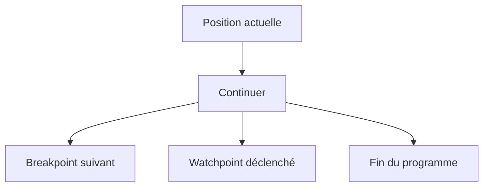

# 6. PILOTER L’EXÉCUTION DU PROGRAMME

## 6.A RÉSULTAT ATTENDU

- Distinguer pas simple, exécution, retour et continuation
- Entrer dans une procédure uniquement lorsque nécessaire
- Revenir au programme appelant
- Continuer jusqu’à un breakpoint[^terme-breakpoint] ou une ligne ciblée

## 6.B COMMANDES PRINCIPALES

| Commande                   | Effet                                                   |
| -------------------------- | ------------------------------------------------------- |
| Pas simple                 | Exécute ligne par ligne et entre dans les procédures    |
| Exécuter                   | Exécute la ligne sans détailler les procédures appelées |
| Retour                     | Exécute jusqu’au retour à l’appelant                    |
| Continuer                  | Exécute jusqu’au prochain breakpoint ou à la fin        |
| Continuer jusqu’au curseur | Exécute jusqu’à la ligne ciblée                         |

Les touches de fonction dépendent de la configuration SAP GUI[^terme-sap-gui], mais les associations courantes sont `F5`, `F6`, `F7` et `F8`. Se fier au libellé affiché dans le débogueur.

## 6.C PAS SIMPLE

Utiliser le pas simple lorsque le contenu de la procédure appelée est potentiellement responsable de l’erreur.

```abap
lo_service->calculate( ).
```

Le pas simple peut entrer dans la méthode[^terme-methode] `calculate`.

## 6.D EXÉCUTER SANS ENTRER

Utiliser **Exécuter** lorsque l’appel est considéré comme fiable ou hors périmètre. Le programme s’arrête à l’instruction suivante du contexte courant.

Cette commande n’empêche pas l’arrêt sur un breakpoint actif dans la procédure appelée.

## 6.E RETOUR

**Retour** poursuit l’exécution jusqu’à la fin de la procédure courante et replace l’analyse dans l’appelant.

Elle est utile après être entré trop profondément dans :

- une méthode standard ;
- un module fonction[^terme-module-fonction] ;
- une routine de conversion[^terme-routine-conversion] ;
- une infrastructure technique.

## 6.F CONTINUER

**Continuer** est préférable au pas-à-pas lorsqu’un breakpoint ou watchpoint[^terme-watchpoint] plus sélectif est déjà préparé.



## 6.G NAVIGATION ET EXÉCUTION

Naviguer dans le code ne modifie pas l’instruction courante. La ligne affichée et la prochaine ligne exécutée peuvent être différentes.

Toujours repérer l’indicateur de l’instruction courante avant de reprendre le programme.

## 6.H PROCESS

### 6.H.1 Étape 1 — Arrêter avant un appel

Placer un breakpoint sur une méthode, un module fonction ou un `PERFORM`. Relever les paramètres et la pile avant l’appel.

### 6.H.2 Étape 2 — Comparer F5 et F6

Utiliser `F5` pour entrer et identifier la première instruction. Refaire le scénario avec `F6` : l’exécution doit reprendre après l’appel, avec les sorties déjà calculées.

### 6.H.3 Étape 3 — Utiliser F7

Entrer dans l’appel, examiner le contexte puis utiliser `F7`. À l’appelant, comparer immédiatement paramètres de sortie et données modifiées.

### 6.H.4 Étape 4 — Continuer avec F8

Placer un second breakpoint à une étape ultérieure puis utiliser `F8`. Si aucun arrêt ne survient, vérifier que ce point appartient à la branche exécutée.

La procédure est validée lorsque chaque commande produit l’effet attendu sur la pile et permet de comparer l’état avant/après l’appel.

## 6.I VÉRIFICATION

- Le scénario reproduit correspond au même utilisateur, mandant[^terme-mandant], transaction et jeu de données.
- L’horodatage et l’identifiant de l’analyse sont conservés.
- La cause retenue est soutenue par une ligne source, une trace[^terme-trace] ou une valeur observée.
- Après correction, le même scénario ne reproduit plus le défaut et le résultat métier reste identique.

## 6.J ERREURS FRÉQUENTES

- Copier un exemple sans adapter les types, noms d’objets et données disponibles dans le système.
- Tester uniquement le cas nominal et ignorer les valeurs initiales, absentes ou invalides.
- Modifier les données dans le débogueur puis considérer le résultat comme reproductible.
- Laisser une trace active trop longtemps.

## 6.K SNIPPET À RÉUTILISER

> [!NOTE]
> Adapter les noms `Z*`, les types DDIC[^terme-acro-ddic], les données et les autorisations au système cible. Effectuer un contrôle syntaxique avant activation.

```abap
lo_service->calculate( ).
```

## 6.L TERMES DU LEXIQUE

- [Breakpoint](<../🧩 00 ├── LEXIQUE SAP ET ABAP/08 ├── EXECUTION EXPLOITATION ET ADMINISTRATION.md#breakpoint>)
- [Watchpoint](<../🧩 00 ├── LEXIQUE SAP ET ABAP/08 ├── EXECUTION EXPLOITATION ET ADMINISTRATION.md#watchpoint>)
- [Dump ABAP](<../🧩 00 ├── LEXIQUE SAP ET ABAP/08 ├── EXECUTION EXPLOITATION ET ADMINISTRATION.md#dump-abap>)
- [Trace](<../🧩 00 ├── LEXIQUE SAP ET ABAP/08 ├── EXECUTION EXPLOITATION ET ADMINISTRATION.md#trace>)

## 6.M RÉFÉRENCES OFFICIELLES SAP

- [Source Code Execution and Navigation — SAP Help Portal](https://help.sap.com/docs/ABAP_PLATFORM_NEW/ba879a6e2ea04d9bb94c7ccd7cdac446/679664bc4ac74d2d82a05f458396797c.html)
- [Standard ABAP Debugger — SAP Help Portal](https://help.sap.com/docs/SAP_NETWEAVER_AS_ABAP_751_IP/ba879a6e2ea04d9bb94c7ccd7cdac446/49250c884d7216b5e10000000a42189d.html)

---

[Chapitre suivant — ANALYSER VARIABLES, STRUCTURES, RÉFÉRENCES ET OBJETS](<./07 ├── ANALYSER VARIABLES STRUCTURES REFERENCES ET OBJETS.md>)

[^terme-breakpoint]: **BREAKPOINT.** Point d’arrêt suspendant l’exécution dans le débogueur. Voir [l’entrée du lexique](<../🧩 00 ├── LEXIQUE SAP ET ABAP/08 ├── EXECUTION EXPLOITATION ET ADMINISTRATION.md#breakpoint>).
[^terme-sap-gui]: **SAP GUI.** Client graphique permettant d’utiliser les transactions et écrans d’un système SAP. Voir [l’entrée du lexique](<../🧩 00 ├── LEXIQUE SAP ET ABAP/02 ├── SAP GUI NAVIGATION ET TRANSACTIONS.md#sap-gui>).
[^terme-methode]: **MÉTHODE.** Comportement déclaré dans une classe ou une interface et appelé avec une liste de paramètres définie. Voir [l’entrée du lexique](<../🧩 00 ├── LEXIQUE SAP ET ABAP/04 ├── LANGAGE ET DEVELOPPEMENT ABAP.md#methode>).
[^terme-module-fonction]: **MODULE FONCTION.** Procédure globale appelée avec `CALL FUNCTION` et définie dans un groupe de fonctions. Voir [l’entrée du lexique](<../🧩 00 ├── LEXIQUE SAP ET ABAP/06 ├── PROGRAMMES CLASSES ET OBJETS TECHNIQUES.md#module-fonction>).
[^terme-routine-conversion]: **ROUTINE DE CONVERSION.** Mécanisme DDIC convertissant une valeur entre représentation interne et affichage externe. Voir [l’entrée du lexique](<../🧩 00 ├── LEXIQUE SAP ET ABAP/05 ├── DONNEES DICTIONNAIRE ET BASE DE DONNEES.md#routine-conversion>).
[^terme-watchpoint]: **WATCHPOINT.** Arrêt conditionné par la modification ou la valeur d’une donnée observée. Voir [l’entrée du lexique](<../🧩 00 ├── LEXIQUE SAP ET ABAP/08 ├── EXECUTION EXPLOITATION ET ADMINISTRATION.md#watchpoint>).
[^terme-mandant]: **MANDANT.** Subdivision logique d’un système SAP. Il est identifié par un numéro à trois chiffres et isole une partie des données, du paramétrage et des utilisateurs. Voir [l’entrée du lexique](<../🧩 00 ├── LEXIQUE SAP ET ABAP/01 ├── SYSTEMES ENVIRONNEMENTS ET MANDANTS.md#mandant>).
[^terme-trace]: **TRACE.** Enregistrement détaillé d’événements techniques pour analyser exécution, SQL ou appels. Voir [l’entrée du lexique](<../🧩 00 ├── LEXIQUE SAP ET ABAP/08 ├── EXECUTION EXPLOITATION ET ADMINISTRATION.md#trace>).
[^terme-acro-ddic]: **DDIC.** Data Dictionary, abréviation courante de l’ABAP Dictionary. Voir [l’entrée du lexique](<../🧩 00 ├── LEXIQUE SAP ET ABAP/10 └── ACRONYMES SAP.md#acro-ddic>).
