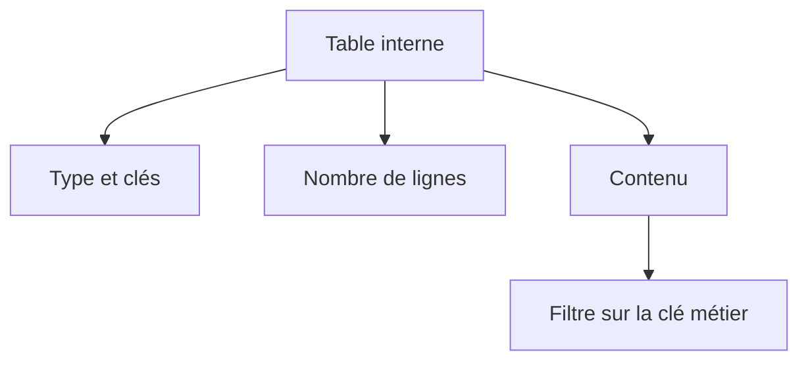

# 8. ANALYSER LES TABLES INTERNES

## 8.A RÉSULTAT ATTENDU

- Afficher le contenu d’une table interne[^terme-table-interne]
- Identifier son type, sa clé et son volume
- Filtrer, trier et organiser les colonnes
- Contrôler les références ou structures imbriquées
- Modifier temporairement une ligne à des fins de diagnostic

## 8.B TABLE TOOL

Le débogueur ABAP[^terme-abap] fournit un outil spécialisé pour les tables internes. Il permet notamment de :

- afficher les lignes ;
- configurer les colonnes ;
- afficher des composants imbriqués ;
- visualiser les attributs d’objets référencés ;
- filtrer et trier l’affichage ;
- modifier, ajouter ou supprimer temporairement des lignes selon le contexte.

## 8.C PREMIERS CONTRÔLES

Avant d’examiner les lignes, vérifier :

- type `STANDARD`, `SORTED` ou `HASHED` ;
- nombre de lignes ;
- clé primaire[^terme-cle-primaire] ;
- clés secondaires ;
- présence d’une ligne d’en-tête dans un code ancien ;
- type de ligne.



## 8.D FILTRER LE CONTENU

Pour une table volumineuse, filtrer sur une clé pertinente :

- numéro de document ;
- article ;
- division ;
- statut ;
- identifiant technique.

Ne pas parcourir manuellement des milliers de lignes si le critère de divergence est connu.

## 8.E STRUCTURES IMBRIQUÉES ET RÉFÉRENCES

Le configurateur de colonnes peut permettre d’ajouter :

- un composant d’une structure imbriquée ;
- un attribut[^terme-attribut] d’un objet référencé ;
- un champ de clé masqué dans l’affichage initial.

Cette vue facilite l’analyse sans modifier le type ou le code source.

## 8.F MODIFICATION TEMPORAIRE

Modifier une table dans le débogueur permet de tester une hypothèse, par exemple :

- ajouter la ligne manquante ;
- corriger un statut ;
- supprimer un doublon ;
- remplacer une quantité.

Cette manipulation ne constitue pas une correction. Elle peut changer le résultat du scénario et doit être documentée.

## 8.G ERREURS FRÉQUENTES

- table initiale car le `SELECT` n’a rien retourné ;
- filtre trop restrictif ;
- doublons créés avant un `DELETE ADJACENT DUPLICATES` ;
- clé incomplète lors d’un `READ TABLE` ;
- ligne modifiée sur une copie `INTO` mais jamais réécrite ;
- field-symbol[^terme-field-symbol] encore lié à la ligne actuelle ;
- tri incompatible avec le traitement suivant.

## 8.H PROCESS

### 8.H.1 Étape 1 — Relever la définition

Afficher catégorie `STANDARD`, `SORTED` ou `HASHED`, type de ligne, clé primaire et clés secondaires. Ces propriétés déterminent l’ordre et les accès possibles.

### 8.H.2 Étape 2 — Filtrer sur le cas métier

Relever le nombre de lignes puis filtrer sur la clé du scénario. Contrôler le format interne avant de conclure qu’une ligne est absente.

### 8.H.3 Étape 3 — Chercher doublons ou valeurs inattendues

Afficher uniquement les colonnes utiles et comparer les clés identiques. Pour une table unique, rechercher l’insertion ayant échoué ou remplacé une ligne.

### 8.H.4 Étape 4 — Suivre l’opération de modification

Arrêter avant `INSERT`, `APPEND`, `MODIFY` ou `DELETE`. Contrôler ligne source, `SY-SUBRC`, `SY-TABIX` lorsqu’il est pertinent et contenu après l’opération.

La cause est prouvée lorsque l’instruction qui ajoute, omet ou altère la ligne est identifiée avec ses valeurs d’entrée.

## 8.I VÉRIFICATION

- Le scénario reproduit correspond au même utilisateur, mandant[^terme-mandant], transaction et jeu de données.
- L’horodatage et l’identifiant de l’analyse sont conservés.
- La cause retenue est soutenue par une ligne source, une trace[^terme-trace] ou une valeur observée.
- Après correction, le même scénario ne reproduit plus le défaut et le résultat métier reste identique.

## 8.J FICHE DE CONTRÔLE À COPIER

```text
Système / SID       :
Mandant             :
Utilisateur         :
Transaction / outil :
Objet technique     :
Jeu de données      :
Résultat attendu    :
Résultat observé    :
Horodatage          :
Ordre de transport  :
```

## 8.K TERMES DU LEXIQUE

- [Breakpoint](<../🧩 00 ├── LEXIQUE SAP ET ABAP/08 ├── EXECUTION EXPLOITATION ET ADMINISTRATION.md#breakpoint>)
- [Watchpoint](<../🧩 00 ├── LEXIQUE SAP ET ABAP/08 ├── EXECUTION EXPLOITATION ET ADMINISTRATION.md#watchpoint>)
- [Dump ABAP](<../🧩 00 ├── LEXIQUE SAP ET ABAP/08 ├── EXECUTION EXPLOITATION ET ADMINISTRATION.md#dump-abap>)
- [Trace](<../🧩 00 ├── LEXIQUE SAP ET ABAP/08 ├── EXECUTION EXPLOITATION ET ADMINISTRATION.md#trace>)

## 8.L RÉFÉRENCES OFFICIELLES SAP

- [The Table Tool: Work With Internal Tables in the ABAP Debugger — SAP Help Portal](https://help.sap.com/docs/ABAP_PLATFORM_NEW/ba879a6e2ea04d9bb94c7ccd7cdac446/492db60934e414d0e10000000a42189b.html)
- [Standard ABAP Debugger — SAP Help Portal](https://help.sap.com/docs/SAP_NETWEAVER_AS_ABAP_751_IP/ba879a6e2ea04d9bb94c7ccd7cdac446/49250c884d7216b5e10000000a42189d.html)

---

[Chapitre suivant — PILE D’APPELS ET CONTEXTE D’EXÉCUTION](<./09 ├── PILE D APPELS ET CONTEXTE D EXECUTION.md>)

[^terme-table-interne]: **TABLE INTERNE.** Collection dynamique de lignes stockée en mémoire dans le programme ABAP. Voir [l’entrée du lexique](<../🧩 00 ├── LEXIQUE SAP ET ABAP/04 ├── LANGAGE ET DEVELOPPEMENT ABAP.md#table-interne>).
[^terme-abap]: **ABAP.** Langage de programmation de la plateforme ABAP, conçu pour développer des applications métier et techniques SAP. Voir [l’entrée du lexique](<../🧩 00 ├── LEXIQUE SAP ET ABAP/04 ├── LANGAGE ET DEVELOPPEMENT ABAP.md#abap>).
[^terme-cle-primaire]: **CLÉ PRIMAIRE.** Ensemble minimal de champs identifiant de manière unique une ligne de table. Voir [l’entrée du lexique](<../🧩 00 ├── LEXIQUE SAP ET ABAP/05 ├── DONNEES DICTIONNAIRE ET BASE DE DONNEES.md#cle-primaire>).
[^terme-attribut]: **ATTRIBUT.** Composant de données déclaré dans une classe et appartenant soit à chaque instance, soit à la classe elle-même. Voir [l’entrée du lexique](<../🧩 00 ├── LEXIQUE SAP ET ABAP/04 ├── LANGAGE ET DEVELOPPEMENT ABAP.md#attribut>).
[^terme-field-symbol]: **FIELD-SYMBOL.** Alias dynamique vers une zone de mémoire existante. Voir [l’entrée du lexique](<../🧩 00 ├── LEXIQUE SAP ET ABAP/04 ├── LANGAGE ET DEVELOPPEMENT ABAP.md#field-symbol>).
[^terme-mandant]: **MANDANT.** Subdivision logique d’un système SAP. Il est identifié par un numéro à trois chiffres et isole une partie des données, du paramétrage et des utilisateurs. Voir [l’entrée du lexique](<../🧩 00 ├── LEXIQUE SAP ET ABAP/01 ├── SYSTEMES ENVIRONNEMENTS ET MANDANTS.md#mandant>).
[^terme-trace]: **TRACE.** Enregistrement détaillé d’événements techniques pour analyser exécution, SQL ou appels. Voir [l’entrée du lexique](<../🧩 00 ├── LEXIQUE SAP ET ABAP/08 ├── EXECUTION EXPLOITATION ET ADMINISTRATION.md#trace>).
